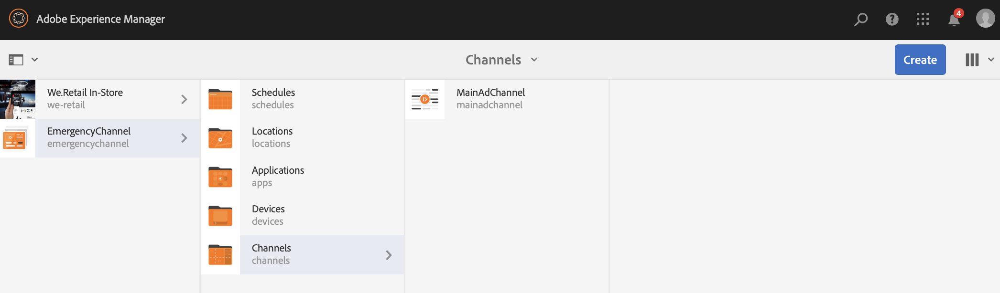
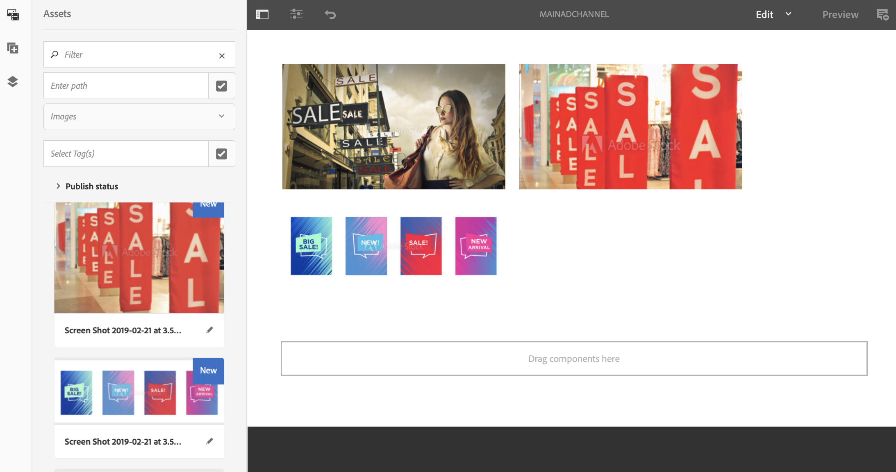
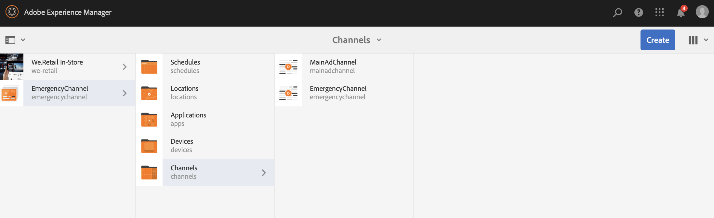
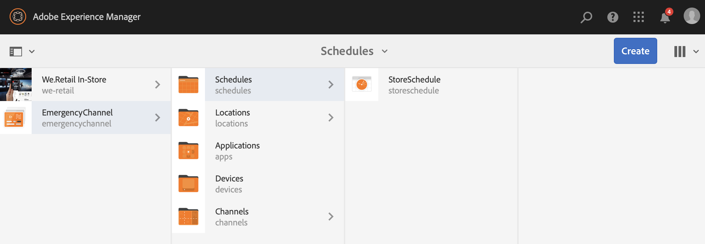
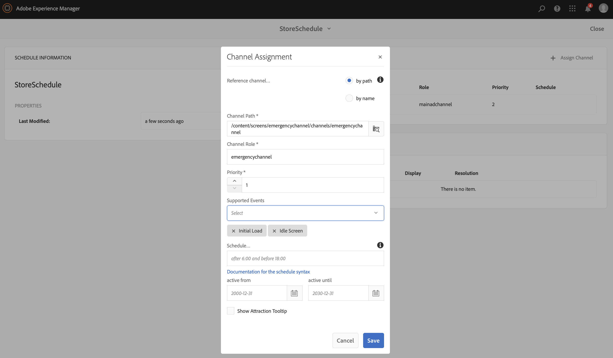
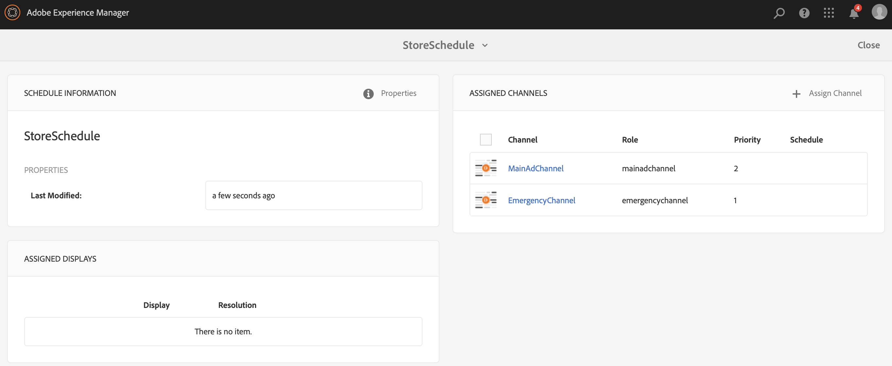
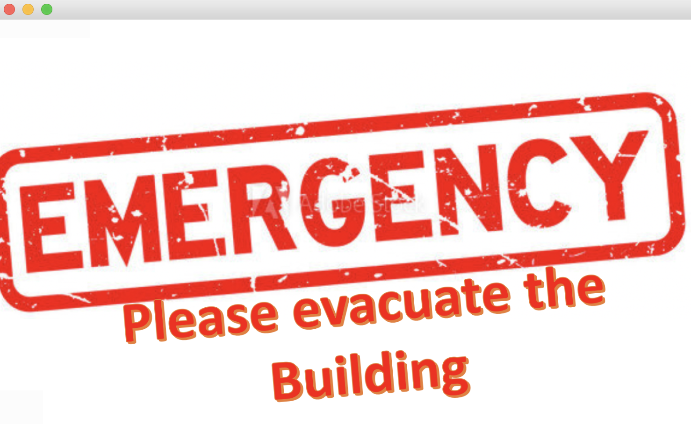

# Emergency Channel{#emergency-channel}

## Use Case Description {#use-case-description}

This section describes a use case example that emphasizes on creating and managing an emergency channel that the content author can switch from a sequence channel in case of a precondition.

### Preconditions {#preconditions}

Before you start this use case, make sure you understand how to:

* **[Create and Manage Channels](/help/screens/managing-channels.md)**
* **[Create and Manage Locations](/help/screens/managing-locations.md)**
* **[Create and Manage Schedules](/help/screens/managing-schedules.md)**
* **[Device Registration](/help/screens/device-registration.md)**

### Primary Actors {#primary-actors}

Content Authors

## Basic Flow: Setting up the Project {#basic-flow-setting-up-the-project}

Follow the steps below to set up an emergency channel:

1. Create an AEM Screens Project named as **EmergencyChannel**, as shown below.

   >[!NOTE]
   >
   >To learn more about creating and managing projects in AEM Screens, refer to Creating a Project.

   

1. **Creating a Sequence Channel**

    1. Select the **Channels** folder and click **Create** to open the wizard to create a channel.
    1. Select **Sequence Channel **from the wizard and create the channel titled as **MainAdChannel**.

   

1. **Adding Content to Sequence Channel**

    1. Select the channel (**MainAdChannel**).
    1. Click **Edit** from the action bar to open the editor. Drag and drop few assets to your channel.

   

1. **Creating an Emergency Channel**

    1. Select the **Channels** folder.
    1. Click on **Create** to open the wizard to create a channel. 
    1. Select **Sequence Channel **from the wizard and create the channel titled as **EmergencyChannel**.

   >[!NOTE]
   >
   >Normally, your emergency channel is added to your pre-existing production project.

   

1. **Adding Content to Emergency Channel**

    1. Select the channel (**Emergency Channel)**.
    1. Click **Edit** from the action bar to open the editor. Drag and drop the asset that you want to run during an emergency to your channel.

   

1. **Creating a Location**

    1. Navigate to **Locations** folder. 
    1. Click **Create** from the action bar and create a location titled **Store** from the wizard.

   

1. **Creating Displays in your Location**

   Navigate to your location (**Store**) and click **Create** from the action bar. Follow the wizard to create two **Displays** titled as **StoreFront** and **StoreRear**.

   

1. **Creating a Schedule**

    1. Navigate to your **Schedules** folder.
    1. Click **Create** from the action bar. Follow the wizard to create a schedule titled as **StoreSchedule**.

   

1. Assign both the Displays to your Schedule and set Priorities

    1. Select the schedule** (StoreSchedule)** and click **Dashboard** from the action bar. 
    1. Click **+ Assign Channel** from the **ASSIGNED CHANNELS** panel.
    1. From the **Channel Assignment** dialog box:

        1. Select the path to the **MainAdChannel**
        1. Set the **Priority** as 2
        1. Set the Supported Events as **Initial Load** and **Idle Screen**.
        1. Click **Save**

       Similarly, you will have to follow the same steps again to assign the **EmergencyChannel** and set its **Priority**.

   >[!NOTE]
   >
   >Priority is used to order the assignments in case multiple ones match the playing criteria. The one with the highest value will always take precedence over lower values.

   

1.

    1. Click **+ Assign Channel** from the **ASSIGNED CHANNELS** panel.
    1. From the **Channel Assignment** dialog box:

        1. Select the path to the **EmergencyChannel**
        1. Set the **Priority** as 1 
        1. Set the Supported Events as **Initial Load**, **Idle Screen**, and **User Interaction**
        1. Click **Save**

   

   You can view the assigned channels from the **StoreSchedule** dashboard.

   

1. **Assigning Schedule to each Display**

    1. Navigate to the each display, such as **EmergencyChannel** --&gt; **Locations** --&gt; **Store **--&gt;**StoreFront**.
    1. Click **Dashboard** from the action to open the display dashboard.
    1. Click **...** from the **ASSIGNED CHANNELS & SCHEDULES** panel and further click **+Assign Schedule**.
    1. Select the path to the Schedule (for example, here, **EmergencyChannel** --&gt; **Schedules** --&gt;**StoreSchedule**).
    1. Click **Save**.

   You can view the assigned schedule to the display from the **StoreSchedule** dashboard. 

   

1. **Device Registration**

   Complete the device registration process and once you have registered you will view the following output on your AEM Screens player.

   

## Switching to Emergency Channel {#switching-to-emergency-channel}

In the event of an emergency perform the following steps:

1. Navigate to **EmergencyChannel** --&gt; **Schedules** --&gt; **StoreSchedule** and select **Dashboard** from the action bar.

   

1. Select the **EmergencyChannel** from the **StoreSchedule** dashboard and click **Edit Assignment**.

   

1. Update the **Priority** of the **EmergencyChannel** to **3** from the **Channel Assignment** dialog box and click **Save**.

   

1. As soon as the priority of the channel is updated, all the AEM Screens player will display the **EmergencyChannel** content, as shown below.

   

### Conclusion {#conclusion}

The **EmergencyChannel** will continue to display its content until the content author resets the Priority Value to 1.

Once the content author receives the instructions that the emergency has been cleared, he/she should update the priority of the **MainAdChannel** which will cause normal playback to resume.
