# Extending an AEM Screens Component{#extending-an-aem-screens-component}

The following tutorial walks through the steps and best practices for extending out of the box AEM Screens components. The Image component is extended to add an authorable text overlay.

## Overview {#overview}

This tutorial is intended for developers who are new to AEM Screens. In this tutorial, the Screens Image component is extended to create a Poster component. A title, description, and logo are overlaid on top of an image to create a compelling experience in a Sequence Channel.

>[!NOTE]
>
>Before starting this tutorial, it is recommended to complete the tutorial: [Developing a Custom Component for AEM Screens](/help/screens/developing-custom-component-tutorial-develop.md).

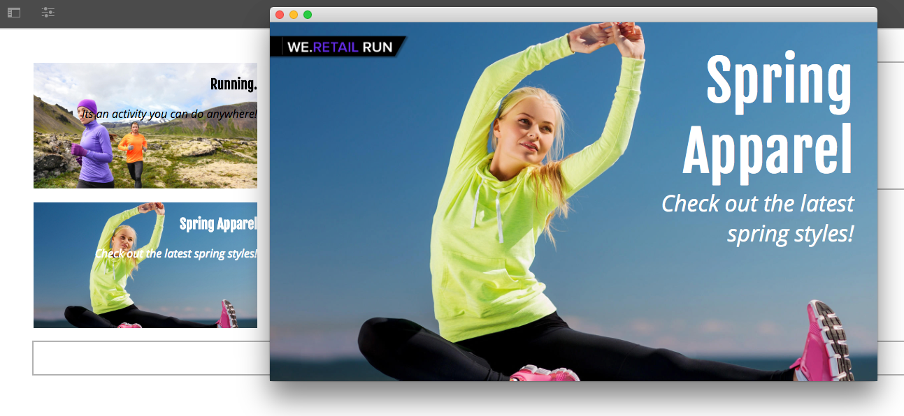

Custom Poster component is created by extending the Image component.

## Prerequisites {#prerequisites}

## Project Setup {#project-setup}

1. Download and install the following packages using [CRX package manage](http://localhost:4502/crx/packmgr/index.jsp)r:

   [Get File](assets/start-poster-screens-weretail-runuiapps-001-snapshot.zip)

   [Get File](assets/start-poster-screens-weretail-runuicontent-001-snapshot.zip)
   **Optionally,** if working with Eclipse or another IDE, download the below source package. Deploy the project to a local AEM instance by using the Maven command:

   **`mvn -PautoInstallPackage clean install`**

   SRC Start Screens We.Retail Run Project

   [Get File](assets/start-poster-screens-weretail-run.zip)

1. In [CRX Package Manager](http://localhost:4502/crx/packmgr/index.jsp) the following two packages are installed:

    1. **screens-weretail-run.ui.content-0.0.1-SNAPSHOT.zip**
    1. **screens-weretail-run.ui.apps-0.0.1-SNAPSHOT.zip**

   

   Screens We.Retail Run Ui.Apps and Ui.Content packages installed via CRX Package Manager

## Create the Poster Component {#poster-cmp}

The Poster component extends the out of the box screens Image component. A mechanism of Sling, `sling:resourceSuperType`, is used to inherit the core functionality of the Image component without having to copy and paste. More information about the basics of [Sling Request Processing can be found here.](https://helpx.adobe.com/experience-manager/6-4/sites/developing/using/the-basics.html#SlingRequestProcessing)

The Poster component is rendered in full screen in preview/production mode. In edit mode, it is important to render the component differently in order to facilitate authoring the sequence channel.

1. In [CRXDE-Lite](http://localhost:4502/crx/de/index.jsp) (or IDE of choice) beneath to `/apps/weretail-run/components/content`create a new `cq:Component` named `poster`.

   Add the following properties to the `poster` component:

   ```xml
   <?xml version="1.0" encoding="UTF-8"?>
   <jcr:root xmlns:sling="https://sling.apache.org/jcr/sling/1.0" xmlns:cq="https://www.day.com/jcr/cq/1.0" xmlns:jcr="https://www.jcp.org/jcr/1.0"
       jcr:primaryType="cq:Component"
       jcr:title="Poster"
       sling:resourceSuperType="screens/core/components/content/image"
       componentGroup="We.Retail Run - Content"/>
   ```

   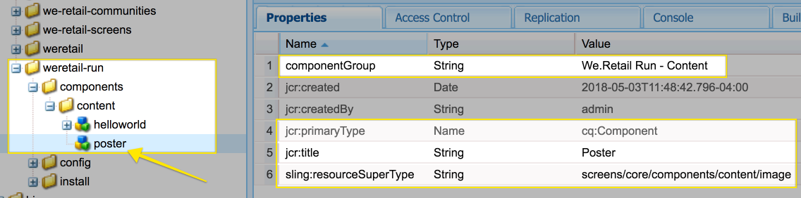

   Properties for /apps/weretail-run/components/content/poster

   By setting the `sling:resourceSuperType`property equal to `screens/core/components/content/image` the Poster component effectively inherits all of the functionality of the Image component. Equivalent nodes and files found beneath `screens/core/components/content/image` can be added beneath the `poster` component in order to override and extend the functionality.

1. Copy the `cq:editConfig` node beneath `/libs/screens/core/components/content/image.`Paste the `cq:editConfig` beneath the `/apps/weretail-run/components/content/poster` component.

   On the `cq:editConfig/cq:dropTargets/image/parameters` node update the `sling:resourceType` property to equal `weretail-run/components/content/poster`. 

   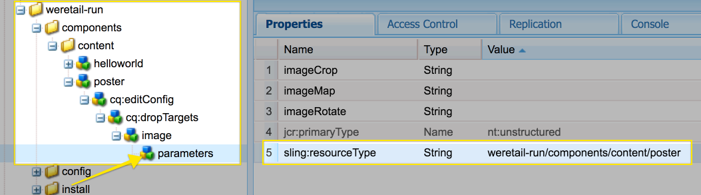

   XML representation of the cq:editConfig represented below:

   ```xml
   <?xml version="1.0" encoding="UTF-8"?>
   <jcr:root xmlns:sling="https://sling.apache.org/jcr/sling/1.0" xmlns:cq="https://www.day.com/jcr/cq/1.0" xmlns:jcr="https://www.jcp.org/jcr/1.0" xmlns:nt="https://www.jcp.org/jcr/nt/1.0"
       jcr:primaryType="cq:EditConfig">
       <cq:dropTargets jcr:primaryType="nt:unstructured">
           <image
               jcr:primaryType="cq:DropTargetConfig"
               accept="[image/.*]"
               groups="[media]"
               propertyName="./fileReference">
               <parameters
                   jcr:primaryType="nt:unstructured"
                   sling:resourceType="weretail-run/components/content/poster"
                   imageCrop=""
                   imageMap=""
                   imageRotate=""/>
           </image>
       </cq:dropTargets>
   </jcr:root>
   
   ```

1. Copy WCM Foundation `image` dialog to be used for the `poster` component.

   It is easiest to start from an existing dialog and then make modifications.

    1. Copy the dialog from: `/libs/wcm/foundation/components/image/cq:dialog`
    1. Paste the dialog beneath `/apps/weretail-run/components/content/poster`

   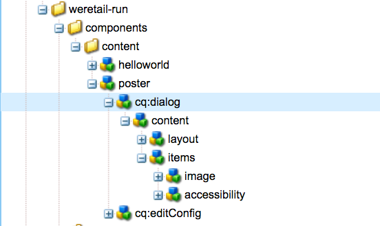

   Copied dialog from /libs/wcm/foundation/components/image/cq:dialog to /apps/weretail-run/components/content/poster

   The Screens `image` component is supertyped to the WCM Foundation `image` component. Therefore the `poster` component inherits functionality from both. The dialog for the poster component is made up of a combination of the Screens and Foundation dialogs. Features of the [Sling Resource Merger](https://helpx.adobe.com/experience-manager/6-4/sites/developing/using/sling-resource-merger.html) are used to hide irrelevant dialog fields and tabs that are inherited from the supertyped components.

1. Update the cq:dialog beneath `/apps/weretail-run/components/content/poster` with the following changes represented in XML:

   ```xml
   <?xml version="1.0" encoding="UTF-8"?>
   <jcr:root xmlns:sling="https://sling.apache.org/jcr/sling/1.0" xmlns:cq="https://www.day.com/jcr/cq/1.0" xmlns:jcr="https://www.jcp.org/jcr/1.0" xmlns:nt="https://www.jcp.org/jcr/nt/1.0"
       jcr:primaryType="nt:unstructured"
       jcr:title="Poster"
       sling:resourceType="cq/gui/components/authoring/dialog">
       <content
           jcr:primaryType="nt:unstructured"
           sling:resourceType="granite/ui/components/foundation/container">
           <layout
               jcr:primaryType="nt:unstructured"
               sling:resourceType="granite/ui/components/foundation/layouts/tabs"
               type="nav"/>
           <items jcr:primaryType="nt:unstructured">
               <image
                   jcr:primaryType="nt:unstructured"
                   jcr:title="Elements"
                   sling:resourceType="granite/ui/components/foundation/section">
                   <layout
                       jcr:primaryType="nt:unstructured"
                       sling:resourceType="granite/ui/components/foundation/layouts/fixedcolumns"
                       margin="{Boolean}false"/>
                   <items jcr:primaryType="nt:unstructured">
                       <column
                           jcr:primaryType="nt:unstructured"
                           sling:resourceType="granite/ui/components/foundation/container">
                           <items
                               jcr:primaryType="nt:unstructured"
                               sling:hideChildren="[linkURL,size]">
                               <file
                                   jcr:primaryType="nt:unstructured"
                                   sling:resourceType="cq/gui/components/authoring/dialog/fileupload"
                                   autoStart="{Boolean}false"
                                   class="cq-droptarget"
                                   fieldLabel="Image asset"
                                   fileNameParameter="./fileName"
                                   fileReferenceParameter="./fileReference"
                                   mimeTypes="[image]"
                                   multiple="{Boolean}false"
                                   name="./file"
                                   title="Upload Image Asset"
                                   uploadUrl="${suffix.path}"
                                   useHTML5="{Boolean}true"/>
                               <title
                                   jcr:primaryType="nt:unstructured"
                                   sling:resourceType="granite/ui/components/foundation/form/textfield"
                                   fieldLabel="Title"
                                   name="./jcr:title"/>
                               <description
                                   jcr:primaryType="nt:unstructured"
                                   sling:resourceType="granite/ui/components/foundation/form/textarea"
                                   fieldLabel="Description"
                                   name="./jcr:description"/>
                               <position
                                   jcr:primaryType="nt:unstructured"
                                   sling:resourceType="granite/ui/components/coral/foundation/form/select"
                                   fieldLabel="Text Position"
                                   name="./textPosition">
                                   <items jcr:primaryType="nt:unstructured">
                                       <left
                                           jcr:primaryType="nt:unstructured"
                                           text="Left"
                                           value="left"/>
                                       <center
                                           jcr:primaryType="nt:unstructured"
                                           text="Center"
                                           value="center"/>
                                       <right
                                           jcr:primaryType="nt:unstructured"
                                           text="Right"
                                           value="right"/>
                                   </items>
                               </position>
                               <color
                                   jcr:primaryType="nt:unstructured"
                                   sling:resourceType="granite/ui/components/coral/foundation/form/select"
                                   fieldLabel="Text Color"
                                   name="./textColor">
                                   <items jcr:primaryType="nt:unstructured">
                                       <light
                                           jcr:primaryType="nt:unstructured"
                                           text="Light"
                                           value="light"/>
                                       <dark
                                           jcr:primaryType="nt:unstructured"
                                           text="Dark"
                                           value="dark"/>
                                   </items>
                               </color>
                           </items>
                       </column>
                   </items>
               </image>
               <accessibility
                   jcr:primaryType="nt:unstructured"
                   sling:hideResource="{Boolean}true"/>
           </items>
       </content>
   </jcr:root>
   
   ```

   The property `sling:hideChildren`= `"[linkURL,size]`" is used on the `items` node to ensure that the **linkURL** and **size** fields are hidden from the dialog. Removing these nodes from the poster dialog is not enough. The property `sling:hideResource="{Boolean}true"` on the accessibility tab is used to hide the entire tab.

   Two select fields are added to the dialog to give authors control over the text position and color of the Title and Description.

   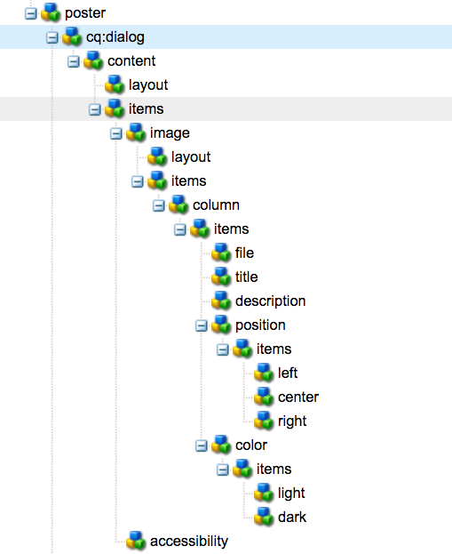

   Poster - Final Dialog Structure

   At this point an instance of the `poster` component can be added to the **Idle Channel** page in the We.Retail Run project: *http://localhost:4502/editor.html/content/screens/we-retail-run/channels/idle-channel.edit.html*.

   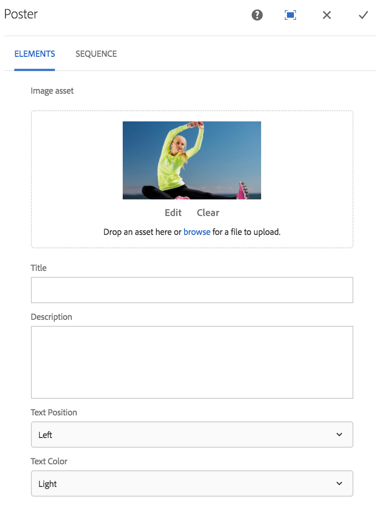

   Poster Dialog fields

1. Create a file beneath `/apps/weretail-run/components/content/poster` named `production.html.`

   Populate the file with the following:

   ```xml
   <!--/*
   
       /apps/weretail-run/components/content/poster/production.html 
          
   */-->
   <div data-sly-use.image="image.js"
        data-duration="${properties.duration}"
        class="cmp-poster"
        style="background-image: url(${request.contextPath @ context='uri'}${image.src @ context='uri'});">
       <div class="cmp-poster__text 
                   cmp-poster__text--${properties.textPosition @ context='attribute'}
                   cmp-poster__text--${properties.textColor @ context='attribute'}">
           <h1 class="cmp-poster__title">${properties.jcr:title}</h1>
            <h2 class="cmp-poster__description">${properties.jcr:description}</h2>
       </div>
    
   </div>
   ```

   Above is the production markup for the Poster Component. The HTL script overrides `screens/core/components/content/image/production.html`. The `image.js` is a server-side script that creates a POJO-like Image object. The Image object can then be called to render the `src` as an inline style background-image.

   `The h1` and h2 tags are added display the Title and Description based on the component properties: `${properties.jcr:title}` and `${properties.jcr:description}`.

   Surrounding the `h1` and `h2` tags is a div wrapper with three CSS classes with variations of " `cmp-poster__text`". The value for the `textPosition` and `textColor` properties are used to change the CSS class rendered based on the dialog selection of the author. In the next section CSS from client libraries are written to enable these changes in display.

   A logo is also included as an overlay in the component. In this example, the path to the We.Retail logo is hard-coded in the DAM. Depending on the use case it might make more sense to create a new dialog field to make the logo path a dynamically populated value.

   Also note that BEM (Block Element Modifier) notation is used with the component. BEM is a CSS coding convention that makes it easier to create reusable components. BEM is the notation used by [AEM's Core Components](https://github.com/Adobe-Marketing-Cloud/aem-core-wcm-components/wiki/CSS-coding-conventions). More info can be found at: [https://getbem.com/](https://getbem.com/)

1. Create a file beneath `/apps/weretail-run/components/content/poster` named `edit.html.`

   Populate the file with the following:

   ```xml
   <!--/*
   
       /apps/weretail-run/components/content/poster/edit.html 
          
   */-->
   
   <div class="aem-Screens-editWrapper ${image.cssClass} cmp-poster" data-sly-use.image="image.js" data-emptytext="${'Poster' @ i18n, locale=request.locale}">
       
       <div class="cmp-poster__text 
              cmp-poster__text--${properties.textPosition @ context='attribute'}
          cmp-poster__text--${properties.textColor @ context='attribute'}">
         <p class="cmp-poster__title">${properties.jcr:title}</p>
         <p class="cmp-poster__description">${properties.jcr:description}</p>
       </div>
   </div>
   ```

   Above is the **edit** markup for the Poster Component. The HTL script overrides `/libs/screens/core/components/content/image/edit.html`. The markup is similar to the `production.html` markup and will display the title and description on top of the image.

   The `aem-Screens-editWrapper`is added so that the component will not render full-screen in the editor. The `data-emptytext` attribute ensures a that placeholder is displayed when no image or content has been populated.

## Create Client-Side Libraries {#clientlibs}

Client-Side Libraries provide a mechanism to organize and manage CSS and JavaScript files necessary for an AEM implementation. More information about using [Client-Side Libraries can be found here.](https://helpx.adobe.com/experience-manager/6-4/sites/developing/using/clientlibs.html)

AEM Screens components are rendered differently in Edit mode vs. Preview/Production mode. Two sets of client libraries are created, one for Edit mode and a second for Preview/Production.

1. Create a folder for client-side libraries for the Poster component.

   Beneath `/apps/weretail-run/components/content/poster,`create a new folder named `clientlibs`.

   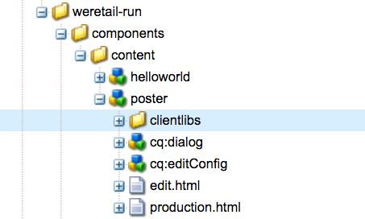

1. Beneath the `clientlibs` folder create a new node named `shared` of type `cq:ClientLibraryFolder.` 

   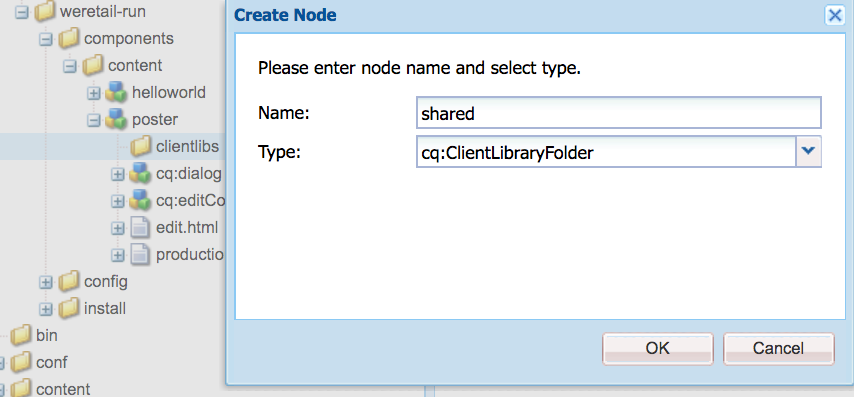

1. Add the following properties to the shared client library:

    * `allowProxy` | Boolean | `true`
    * `categories` | String[] | `cq.screens.components`

   

   Properties for /apps/weretail-run/components/content/poster/clientlibs/shared

   The `categories` property is a string that identifies the client library. The `cq.screens.components` category is used in both Edit and Preview/Production mode. Therefore any CSS/JS defined in the `shared` clientlib is loaded in all modes.

   It is a best practice to never expose any paths directly to /apps in a production environment. The `allowProxy` property ensures the client library CSS and JS is referenced via a prefix of `/etc.clientlibs`. More information about the [allowProxy property can be found here.](https://helpx.adobe.com/experience-manager/6-4/sites/developing/using/clientlibs.html#main-pars_title_8ced)

1. Create file named `css.txt` beneath the shared folder.

   Populate the file with the following:

   ```
   #base=css
   
   styles.less
   
   ```

1. Create a folder named `css` beneath the `shared` folder. Add a file named `style.less` beneath the `css` folder. The structure of the client libraries should now look like this:

   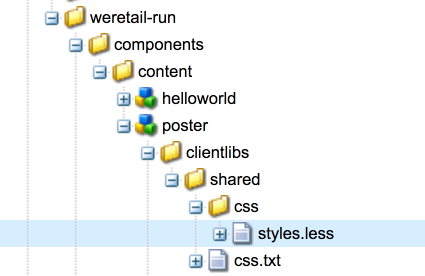

   Instead of writing CSS directly, this tutorial uses LESS. [LESS](https://lesscss.org/) is a popular CSS pre-compiler that supports CSS variables, mixins, and functions. AEM client libraries natively support LESS compilation. Sass or other pre-compilers can be used but need to be compiled outside of AEM.

1. Populate `/apps/weretail-run/components/content/poster/clientlibs/shared/css/styles.less` with the following:

   ```css
   /* 
    /apps/weretail-run/components/content/poster/clientlibs/shared/css/styles.less
    Poster Component - Shared Style 
   */
   
   @import url('https://fonts.googleapis.com/css?family=Fjalla+One|Open+Sans:400i');
   
   @text-light-color: #fff;
   @text-dark-color: #000;
   @title-font-family: 'Fjalla One', sans-serif;
   @description-font-family: 'Open Sans', sans-serif;
   
   .cmp-poster {
    
         &__text {
         position: absolute;
         color: @text-light-color;
         top: 0;
         text-align:center;
         width: 100%;
         
         &--left {
          text-align: left;
                margin-left: 1em;
         }
         
         &--right {
          text-align: right;
                margin-right: 1em;
         }
         
         &--dark {
          color: @text-dark-color;
         }
       }
       
       &__title {
         font-weight: bold;
            font-family: @title-font-family;
            font-size: 1.2em;
       }
   
       &__description {
     font-style: italic;
           font-family: @description-font-family;
    }
   
   }
   ```

   >[!NOTE]
   >
   >Google web fonts are used for the font families. Web fonts require internet connectivity and not all screens implementations will a reliable connection. Planning for offline mode is an important consideration for Screens deployments.

1. Copy the `shared` client library folder. Paste it as a sibling and rename it to `production`.

   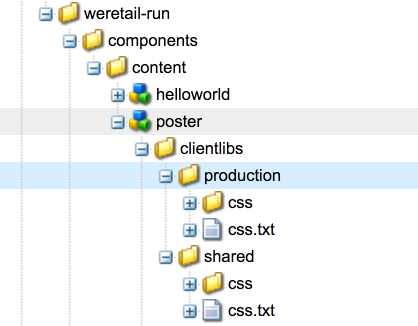

1. Update the `categories` property of the production clientlibrary to be `cq.screens.components.production.`

   The `cq.screens.components.production` category ensures that the styles are only loaded when in Preview/Production mode.

   

   Properties for /apps/weretail-run/components/content/poster/clientlibs/production

1. Populate `/apps/weretail-run/components/content/poster/clientlibs/production/css/styles.less` with the following:

   ```css
   /* 
    /apps/weretail-run/components/content/poster/clientlibs/production/css/styles.less
    Poster Component - Production Style 
   */
   
   .cmp-poster {
   
       background-size: cover; 
    height: 100%; 
    width: 100%;
    position:absolute;
   
        &__text {
   
           top: 2em;
   
           &--left {
               width: 40%;
               top: 5em;
           }
   
           &--right {
               width: 40%;
               right: 1em;
           }
       }

       &__title {
     font-size: 5rem;
     font-weight: 900;
     margin: 0.1rem;
    }
    
    &__description {
     font-size: 2rem;
     margin: 0.1rem;
     font-weight: 400;
     
    }
   
       &__logo {
     position: absolute;
     max-width: 200px;
     top: 1em;
     left: 0;
    }
    
   }
   ```

   The above styles display the Title and Description in an absolute position on the screen. The title will be displayed significantly larger than the description. The BEM notation of the component makes it very easy to carefully scope the styles within the cmp-poster class.

A third clientlibrary category: `cq.screens.components.edit` could be used to add Edit only specific styles to the component. 

| Clientlib Category |Usage |
|---|---|
| `cq.screens.components` |Styles and scripts that are shared between both edit and production modes |
| `cq.screens.components.edit` |Styles and scripts that are only used in edit mode |
| `cq.screens.components.production` |Styles and scripts that are only used in production mode |

## Add Poster Component to a Sequence Channel {#add-sequence-channel}

The Poster component is intended to be used on a Sequence Channel. The starter package for this tutorial included an Idle Channel. The Idle Channel is pre-configured to allow components of the group **We.Retail Run - Content**. The Poster component's group is set to `We.Retail Run - Content` and is available to be added to the channel.

1. Open the Idle Channel from the We.Retail Run project: **`http://localhost:4502/editor.html/content/screens/we-retail-run/channels/idle-channel.edit.html`**
1. Drag + Drop a new instance of the **Poster** component from the side bar on to the page.

   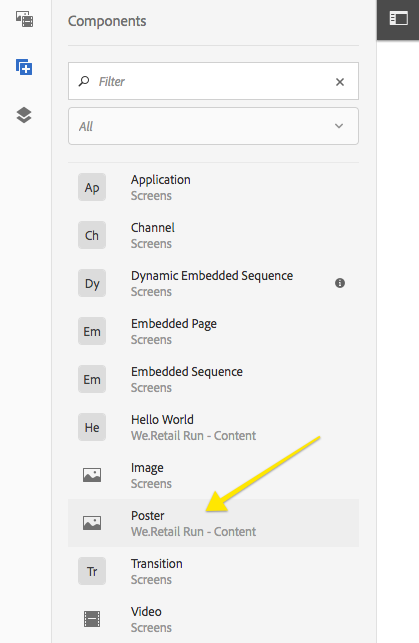

1. Edit the dialog of the Poster component to add an Image, Title, Description. Use the Text Position and Text Color choices to ensure the Title/Description is readable over the Image. 

   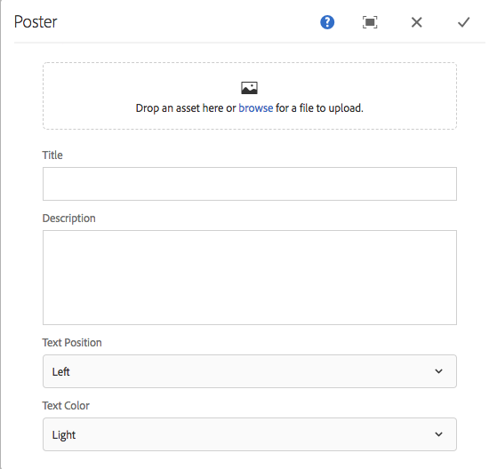

1. Repeat the above steps to add a few Poster components. Add transitions in between the components.

   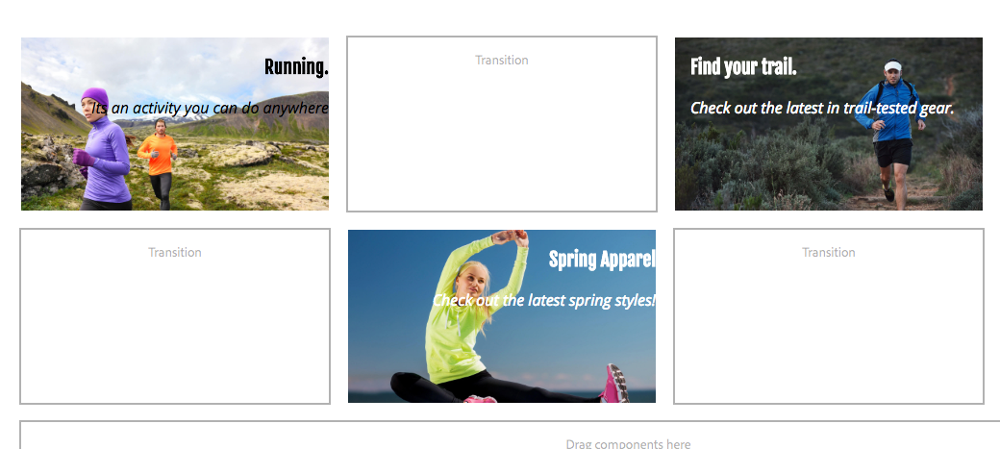

## Putting it all together {#putting-it-all-together}

The below video shows the finished component and how it can be added to a Sequence channel. The Channel is then added to a Location display and ultimately assigned to a Screens player.

>[!VIDEO](https://video.tv.adobe.com/v/22414?quaity=9)

## Finished Code {#finished-code}

Below is the finished code from the tutorial. The **screens-weretail-run.ui.apps-0.0.1-SNAPSHOT.zip** and **screens-weretail-run.ui.content-0.0.1-SNAPSHOT.zip** are the compiled AEM packages. The **SRC-screens-weretail-run-0.0.1.zip **is the uncompiled source code that can be deployed using Maven.

[Get File](assets/final-poster-screens-weretail-runuiapps-001-snapshot.zip)

[Get File](assets/final-poster-screens-weretail-runuicontent-001-snapshot.zip)

SRC Final Screens We.Retail Run Project

[Get File](assets/src-screens-weretail-run-001.zip)
