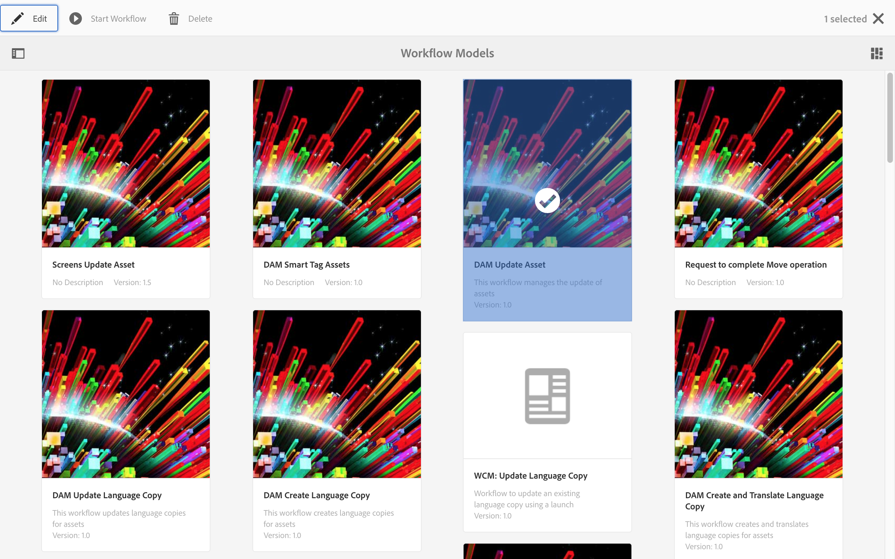
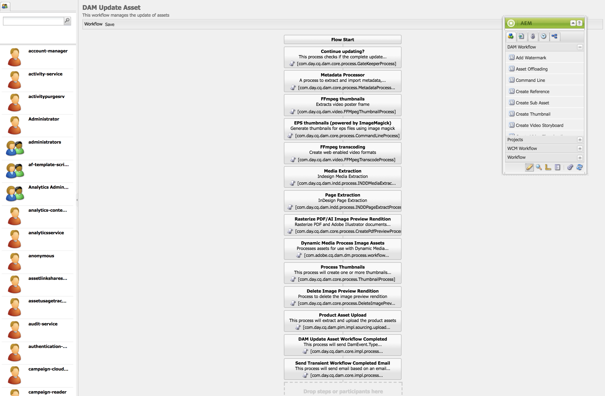
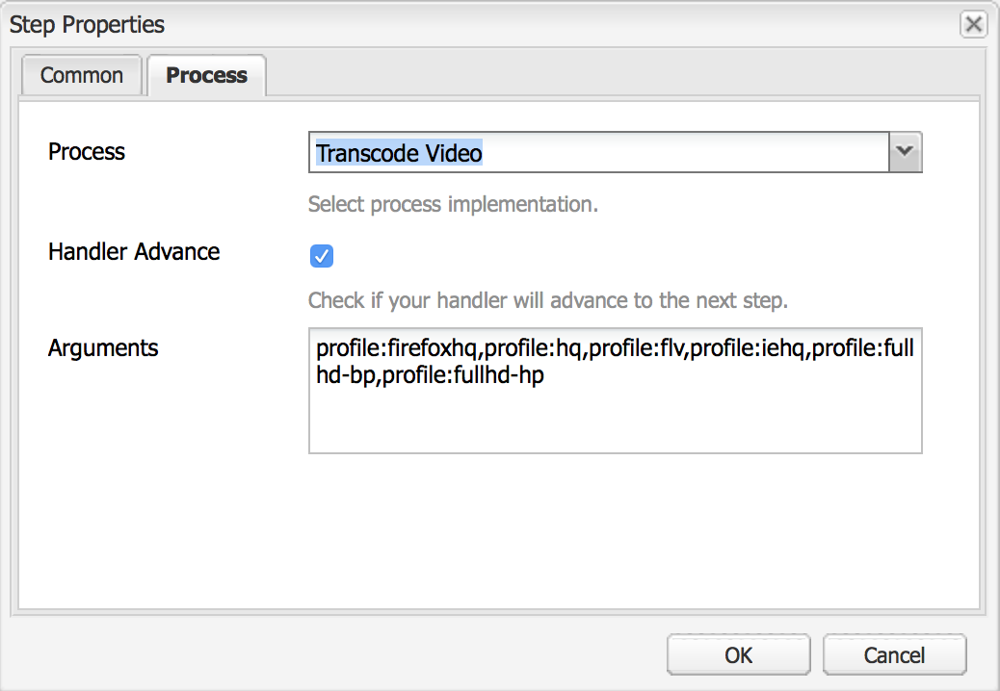
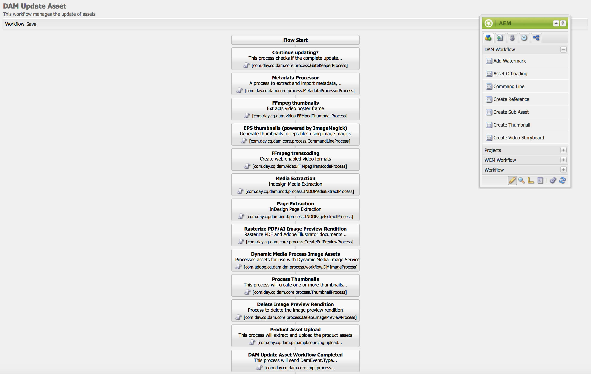
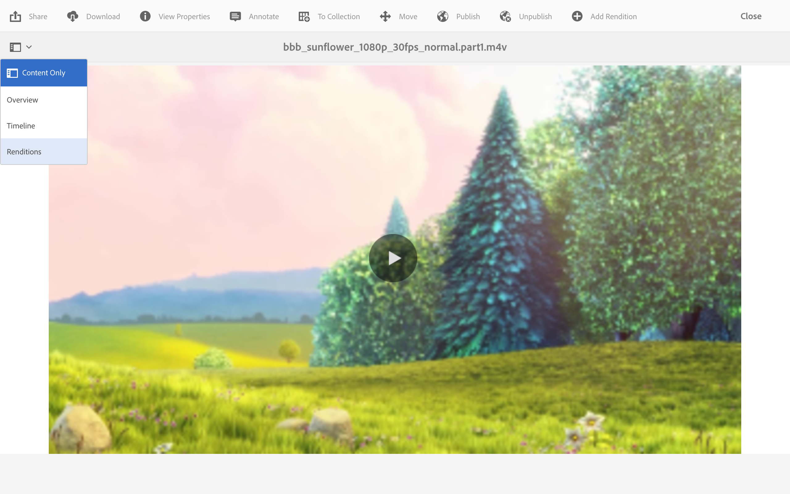
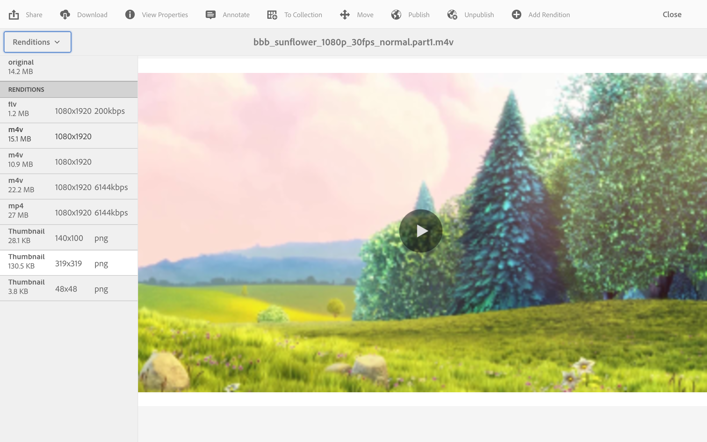
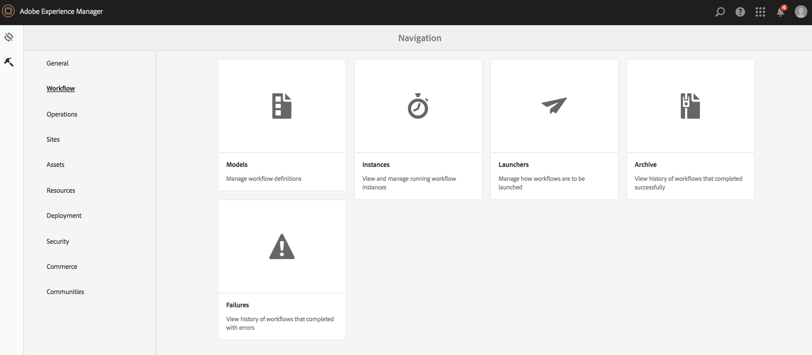
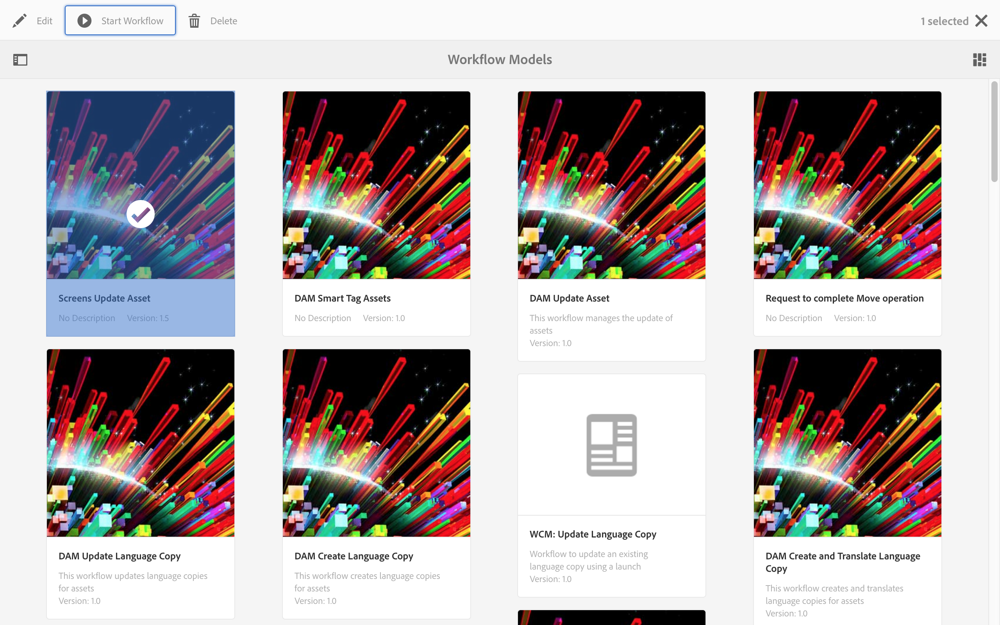
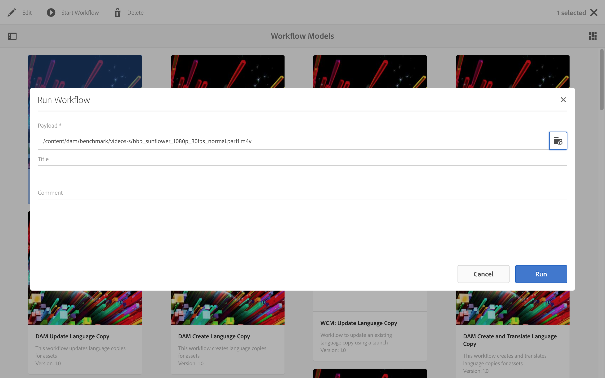
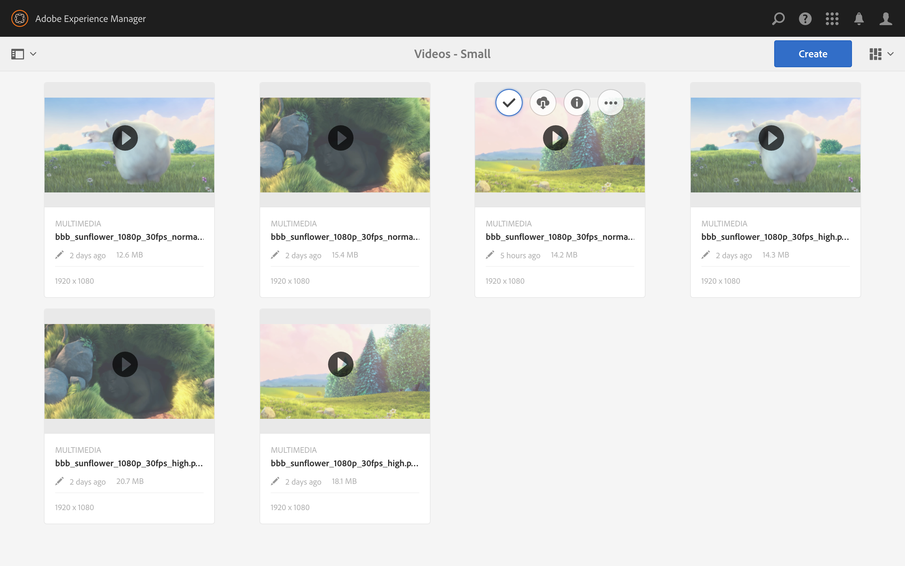

# Video Renditions{#video-renditions}

You can generate manual and automatic Full HD renditions. The following section describes the workflow to add renditions to your assets.

## Automatically Generating Full HD Renditions  {#automatically-generating-full-hd-renditions}

>[!NOTE]
>
>In case the AEM Screens video renditions do not play optimally on your device, contact the hardware vendor for the specifications of the video. This will help to get the best performance on the device and hence create your own custom video profile where you provide the appropriate parameters for FFMPEG to generate your rendition. Subsequently, use the steps below to add your custom video profile to the list of profiles.
>
>Additionally, see [Troubleshooting Videos](/help/screens/troubleshoot-videos.md) to debug and troubleshoot video playing in your channel.

Follow the steps below to automatically generate full HD renditions:

1. Select the Adobe Experience Manager link (top left) and click the hammer icon to select tools to selct **Workflow**.

   Click **Models** to enter the workflow models management.

   

1. Select the **DAM Update Asset **model and click Edit from the action bar to open the **DAM Update Asset **window.

   

1. Double-click the **FFmpeg transcoding** step.

   

1. Select the **Process** tab to edit the process arguments. Enter the full HD profiles to the list in **Arguments** as: ***,profile:fullhd-bp,profile:fullhd-hp*** and click **OK**.

   

1. Click **Save **on the top left of the **DAM Update Asset **screen.

   

1. Navigate to **Assets** and upload a new video. Click the video and open the Renditions side rail and you will notice the two full HD videos.

   

1. Open **Renditions** from the side rail.

   

1. You will notice two new full HD renditions.

   

## Manually Generating Full HD Renditions {#manually-generating-full-hd-renditions}

Follow the steps below to manually generate full HD renditions:

1. Select the Adobe Experience Manager link (top left) and click the hammer icon to select tools to selct **Workflow**.

   Click **Models** to enter the workflow models management.

   

1. Select the **Screens Update Asset **model, and click the **Start Workflow** to open the **Run Workflow** dialog box.

   

1. Select the desired video in the **Payload** and click the **Run**.

   

1. Navigate to **Assets**, drill down to your asset, and click it.

   

1. Open the **Renditions** side rail and you will notice the new full HD renditions.

   

