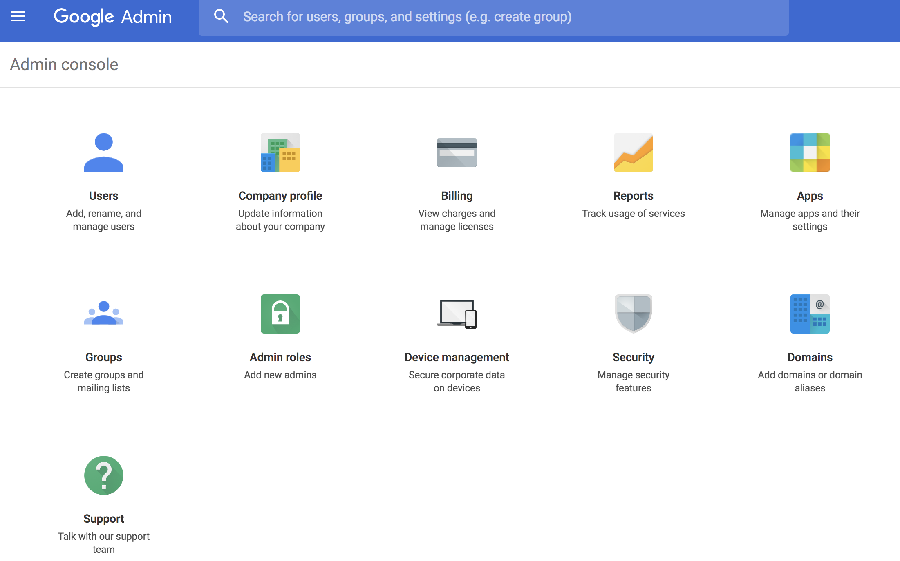

# Implementing Chrome OS Player {#implementing-chrome-os-player}

This section describes how to implement the Chrome OS Player using the Chrome Management Console.

## Using Chrome Management Console {#using-chrome-management-console}

Follow the steps below to set up chrome management console:

1. Register for the Chrome Management Console. You need to obtain a license for Chrome Management Console. Contact [Google Support](https://support.google.com/chrome/a/answer/1375678?hl=en&ref_topic=2935995) to Manage Chrome device settings for more information.
1. Enroll your Chrome OS Device into the domain wait for 15 minutes for the device to sync with the Chrome Management Console. To learn more about enrolling chrome device, click [here](https://support.google.com/chrome/a/answer/1360534?hl=en).
1. The Chrome Player will be available in the Chrome Web store.

>[!NOTE]
>
>A device management solution such as the Chrome Management Console is recommended for deployment and management of Chrome OS Devices. Although, this document provides implementation for Chrome Management Console there are other vendors who claim to provide similar functionality. Please contact the vendor of your device management software.

### Enabling Kiosk Mode {#enabling-kiosk-mode}

Follow the steps below to enable the Kiosk mode:

1. Log in to the Chrome Developer Console.

   

1. Browse to **Device management** → **Chrome Management** → **Device Settings**.
1. Scroll down to **Kiosk Settings** and click **Manage Kiosk Applications**.

   

1. Select the AEM Screens Player from the Chrome Web Store.

   >[!NOTE]
   >
   >A recently published app may take about 15 minutes to appear in this list.

1. Select **AEM Screens Player** from the **Auto Launch Kiosk App** dropdown.

   It may take a few minutes depending on the network for the changes to take effect. A reboot is recommended.

#### Checking Remote Device Status {#checking-remote-device-status}

1. Log in to the Chrome Developer Console.
1. Browse to **Device management** → **Chrome Devices** and select the device you wish to control.

1. Click **System Activity and troubleshooting**.
1. Check the **Reboot Device** and **Screen Capture** properties of the device. You can also check the device status and health information.

>[!NOTE]
>
>Please note that these settings maybe enabled several minutes after the device is enrolled. Each option may become enabled over time.

### Configuring Remote Configuration of Chrome OS Players {#configuring-remote-configuration-of-chrome-os-players}

The AEM Screens Player is a Kiosk enabled application that also enables Remote Policy Configuration for Chrome OS Players.

Follow the steps below to configure various options of the player:

1. Login to Chrome Management Console.
1. Click **Device management** → **Chrome Management** → **App Management**. The AEM Screens Player displays in the list.

1. Click the application **AEM Screens Player**.
1. Click **Kiosk settings** and select select your org (*if using a test environment*).

1. Click on **upload configuration file** and upload the configuration policy (*Json file*).

1. Click **Save**. You must reboot the device to sync the policy.

>[!NOTE]
>
>Reboot the device to sync policy changes.

#### Example Policy JSON file {#example-policy-json-file}

```java
{
  "server": {
    "Value": "https://aemscreensdemo.adobeitc.com"
  },
  "resolution": {
    "Value": "auto"
  },
  "rebootSchedule": {
    "Value": "at 4:00am"
  },
  "enableAdminUI": {
    "Value": true
  },
  "enableOSD": {
    "Value": true
  },
  "enableActivityUI": {
    "Value": true
  }
}
```

### Policy attributes and purpose {#policy-attributes-and-purpose}

The following table summarizes the policies with their functions.

| **Policy Name** |**Purpose** |
|---|---|
| *server* |The URL to the Adobe Experience Manager Server |
| *resolution* |The resolution of the Chrome OS Device |
| *rebootSchedule* |The schedule to reboot the Chrome player |
| *enableAdminUI* |Enable the Admin UI for technicians to configure the device on site. Set to false once it is fully configured and in production. |
| *enableOSD* |Enable the channel switcher UI for users to switch channels on device. Consider setting to false once it is fully configured and in production. |
| *enableActivityUI* |Enable to show progress of activities such as download and sync. Enable for troubleshooting and disable once it is fully configured and in production. |

>[!NOTE]
>
>Policy configurations are strictly enforced and are not manually overridden at the player's admin UI. To allow manual player configuration for a particular policy, do not specify the policy in the ***policy  configuration,*** for example, if you want to allow manual configuration for reboot schedule, do not specify the key ***rebootSchedule*** in the policy configuration.

