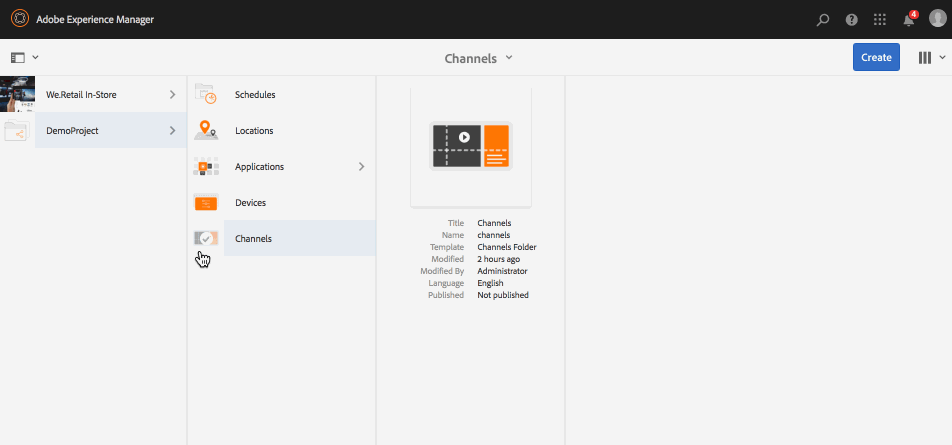
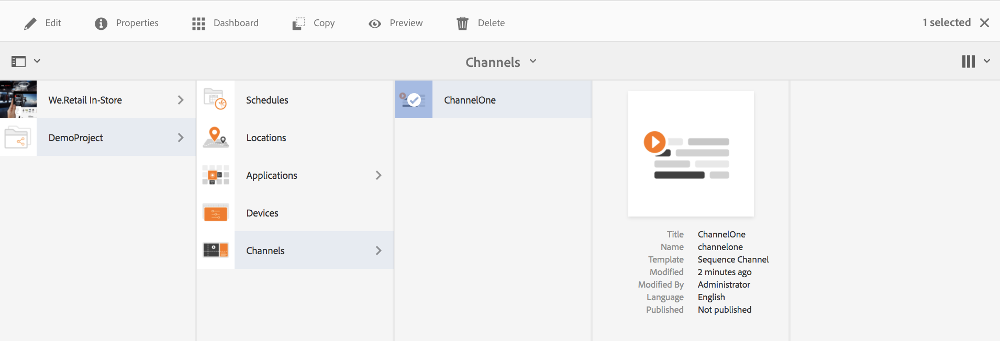
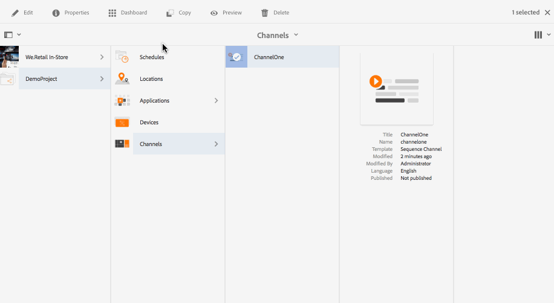
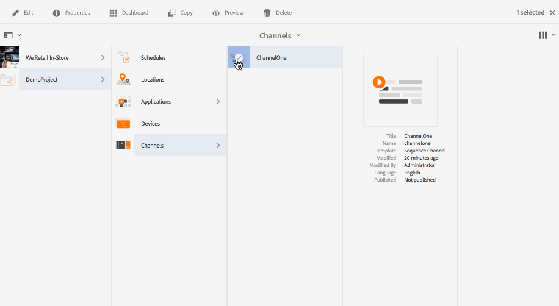
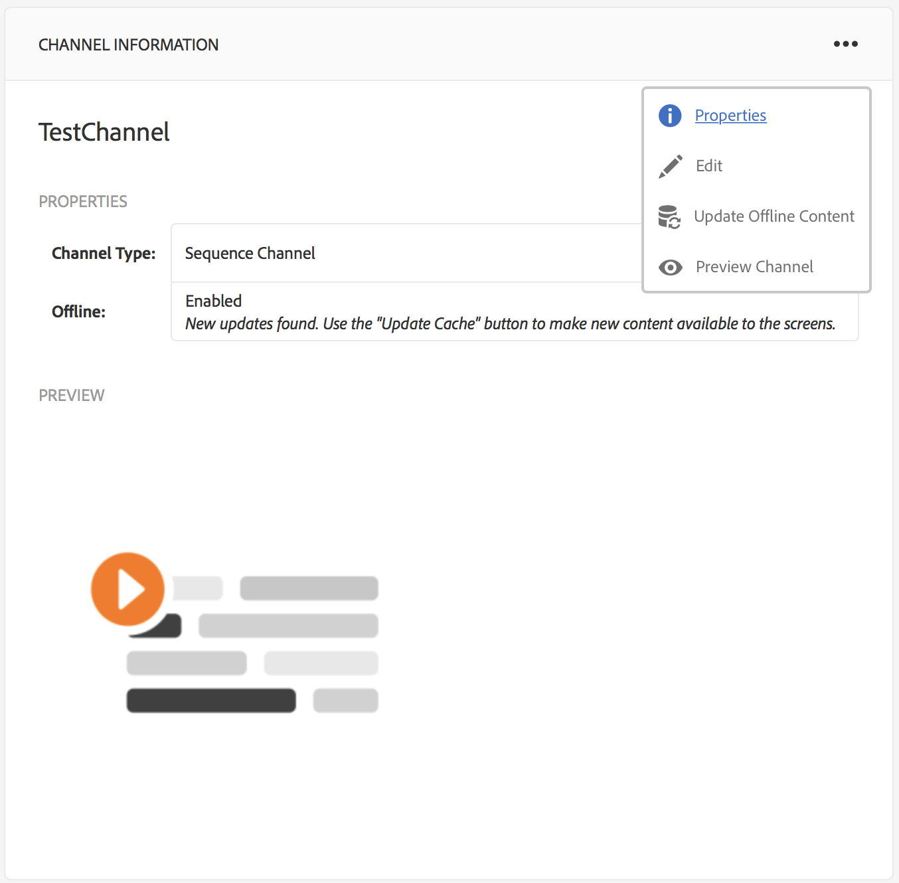
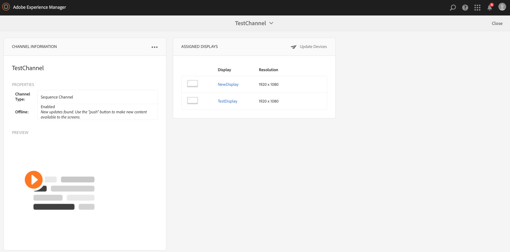
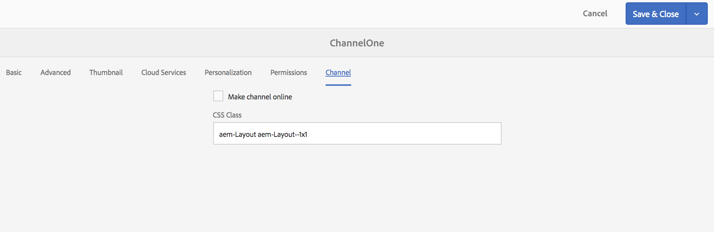

# Creating and Managing Channels{#creating-and-managing-channels}

A Channel displays a sequence of content and display images and videos, but they could also display a website or a single-page application.

This page shows creating and managing channels for Screens.

**Pre-requisites**:

* [Configuring and Deploying Screens](configuring-screens-introduction.md)
* [Creating and Managing Screens Project](creating-a-screens-project.md)

## Creating a New Channel {#creating-a-new-channel}

Once you create your project for Screens, follow the steps below to create a new Channel for a Screens project:

1. Select the Adobe Experience Manager link (top left) and then Screens. Alternatively, you can navigate directly from `http://localhost:4502/screens.html/content/screens`
1. Navigate to Screens project and click **Channels**. 
1. Click **Create** next to the plus icon in the action bar. A wizard will open (*See Channel Types for more information*).

1. Select the template from the wizard and click **Next**.
1. Enter the properties for **Title and Tags**, **More Titles and Description**, **On/Off Time**, and **Vanity URL**.

1. Click **Create** and the channel is created and added to your channels folder.

### Channel Types {#channel-types}

The following template options are available while using the wizard such as:

| **Template option** |**Description** |
|---|---|
| Channels Folder |Allows to create a folder to store collection of channels. |
| Sequence Channel |Allows to create a channel that plays the components sequentially (one by one in a slideshow). |
| Application Channel |Allows to showcase your custom web application in Screens player. |
| 1x1 Split Screen Channel |Allows to view the component in a single zone. |
| 1x2 Split Screen Channel |Allows to view the assets in two zones (split horizontally). |
| 2x2 Split Screen Channel |Allows to view the assets in four zones (split horizontally and vertically in a matrix). |
| 2 to 3 Split Screen Channel |Allows to view the assets in two zones (split horizontally) with one of the zones being larger than the other one. |

>[!NOTE]
>
>The Split Screen channels split the display into multiple zones so you can play several experiences at the same time, side-by-side. The experiences can either be static assets/text or embedded sequences.

The following example shows the creation of a Sequence Channel **ChannelOne** for a Screens project **DemoProject**.

>[!NOTE]
>
>You can create different zones using the template options such as 1x2, 2x2, or 2 to 3 split screen channels mentioned above.

***Important***:

Once you create and add content to your channel, the next step is to create a location followed by creating a display. Furthermore you need to assign that channel to a display. See the resources below at the end of the section to learn more.

## Working with Channels {#working-with-channels}

You can edit, view properties and dashboard, copy, preview, and delete a channel.

>[!NOTE]
>
>Click on the icon on the left to select an item. For example, click on the icon for channel and perform the following actions, as shown in the figure below.

 

### Adding/Editing Content to a Channel {#adding-editing-content-to-a-channel}

To add or edit content in a channel, follow the steps below:

1. Click on the Channel you want to edit (as shown in the figure above).
1. Click **Edit** from the top left corner of the action bar to edit the channel properties. The editor opens that allows you to add assets/components to your channel that you want to publish.

**Uploading Videos to the Channel** 
Follow the steps below to upload videos to your channel:

1. Select the channel where you want to upload the video.   
1. Click **Edit** from the action bar to open the editor.
1. Select **Videos** under Assets and drag and drop the required videos.

>[!NOTE]
>
>If you encounter issues uploading videos in your channel, see [Troubleshooting Videos](troubleshoot-videos.md) under Administering Screens.

### Viewing Properties {#viewing-properties}

To view or edit properties of a channel, follow the steps below:

1. Click on the Channel you want to edit.
1. Click **Properties **from the action bar to view/edit the channel properties. The following tabs allow you to change the options.

 

### Viewing Dashboard {#viewing-dashboard}

To view dashboard of a channel, follow the steps below:

1. Click on the Channel you want to edit.
1. Click **View Dashboard** from the action bar to view the dashobard. The **CHANNEL INFORMATION** and **ASSIGNED DISPLAYS** panel opens, as shown in the figure below:

 

### Channel Information {#channel-information}

The Channel Information panel describes the Channel properties, along with the preview to the channel. Also, it provides you the information on whether the channel is offline or online.

Click on the (**...**) in the **Channel Information** action bar to view properties, edit the content, or to update cache (offline content) for the channel.

 

### Online and Offline Channels {#online-and-offline-channels}

>[!NOTE]
>
>By Default, when you create a channel, the channel is Offline.

When you create a channel, it can either be defined as an online or an offline channel.

An ***Online Channel***, will show the updated content in the real time environment whereas an ***Offline Channel***, shows the cached content.

Follow the steps below to make the channel online:

1. Navigate to the channel **TestChannel** from **Channels** folder in your **TestProject**.

   Select the channel.

   

   Click **View Dashboard** from the action bar to view the status of the player. The **CHANNEL INFORMATION **panel provides information on whether the channel is online or offline.

   

1. Click **Properties** from the action bar and navigate to the **Channel** tab as shown below:

   

1. Check the **Make channel online** to make the channel as online.

   Click **Save & Close** to save your option.

   

   The channel dashboard displays and the **CHANNEL INFORMATION** panel shows the online status of the player.

   

#### Automatic versus Manual Updates from the Device Dashboard {#automatic-versus-manual-updates-from-the-device-dashboard}

The following table summarizes the events associated with the automatic and manual updates from the device dashboard.

<table> 
 <tbody> 
  <tr> 
   <td><strong>Event</strong></td> 
   <td><strong>Device Auto Update</strong></td> 
   <td><strong>Device Manual Update</strong></td> 
  </tr> 
  <tr> 
   <td>Change in Online Channel</td> 
   <td>Content updated automatically</td> 
   <td>
Content updated on "Device: Push Config"
 
Or,
 
Content updated on <strong><i>Device: Restart</i></strong>
 </td> 
  </tr> 
  <tr> 
   <td>Change in Offline channel but Channel "Push Content" is NOT triggered (no offline package re-creation)</td> 
   <td>No content update</td> 
   <td>No content update</td> 
  </tr> 
  <tr> 
   <td>Change in Offline Channel and Channel "Push Content" is triggered (new offline package)</td> 
   <td>Content updated automatically</td> 
   <td>
Content updated on <strong><i>Device: Push Config</i></strong>
 
Or,
 
Content updated on <strong><i>Device: Restart</i></strong>
 </td> 
  </tr> 
  <tr> 
   <td>
Change in Config
 
    <ul> 
     <li>Display (forced channel)</li> 
     <li>Device</li> 
     <li>Channel assignments (new channel, removed channel)</li> 
     <li>Channel assignment (role, event, scheduling)</li> 
    </ul> </td> 
   <td>Config updated automatically</td> 
   <td>
Config updated on <strong><i>Device: Push Config</i></strong>
 
Or,
 
Config updated on <strong><i>Device: Restart</i></strong>
 </td> 
  </tr> 
 </tbody> 
</table>

### Assigned Displays {#assigned-displays}

The assigned displays panel shows the display associated to the channel. It provides a snapshot of the assigned display along with the resolution.

The associated displays will list in the **Assigned Displays** panel, as shown below:

>[!NOTE]
>
>To learn about creating a display in a location, please refer to:
>
>* [Create and Manage Locations](managing-locations.md)
>* [Create and Manage Displays](managing-displays.md)
>

Additionally, click on the display in the **ASSIGNED DISPLAYS** panel, to view the display information, as shown below:

 

### The Next Steps {#the-next-steps}

The next step after creating a channel and adding/editing content in your channel is to learn how to create a location and display. Furthermore, then assign a channel to that display.

See the following resources, for next steps:

* [Create and Manage Channels](managing-channels.md)
* [Create and Manage Locations](managing-locations.md)
* [Create and Manage Displays](managing-displays.md)