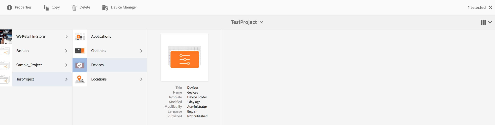
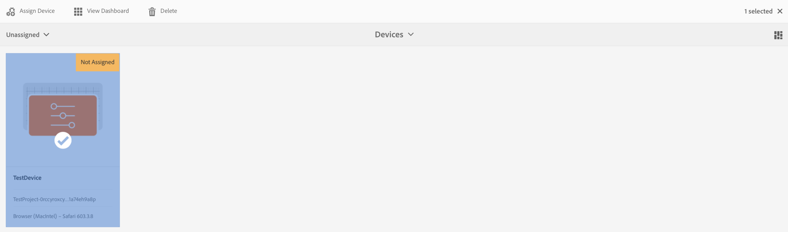
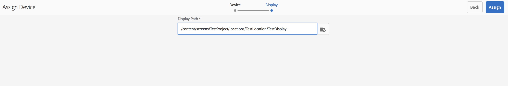
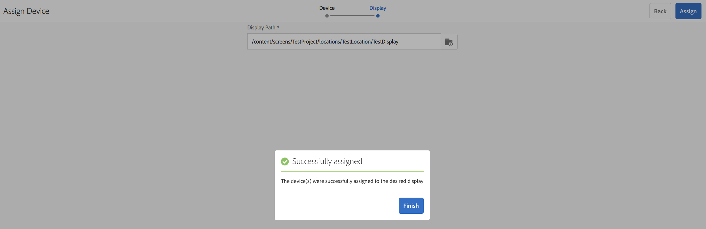
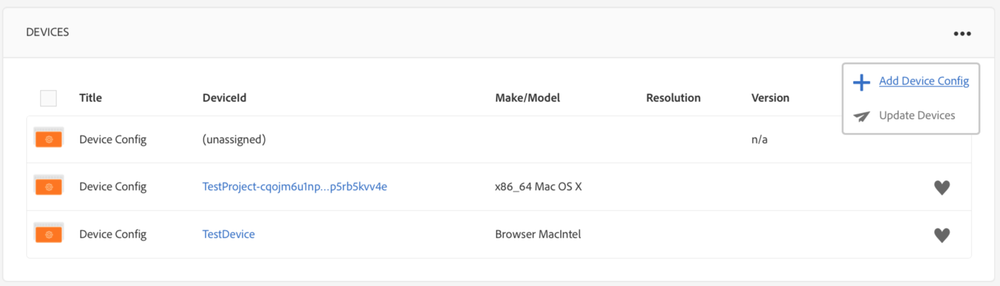
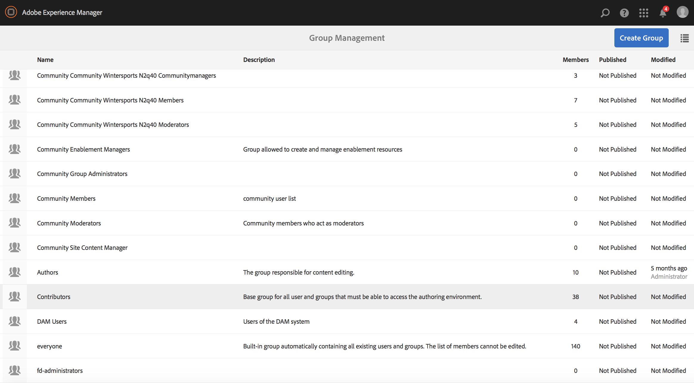

# Managing Devices{#managing-devices}

This page describes device assignment.

The Devices console allows you to access the device manager to assign your device to a display.

>[!CAUTION]
>
>Before assigning your device, you need to register it. For more information, see [Device Registration](managing-devices.md).

## Device Assignment {#device-assignment}

Follow the steps below to assign a device to a display:

1. Navigate to the Devices folder of your project, for example

   [http://localhost:4502/screens.html/content/screens/TestProject](http://localhost:4502/screens.html/content/screens/TestProject)

   

1. Select your **Devices** folder and tap/click **Device Manager** in the action bar. The assigned and unassigned devices display.

   

1. Select an unassigned device from the list, and tap/click the **Assign Device** in the action bar.

   

1. Select the display you want to assign the device to from the list, and tap/click the **Assign**.

   

1. Tap/click the **Finish** to complete the assignment process.

   

   The display dashboard displays the assigned device in the **DEVICES** panel.

   

   Click the (**...**) on the top right corner of the **DEVICES** panel to either add device config or update the devices.

   

>[!NOTE]
>
>Every time the first device is added to a new Screens project, a user group is created.  
>For instance, if the project node name is *we-retail*, then the user group name is *screens-we-retail-devices*.  
>This group will be added as a member of the **Contributors** group, as shown in the figure below:

### The Next Steps {#the-next-steps}

Once you are familiar with assigning channel to a display, see the following resources:

* [Monitor and troubleshoot](monitoring-screens.md)

