# Creating and Managing a Live Copy{#creating-and-managing-a-live-copy}

This page describes creating and managing Live Copies of channels.

A ***Live Copy*** is a copy of specific site content for which a live relationship with the original source is maintained. This live relationship allows the live copy to inherit content and page properties from the source.

This page describes creating live copy of a channel, viewing properties, checking status, and propagating changes from a channel to its live copy.

>[!NOTE]
>
>To learn more about Live Copy Sources and Blueprint Configurations, see [MSM Best Practices](/help/sites-administering/msm-best-practices.md). 

## Creating a Live Copy {#creating-a-live-copy}

Follow the steps below to create a live copy of a channel in your project folder.

1. Select the Adobe Experience Manager link (top left) and then **Screens**. Alternatively, you can go directly to: [http://localhost:4502/screens.html/content/screens](http://localhost:4502/screens.html/content/screens).

1. Navigate to Screens project and click **Channels**. 
1. Click **Create** and select **Live Copy** to create a live copy of the channel.

1. Select the destination and click **Next**.
1. Select the location where the live copy will reside.
1. Enter the **Title** and **Name** in the **Create Live Copy** page.

1. Click **Open** to view the contents of new live copy or **Done** to return to the main page.

Alternatively, see the steps below for visual representation for creating a new live copy of a channel.

The following example shows the creation of a live copy (***IdleLiveCopy***) for ***Idle Channel*** with destination folder as ***Channels***.

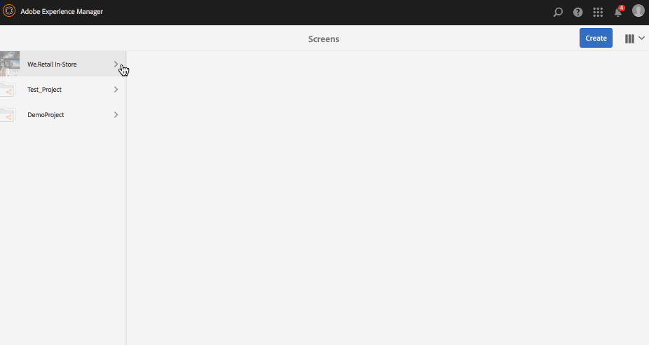

## Viewing Content of the Live Copy Channel {#viewing-content-of-the-live-copy-channel}

A Live copy is a copy of a channel that already exists.

To view the content of your live copy, see the steps below:

1. Navigate to Screens project and click the location where you orginally created live copy as shown in the section above. (Here, the location was chosen as **Channels** folder)

   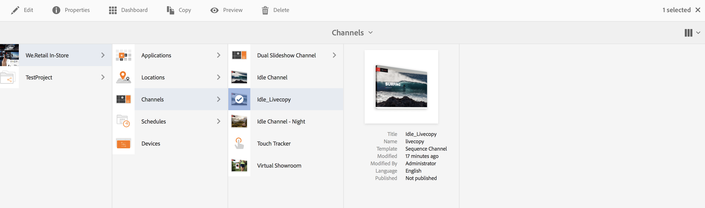

1. Click **Edit** from the action bar to view the content in the channel.

   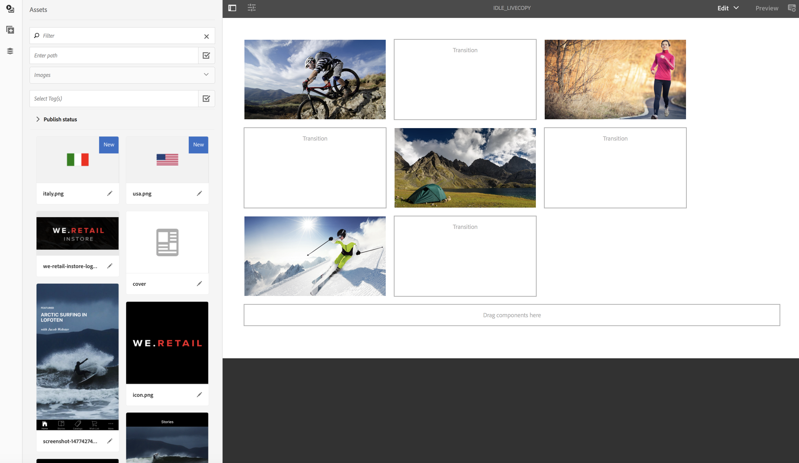

   >[!NOTE]
   >
   >When viewing content for a live copy channel, you will view an extra item in the menu as **Live Copy Status**. See the section below for more details.

### Viewing Properties of a Live Copy {#viewing-properties-of-a-live-copy}

Additionally, you can view the properties of your live copy channel.

1. Navigate to your live copy channel and click **Properties** from the action bar.

   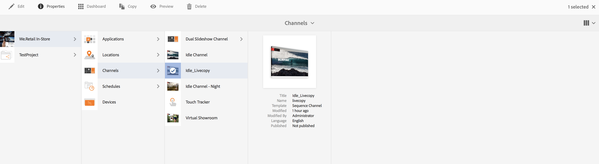

1. Select the **Live Copy** tab to view details of your channel.

   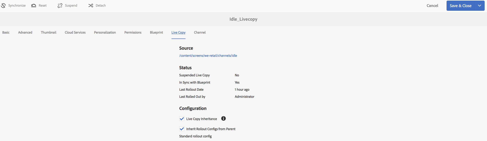

### Live Copy Status {#live-copy-status}

The mode** Live Copy Status**, as shown in the figure below, allows you to view the relationship status of all the assets in the channel.

1. Click **Edit** to choose the **Live Copy Status** and view the association of your channel content to the original channel (from which the live copy is generated).

   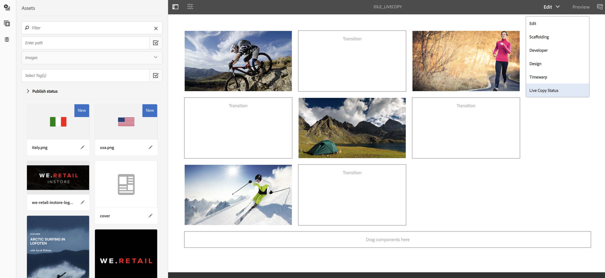

1. Select **Live Copy Status** to display the preview page.

   All the resources with green border show that the content is inherited from the original channel.

   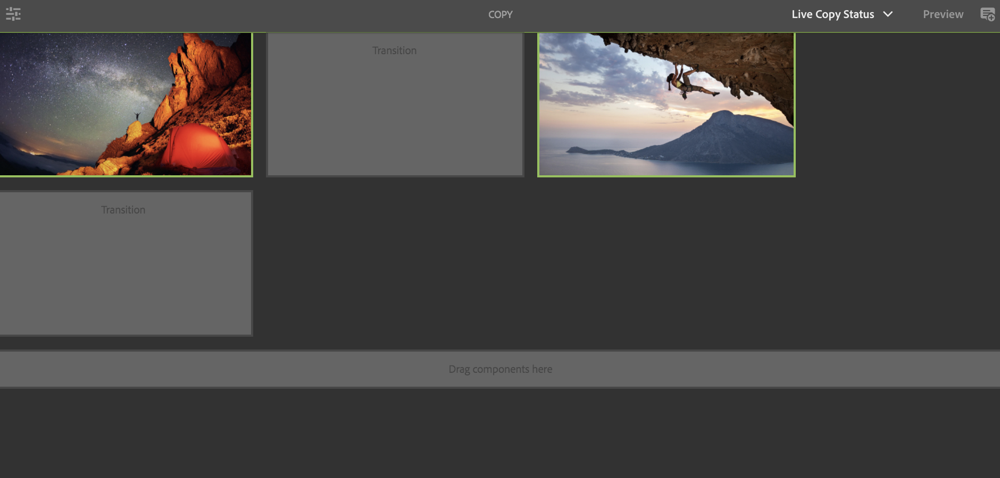

### Breaking the Inheritance {#breaking-the-inheritance}

You can also cancel the inheritance from the livecopy, so the content becomes independent of the original branch.

The following example, shows that you select the image in the edit mode and click the cancel inheritance symbol on the top right.

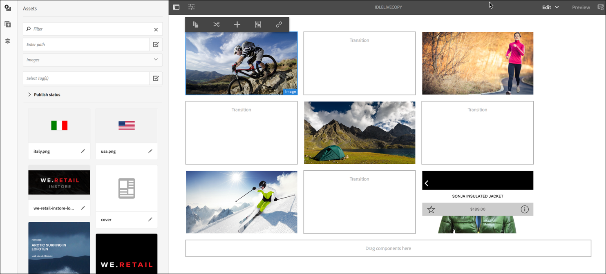

### Propagating Changes to the Live Copy Channel {#propagating-changes-to-the-live-copy-channel}

If you make changes/updates in the orginal channel, you need to propagate those changes to your Live Copy channel too.

Follow the steps below to ensure your changes are propagated from the original channel to the live copy channel:

1. Select the original channel (***Idle Channel***) and click **Edit** from the action bar.

   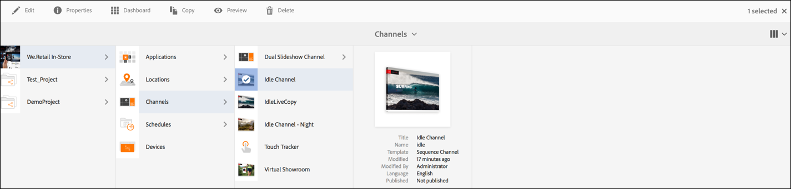

1. Make edits to this channel content. For example, delete an image from this channel.

   

1. Select the live copy of the channel (***IdleLiveCopy***) and click **Edit** from the action bar. You will notice that the image you deleted is still visible in the live copy.

   In order to propagate the changes, you need to synchronize the channel.

   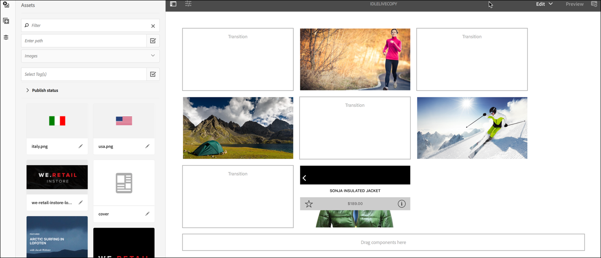

1. In order to propagate changes to the live copy channel, navigate to the AEM dashboard and select the live copy channel and click **Properties** from the action bar.

   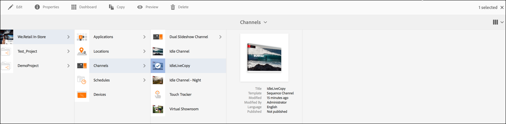

1. Select the **Live Copy** tab and click **Synchronize** from the action bar.

   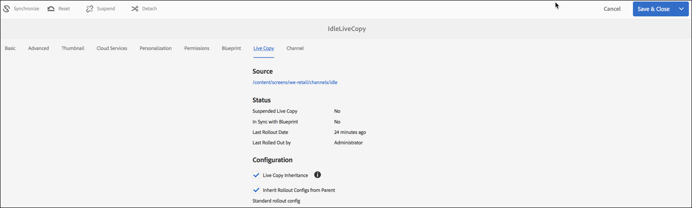

1. Click **Sync** to confirm the changes. Click **Save & Close** to navigate back to the AEM dashboard..

   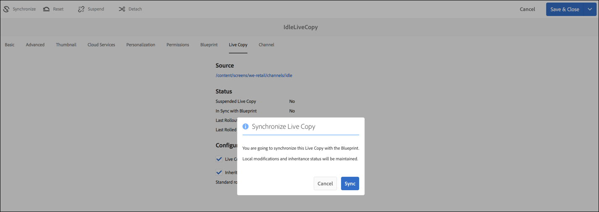

   You will notice that the image is now deleted from the live copy channel too.

