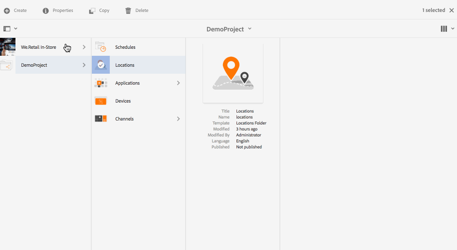
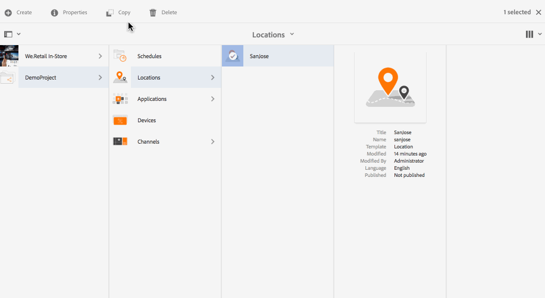

# Creating and Managing Locations{#creating-and-managing-locations}

The locations host the configuration of the displays according to where the various screens are.

This page shows creating and managing locations for Screens.

**Pre-requisites**:

* [Configuring and Deploying Screens](configuring-screens-introduction.md)
* [Creating and Managing Screens Project](creating-a-screens-project.md)
* [Creating and Managing Channels](managing-channels.md)

## Creating a New Location {#creating-a-new-location}

Once you create your project for Screens, follow the steps below to create a new Location for a Screens project:

1. Select the Adobe Experience Manager link (top left) and then Screens. Alternatively, you can go directly to: [http://localhost:4502/screens.html/content/screens](http://localhost:4502/screens.html/content/screens).
1. Navigate to Screens project and click **Locations**. 
1. Click **Create** next to the plus icon in the action bar. A wizard will open.
1. Select the template **Location** from the wizard and click **Next**.

1. Enter the properties for **Title and Tags**, **More Titles and Description**, **On/Off Time**, and **Vanity URL**.

1. Click **Create** and the location is created and added to your locations folder.

See the steps below to understand creating a new location for an AEM Screens project. For demonstration purposes, the new location (SanJose) is created under *DemoProject*.

Once you create a location, you have to create a new display for your location.

### Editing Properties for a Location {#editing-properties-for-a-location}

To edit/access the properties of a location:

1. Select the location.
1. Click **Properties** from the action bar.

#### The Next Steps {#the-next-steps}

Once you create a location, you have to create a new display for your location.

See [Creating and Managing Displays](managing-displays.md) for more details.
