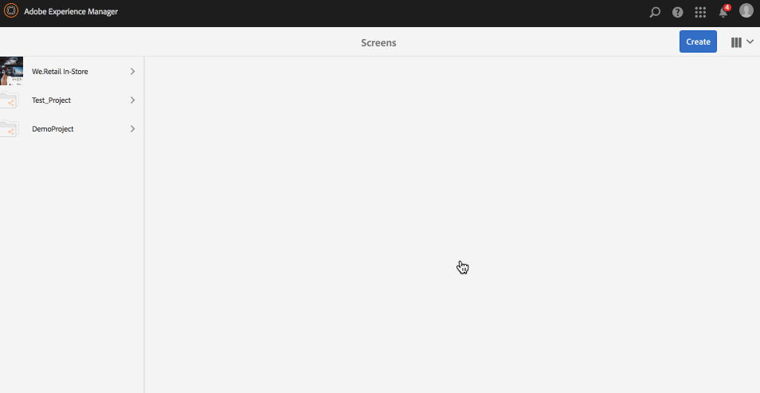
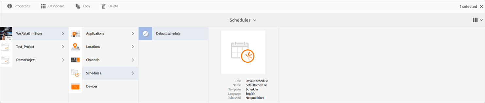
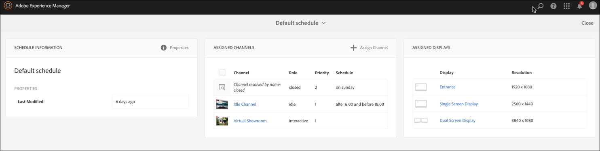

# Creating and Managing Schedules{#creating-and-managing-schedules}

**Schedules**, in AEM Screens, lets you organise channels into re-usable groups so that you do not have to repeat their assignment individually for each display on which you want to show your content.

Schedules when combined with ***Dayparting***, allows you to set a global schedule with multiple channels running at specific times of the day, and re-use that setup for all your displays at once.

>[!NOTE]
>
>This AEM Screens functionality is only available, if you have installed AEM 6.3 Sites Feature Pack 1. To get access to this Feature Pack, you must contact Adobe Support and request access. Once you have permissions you can download it from Package Share.

## Creating a Schedule {#creating-a-schedule}

You can create a schedule for your Screens project that will manage all the activities for your use case.

Follow the steps below to create schedule for your channel:

1. Select the Adobe Experience Manager link (top left) and then Screens. Alternatively, you can go directly to: [http://localhost:4502/screens.html/content/screens](http://localhost:4502/screens.html/content/screens).
1. Navigate to Screens project and click **Schedules**. 
1. Click **Create** from the action bar.
1. Select **Schedule** from the **Create** wizard and click **Next**.

1. Enter the **Name** and **Title** and click **Create**.

You will see a schedules folder with designated name and title in your project.

## Viewing Dashboard {#viewing-dashboard}

Once you have created schedules folder in your project, you can view the details from the schedules dashboard.

Follow the steps below to view the schedules dashboard. The following example shows the dashboard of We.Retail project:

1. Navigate to the **Schedules** folder of Screens (example, We.Retail) project.

   

1. Click **Dashboard** from the action bar to open the schedule's dashboard.

   You ca view three different panels such as **SCHEDULE INFORMATION**, **ASSIGNED CHANNELS**, and **ASSIGNED DISPLAYS**.

   

   **Schedule Information Panel** Click Properties from the top right corner from the SCHEDULE INFORMATION Panel to view/change properties of the schedule.

   **Assigned Channels Panel** Click +Assign Channel from the top right corner from the ASSIGNED CHANNELS Panel to open the Channel Assignment dialog box. See Asigning Channels for more details.

   **Assigned Displays Panel** Select any of the displays from the ASSIGNED DISPLAYS Panel to open the display dashboard.

