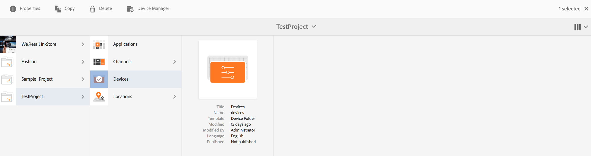
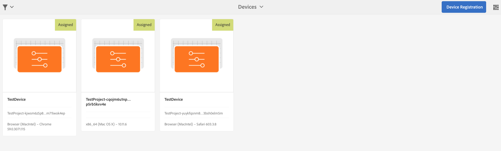
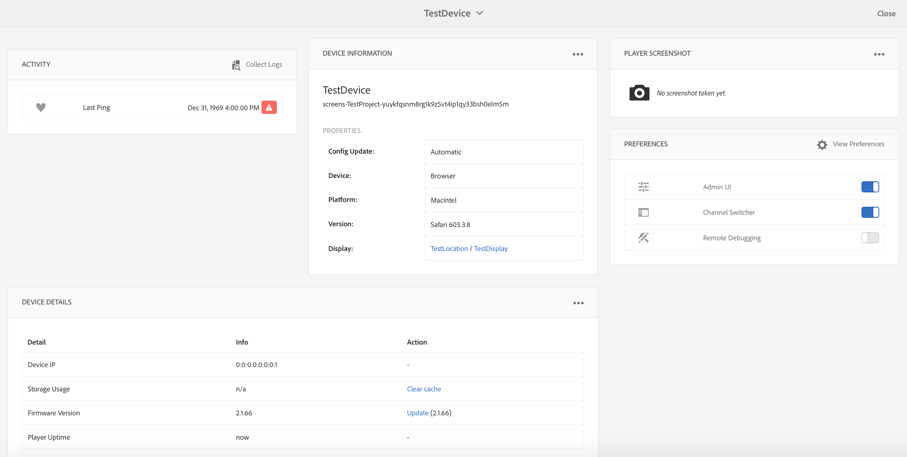
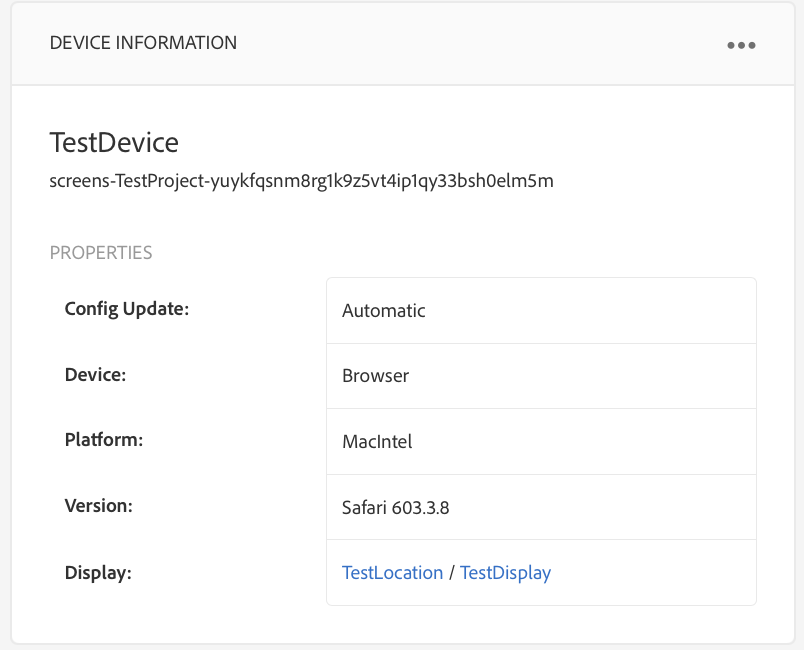
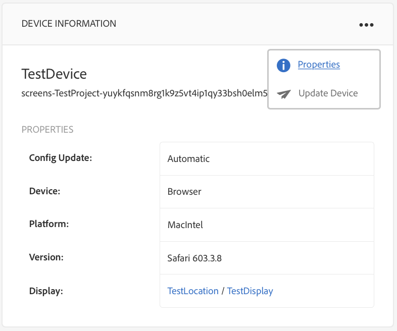
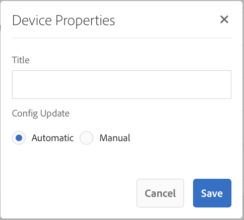
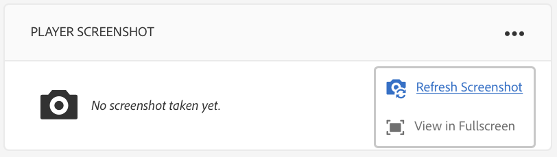
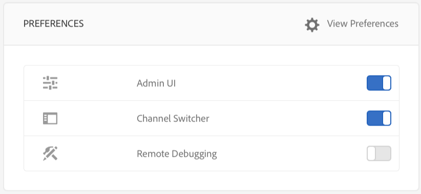
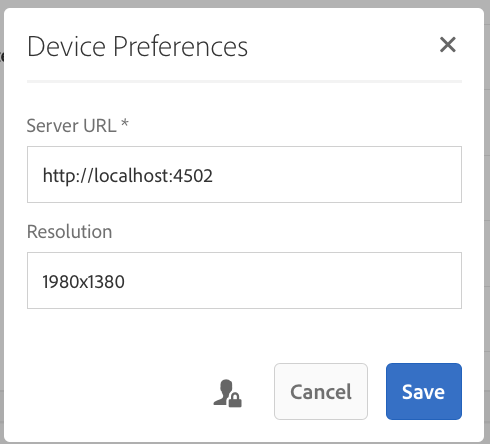

# Troubleshooting Device Control Center{#troubleshooting-device-control-center}

You can monitor and troubleshoot performance for your Screens player activity and device using the the Device dashboard. This page provides information about how to monitor and troubleshoot perceived performance problems for Screens player and the assigned devices.

## Monitor and Troubleshoot from Device Control Center {#monitor-and-troubleshoot-from-device-control-center}

You can monitor the activity and hence troubleshoot your Screens player, using the the Device Dashboard.

### Device Dashboard {#device-dashboard}

Follow the steps below to navigate to the device dashboard:

1. Navigate to the device dashboard from your project, for example, ***Test Project*** --&gt; ***Devices***.

   Select **Devices** and **Device Manager** from the action bar.

   

1. Select the device you want to monitor.

   

1. The page shows the device information, activity, and the device details that allows you to monitor the device activities and functions.

   

### Monitor Device Activity {#monitor-device-activity}

The **Activity** panel shows the last ping of your screens player with the timestamp. The last ping corresponds to the last time the device contacted the server.

Additionally, click **Collect Logs** from the top right hand corner of the **Activity** panel to view the logs for your player.

### Update Device Details {#update-device-details}

Check the **Device Details** panel to view the device IP, Storage usage, firmware version and the player uptime for your device.

Additionally, click **Clear cache** and **Update** to clear the cache of your device and update the [firmware](screens-glossary.md) version respectively from this panel.

Also, click the **...** from the top right corner of the **Device Details** panel to restart or refresh the status of your player.

 

### Update Device Information {#update-device-information}

Check the **DEVICE INFORMATION** panel to view the configuration update, device, platform, version, and the diplay associated with the device.

Additionally, click the (**...**) from the top right corner of the Device Information panel to view properties or update the device.

Click **Properties** to view the **Device Properties** dialog box. You can edit the device title or choose the option for configuration updates as **Manual** or **Automatic**.

>[!NOTE]
>
>To learn more about the events associated with device's automatic or manual updates, see the section ***Automatic versus Manual Updates from the Device Dashboard*** in [Managing Channels](managing-channels.md).

 

### View Player Screenshot {#view-player-screenshot}

You can view the player screenshot from the device from the **PLAYER SCREENSHOT **panel.

Click (**...**) on the top right corner of the Player Screenshot panel and select **Refresh Screenshot **to view the snapshot of the running player.

 

### Manage Preferences {#manage-preferences}

The **PREFERENCES** panel allows the user to change preferences for **Admin UI**, **Channel Switcher**, and **Remote Debugging** for the device.

>[!NOTE]
>
>To learn more on these option, See [AEM Screens Player](working-with-screens-player.md).

Additionally, click **View Preferences** from the top right corner to update the server URL and the resolution.

 

## Troubleshoot OSGI Settings {#troubleshoot-osgi-settings}

You need to enable the empty referrer to allow the device to post data to the server. For example, if the empty referrer property is disabled, the device cannot post a screenshot back.

Currently some of these features are only available if the *Apache Sling Referrer Filter Allow Empty* is enabled in the OSGI Config. The dashboard may display a warning that security settings may prevent some of these features from working.

Follow the steps below to enable the Apache Sling Referrer Filter Allow Empty

1. Navigate to [Adobe Experience Manager Web Console Configuration](http://localhost:4502/system/console/configMgr/org.apache.sling.security.impl.ReferrerFilter).
1. Check the **allow.empty **option.
1. Click **Save**.

 

### Recommendations {#recommendations}

The following section recommends monitoring the network links, server, and players to understand the health and react to issues.

AEM provides built-in monitoring for:

* *Heartbeat* every 5 seconds to indicates that the AEM Screens Player is in operation.
* *Screenshot* from the Player that shows what is currently displayed on the Player.
* The *AEM Screens Player Firmware* version installed on the Player.
* *Free storage space* on the Player.

Recommendations for remote monitoring with 3rd party software:

* CPU usage on Players.
* Check if AEM Screens Player process is running.
* Remote restart/reboot of the Player.
* Real-time Notifications.

It is recommended to deploy the Player hardware and OS in a way that allows remote login to diagnose issues and restart the Player.

#### Additional Resources {#additional-resources}

See [Video Playback Configuration and Troubleshooting](troubleshoot-videos.md) to debug and troubleshoot videos playing in your channel.
