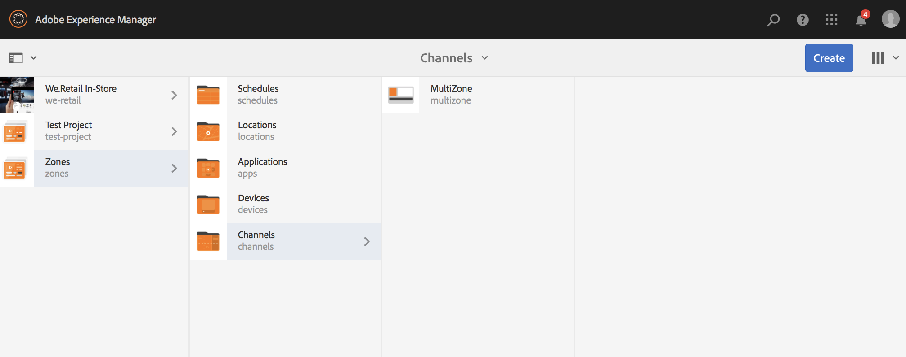
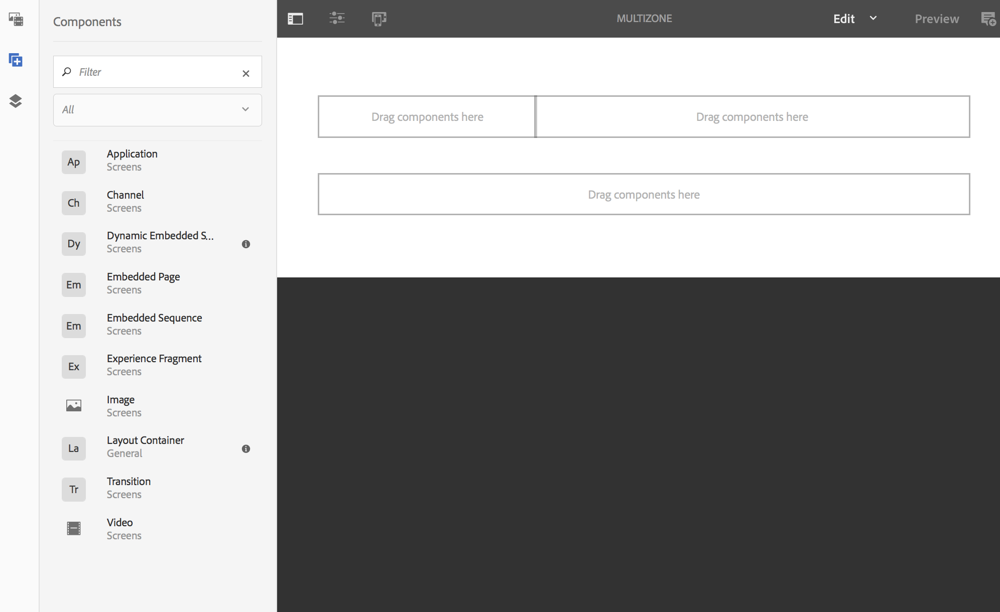
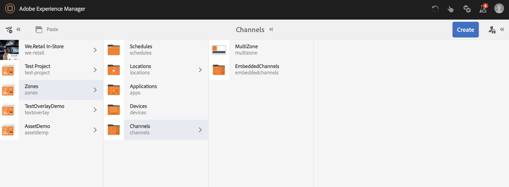
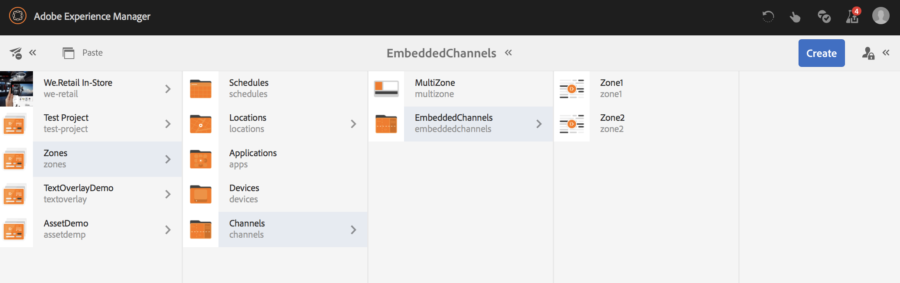
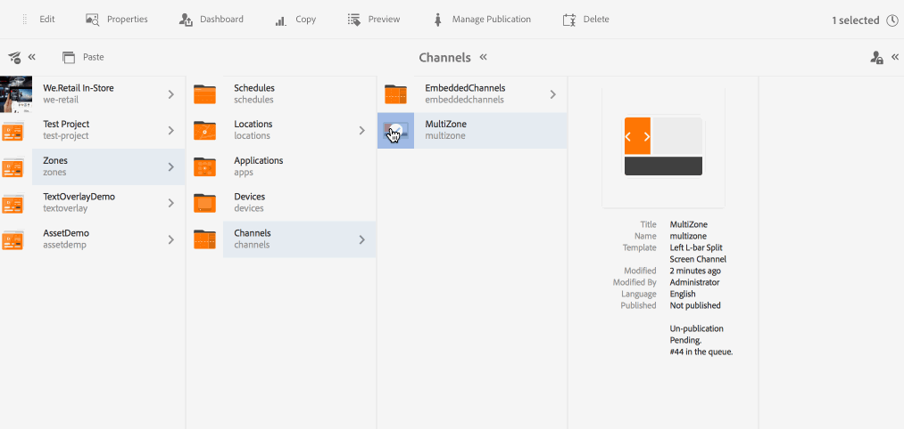
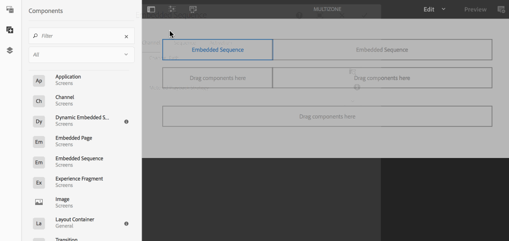
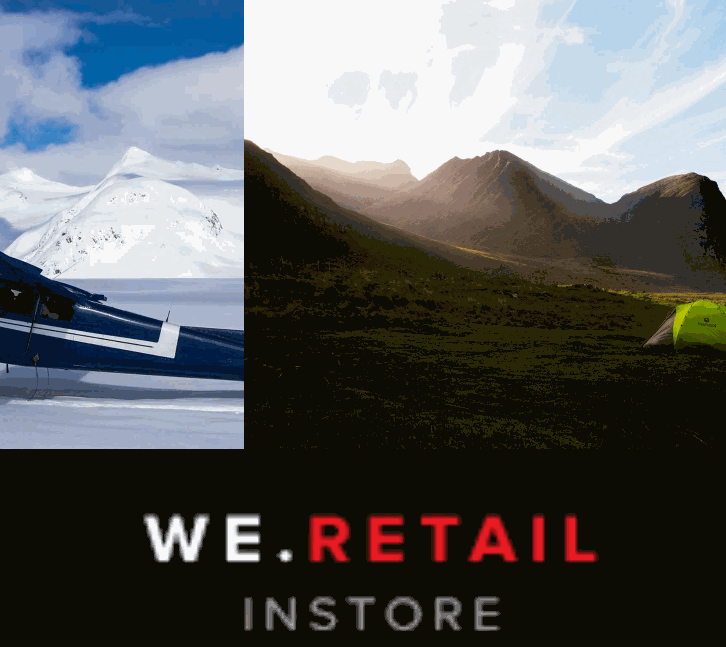

# Multi-zone Layout{#multi-zone-layout}

The following page describes the usage of multi-zone layout and covers the following topics:

* Overview
* Creating Multi-zone Layout
* Prerequisites
* Using Single Assets in one or more Zones
* Using Sequenced Content in one or more Zones

## Overview {#overview}

***Multi-zone Layout*** allows you to create multiple zone content and use a variety of assets such as videos, images, and text that can be combined in a single screen. You can pull in images, videos, and text allowing it all to blend together and create an intuitive digital experience.

As per the project requirements, sometimes you need multiple zones in a channel and edit them as one comprehensive unit. For example, a product sequence with a related social media feed running in three separate zones on a single channel.

## Creating Multi-zone Layout {#creating-multi-zone-layout}

While creating a channel, you can use different templates in order to create zones in your channel. You can add a single image, video, or an embedded channel which allows for multiple assets to be shown in a sequence.

### Prerequisites {#prerequisites}

Before you start implementing this functionality, please make sure you have a project ready as a prerequisite to start implementing multi-zone layout. For example,

* Create an AEM Screens project titled as **Zones**
* Create a display under **Locations **titled as** MultiZoneDisplay**

Create a channel titled as **MultiZone** in **Zones** project. Follow the steps below:

**Creating the Channel **

1. Select the Adobe Experience Manager link (top left) and then **Screens**. Alternatively, you can go directly to: http://localhost:4502/screens.html/content/screens.
1. Navigate to **Channels** folder and click **Create** from the action bar.   

1. Select **Left L-bar Split Screen Chanel** from the **Create** wizard.  

1. Click **Next** and enter the **title** as **MultiZone**.

1. Click **Create** to complete the channel creation.

 

### Using Single Assets in one or more Zones {#using-single-assets-in-one-or-more-zones}

You can use single assets such as an image or a video in all three different zones. Follow the steps below for implementation:

1. **Adding Content to the Channel**

    1. Navigate to **Zones** --&gt; **Channels **--&gt;** MultiZone**.
    1. Select the **MultiZone** channel and click **Edit** from the action bar to open the editor.

   

1. **Adding Images to the Channel**

   To play a single image or a video in all three zones, simply drag and drop the image in the channel editor, as shown below.

   

### Using Sequenced Content in one or more Zones {#using-sequenced-content-in-one-or-more-zones}

If you want the zones to display sequence of images or content and a static image in three different zones, please follow steps below for details.

1. **Creating a Channel Folder**

    1. Navigate to **Zones** --&gt; **MultiZone** --&gt; **Channels** and click **Create** from the action bar.
    1. Select **Channels Folder** from the **Create** wizard and click **Next**.
    1. Enter the title as **EmbeddedChannels** and click **Create**.

   

1. **Adding two more channels to Channel Folder**

    1. Navigate to **Zones** --&gt; **Channels** --&gt; **EmbeddedChannels** and click **Create** from the action bar.
    1. Select **Sequence Channel** from the **Create** wizard to create a channel titled as** Zone1**.
    1. Select **Zone1** and click **Edit** from the action bar to open the editor.
    1. Drag and drop few images to this channel.

   Similarly, create another sequence channel titled as **Zone2** in **EmbeddedChannels** folder.

   

1. **Adding Embedded Sequences/component to main channel (MultiZone)**

    1. Navigate to **Zones** --&gt; **Channels** --&gt; **MultiZone**.
    1. Click **Edit** from the action bar to open the editor.
    1. Drag and drop the **Embedded Sequence** component to two of the zones, as shown in the figure below.

   

1. **Add Content to all three Zones**

    1. Navigate to **Zones** --&gt; **Channels** --&gt; **MultiZone**.
    1. Select the embedded sequence in one of the zones. 
    1. Click the **Configure** (wrench) icon to one of the embedded sequences in the editor.
    1. Select the channel path as **Zones** --&gt; **Channels** --&gt; **EmbeddedChannels** --&gt; **Zone1**, as shown in the figure below.

   Similarly, add the **Zone2** to another embedded sequence component in the editor. Also, add an image to the third zone at the bottom, as shown below.

   

#### Viewing the Result {#viewing-the-result}

Once you implement multi-zone layouts using the preceding steps, the following output displays, as shown in the figure below.

The following output in Screens Player displays the content in three different zones. The left and the right zones (both use embedded sequence as a component) display sequence of images and the zone below displays a static image.

