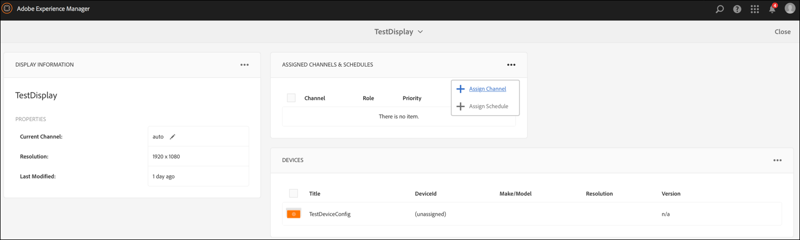
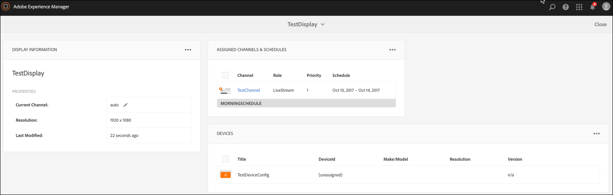
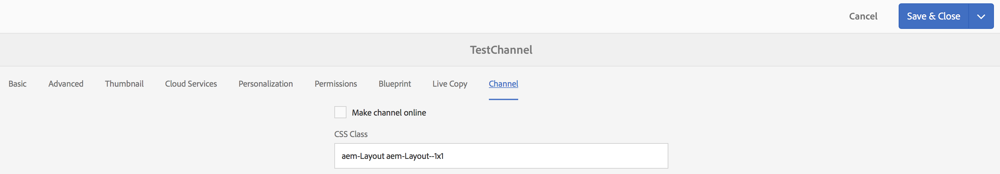
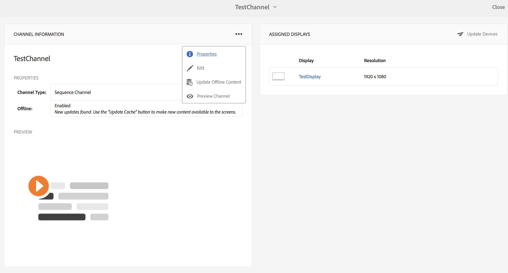
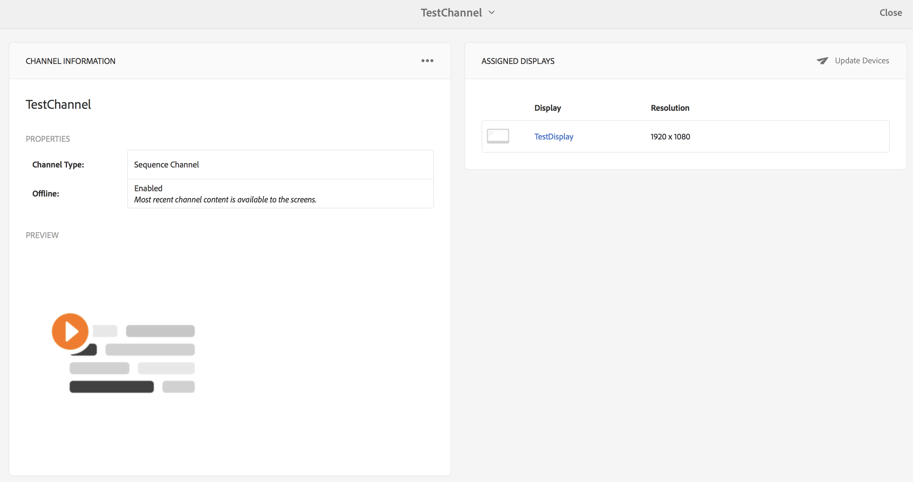
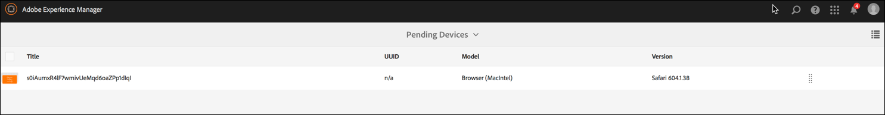

# Offline Channels{#offline-channels}

The Screens player provides offline support for the channels by leveraging the ***ContentSync*** technology.

The players use a local http server to serve the unzipped content.

When a channel is configured to run *online*, the player serves the channel-resources by accessing the AEM server but when the channel is configured to run *offline*, the player serves the channel-resources from a local http server.

The workflow for the process is as follows:

1. Parse the desired page(s)
1. Collect all related assets
1. Package everything in a zip file
1. Download the zip and extract it locally
1. Display local copy of the content

## Update Handlers {#update-handlers}

The ***ContentSync*** uses update handlers to parse and collect all necessary pages and assets for a specific project. AEM Screens uses the following update handlers:

### Common Options {#common-options}

* *type*: the update handler type to use
* *path*: path to the resource
* *[targetRootDirectory]*: target folder in the zip file

<table> 
 <tbody>
  <tr>
   <td><strong>Type</strong></td> 
   <td><strong>Description</strong></td> 
   <td><strong>Options</strong></td> 
  </tr>
  <tr>
   <td>channels</td> 
   <td>collects a channel</td> 
   <td>extension: extension of the resource to collect  [pathSuffix='']: suffix to add to the channel path  [deep=true]: whether to parse child pages recursively  [includeImages=true]: include all images in the channel  [includeVideos=true]: include all videos in the channel  [includeProducts=true]: include all products in the channel</td> 
  </tr>
  <tr>
   <td>clientlib</td> 
   <td>collect the specified client library</td> 
   <td>[extension='']: can be either css or js, to collect only the former, or only the latter</td> 
  </tr>
  <tr>
   <td>assetrenditions</td> 
   <td>collect the asset renditions</td> 
   <td>[renditions=[]]: list of renditions to collect. Defaults to the original rendition</td> 
  </tr>
  <tr>
   <td>copy</td> 
   <td>copy the specified structure from path</td> 
   <td> </td> 
  </tr>
 </tbody>
</table>

### Testing ContentSync Configuration {#testing-contentsync-configuration}

Follow the steps below to test the ContentSync configuration:

1. Open [http://localhost:4502/libs/cq/contentsync/content/console.html](http://localhost:4502/libs/cq/contentsync/content/console.html)
1. Select your config in the list
1. Click Clear Cache
1. Click Update Cache
1. Click Download Full
1. Extract the zip file
1. Start a local server in the extracted folder 
1. Open your start page and check your app status

## Enabling Offline Config for a Channel {#enabling-offline-config-for-a-channel}

Follow the steps below to enable offline config for a channel:

1. Inspect the channel content and check if it is requested from an AEM Instance (Online).

   

1. Navigate to the channel dashboard and click **... **in the** CHANNEL INFORMATION **Panel to change the properties.

   

1. Navigate to the channel properties and make sure the checkbox is disabled under the **Channel** tab. Click **Save & Close**.

   

   Before content is properly deployed to the device, click the **Update Offline Content**.

   

   The **Offline** status under **PROPERTIES** also updates accordingly.

   

1. Inspect the channel content and check if it is requested from the local Player-Cache. 

   

