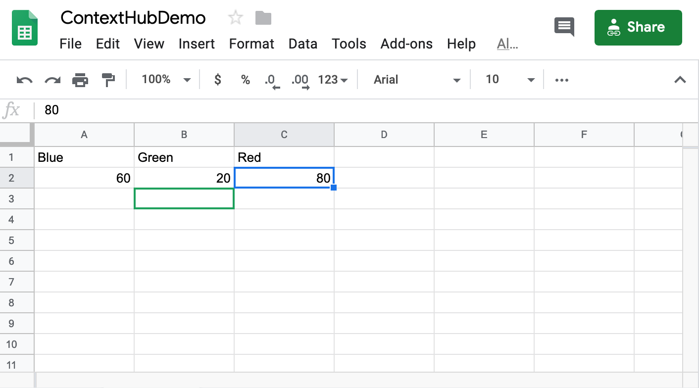
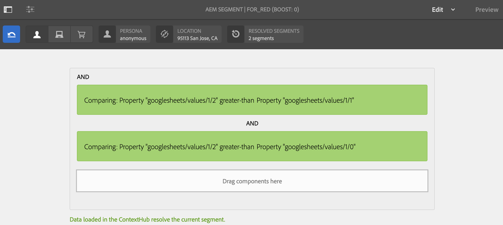
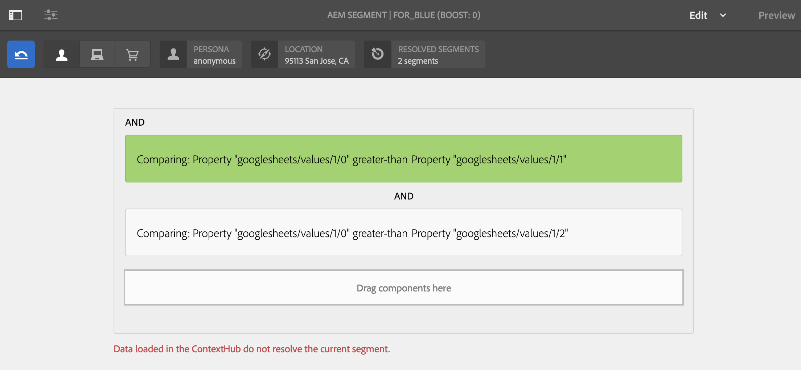
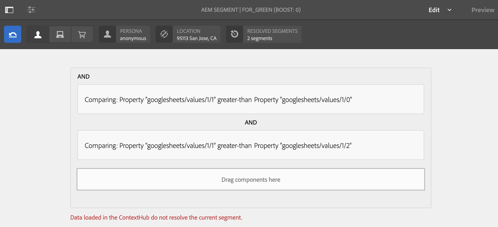
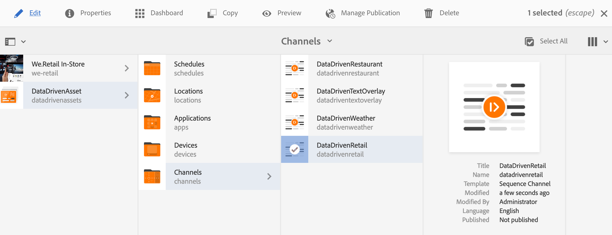
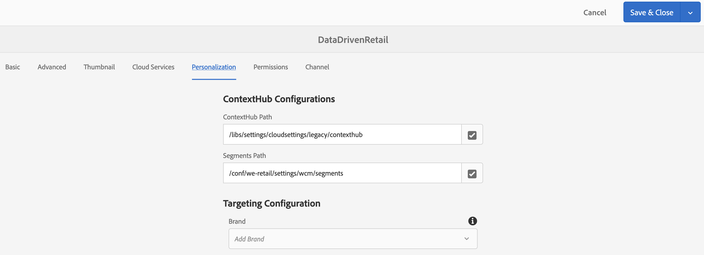
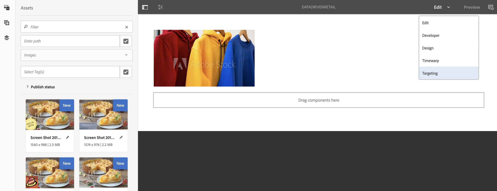

# Retail Inventory Targeted Activation{#retail-inventory-targeted-activation}

The following use case demonstrates three different images based on the values in your Google Sheet.

## Description {#description}

This Use Case showcases the retail inventory stock for three different colored sweatshirts. Depending on the number of sweatshirts available in stock that is recorded in Google Sheets, the image (red, green, or blue sweatshirt) with highest number is displayed on the screen.

For this Use Case, the Red, Green, or Blue sweater will display on your screen based on the highest value of number of sweaters that is available.

## Preconditions {#preconditions}

Before you start implementing the retail inventory targeting activation, you must learn how to set up ***Data Store***, ***Audience Segmentation*** and ***Enable Targeting for Channels*** in an AEM Screens Project.

Refer to [**Configuring ContextHub in AEM Screens**](/help/screens/configuring-context-hub.md) for detailed information.

## Basic Flow {#basic-flow}

Follow the steps below to implement the Retail Inventory Activation use case:

1. **Populating the Google Sheets**

    1. Navigate to the ContextHubDemo Google Sheet.
    1. Add three columns (Red, Green, and Blue) with corresponding values for three different sweatshirts.

   

1. **Configuring the Audiences as per the requirements**

    1. Navigate to the segments in your audience (Refer to ***Step 2: Setting up Audience Segmentation*** in ** [Configuring ContextHub in AEM Screens](/help/screens/configuring-context-hub.md)** page for more details).

    1. Add three new segments **For_Red**, **For_Green**, and **For_Blue**.

    1. Select **For_Red** and click **Edit** from the action bar.

    1. Drag and drop the **Comparison : Property - Property** to the editor and click the configure icon to edit the properties.
    1. Select **googlesheets/value/1/2** from the drop-down in **First Property name**

    1. Select the **Operator** as **greater-than **from the drop-down menu

    1. Seelect **Data Type** as **number**

    1. Select **googlesheets/value/1/1** from the drop-down in **Second Property name**

    1. Drag and drop **another Comparison : Property - Property **to the editor and click the configure icon to edit the properties.
    1. Select **googlesheets/value/1/2** from the drop-down in **First Property name**

    1. Select the **Operator** as **greater-than **from the drop-down menu

    1. Select **Data Type** as **number**

    1. Select **googlesheets/value/1/0** from the drop-down in **Second Property name**

   

   Similarly, edit and add comparison property rules to **For_Blue** segment as shown in the figure below:

   

   Similarly, edit and add comparison property rules to** For_Green **segment as shown in the figure below:

   

   >[!NOTE]
   >
   >You will notice that for segments **For_Green** and **For_Green**, data cannot be resolved in the editor as only the first comparison is valid as of now as per the values in the Google Sheet.

1. Navigate and select your **DataDrivenRetail **channel (a sequencel channel) and click **Edit** from the action bar.

   

   >[!CAUTION]
   >
   >You should have set up your **ContextHub** **Configurations** using the channel **Properties** --&gt; **Personalization** tab.

   

   >[!NOTE]
   >
   >You must select both the **Brand** and the **Area** for the activities to be properly listed when you start the Targeting process.

1. **Adding a default image**

    1. Add a default image to your channel and click **Targeting**.
    1. Select **Brand** and the **Activity** from the drop-down menu and click **Start Targeting**.

    1. Click **Start Targeting**.

   

   >[!NOTE]
   >
   >Before you start targeting, you must add the segments (**For_Green**, **For_Red**, and **For_Blue**) by clicking on **+ Add Experience Targeting** from the side rail as shown in the figure below.

   

1. Add the images to all the three different screnarios as shown below.

   

1. **Checking the Preview**

    1. Click **Preview.** Also, open your Google Sheet and update its value.
    1. Change the value for all three different columns and you will notice the display image updates as per the highest value in inventory.

   

