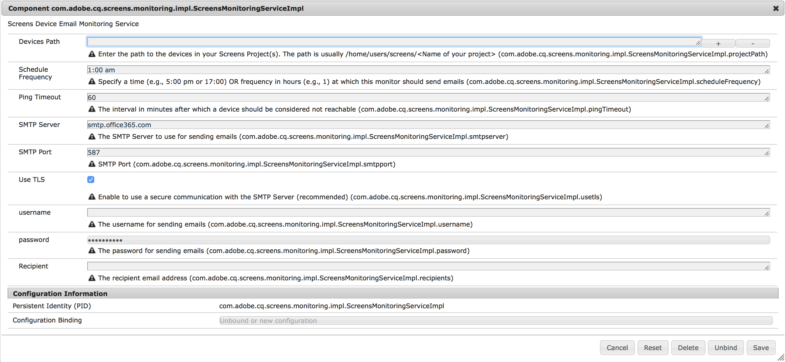

# AEM Screens Notifications Service{#aem-screens-notifications-service}

<!--removed from metadata: admitteddomains: @adobe.com;@caesars.com-->

***AEM Screens Notifications Service***, describes the feature where you can monitor device activity.

This section covers the following topics:

* **Overview**
* **Configuring Email Settings**
* **Email Notification**
* **Example Use Case**

>[!CAUTION]
>
>This AEM Screens functionality is only available, if you have installed AEM 6.3.2 Feature Pack 3 or AEM 6.4.1 Screens Feature Pack 1.
>
>To get access to this Feature Pack, you must contact Adobe Support and request access. Once you have permissions you can download it from Package Share.

## Overview {#overview}

***AEM Screens Notifications Service***, allows administrators to receive an email if an AEM screens player does not ping for a configurable period of time.

This service can be configured in the OSGi web console.

## Configuring Email Settings {#configuring-email-settings}

Follow the steps below to configure the email notification settings:

1. Open **Adobe Experience Manager Web Console Configuration**.
1. Open **Screens Device Email Monitoring Service**.

   

1. Define the following fields to configure your settings for the email:

   **Devices Path** Enter the path to the Screens Project(s) you wish to monitor. The path is usually `/home/users/screens/<Name of your project>`.

   For example, if your project is **We.Retail**, you will use the project path as ***/home/users/screens/we-retail***.

   >[!NOTE]
   >
   >Specify the project path, where the device users are located.

   **Schedule Frequency** Specify a time (e.g., 5:00 pm or 17:00) or frequency in hours (e.g., 1) at which this monitor should send emails.

   **Ping Timeout** This specifies the interval in minutes after which a device should be considered not reachable.

   **SMTP Server** Specifies the SMTP Server that is used for sending emails.

   **SMTP Port** Enter the SMTP Port.

   **Use TLS** Transport Layer Security (TLS) enables you to use a secure communication with the SMTP Server.

   It is recommended to use TLS for secure connection to corporate mail servers. Please check with your mail administrator for appropriate values.

   **username** Specify the username for sending emails.

   **password** Specify the password for sending emails.

   **Recipient** Specify the recipient's email address.

   >[!NOTE]
   >
   >You can enter only one email address. In order to send a bulk email, create a group or distribution list with the relevant users.

1. Click **Save** to configure the monitor activity through an email for your AEM Screens device.

## Email Notification {#email-notification}

Once you set the configuration for your email notifications, you will receive an email notification that will contain the link to the actual device that is reported of inactivity.

Accessing that link will navigate you directly to the device dashboard.

Emails will only be sent, if there is at least one device that has not pinged for the given ping timeout and is still not pinging at the time of generating the email.

### Example Use Cases {#example-use-cases}

The following example describe few scenarios for reference, to configure the properties from Screens Device Email Monitoring Service.

**Scenario 1**:

If you set the schedule frequency as 1:00 am and the ping timeout as 60, then if your Screens device does not ping between 12:00 pm until 1:00 pm, you will receive an email notification confirming device inactivity.

**Scenario 2**:

If you set the schedule frequency as 1 and the ping timeout as 60, then if your Screens device does not ping between once at any particular time of the day, you will receive an email notification confirming device inactivity.
