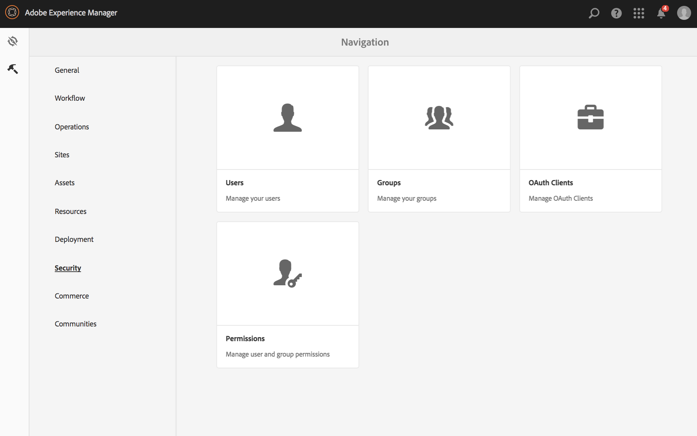
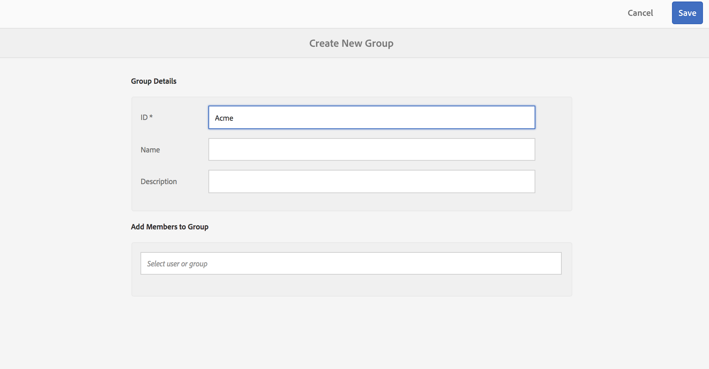
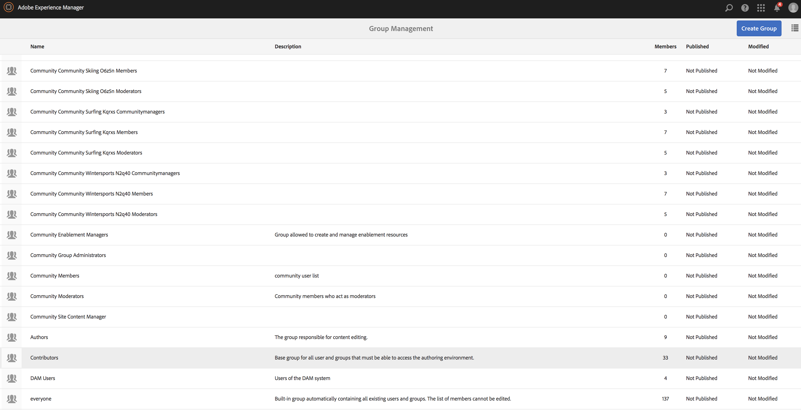
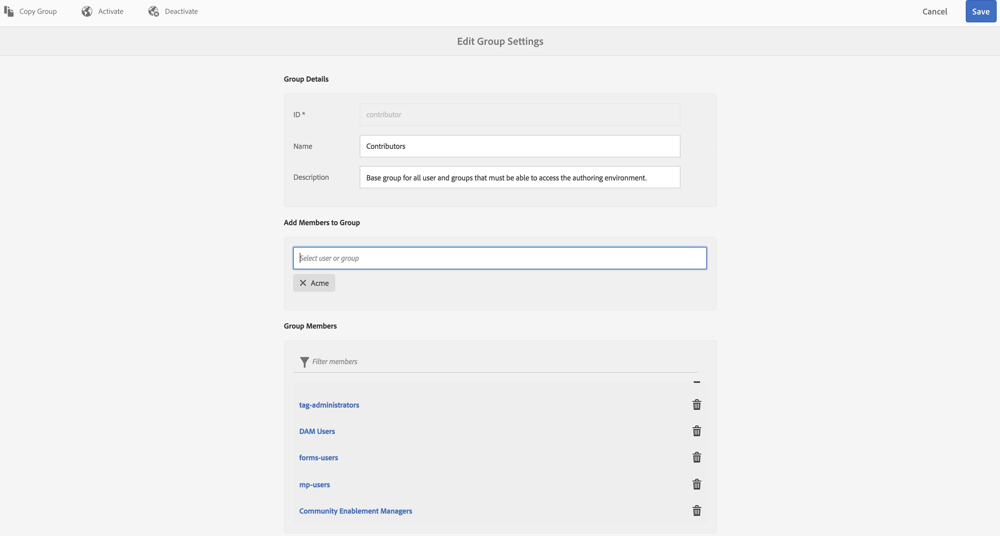
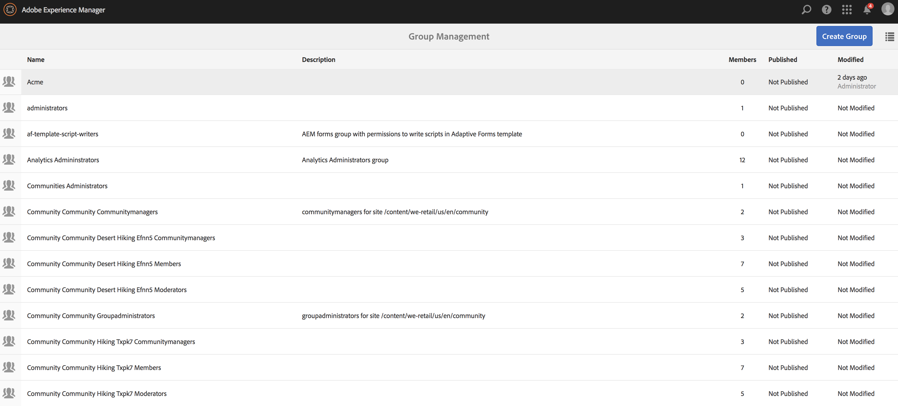
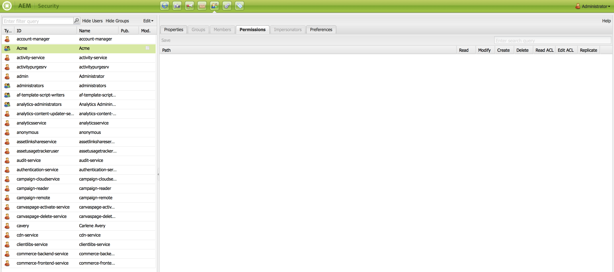

# Setting up ACLs {#setting-up-acls}

The following section explains how to segregate projects using ACLs so that each individual or team handles their own project.

As an AEM administrator, you want ensure that team members of a project do not interfere with other projects and each of the users are assigned sepecific roles as per project requirements.

## Setting up Permissions {#setting-up-permissions}

The following steps summarize the procedure for setting up ACLs for a project:

1. Login to AEM and navigate to **Tools** → **Security**.

   

1. Click **Groups** and enter an ID (for example, Acme).

   Alternatively, use this link, [http://localhost:4502/libs/granite/security/content/groupadmin.html](http://localhost:4502/libs/granite/security/content/groupadmin.html).

   Subsequently, click **Save**.

   

1. Select **Contributors** from the list and double click it.

   

1. Add the **Acme** (project you created) to** Add Members to Group**. Click **Save**.

   

   >[!NOTE]
   >
   >If you want project team members to register players (which involves creating a user for every player) find the group user-administrators and add the ACME group to user-administrators

1. Add all the users who will be working on the **Acme** Project to the **Acme** group.

   

1. Setup the permissions for the group **Acme** using this [link](http://localhost:4502/useradmin).

   Select the group **Acme** and click the **permissions**.

   

### Permissions {#permissions}

The following table summarizes the path with the permissions at the project level:

| **Path** |**Permission** |**Description** |
|---|---|---|
| `/apps/<project>` |READ |Provides access to project files (if applicable) |
| `/content/dam/<project>` |ALL |Provides access to store the projects assets such as images or video in DAM |
| `/content/screens/<project>` |ALL |Removes access to all other projects under /content/screens |
| `/content/screens/svc` |READ |Provides access to the registration service |
| `/libs/screens` |READ |Provides access to DCC |
| `/var/contentsync/content/screens/` |ALL |Allows to update offline content for the project |

>[!NOTE]
>
>In some cases, you can separate author functions (such as managing assets and creating channels) from admin functions (such as registering players). In such a scenario, create two groups and add the authors group to contributors and the admin group to both contributors and user-administrators.

### Creating Groups {#creating-groups}

Creating a new project should also create default user groups with a basic set of permissions assigned. You should extend the permissions to the typical roles we have for AEM Screens.

For example, you can create the following project specific groups:

* Screens Project Administrators 
* Screens Project Operators (register players, and manage locations and devices)
* Screens Project Users (work with channels, schedules and channel assignments)

The following table summarizes the groups with description and permissions for an AEM Screens project:

<table> 
 <tbody>
  <tr>
   <td><strong>Group name</strong></td> 
   <td><strong>Description</strong></td> 
   <td><strong>Permissions</strong></td> 
  </tr>
  <tr>
   <td>Screens Admins  <em>screens-admins</em></td> 
   <td>Admin level access for AEM Screens capabilities</td> 
   <td>
    <ul> 
     <li>Member Of Contributors</li> 
     <li>Member OF user-administrators</li> 
     <li>ALL /content/screens</li> 
     <li>ALL /content/dam</li> 
     <li>ALL /content/experience-fragments</li> 
     <li>ALL /etc/design/screens</li> 
    </ul> </td> 
  </tr>
  <tr>
   <td>Screens Users  <em>screens-users</em></td> 
   <td>Create and update channels and schedules and assign to location in AEM Screens</td> 
   <td>
    <ul> 
     <li>Member Of Contributors</li> 
     <li>&lt;project&gt; /content/screens</li> 
     <li>&lt;project&gt; /content/dam</li> 
     <li>&lt;project&gt; /content/experience-fragments</li> 
    </ul> </td> 
  </tr>
  <tr>
   <td>Screens Operators  <em>screens-operators</em></td> 
   <td>Create and update location structure and register players in AEM Screens</td> 
   <td>
    <ul> 
     <li>Member Of Contributors</li> 
     <li>jcr:all /home/users/screens</li> 
     <li>jcr:all /home/groups/screens</li> 
     <li>&lt;project&gt; /content/screens</li> 
    </ul> </td> 
  </tr>
  <tr>
   <td>Screens Players  <em>screens-we-retail-devices</em></td> 
   <td>Groups all players and all players/devices are member of the contributors automatically.</td> 
   <td>
 Member of Contributors
 </td> 
  </tr>
 </tbody>
</table>

