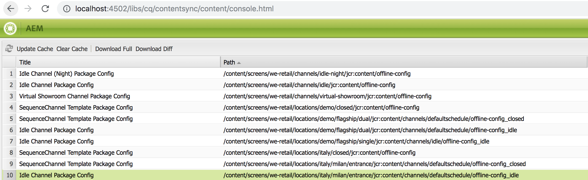

# Transitioning from ContentSync to SmartSync{#transitioning-from-contentsync-to-smartsync}

This section povides an overview to SmartSync feature and how it minimizes server load/storage and network traffic to reduce cost.

## Overview {#overview}

SmartSync is the latest mechanism used by AEM Screens. It serves as a replacement of the current method used to cache offline channels and delivering them to the player.

It executes both on the server-side and client-side.

**On Server-side**:

* Content of the channels, including assets, are cached in */var/contentsync*.
* Cache is exposed to the players via a manifest which describes the available content for a display.

**On Client-side**:

* Player updates its content based on the manifest generated above.

### Benefits of Using SmartSync {#benefits-of-using-smartsync}

SmartSync feature provides a number of benefits to your AEM Screens project. It allows

* Dramatic reduction of network traffic and server side storage requirements
* Player intelligently downloads assets only if the asset is missing or changed
* Server-side and client-side storage optimizations

>[!NOTE]
>
>Adobe strongly recommends on using SmartSync for AEM Screens projects.

## Migrating from ContentSync to SmartSync {#migrating-from-contentsync-to-smartsync}

>[!NOTE]
>
>If you have already installed AEM 6.3 Feature Pack 5 and AEM 6.4 Feature Pack 3, you can enable SmartSync for assets to improve disk space usage. To enable SmartSync, follow the section below to transition from ContentSync to SmartSync, thus enabling SmartSync.
>
>SmartSync is available to Screens Player with supported servers AEM 6.4.3 FP3.
>
>Refer to the [AEM Screens Player Downloads](https://download.macromedia.com/screens/) to download the latest player. The following table describes the minimum player version required for each platform:

| **Platform** |**Minimum Supported Player Version** |
|---|---|
| Android |3.3.72 |
| Chrome OS |1.0.136 |
| Windows |1.0.136 |

Follow the steps below to transition from ContentSync to SmartSync:

1. Migrating from ContentSync to SmartSync requires clearing of ContentSync cache before activating SmartSync.

   Navigate to the ContentSync console from your instance using the link ***https://localhost:4502/libs/cq/contentsync/content/console.html*** and click **Clear Cache**, as shown in the figure below:

   

   >[!CAUTION]
   >
   >All content cache must be cleared before using SmartSync for the first time.

1. Navigate to **Adobe Experience Manager Web Console Configuration **via AEM instance --&gt; hammer icon --&gt; **Operations** --&gt; **Web Console**.

   

1. **Adobe Experience Manager Web Console Configuration **opens. Search for *offlinecontentservices*.

   For searching the **Screens Offline Content Service **property, press **Command+F** for **Mac** and **Control+F** for **Windows**.

   

1. Click **Save** to enable the **Screens Offline Content Services* ***property and hence use SmartSync for AEM Screens.
1. Once you have enabled SmartSync, you must navigate to your project and click **Update Offline Content** *(from the action bar),* as shown in the figure below.

   

