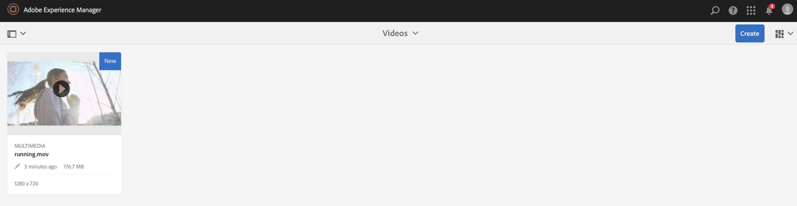
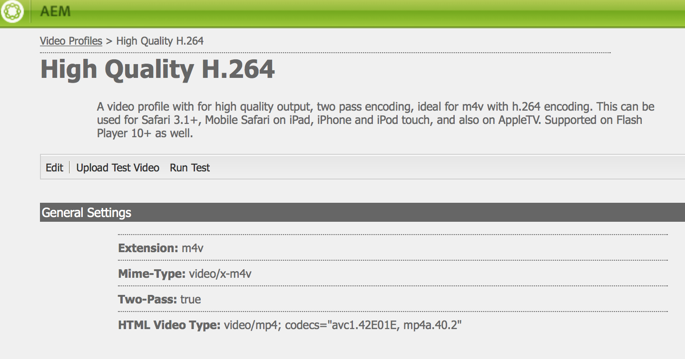
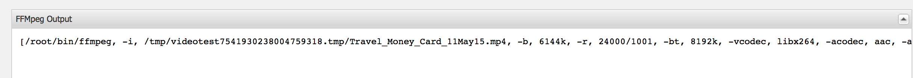
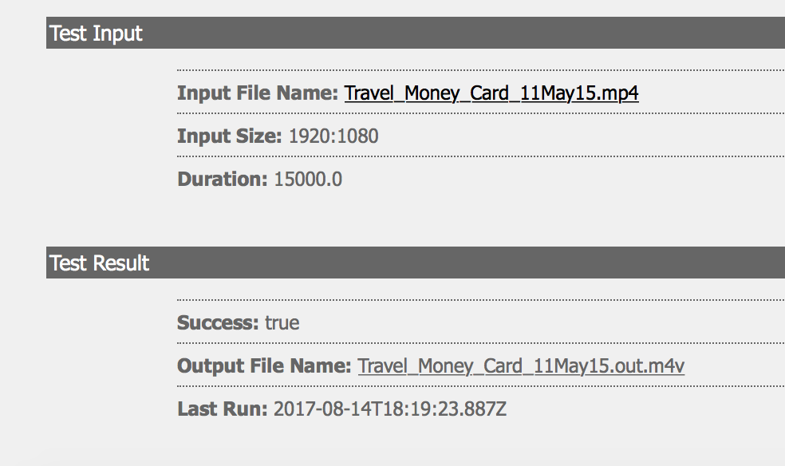
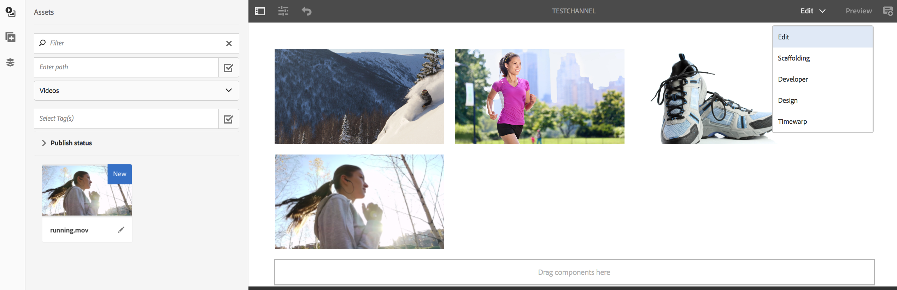
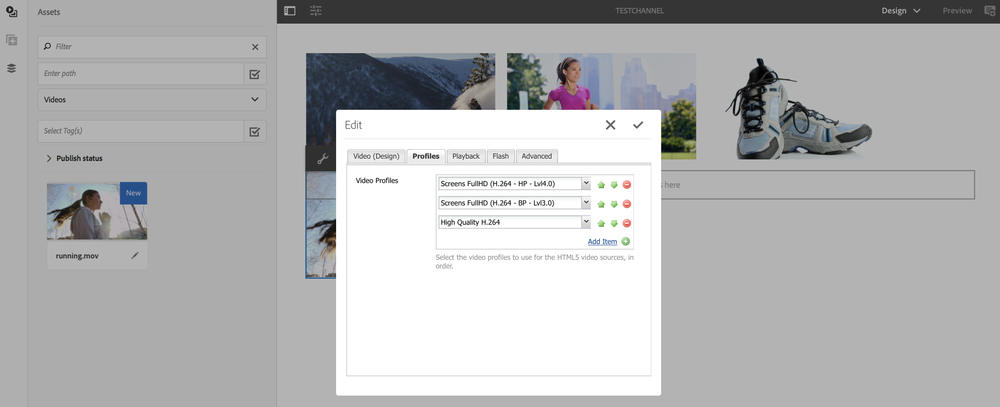
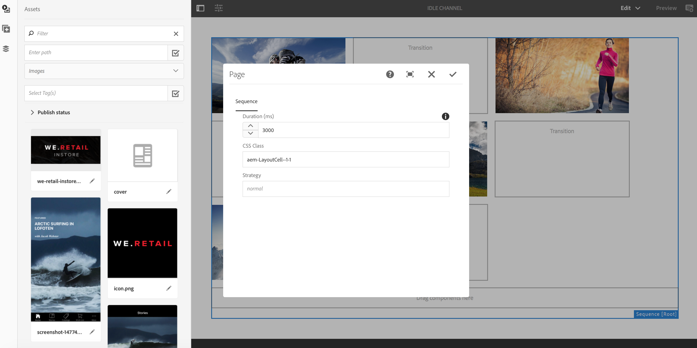

# Video Playback Configuration and Troubleshooting{#video-playback-configuration-and-troubleshooting}

When you upload a video to the DAM and add it your channel, you might encounter issues that video might not play in Screens player.

The following sections describe how to debug and troubleshoot video playing in your channel.

## DAM Renditions {#dam-renditions}

Once you upload the video to the channel, AEM should start creating some renditions for it. You can view your videos under Assets.

To view the video:

1. Navigate to your video, for example [http://localhost:4502/assets.html/content/dam/we-retail/en/videos](http://localhost:4502/assets.html/content/dam/we-retail/en/videos).
1. Click the video and expand the top left menu and click **Renditions**.

There should be different renditions (a MP4 or M4V).

If there is no rendition, make sure you have ffmpeg installed on the OS where AEM is running.

>[!CAUTION]
>
>If there is no rendition, make sure you have ffmpeg installed on the OS where AEM is running.
>
>Click [here](https://evermeet.cx/ffmpeg/) to install ffmpeg.

## Video Assets {#video-assets}

If you do not see a source attribute under video, it could be that the video did not get transcoded. If the video is transcoded properly, it will appear in the dashboard, as shown in the figure below.

Check ffmpeg is installed and the video profiles. 

### Checking Video Profile {#checking-video-profile}

1. Navigate to the [Video Profile](http://localhost:4502/etc/dam/video.html) and click **Upload Test Video**.

   

1. Upload a test video and click **Ok **to begin the transcoding.

   If the transcode fails, expand the ffmpeg output to understand any errors in the console output of ffmpeg.

   

   Also, if the video transcodes successfully can download the transcoded file.

   

   >[!NOTE]
   >
   >Make sure you give sufficient time for the video to transcode (it should show the tag new instead of processing) before you add it to any channel.

### Checking Profile with a Video Component {#checking-profile-with-a-video-component}

Check the list of profiles from the page design if the video component is not configured properly.

1. Navigate to your channel and select the **Design** mode.

   

1. Select the video and open the **Edit** dialog. Open the **Profiles** tab.

   Select different profiles (at least "High Quality H.264" profile should be there).

   

### Checking the Video in the Web Player {#checking-the-video-in-the-web-player}

Use the [Web Player](http://localhost:4502/content/mobileapps/cq-screens-player/firmware.html/content/screens/we-retail/locations/demo/flagship/single/device0) to validate playback in browsers (Chrome and Safari). Chrome is used on Android devices while Safari is the OSX and iOS browser.

If the video does not run on Safari, it will not run in the OSX and iOS players. This is probably an encoding issue and the video must be re-encoded.

Follow these steps to use a DAM workflow to create FullHD renditions:

1. Navigate to the [workflow model admin](http://localhost:4502/libs/cq/workflow/admin/console/content/models.html/etc/workflow/models).
1. Select the **Screens Update Asset** model.
1. click **Start Workflow** from the action bar to open the **Run Workflow** dialog box.

1. Select your video asset in the **Payload**.
1. Click **Run**.

>[!NOTE]
>
>Allow some time to create the renditions, but after a few seconds/minutes (depends on video size), reload the web player on Safari.

#### Troubleshooting Autoplay Policy Flag {#troubleshooting-autoplay-policy-flag}

In case, AEM Screens player picks up the video but does not display, you need to troubleshoot the Autoplay Policy flag.

Follow the steps below to troubleshoot google's autoplay policy flag issue:

1. Navigate to ***chrome://flags/#autoplay-policy***
1. Change **Autoplay policy** from **Default** to **no user gesture is required**

1. Relaunch your web browser and update the player

>[!NOTE]
>
>To learn more about the best practices for good user experiences with the new autoplay policies in Chrome, please see documentation for [Autoplay Policy Changes.](https://developers.google.com/web/updates/2017/09/autoplay-policy-changes#webaudio)

### Syncing Video across Multiple Players {#syncing-video-across-multiple-players}

To play videos synchronously across multiple devices, you should use the absolute strategy for the sequence the video is part of.

#### Requirements {#requirements}

* identical 2+ players  
* ideally similar hardware
* identical network topology (players are connected to an NTP server that aligns their internal system clocks)

#### Setting up the absolute strategy {#setting-up-the-absolute-strategy}

The absolute strategy:

* computes an anchor time (midnight of the current day)
* computes the duration of the sequence (sum of duration of all its item)
* at any point in time, it computes which item should be currently played and the next item by solving sequence _remaining_time = (current_time - anchor_time) % sequence_duration.

Follow the steps below to set up an absolute strategy:

1. Navigate to your channel author and select the sequence component as shown in the figure below.
1. Open its configuration dialog.
1. Edit the **Strategy** and add absolute.

>[!NOTE]
>
>The OS of the players must have the same clock.

**Aligning Clocks on OS X** Follow the steps below to align the clocks on OSX:

1. Open **Date & Time** preferences on each OSX box
1. Check** Set date and time automatically**
1. Paste value 0.pool.ntp.org, 1.pool.ntp.org, 2.pool.ntp.org, 3.pool.ntp.org, time.apple.com in the dropdown or simply run *sudo ntpdate -u -v 0.pool.ntp.org*
1. Start the 2+ players

It may take some time before the players start a new aligned sequence.  

