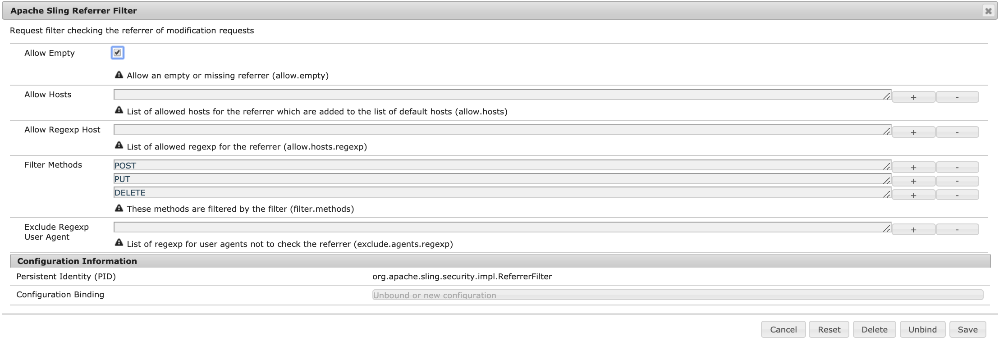

# Configuring and Deploying AEM Screens{#configuring-and-deploying-aem-screens}

This page shows how to install and configure the Screens players on your devices and covers the following topics:

* [Installing AEM Screens Player](../../screens/using/configuring-screens-introduction.md#installing-aem-screens-player)
* [Server Configuration](../../screens/using/configuring-screens-introduction.md#server-configuration)
* [Hardware Selection Guidelines for Player Device](#hardware-selection-guidelines-for-player-device)  

* [The Next Steps](../../screens/using/configuring-screens-introduction.md#the-next-steps)

## Installing AEM Screens Player {#installing-aem-screens-player}

The AEM Screens player is available for Android, Chrome OS, iOS, and Windows.

To download **AEM Screens Player**, visit the [**AEM 6.5 Player Downloads**](https://download.macromedia.com/screens/) page.

>[!NOTE]
>
>Once you download the latest Player (*.exe*), follow the steps on the player to complete the ad-hoc installation:
>
>1. Long-press on the top left corner to open the admin panel.
>1. Navigate to **Configuration** from the left action menu and enter the location address of the AEM instance in **Server** and click **Save**.
>
>1. Click on the **Registration** link from the left action menu and the steps below to complete the device registration process.
>

#### Additional Resources {#additional-resources}

Refer to the following topics for an in-depth information:

* To download Android Player, visit **Google Play**. To learn about implementing Android Watchdog, refer to ** [Implementing Android player](../../screens/using/implementing-android-player.md)**.

* To implement Chrome OS Player, refer to [**Chrome Management Console**](/screens/using/implementing-chrome-os-player.html?cq_ck=1513900475345) for more information.
* To configure AEM Screens Windows player, refer to [**Implementing Windows Player**](../../screens/using/implementing-windows-player.md).

## Server Configuration {#server-configuration}

>[!NOTE]
>
>**Important**:
>
>AEM Screens player does not make use of the Cross-Site Request Forgery (CSRF) token. Therefore, in order to configure and AEM server to be ready to use for AEM Screens, skip the referrer filter by allowing empty referrers.

### Prerequisites {#prerequisites}

The following key points below helps to configure and AEM server to be ready to use for AEM Screens:

#### Allow Empty Referrer Requests {#allow-empty-referrer-requests}

1. Navigate to **Adobe Experience Manager Web Console Configuration **via AEM instance --&gt; hammer icon --&gt; **Operations** --&gt; **Web Console**.

   

1. **Adobe Experience Manager Web Console Configuration **opens. Search for sling referrer.

   For searching the sling referrer property, press **Command+F** for **Mac** and **Control+F** for **Windows**.

   

1. Check the **Allow Empty **option, as shown in the figure below.

   

1. Click **Save** to enable the Apache Sling Referrer Filter Allow Empty.

#### Enable Touch UI for AEM Screens {#enable-touch-ui-for-aem-screens}

AEM Screens requires TOUCH UI and will not work with CLASSIC UI of Adobe Experience Manager (AEM).

1. Navigate to *&lt;yourAuthorInstance&gt;/system/console/configMgr/com.day.cq.wcm.core.impl.AuthoringUIModeServiceImpl*
1. Ensure that the **Default authoring UI mode** is set to **TOUCH**, as shown in the figure below

Alternatively, you can also perform the same setting using*&lt;yourAuthorInstance&gt; *-&gt;* tools (hammer icon)* -&gt; **Operations** -&gt;** Web Console** and search for **WCM Authoring UI Mode Service**.

>[!NOTE]
>
>You can always enable Classic UI for specific users using user preferences.

#### AEM in NOSAMPLECONTENT runmode {#aem-in-nosamplecontent-runmode}

Running AEM in production uses the **NOSAMPLECONTENT** runmode. Remove the the *X-Frame-Options=SAMEORIGIN* header (in the additional response header section) from

[http://localhost:4502/system/console/configMgr/org.apache.sling.engine.impl.SlingMainServlet](http://localhost:4502/system/console/configMgr/org.apache.sling.engine.impl.SlingMainServlet).

This is required for the AEM Screens Player to play online channels.

#### Password Restrictions {#password-restrictions}

With latest changes to ***DeviceServiceImpl***, you do not have to remove the password restrictions.

You can configure ***DeviceServiceImpl*** from the link below to enable password restriction while creating the password for the screens device users:

[http://localhost:4502/system/console/configMgr/com.adobe.cq.screens.device.impl.DeviceService](http://localhost:4502/system/console/configMgr/com.adobe.cq.screens.device.impl.DeviceService)

Follow the steps below to configure ***DeviceServiceImpl***:

1. Navigate to **Adobe Experience Manager Web Console Configuration **via AEM instance --&gt; hammer icon --&gt; **Operations** --&gt; **Web Console**.

1. **Adobe Experience Manager Web Console Configuration **opens. Search for deviceservice. For searching the property, press **Command+F** for **Mac** and **Control+F** for **Windows**.

 

#### Dispatcher Configuration {#dispatcher-configuration}

To learn how to configure dispatcher for an AEM Screens project, refer to ** [Configuring Dispatcher for an AEM Screens project](../../screens/using/dispatcher-configurations-aem-screens.md)**.

#### Java encoding {#java-encoding}

Set the ***Java encoding*** to Unicode. For example, *Dfile.encoding=Cp1252* will not work.

>[!NOTE]
>
>**Recommendation:**
>
>It is recommended to use HTTPS for AEM Screens Server in production use.

## Hardware Selection Guidelines for Player Device {#hardware-selection-guidelines-for-player-device}

The following section provides the hardware selection guidelines for a Screens Project:

* Always source ***Commercial*** or ***Industrial*** Grade components for both PC player and Display Panel or Projector.

* Always engage with vendors who serve the digital signage market.
* Always consider environmental factors such as ambient temperature and relative humidity.
* Always review power requirements and power conditioning.
* Carefully review performance needs and I/O ports required for application.

The following table summarizes the hardware configurations with typical use cases for an AEM Screens project:

<table border="1" cellpadding="1" cellspacing="0" width="100%"> 
 <tbody> 
  <tr> 
   <td>Player Configuration</td> 
   <td>Processor</td> 
   <td>Memory</td> 
   <td>Storage SSD</td> 
   <td>GPU</td> 
   <td>Display</td> 
   <td>I/O</td> 
   <td>Typical Use Cases</td> 
  </tr> 
  <tr> 
   <td>Basic</td> 
   <td>Dual Core, i3 or entry-level quad core Intel® Atom Processor</td> 
   <td>
4GB of memory
 
2MB of cache
 </td> 
   <td>
•ChromeOS 32 GB
 
•Windows 128GB
 </td> 
   <td>OnBoard</td> 
   <td>1920 x 1080</td> 
   <td>DVI,  Ethernet / Wireless,  2xUSB</td> 
   <td> 
    <ul> 
     <li>Standard Full Screen Looping  </li> 
     <li>Day Parting</li> 
    </ul> </td> 
  </tr> 
  <tr> 
   <td>Standard</td> 
   <td>Quad Core, Intel® Core i5 processor</td> 
   <td>
8GB of memory
 
4MB of cache
 </td> 
   <td>128 GBB</td> 
   <td>OnBoard</td> 
   <td>3840x2160 (4K)</td> 
   <td>DVI, HDMI  Ethernet / Wireless,  2xUSB</td> 
   <td> 
    <ul> 
     <li>Single Source Dynamic Content</li> 
     <li>Simple Interactive</li> 
     <li>1-3 Zone layouts</li> 
    </ul> </td> 
  </tr> 
  <tr> 
   <td>Advanced</td> 
   <td>Quad Core with hyperthreading, Intel® Core i7 processor</td> 
   <td>
16GB of memory
 
8MB of cache
 </td> 
   <td>256 GB</td> 
   <td>Dedicated Graphics GPU</td> 
   <td>3840x2160 (4K)</td> 
   <td>DVI, HDMI  Ethernet / Wireless,  4xUSB</td> 
   <td> 
    <ul> 
     <li>4 or more Content Zones, Concurrent Video Playback</li> 
     <li>Multi-Page Interactive</li> 
     <li>Multi-Source Data Triggers</li> 
    </ul> </td> 
  </tr> 
 </tbody> 
</table>

## The Next Steps {#the-next-steps}

Once you have installed and configured Screens player, follow the topics below to get started:

1. [Create and Manage Screens Project](/screens/using/creating-a-screens-project.md)
1. [Create and Manage Channels](../../screens/using/managing-channels.md)
1. [Create and Manage Locations](/screens/using/managing-locations.md)
1. [Create and Manage Displays](/screens/using/managing-displays.md)
1. [Assign Channels](../../screens/using/channel-assignment.md)
1. [Registering a Device](../../screens/using/device-registration.md)
1. [Assign Devices](/screens/using/managing-devices.md)
1. [Create and Manage Schedules](/screens/using/managing-schedules.md)
1. [AEM Screens Player](/screens/using/working-with-screens-player.md)  

1. [Troubleshoot Device Control Center](../../screens/using/monitoring-screens.md)

