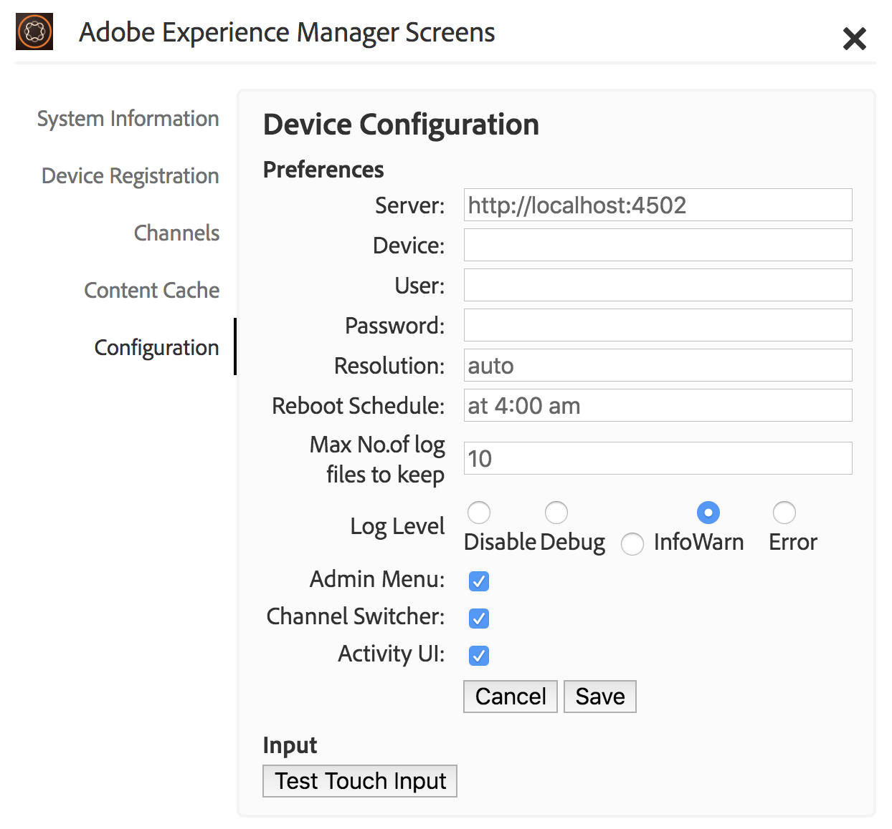
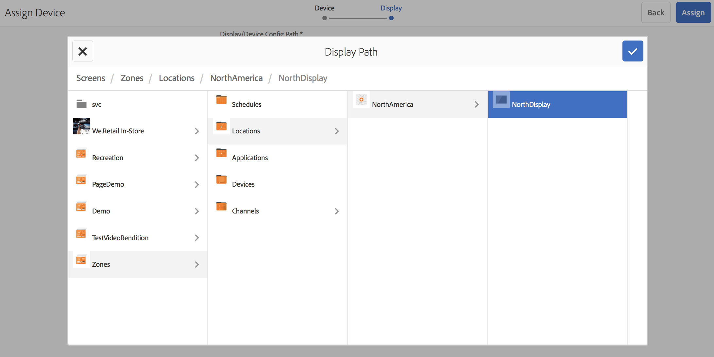
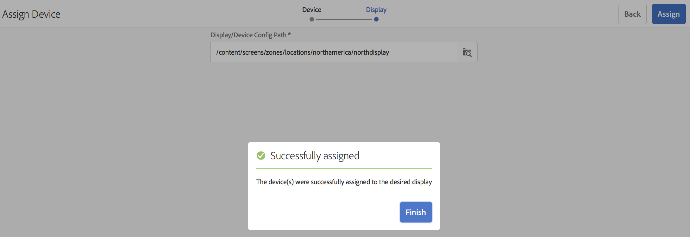

# Device Registration{#device-registration}

The following page describes the device registration process in an AEM Screens project.

## Registering a Device {#registering-a-device}

The device registration process is done on 2 separate machines:

* The actual device to be registered, for example your Signage Display
* The AEM server that is used to register your device

>[!NOTE]
>
>Once you download the latest Windows Player (*.exe*), from [**AEM 6.4 Player Downloads**](https://download.macromedia.com/screens/) page, follow the steps on the player to complete the ad-hoc installation:
>
>1. Long-press on the top left corner to open the admin panel.
>1. Navigate to **Configuration** from the left action menu and enter the location address of the AEM instance in **Server** and click **Save**.
>
>1. Click on the **Registration** link from the left action menu and the steps below to complete the device registation process.
>



1. On your device, start the AEM Screens Player. The registration UI is shown.

   

1. In AEM, navigate to the **Devices** folder of your project.

   >[!NOTE]
   >
   >To get more information on creating a new project for Screens in the AEM dashboard, see [Create and Manage Screens Project](/screens/using/creating-a-screens-project.md).

1. Tap/click the **Device Manager** button in the action bar.

   

1. Tap/click the **Device Registration** button on the top right.

   

1. Select the required device (same as step 1) and tap/click **Register Device**.

   

1. In AEM, wait for the device to send its registration code.

   

1. In your device, check the **Registration Code**.

   

1. If the **Registration Code** is the same on both machines, tap/click **Validate** button in AEM, as shown in the step (6).
1. Set the desired name for the device, and click** Register**.

   

1. Tap/click** Finish** to complete the registration process.

   

   >[!NOTE]
   >
   >The **Register New** allows you to register a new device.
   >
   >
   >The **Assign Display** lets you directly add the device to a display.

   If you click **Finish**, you will need to assign the device to a display.

   

   >[!NOTE]
   >
   >To learn more about creating and managing a display for your Screens project, please refer to [Creating and Managing Displays](/screens/using/managing-displays.md).

### Assigning Device to a Display {#assigning-device-to-a-display}

If you have not assigned the device to a display, follow the steps below to assign your device to a display in your AEM Screens project:

1. Select the device and click **Assign Device** from the action bar.

   

1. Select the path of the display in **Display/Device Config Path**.

   

1. Click **Assign** when you select the path.

   

1. Click **Finish** once the device is assigned successfully, as shown in the figure below.

   

   Additionally, you can view the display dashboard on clicking **Finish**.

   

## Limitations on Device Registration  {#limitations-on-device-registration}

System wide user password restrictions might cause failure in the device registration. The device registration uses a random generated password to create the device user.

If the password is restricted by the *AuthorizableActionProvider* configuration, creating the device user might fail.

>[!NOTE]
>
>The current generated random password is composed of 36 ASCII characters, ranging from 33 - 122 (includes almost all special characters).

```java
25.09.2016 16:54:03.140 *ERROR* [59.100.121.82 [1474844043109] POST /content/screens/svc/registration HTTP/1.1] com.adobe.cq.screens.device.registration.impl.RegistrationServlet Error during device registration
javax.jcr.nodetype.ConstraintViolationException: Password violates password constraint (^(?=.*\d).{7,9}$).
        at org.apache.jackrabbit.oak.spi.security.user.action.PasswordValidationAction.validatePassword(PasswordValidationAction.java:105)
        at org.apache.jackrabbit.oak.spi.security.user.action.PasswordValidationAction.onPasswordChange(PasswordValidationAction.java:76)
        at org.apache.jackrabbit.oak.security.user.UserManagerImpl.onPasswordChange(UserManagerImpl.java:308)
```

#### Additional Resources {#additional-resources}

To learn about AEM Screens Player, see [AEM Screens Player](/screens/using/working-with-screens-player.md).
