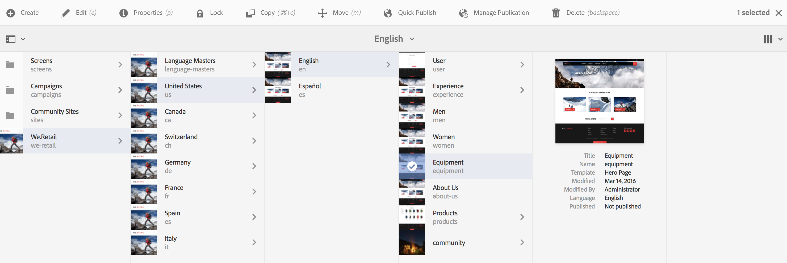
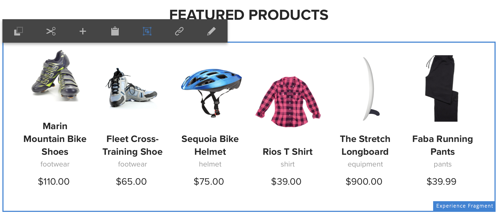
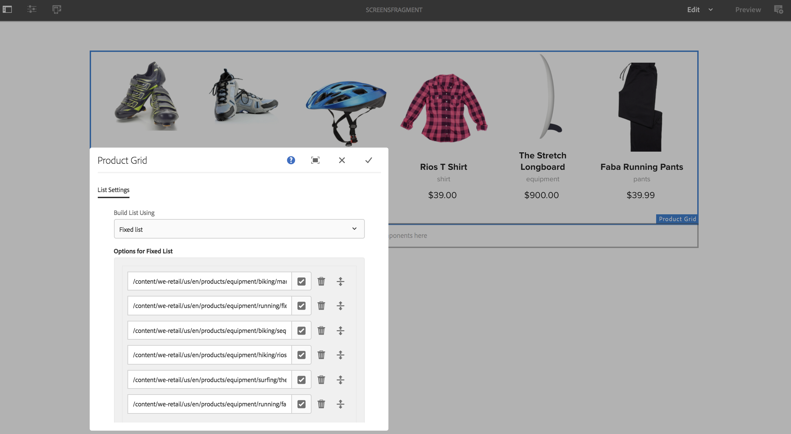
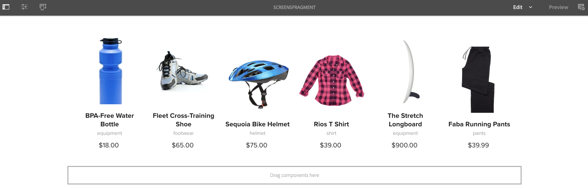
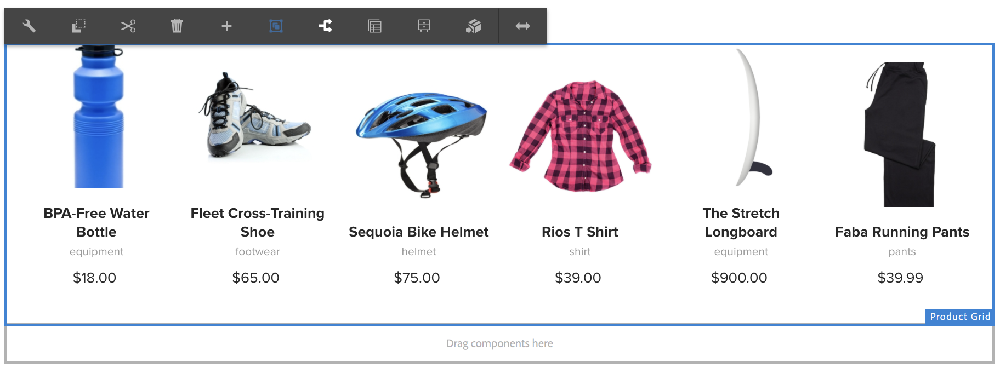
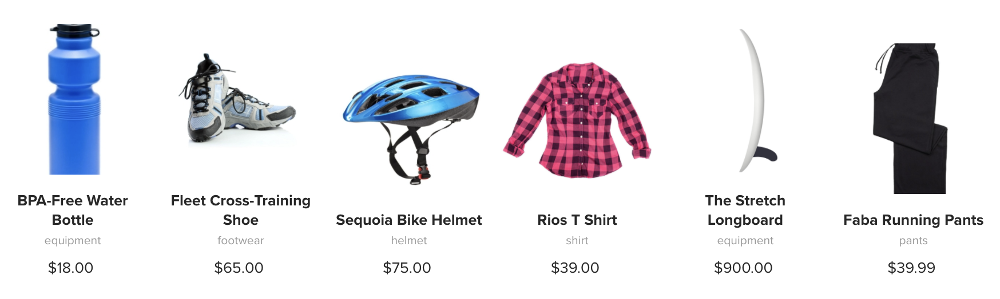

# Using Experience Fragments{#using-experience-fragments}

This page covers the following topics:

* **Overview**
* **Using Experience Fragments in AEM Screens**
* **Propagating Changes from the Master Page  
  **

## Overview {#overview}

An ***Experience Fragment*** is a group of one or more components including content and layout that can be referenced within pages. Experience fragments can contain any component, such as, one or multiple components that can contain anything within a paragraph system, that will be referenced into the complete experience or requested by a third endpoint.

To learn more about Experience Fragments, click [here](../../sites/authoring/using/experience-fragments.md).

## Using Experience Fragments in AEM Screens {#using-experience-fragments-in-aem-screens}

>[!NOTE]
>
>The following example uses **We.Retail** as a demo project from where the Experience Fragment is leveraged from a **Sites** page to an AEM Screens project.

As an example, the following workflow demonstrates the use of experience fragments from We.Retail in Sites. You can choose a web page and leverage that content in your AEM Screens channel in one of your projects.

### Pre-requisites {#pre-requisites}

**Creating a demo project with a Channel**

***Creating a Project***

1. Click Screens and select **Create** --&gt; **Create Project **to create a new project. 

1. Select **Screens **from the **Create Screens Project **wizard.

1. Enter the Title as **DemoProject**.
1. Click **Create**.

A **DemoProject** will be added to your AEM Screens.  ***Creating a Channel***

1. Navigate to the **DemoProject** you created and select the **Channels** folder.

1. Click **Create** from the action bar (see the figure below). A wizard will open.
1. Choose the **Sequence Channel** template from the wizard and click **Next**.

1. Enter the **Title** as **TestChannel** and click **Create**.

A **TestChannel** will be added to your **DemoProject**.   

>[!NOTE]
>
>To learn in detail about creating a project and creating a channel, see [Creating a Project](https://chl-author.corp./content/help/en/experience-manager/6-5/sites/authoring/using/creating-a-screens-project.html) and [Managing Channels](https://chl-/content/help/en/experience-manager/6-5/sites/authoring/using/managing-channels.html) respectively.

### Creating an Experience Fragment {#creating-an-experience-fragment}

Follow the steps below to leverage the content from **We.Retail** to your **TestChannel** in **DemoProject**.

1. **Navigate to a Sites page in We.Retail**

    1. Navigate to Sites and select **We.Retail **-&gt;** United States **-&gt;**English **and select **Equipment** page to use this as an experience fragment for your Screens channel. 
    
    1. Click **Edit** from the action bar to open the page you want to use as an experience fragment for your Screens channel.

   

1. **Re-using the Content**

    1. Select the fragment you want to include in your channel.
    1. Click the last icon from the right to open the **Convert to experience fragment** dialog box.

   

1. **Creating Experience fragment**

    1. Choose the **Action** as **Create a new Experience Fragment**.
    
    1. Select the **Parent path**.
    1. Select the **Template**. Choose the **Experience Fragment - Screens Variation **template here.  
    
    1. Enter the **Fragment Title **as **ScreensFragment**.
    
    1. Click the check mark to complete the creation of a new experience fragment.

   

1. **Creating Live Copy of Experience Fragment**

    1. Navigate to the AEM home page.
    1. Select **Experience Fragments** and highlight the **ScreensFragment** and click **Variation as live-copy**, as shown in the figure below:

   

   c. Select the** ScreensFragment **from** Create Live Copy** wizard and click **Next**.

   d. Enter the **Title** and **Name** as **Screens**.

   e. Click **Create** to create the Live Copy.

   f. Click **Done** to move back to **ScreensFragment** page.

   

   >[!NOTE]
   >
   >Once you have created Screens fragment, you can edit the properties of your fragment. Select the fragment and click **Properties** from the action bar.

   **Editing Properties of a Screens Fragment**

    1. Navigate to the **ScreensFragment** (you created in the preceding steps) and click **Properties** from the action bar.
    
    1. Select the **Offline Config** tab, as shown in the figure below.

   You can add the **Client-side Libraries** (java and css) and **Static Files** to your experience fragment.  

   The following example shows the addition of client-side libraries and the fonts as a part of static files to your experience fragment.  

1. **Using Experience Fragment as a Component in Screens Channel**

    1. Navigate to the Screens channel where you want to use the **Screens** fragment.
    1. Select the **TestChannel** and click **Edit** from the action bar.
    
    1. Click the components icon from the side tab.  
    1. Drag and drop the **Experience Fragment** to your channel.

   

   e. Select the **Experience Fragment** component and select the top left (wrench) icon to open the **Experience Fragment** dialog box.

   f. Select the **Screens** live copy of the fragment you created in *Step 3* in the **Path **field.

   

   f. Select the **Screens** live copy of the fragment you created in *Step 3* in the **Experience Fragment **field.

   

   h. Enter the seconds in the** Duration** field.

   i. Select the **Offline Config** from the **Experience Fragments** dialog box to define the client-side libraries and the static files.

   >[!NOTE]
   >
   >If you want to add client-side libraries or the static files in addition to what you configured in step (4), you can add from the **Offline Config** tab in the **Experience Fragment** dialog box.

   

   j. Click the check mark to complete the process.

### Validating the Result {#validating-the-result}

After completion of preceding steps, you can validate your experience fragment in **ChannelOne** by:

1. Navigating to the **TestChannel**.
1. Selecting the **Preview** from the action bar.

You will view the content from the **Sites** page (live-copy of the experience fragment) in your channel, as shown in the figure below:   
 

## Propagating Changes from the Master Page {#propagating-changes-from-the-master-page}

***Live Copy*** refers to the copy (of the source), maintained by synchronization actions as defined by the rollout configurations.

Since the Experience Fragment, we created is a live copy from the **Sites** pages, so if you make changes to that particluar fragment from the master page, you will view the changes in your channel or the destination where you have used the Experience Fragment.

>[!NOTE]
>
>For more information on Live Copy, see [Reusing Content: Multi Site Manager and Live Copy](https://content/help/en/experience-manager/6-5/sites/administering/using/msm.html).

Follow the steps below to propagate changes from the Master channel to your destination channel:

1. Select the Experience Fragment from the **Sites** (Master) page and click the pencil icon to edit the items in the Experience Fragment.

   

1. Select the Experience Fragment and click the wrench icon to open the dialog box to edit the images.

   

1. The **Product Grid** dialog box opens.

   

1. You can edit any of the images. For example, here the first image is replaced in this fragment.

   

1. Select the Experience Fragment and click the Rollout icon to propagate changes to the fragment that is used in your channel.

   

1. Click Rollout to confirm the changes.

   You will see that the changes are rolled out.

   

### Validating the Changes {#validating-the-changes}

Follow the steps below to confirm the changes in your channel:

1. Navigate to the **Screens** -&gt; **Channels** -&gt; **TestChannel**.

1. Click **Preview** from the action bar to confirm the changes.

The following image illustrates the changes in your **TestChannel**:   

