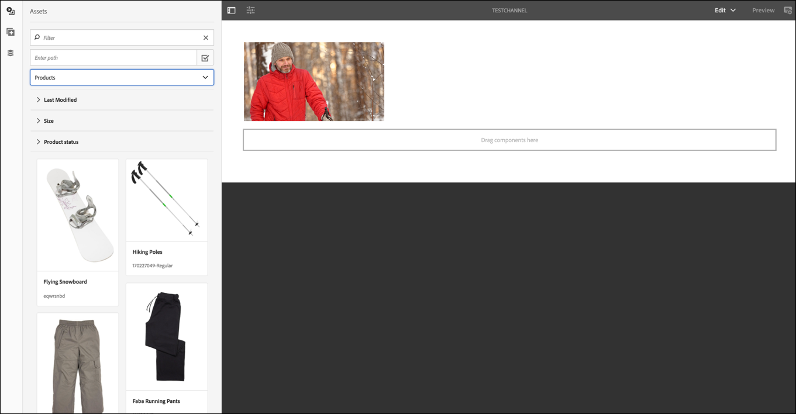
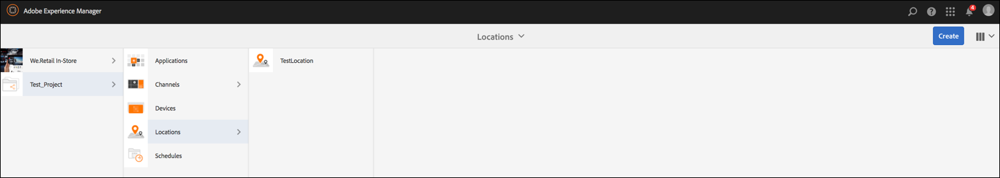
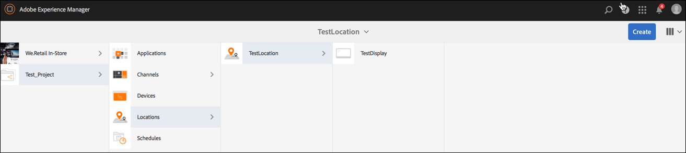
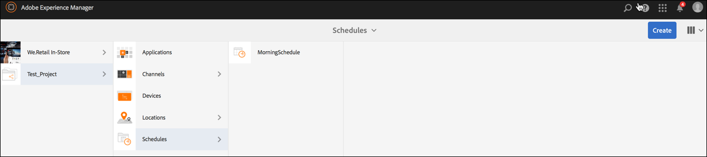
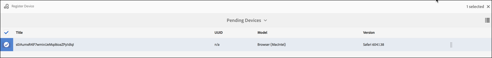

# Kickstart Guide{#kickstart-guide}

This section is a kickstart to AEM Screens and shows how to achieve basic actions. It walks you through setting up a basic digital signage experience with content/assets and publishing to a Screens player. For an in-depth understanding of all the components for Screens development, see the resources at the end of the page.

## Creating a Digital Signage Experience in 5 minutes {#creating-a-digital-signage-experience-in-minutes}

The following steps allow you to create a sample project for Screens and publish content to Screens player.

1. To download **AEM Screens Player**, click [here](https://download.macromedia.com/screens/).

   AEM Screens is also available in **Google Play**.

   For implementation of Chrome OS Player, see [**Chrome Management Console**](/screens/using/implementing-chrome-os-player.html?cq_ck=1513900475345) for more information.

   See [Installing and Configuring Screens](../../screens/using/configuring-screens-introduction.md) for more details.

   >[!NOTE]
   >
   >**OSGI Settings**
   >
   >
   >You need to enable the empty referrer to allow the device to post data to the server. For example, if the empty referrer property is disabled, the device cannot post a screenshot back. Currently some of these features are only available if the Apache Sling Referrer Filter Allow Empty is enabled in the OSGI Config. The dashboard may display a warning that security settings may prevent some of these features from working.
   >
   >
   >Follow the steps below to enable the ***Apache Sling Referrer Filter Allow Empty***:
   >
   >    
   >    
   >    1. Navigate to [Adobe Experience Manager Web Console Configuration](http://localhost:4502/system/console/configMgr/org.apache.sling.security.impl.ReferrerFilter).
   >    1. Check the **allow.empty** option.
   >    1. Click **Save**.
   >    
   >

1. **Creating a new project**

    1. Select the Adobe Experience Manager link (top left) and then **Screens**. Alternatively, you can go directly to: [http://localhost:4502/screens.html/content/screens](http://localhost:4502/screens.html/content/screens).
    
    1. Click **Create** to create a new Screens project (see the figure below).
    1. Select **Screens** from the **Create Screens Project** wizard and click **Next**.
    
    1. Enter the title as *Test_Project *and click **Create**.

   

   Once the project is created, it brings you back to the Screens Project console. You can now select your project. In a project, there are five kind of folders namely **Applications**, **Channels**, **Devices**, **Locations**, and **Schedules**, as shown in the figure below.

   >[!NOTE]
   >
   >Schedules is only available if you have installed AEM 6.3 Sites Feature Pack 1. To get access to this Feature Pack, you must contact Adobe Support and request access. Once you have permissions you can download it from Package Share.

   

   See [Create and Manage Screens Project](/screens/using/creating-a-screens-project.md) for more details.

1. **Creating a new channel**

   Once you have your project in place, you need to create a new channel where you manage the content.

   Follow the steps below to create a new channel for your project:

    1. Navigate to the *Test_Project* you created and select the **Channels** folder.
    
    1. Click** Create** from the action bar (see the figure below). A wizard will open.
    1. Choose the **Sequence Channel **and click **Next**.
    
    1. Enter the **Name** and **Title** as *TestChannel* and click **Create**.

   

   The *TestChannel* is created and added to your channels folder, as shown in the figure below.

   

   See [Channel Management](../../screens/using/managing-channels.md) for more details on creating and managing channels.

1. **Adding Content to a Channel**

   Once you have your channel in place, you need to add content to your channel that the Screens player will display.

   Follow the steps below to add content to the channel (*TestChannel*) in your project:

    1. Navigate to the *Test_Project* you created and select the **Channels **folder.
    
    1. Click **Edit** from the action bar (see the figure below). The editor for the* TestChannel* opens.
    
    1. Click the icon that toggles side panel on left hand side of the action bar to open the assets and components.
    1. Drag and drop the components you want to add to your channel.

   

   In this example, the editor shows an image added to the channel.

   

1. **Creating a new location**

   Once you have your channel in place, you need to create your location.

   ***Locations*** compartmentalise your various digital signage experiences and contains the configurations of the displays according to where the various screens are.

   Follow the steps below to create a new location for your project:

    1. Navigate to the *Test_Project* you created and select the **Locations **folder.
    
    1. Click **Create** next to the plus icon in the action bar (see the figure below). A wizard will open. 
    1. Select **Location** from the wizard and click **Next**.
    
    1. Enter the **Name** and **Title** for your location (enter the title as *TestLocation*) and click **Create**.

   

   The *TestLocation* is created and added to your **Locations** folder.

   

1. **Creating a new display for *TestLocation***

   Once you have created a location, you need to create a new display for your location.

   ***Displays*** represent the digital experience that run on one or multiple screens.

    1. Navigate to the location where you want to create your display (*Test_Projec*t --&gt; **Locations** --&gt; *TestLocation)* as shown in the figure above and selct *TestLocation*.
    
    1. Click** Create **from the action bar. 
    1. Select **Display **from the **Create** wizard and click **Next**.
    
    1. Enter **Name** and **Title** for your display location (enter the title as *TestDisplay*).
    
    1. Under the **Display** tab, choose the details of the Layout.

        1. Choose the **Resolution** as **Full HD**.
        
        1. Choose the **Number of Devices Horizontally** as 1.
        1. Choose the **Number of Devices Vertically** as 1.

    1. Click **Create**.

   A new display (*TestDisplay*) is added to your location *TestLocation)*, as shown in the figure below.

   

1. **Adding a Schedule**

   *Schedules*, in AEM Screens, lets you organise channels into re-usable groups so that you do not have to repeat their assignment individually for each display on which you want to show your content.

   >[!NOTE]
   >
   >This Screens functionality is only available if you have installed AEM 6.3 Sites Feature Pack 1. To get access to this Feature Pack, you must contact Adobe Support and request access. Once you have permissions you can download it from Package Share.

    1. Navigate to the **Schedules** folder from Test_Project --&gt; **Schedules**.
    
    1. Click** Create **from the action bar. A wizard will open.
    1. Select **Schedule** from the **Create** wizard page.
    
    1. Enter the **Name** and **Title** as *MorningSchedule* in the properties page.
    
    1. Click **Create** and schedule will be added to the **Schedules** folder, as shown in the figure below.

   

   Additionally, select the schedule (*MorningSchedule*) and click **Dashboard** from the action bar to view the schedules dashboard. You can view/change schedule's properties, assign channels, and view assigned displays using the dashboard.

   

   See [Create and Manage Schedules](/screens/using/managing-schedules.md) to get detailed information on schedules.

1. **Assigning a channel**

    1. Navigate to the display from *Test_Project* --&gt; **Locations** --&gt; *TestLocation* --&gt; *TestDisplay*.
    
    1. Select *TestDisplay* and tap/click **Assign Channel **from the action bar, *Or*,
    
    1. Click **Dashboard** and select **+Assign Channel** at the top right from **ASSIGNED CHANNELS & SCHEDULES** panel, as shown in the figure below. **Channel Assignment** dialog box opens.
    
    1. Select **Reference Channel** by **path**
    
    1. Enter the **Channel Role** as *LiveStream*.
    
    1. Select the** Channel Path** (*Test_Project* --&gt; *Channels* --&gt; *TestChannel* ) in the **Channel**.
    
    1. Select the **Priority** for this channel as *1*.
    
    1. Choose the **Supported Events** as **Initial Load **and **Idle Screen**.
    
    1. Enter **Schedule **and select the dates in **active from** and **active until**.
    
    1. Click **Save**.

   The channel is created and added to the panel.

   

   To learn more about **Channel Assignment** dialog box and the properties associated with it, see [Assign Channels](../../screens/using/channel-assignment.md).

1. **Adding Schedule to a Channel**

    1. Navigate to the display from *Test_Project* --&gt; **Locations** --&gt; *TestLocation* --&gt; *TestDisplay*.
    
    1. Click **Dashboard** and select **+Assign Schedule** at the top right from **ASSIGNED CHANNELS & SCHEDULES** panel, as shown in the figure above. **Schedule Assignment** dialog box opens.
    
    1. Choose the path where you created your schedule (here, *Test_Project* --&gt; **Schedules** --&gt; *MorningSchedule*).
    
    1. Click **Save** to add your schedule to your channel.

   

1. **Registering a device**

   You need to register your device using the AEM dashboard.

   >[!NOTE]
   >
   >You can open the Screens player using the AEM Screens app you downloaded or using the web browser.

   To view the pending device:

    1. Launch a separate browser window.
    1. Go to Screens player using the [web browser](http://localhost:4502/content/mobileapps/cq-screens-player/firmware.html) or launch the AEM Screens app. When you open the device you will notice the device's state as unregistered. 
    1. From the AEM dashboard, navigate to *Test_Project* --&gt; **Devices**
    
    1. Click **Device Manager** from the action bar.
    1. Click **Device Registration** and you will see the pending devices, as shown in the figure below.

   

   Select the device you want to register and click **Register Device**.

   

   You will need to validate the code by verifying the code from the web browser or AEM Screens player.

   Click **Validate** to navigate to **Device Registration** screen.

   

   Enter **Title** and click **Register **and** **the device will be registered.

   Click **Finish** to complete the device registration step.

   

   Clicking **Finish** returns you to the device page that displays unassigned and assigned devices.

   

   >[!NOTE]
   >
   >The device you added displays as **Not Assigned** under **Assigned** status.

1. **Assigning the device to display**

   Once you have registered the device, you need to assign the device to a display.

   Follow the steps below to assign a device:

    1. Select the device you want to assign.
    1. Click **Assign Device** from the action bar.
    1. Select the display path for your channel as */content/screens/Test_Project/***Locations***/TestLocation/TestDisplay.*
    
    1. Click **Assign**.
    1. Click **Finish** to complete the process, and now the device is assigned.

   

   The display dashboard opens and you will see all the information related to assigned channels and schedules along with device config details.

   

### Viewing the content in Screens Player {#viewing-the-content-in-screens-player}

Once you have added the above configurations, the player should automatically show the default channel for the display on your device, for example an image (in this scenario, a sequence channel and the content is visible in Screens Player for web browser).

See [AEM Screens Player](/screens/using/working-with-screens-player.md) to get more detailed information on AEM Screens player.

### Additional Resources {#additional-resources}

For in-depth understanding for all the modules for Screens, see the resources below:

1. [Install and Configure Screens](../../screens/using/configuring-screens-introduction.md)
1. [Create and Manage Screens Project](/screens/using/creating-a-screens-project.md)
1. [Assign Devices](/screens/using/managing-devices.md)
1. [Create and Manage Channels](../../screens/using/managing-channels.md)
1. [Create and Manage Locations](/screens/using/managing-locations.md)
1. [Create and Manage Displays](/screens/using/managing-displays.md)
1. [Assign Channels](../../screens/using/channel-assignment.md)
1. [Manage Devices](/screens/using/managing-devices.md)
1. [Create and Manage Schedules](/screens/using/managing-schedules.md)
1. [AEM Screens Player](/screens/using/working-with-screens-player.md)  

1. [Troubleshoot Device Control Center](../../screens/using/monitoring-screens.md)

