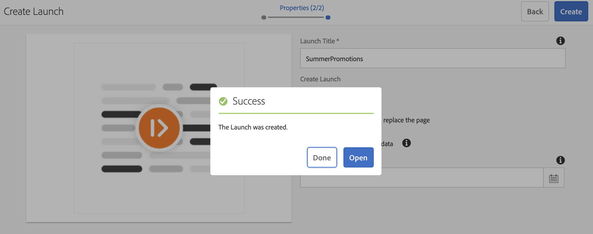
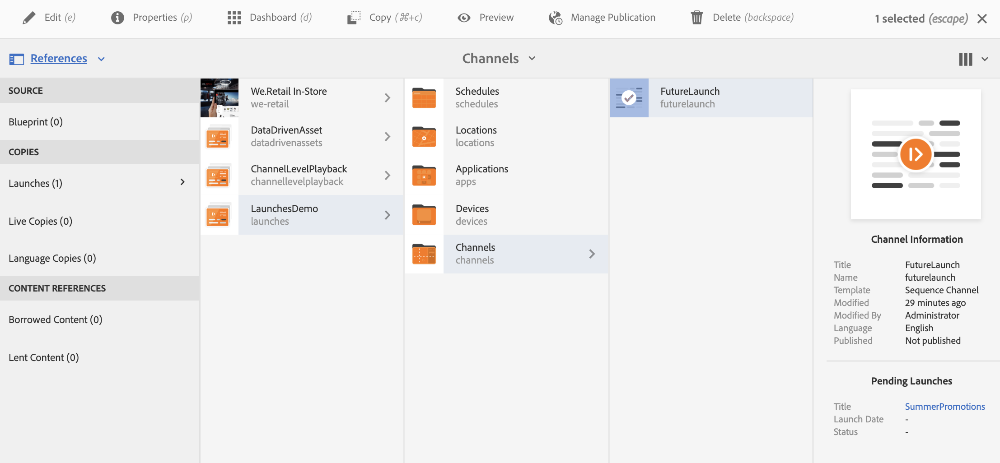

# Launches{#launches}

## Introduction {#introduction}

Content authors can create future version of the channel(s), known as **Launch** and further setting live date for this launch allows content to be live in devices or players.

With the help of launches, authors can preview each channel in the launch and should be able to initiate a request for review. Approvers group will get notification and can approve or reject the request. When the live date is reached, the content plays in the devices.

For example, if the author wants to create future versions of c1, c2 (channels), a launch is created and a live date is set (for instance, Nov 10th 8:00 AM). Any further updates in the content is sent out for review. Once approved and on live date (Nov 10th, 8:00 AM), this launch plays the content on the devices or players.

## Requirements {#requirements}

Before you start the implementation of Launches in an AEM Screens project, make sure you understand the concept of Grace Period and its relevance.

The following section explains the Grace Period and further how to configure it out-of-the-box. You can also download a sample test configuration to understand its usage.

### Understanding Grace Period {#understanding-grace-period}

The following setup allows the admin to configure the ***Grace Period***, required in Launches.

**Grace Period**, includes:

* promotion of the launch
* publishing of the resources to publish instances
* time taken by the devices to download the content from the publish instance and any time differences of the server and the player

For example let's say, server is in PST and the devices are in EST, max time difference is 3 hours in this case and assume that promotion will take 1 min and publishing from author to publish takes 10 min and player can download the resources typically in 10-15 min. Then grace period = time difference (3 hours) + time to promote the launch (1 min) + time to publish the launch (10 min) + time to download at player (10-15 min) + buffer (to be safe, say 30 min) = 3 hours 56 min = 14160 seconds. So, when ever we schedule any launch live, the promotion will start early by this offset. In the above equation, most of the items doesn't take much time, we can use a decent guess for this offset once we know the max time difference b/w the server and any player.

### Configuring out-of-the-box Grace Period {#configuring-out-of-the-box-grace-period}

Out-of-the-box, the grace period for a launch is set to 24 hours which means that when we set live date for any launch for the resources under */content/screens*, the promotion will start with this offset. For example, if the liveDate is set as Nov 24th, 9:00 AM and grace period is 24 hours, the promotion job will start at Nov 23Rd, 09:00 AM.

### Downloading Configurations {#downloading-configurations}

Download the following test configurations:

[Get File](assets/launches_event_handlerconfig-10.zip)

>[!NOTE]
>
>The above mentioned configuration has 600 seconds as the Grace Period in this test configuration.

#### Updating the Configurations {#updating-the-configurations}

If you want to change the above configuration, follow the below instructions below:

* create the ***sling:OsgiConfig/ nt:file in /apps/system/config*** with name **com.adobe.cq.wcm.launches.impl.LaunchesEventHandler.config** and content

  *launches.eventhandler.updatelastmodification=B"false"  
  launches.eventhandler.launch.promotion.graceperiod=["/content/screens(/.&#42;):600"]  
  launches.eventhandler.threadpool.maxsize=I"5"  
  launches.eventhandler.threadpool.priority="MIN"*

* ***launches.eventhandler.launch.promotion.graceperiod=["/content/screens(/.&#42;):600"]***, allows you to set a grace period of 600 seconds in the path */content/screens*.

It means that when you set live date for any launch for the resources under */content/screens*, the promotion will start with this offset. For example, if the live date is set as Nov 24th, 9:00 AM and grace period is 600 seconds, the promotion job will start at Nov 24th, 8:50 AM.

## Using Launches {#using-launches}

Follow the section below to implement Launches in your AEM Screens project. This section covers these topics:

1. **Creating a Launch**
1. **Editing a Launch to set live date and scope**

### Creating a Launch {#creating-a-launch}

Follow the steps below to implement future publish functionality to your AEM Screens project:

1. Navigate to the channel in your AEM Screens project, for example **LaunchesDemo** --&gt; **Channels** --&gt; **FutureLaunch**, as shown below.

   >[!CAUTION]
   >
   >You must create a launch from a pre-existing channel in your AEM Screens project.

   

1. Select the channel **FutureLaunch** and and click **Create**. Select **Launch** from the drop-down menu.

   

1. The **Create Launch** wizard opens. Click **+ Add Pages** to select the AEM Screens channels for which you want to create the launch.

   

1. Navigate to the channel and click **Select**.

   

1. Once you have the page selected, click **Next** to move one step further in **Create Launch** wizard.

   

1. Enter the **Launch Title** as **SummerPromotions** and you do not need to set the** Launch Date**, as shown in the figure below. Click **Create**.

   >[!NOTE]
   >
   >*Enabling or checking* the option **Inherit source page live data** allows the channels to be created as live copies in the launch. If any changes are made in the original channel, those changes are automatically applied to launch channels.
   >
   >
   >*Disabling or unchecking* **Inherit source page live data** allows the channels to be be copied without any live relationship in the launch. So, if any changes are made to the original channel, those changes are not applied to launch channels.

   

   >[!NOTE]
   >
   >You can set the live launch date in this step or can set it up later while editing the properties of the launch once it has already been created.

1. You will see that your launch is created. You can either click **Open** to view the pages in the editor or click **Done** to navigate back to your project.

   

   Clicking **Done** allows you to navigate back to your **LaunchesDemo** project.

   

### Editing the launch properties to set the live date and scope {#editing-the-launch-properties-to-set-the-live-date-and-scope}

Once you have created the launch, you need to edit the launch properties to set the live date the scope of the launch.

Follow the steps below to edit the launch properties:

1. Navigate to the channel (**FutureLaunch**) and select the channel, as shown in the figure below. Open the **References** rail from the the left side-rail.

   >[!NOTE]
   >
   >Select the **Content Tree **option from the left rail to open the launch you created.

   

1. Navigate to **Launches** and select the launch (**SummerPromotions**) you created. Click **Edit Properties**.

   

1. The launch **SummerPromotions** dialog box opens. Populate the following fields:

    * Select the **Launch Date**
    * Check **Production Ready**
    * Select **Promote approved pages** from **Scope**

   >[!NOTE]
   >
   >Understanding the Launches entries under **Auto-Promotion**:  

   >
   >    
   >    
   >    * **Launch Date**, refers to the live date, that is, the date/time the content will play in the Screens player as per the player's timezone.
   >    * **Production Ready**, allows the channels to be promoted and means that the launch is ready to be used.  
   >    
   >    * **Scope**, refers to the channels that can be promoted during a launch. The following three options are available to setup the scope:    >    
   >        
   >        
   >        1. **Promote full launch**: All the channels of the launch are promoted at the set live date.
   >        1. **Promote modified pages**: Only edited launch resources will be promoted. It is recommended to use this option when the launch review is not required. It allows the modifications in the launch channels to be promoted.
   >        1. **Promote approved pages**: Only approved pages are promoted at the set live date.
   >        
   >        
   >    
   >    
   >

   

   >[!CAUTION]
   >
   >Launch promotion respects player/device's timezone rather than server's.

1. Click **Save & Close** to navigate back to **FutureLaunch** channel.

   

