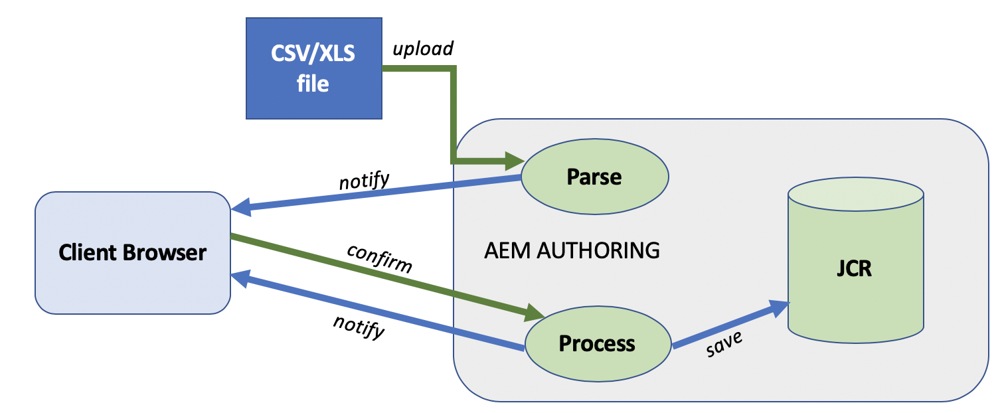
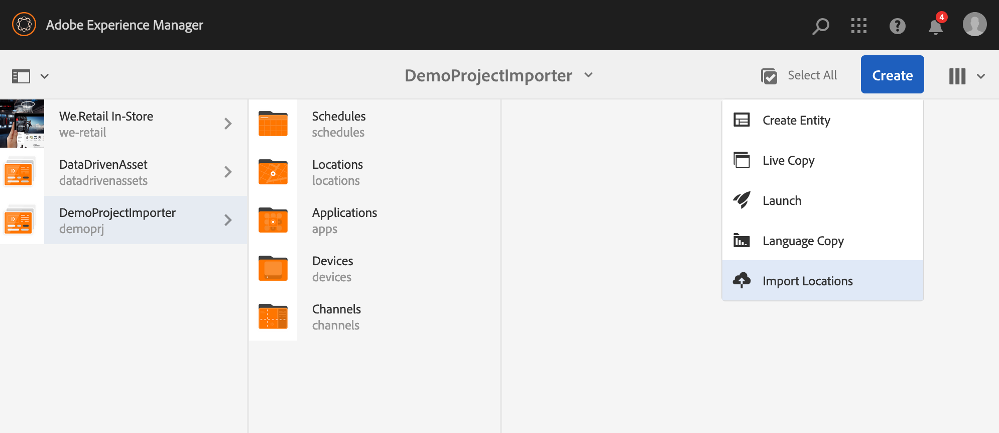
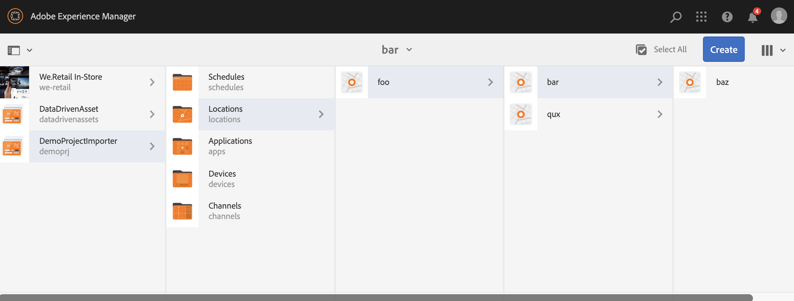

# New Project Importer from File{#new-project-importer-from-file}

This section describes a functionality to bulk-import a set of locations from a CSV/XLS spreadsheet to your AEM Screens project.

## Introduction {#introduction}

When you are setting up an AEM Screens project, for the first time in your organization, you need to create all the locations too. If your project involves a large number of locations, it results into a tedious task that involves a lot of clicking and waiting in the UI.

The goal of this feature is to reduce the time required to set up the project and thus resolve budgeting issues.

By letting the author provide a spreadsheet as an input file, and letting the system automatically create the location tree in the back-end, this feature:

* *achieves way better performances than manually clicking through the UI*
* *lets customer export the locations they have from their own system and easily import them directly in AEM*

This saves both time and money during initial project setup or when extending the existing AEM Screens to new locations.

## Architectural Overview {#architectural-overview}

The following diagram showcases the architectural overview for Project Importer feature:

 

### Data Model {#data-model}

The data model for Project Importer is described below:

>[!NOTE]
>
>The current release supports only importing locations.

| **Property** |**Description** |
|---|---|
| ***path {string*}** |The resource path for the location |
| ***[./jcr:title] {string*}** |The name of the template to use (that is, location for *screens/core/templates/location*) |
| ***template {string}*** |Optional title to use for the page |
| ***[./jcr:description] {string}*** |Optional description to use for the page |

The spreadsheet (CSV/XLS) file, thus requires the following columns:

* **path {string}** The path for the location to be imported, where the root of the path is the location folder for the project (that is, */foo* will be imported to */content/screens/&lt;project&gt;/locations/foo*)

* **template {string}** The template to use for the new location, for now the only allowed value is "location", but this will be extended to all the Screens templates in the future ("display", "sequencechannel, and so on)
* [**./&#42;] {string}** Any optional property to be set on the location (that is, ./jcr:title, ./jcr:description, ./foo, ./bar). The current release allows no filtering at this time

>[!NOTE]
>
>Any column that does not match the conditions above will just be ignored. For example, if you have any other column defined in your sheet (CSV/XLS) file other than*** *path**,** template**,** title **, and** description **in your file, those fields will be ignored and **Project Importer** will not validate those additional fields for importing your project to your AEM Screens project.

## Using Project Importer {#using-project-importer}

The following section describes how the Project Importer is used in an AEM Screens project.

>[!CAUTION]
>
>### Limitations: {#limitations}>
>* Files other than CSV/XLS/XLSX extensions are not supported in the current release.
>* No filtering of the properties exists for imported files and anything starting with "./" will be imported.
>

### Prerequisites {#prerequisites}

* Create a new project titled as **DemoProjectImport** 

* Use a sample CSV or excel file that you need to import.

For demo purposes, you can download an excel file from the section below.

[Get File](assets/minimal-file.xls)

### Importing the file with minimum required fields {#importing-the-file-with-minimum-required-fields}

Follow the steps below to import a file to locations folder with minimum required fields:

>[!NOTE]
>
>The following example showcases the minimum four fields required to import your project:

1. Navigate to your AEM Screens project (**DemoProjectImport**).

   

1. Select the project,** DemoProjectImporter **--&gt;** Create **--&gt;** Import Locations** from the side bar.

   

1. The **Import** wizard open. Select the file you have for your project with locations or select the file (***minimal-file.xls***) you downloaded from the *Prerequisites* section.

   Once you have selected the file, click **Next**.

   

1. Verify the content of the file (locations) from the Import wizard and click **Import**.

   

1. As a result, you will be now be able to view all the locations imported to your project.

   

