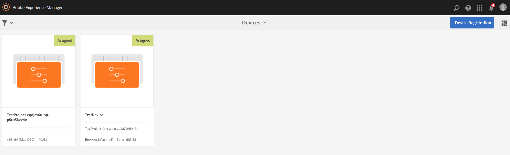
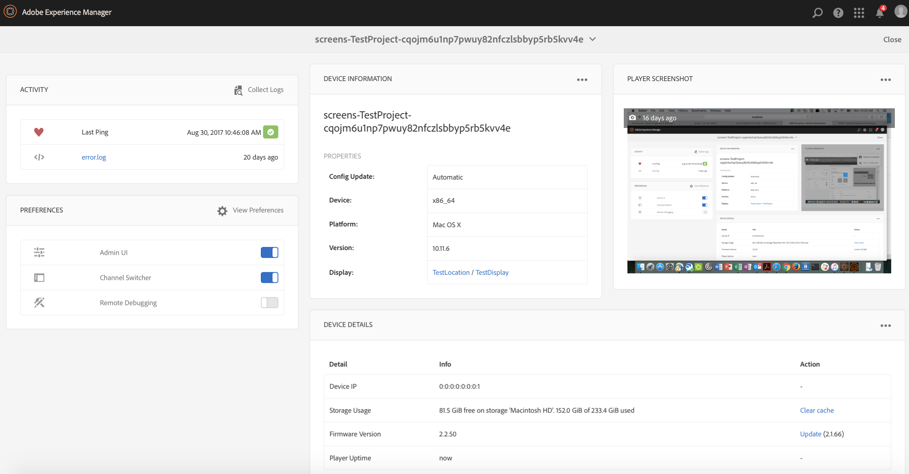
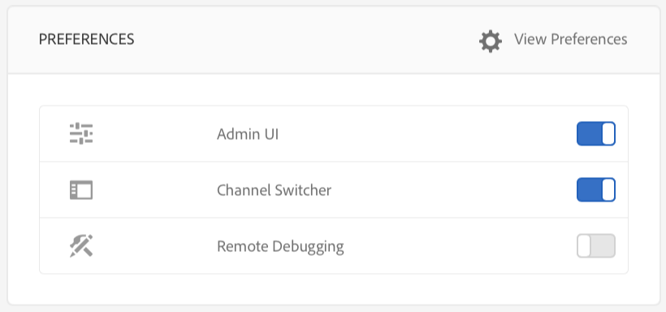
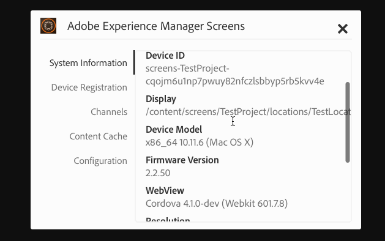
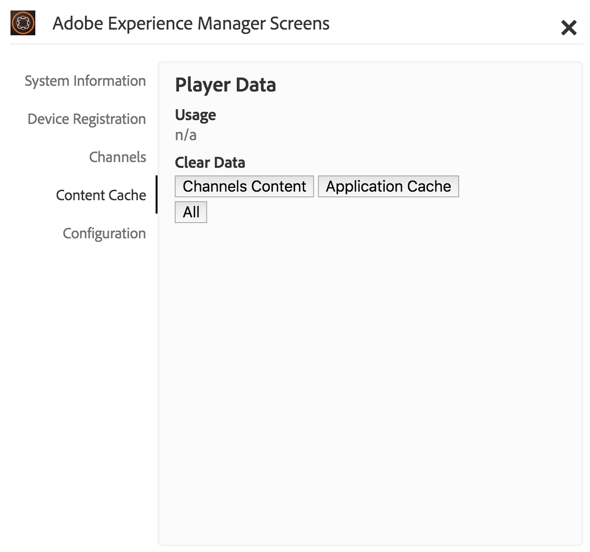
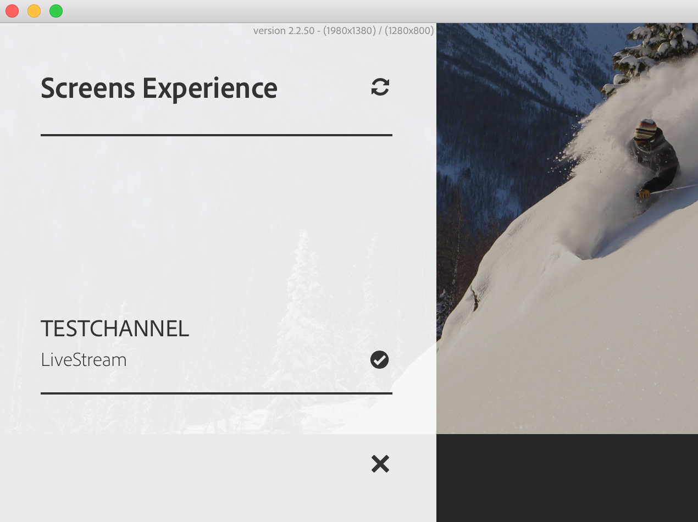
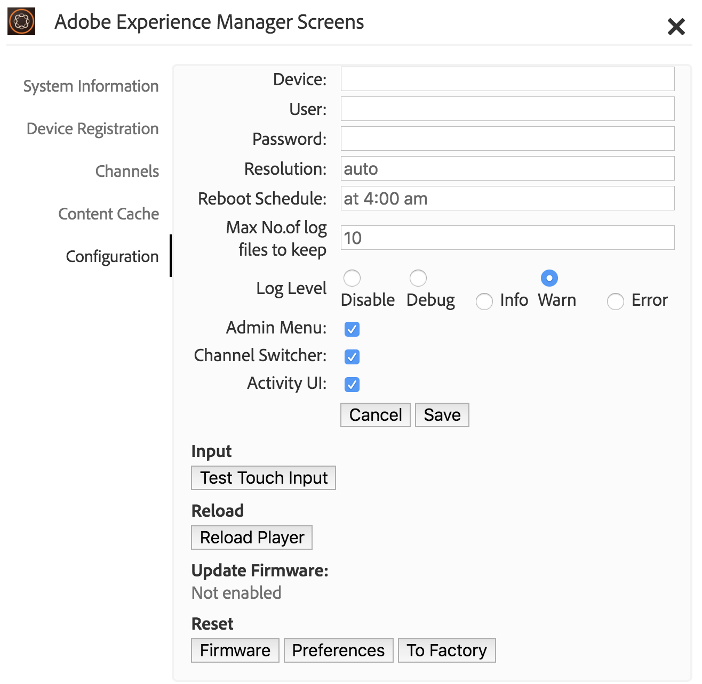

# Working with AEM Screens Player{#working-with-aem-screens-player}

You can manage the channel content and other settings on the AEM Screens Player.

>[!NOTE]
>
>Press ***Ctrl+Cmd+F*** to exit fullscreen mode for OS X AEM Screens Player.

Once you assign a channel to a display, the AEM Screens Player displays the content. You can either configure settings for your player using the preferences for admin UI (from the dashboard) or from the player itself.

## Using the Device Dashboard {#using-the-device-dashboard}

You can configure preferences for your device from the Device Dashboard, accessible via your AEM authoring instance.

1. Navigate to the device dashboard from your project, for example, ***Test Project*** --&gt; ***Devices***.

   Select **Devices** and **Device Manager** from the action bar.

   

1. Click on the device to open the device dashboard.

   

1. Check the **PREFERENCES** panel. You can enable/disable the **Admin UI** and **Channel Switcher** for your player from these two options.

   

### The Admin UI {#the-admin-ui}

Enabling the **Admin UI** from the preferences panel allows the user to open the admin settings from the Screens Player. Additionally, if you disable this option from the device dashboard, the user cannot open the admin UI from the player.

To view the admin UI from the Screens player, long press on the top left corner to open the Admin menu, on your touch enabled AEM Screens player, or by using a mouse. It shows information after registration is complete and the channels are loaded.

>[!NOTE]
>
>Additionally, you can view the AEM Screens Player app uptime to check app health status.

If you select the **Configuration** option from the side menu, you can also reset **Firmware**, **Preferences**, or **To Factory** from this dialog box.

Additionally, you can specify the number of maximum log files to keep for an AEM Screens player in **Max No. of log files to keep**. Please see the screenshot below for more details.

>[!NOTE]
>
>The **Update Firmware** option only works on the cordova, such as Android players.

You can clear cache for channels and applications from the Admin UI in AEM Screens player.

Select the **Content Cache** from the side rail to update the cache.

 

### The Channel Switcher {#the-channel-switcher}

Enabling the **Channel Switcher** from the preferences panel allows the user to open the channel selection/settings from the Screens Player.

Additionally, if you disable this option from the device dashboard, the user cannot control channel preferences from the Screens Player.

You can switch and control settings for your channel from your Screens Player.

To view the channel switcher from the player, long press on the lower left corner to open the channel switcher that allows switching channels and other features.

>[!NOTE]
>
>You can also enable or disable the admin menu and the channel switcher for the player from the Screens player.
>
>(See *Change Preferences from Screens Player* as mentioned in the section below).

### Managing Preferences from the AEM Screens Player {#managing-preferences-from-the-aem-screens-player}

You can also change the settings for admin UI and channel switcher from the player itself.

Follow these steps to change preferences from your Player:

1. Long-press on the top left corner on the idle channel to open the admin panel.
1. Navigate to **Configuration** from the left action menu.
1. Enable/disable configuration for **Admin UI** or **Channel Switcher**.

 

## Troubleshooting AEM Screens Player {#troubleshooting-aem-screens-player}

You can troubleshoot various issues associated with the AEM Screens Player (hardware and software):

| **Issues** |**Recommendations** |
|---|---|
| Player storage is full |Eliminate unnecessary files |
| Player lost network |Use Cat-5/Cat-6 cable. For wifi, reduce the distance from the router to the player device |
| AEM Screens Player crashed |It is recommended to have a watchdog app that makes sure the AEM Screens Player always runs |
| AEM Screens Player lost settings |Check connection to AEM server |
| AEM Screens Player does not auto-start after Player restart/reboot |Check OS start folder or initialization procedure |
| AEM Screens Player shows wrong/old content |Check network connection |

### Updates for AEM Screens Player {#updates-for-aem-screens-player}

There are two types of updates for the AEM Screens Player:

| **Method** |**Details** |**via Remote** |**Automated** |**0 Downtime** |
|---|---|---|---|---|
| Firmware Update |Applied on existing installed Players via remote command. After the update the Player will auto-reload with the existing content. |Yes |Custom |Almost - 1-3 seconds |
| Player Shell Updates |This is a new executable to be deployed on the Player. This requires to remote copy new binary on the player and stop the currently running and start the new version. This might require re-download the pre-load of the packages. |Yes (via remote shell) |Custom |No |

