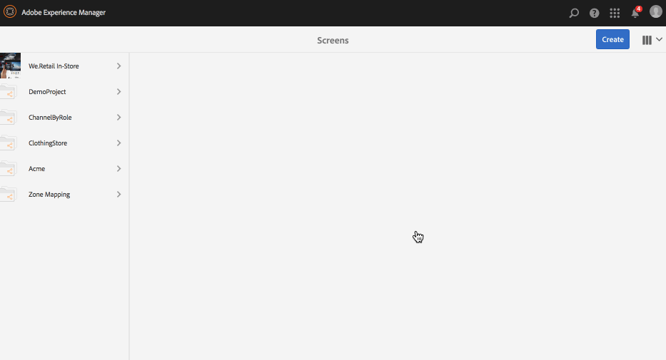
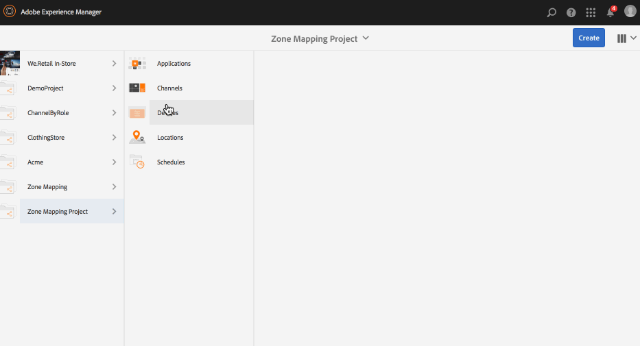
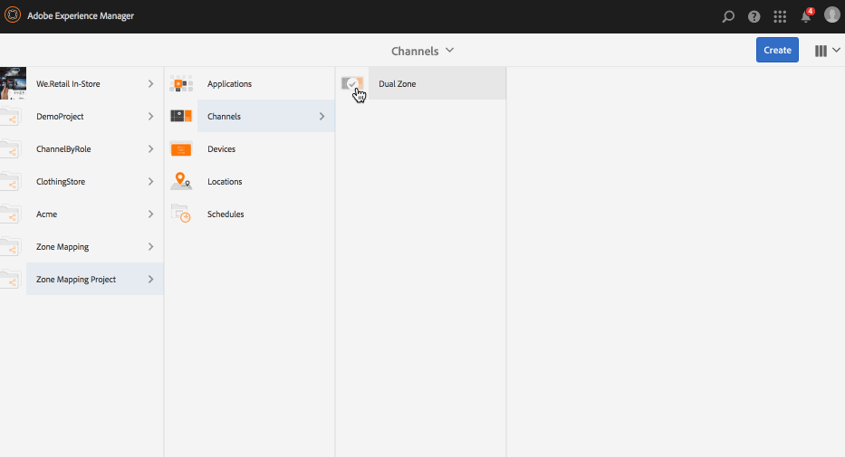
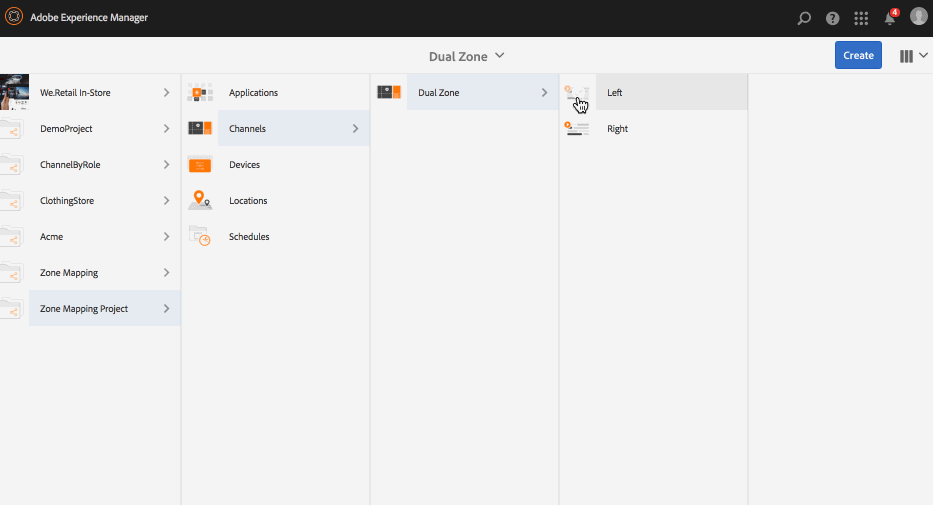
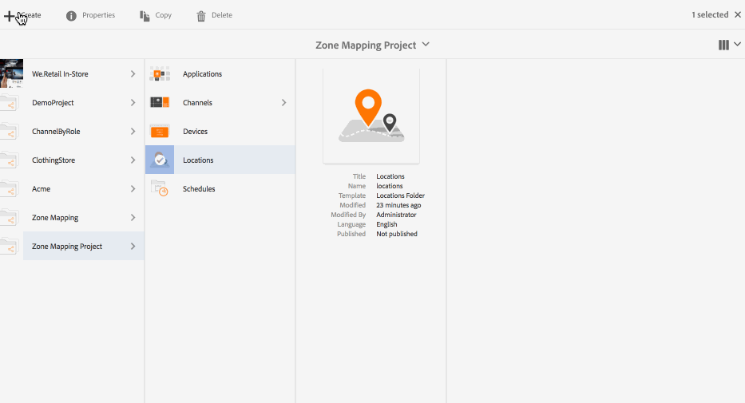
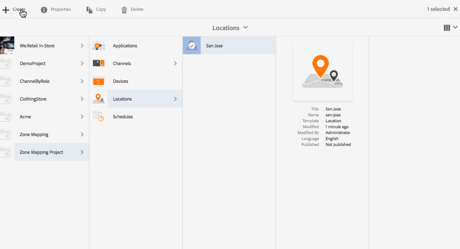
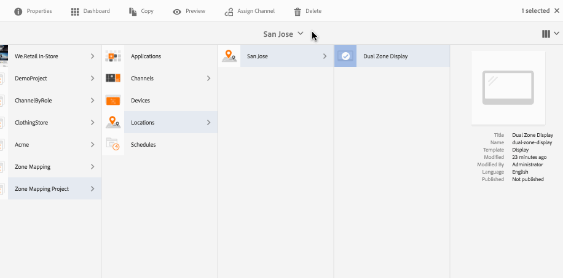
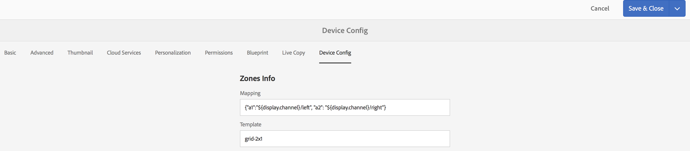
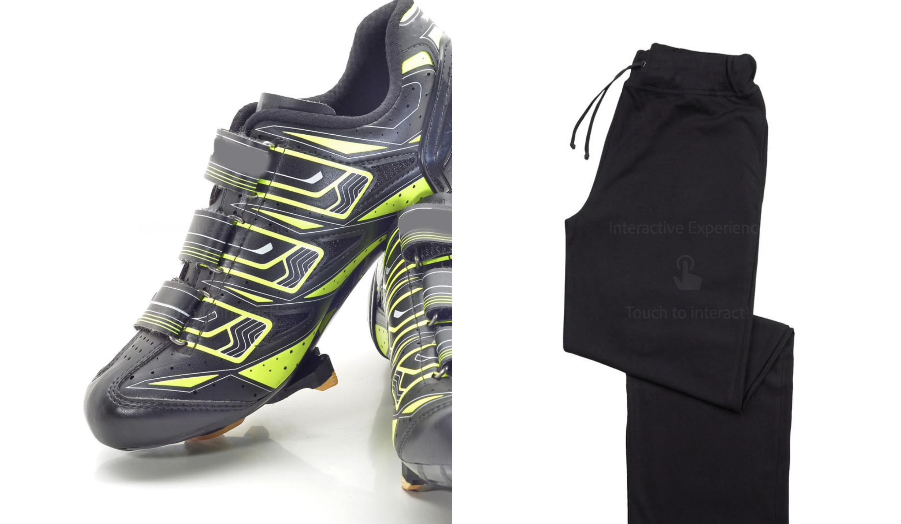

# Display Layout Editor{#display-layout-editor}

***Zone Mapping*** allows you to create different zones and use variety of assets such as videos, images, and text that can be combined inn a single screen in contexual ways. You can pull in images, videos, and texts and allow it all to blend together and create an intuitive and interactive digital experience. As per the project requirements, sometimes you need multiple zones in a display.

For example, a product sequence with a related social media feed running in two separate zones on a single display.

## Overview {#overview}

While creating a display for your channel, you can choose different template options to view/manage content in your channel.

The following templates are available while creating zones for display:

* 2x1 
* 2x2 
* 3x1 
* 4x1
* 5x1

Using any one of these templates allows you to create an intuitive and interactive digital signage experience where a variety of content can be leveraged on a single screen.

>[!NOTE]
>
>To learn in-depth about creating channels and displays, see [Managing Channels](managing-channels.md) and [Managing Displays](managing-displays.md) respectively in Authoring Screens.

## Use Case Description {#use-case-description}

This use case allows you to create an AEM Screens project with a channel that leverages content and display it on screen in multi zones.

>[!NOTE]
>
>Zones do not scale the content and that must be done prior to inserting the content to your channels.

### Steps for Creating a Project {#steps-for-creating-a-project}

Follow the steps below to create an AEM Screens project that shows how to achieve zone mapping for your AEM Screens project:

1. ***Creating a New Screens Project***

    1. Select the Adobe Experience Manager link (top left) and then Screens. Alternatively, you can go directly to: [http://localhost:4502/screens.html/content/screens](http://localhost:4502/screens.html/content/screens).
    1. Click **Create** to create a new Screens project.
    1. Select **Screens** from the **Create Screens Project** wizard and click **Next**. 
    1. Enter the title as **Demo Mapping Project** and click **Create**.

   

1. ***Creating a new Channels Folder***

    1. Navigate to** Zone Mapping Project**.
    1. Click **Create** from the action bar. A wizard will open.
    1. Choose the **Channels Folder **and click **Next**.
    1. Enter the Title as **Dual Zone **and click **Create**.

   

1. ***Creating a new Channel***

    1. Navigate to the **Zone Mapping Project** you created and select the Channels folder (**Dual Zone**).
    1. Click **Create** from the action bar. A wizard will open.
    1. Choose the **Sequence Channel **and click **Next**. 
    1. Enter the **Title** as **Left** and click **Create**.

   Similarly, create another sequence channel as **Right** in the **Zone Mapping Project**.

   

1. ***Adding Content to the Channels***

    1. Navigate to the **Zone Mapping Project** you created and select the **Channel** you created.
    1. Click **Edit** from the action bar.
    1. The editor for the **Left** opens. Click the icon that toggles side panel on left hand side of the action bar to open the assets and components.
    1. Drag and drop the components you want to add to your channel.

   Similarly, add content to the **Right** channel too.

   

   >[!NOTE]
   >
   >You can populate the content in your channels with different assets (images, videos) as per your project requirements.

1. ***Creating a new Location***

    1. Navigate to the** Zone Mapping Project** and select the **Locations** folder.
    1. Click **Create** next to the plus icon in the action bar. A wizard will open. 
    1. Select **Location** from the wizard and click **Next**.
    1. Enter the **Title** for your location (enter the title as **San Jose**) and click **Create**.

   

1. ***Creating a new display for San Jose***

    1. Navigate to the location where you want to create your display (**Demo Mapping Project** --&gt; **Locations** --&gt; **San Jose**) and select **San Jose**.
    1. Click **Create** from the action bar. Select **Display** from the **Create** wizard and click **Next**.
    1. Enter **Title** for your display location (enter the title as **Dual Zone**).
    1. Under the **Display** tab, choose the details of the Layout. Choose the Resolution as **Full HD**.
    1. Choose the **Number of Devices Horizontally** as **2**. Choose the **Number of Devices Vertically** as **1**.
    1. Click **Create**.

   

1. ***Assigning a channel***

    1. Navigate to the display from **Zone Mapping Project** --&gt; **Locations** --&gt; **San Jose** --&gt; **Dual Zone Display**.
    1. Select **Dual Zone Display **and tap/click **Assign Channel** from the action bar, Or,
    1. Click **Dashboard** and select **+Assign Channel** at the top right from **ASSIGNED CHANNELS & SCHEDULES** panel, as shown in the figure below. **Channel Assignment **dialog box opens.
    1. Enter the **Channel Role** as **Zone**.
    1. Select Reference Channel by path. Select the channel folder path (**Zone Mapping Project **--&gt; **Channels** --&gt; **Dual Zone** ) in the Channel.
    1. Select the **Priority** for this channel as **1**. Choose the **Supported Events** as **Initial Load** and **Idle Screen**.
    1. Click **Save**.

   

1. ***Registering and Assigning the Device***

    1. Launch a separate browser window. Go to Screens player using the web browser or launch the AEM Screens app. When you open the device you will notice the device's state as unregistered. 
    1. From the AEM dashboard, navigate to **Zone Mapping Project** --&gt; **Devices**.
    1. Click** Device Manager** from the action bar.
    1. Click **Device Registration** and you will see the pending devices.
    1. Select the device you want to register and click **Register Device**.  
    1. You will need to validate the code by verifying the code from the web browser or AEM Screens player. Click **Validate** to navigate to **Device Registration** screen.  
    1. Enter **Title** as **Zone Device** and click **Register** and the device will be registered.  
    1. Click **Assign Display** to move on to the next step where you assign the device to a display.  
    1. Click **Assign Device** fand select the display path for your channel () as */content/screens/Test_Project/Locations/TestLocation/TestDisplay*. Click **Assign**.
    1. Click **Finish** to complete the process, and now the device is assigned.

   

1. ***Creating multi-zone display***

    1. Navigate and select the display from **Zone Mapping Project** --&gt; **Locations** --&gt; **San Jose **--&gt; **Dual Zone **display and click **Dashboard** from the action bar.
    1. Select the icon to the left of **Device Config** of your player from the **DEVICES** panel and click **properties**.
    1. Navigate to the **Device Config** tab and fill in the **Mapping** and **Template** fields. Enter *{"a1":"${display.channel}/left", "a2": "${display.channel}/right"}* in the **Mapping** field and template as *grid-2x1*. 
    1. Click **Save & Close** and reload the player.

   >[!NOTE]
   >
   >***Understanding Mapping and Template in device config:***
   >
   >* identifiers "a1" and "a2" correspond to the zones defined in the template, that is, "screens-zone-a1" and "screens-zone-a2".
   >* ${display.channel}/left" points to the channel to embed in the zone, where "display.channel" points to the current channel path in the display. This effectively embeds the "left" and "right" children of the channel.

   

#### Viewing Content in AEM Screens Player {#viewing-content-in-aem-screens-player}

Load your AEM Screens Player or use the web browser.

You will notice the content of both the channel (Left and Right) displayed in your Screens player. The content is displayed as 2x1 display zone.

 

### Inference {#inference}

Zone Mapping that uses one of the available templates while creating a channel in AEM Screens, allows you to do client side flattening. You can create different zones in your screen and further populate the zones with videos, images and other available assets.
