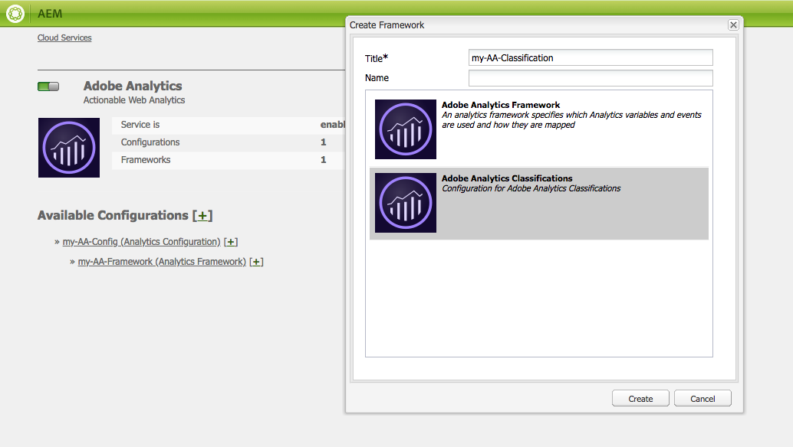
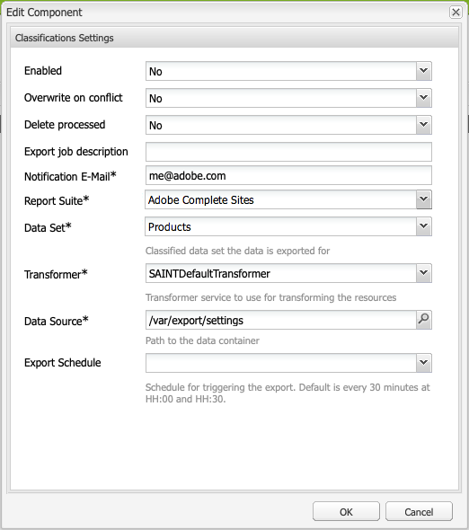
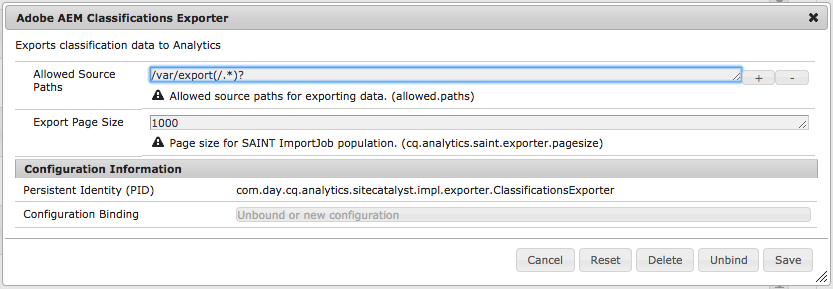

# Adobe Classifications{#adobe-classifications}

Adobe Classifications exports classifications data to [Adobe Analytics](/help/sites-administering/adobeanalytics.md) in a scheduled manner. The exporter is an implementation of a **com.adobe.cq.scheduled.exporter.Exporter**.

To configure this:

1. Using **Navigation**, select **Tools**, **Cloud Services**, then **Legacy Cloud Services**.
1. Scroll to **Adobe Analytics** and select **Show Configurations**.
1. Click the **&#91;+&#93;** link next to your Adobe Analytics configuration.

1. In the **Create Framework** dialog:

    * Specify a **Title**.
    * Optionally you can specify the **Name**, for the node that stores the framework details in the repository.
    * Select **Adobe Analytics Classifications**

   And click **Create**.

   

1. The **Classifications Settings** dialog opens for editing. 

   

   Properties include the following:

   | **Field** |**Description** |
   |---|---|
   | Enabled |Select **Yes** to enable the Adobe Classifications settings. |
   | Overwrite on conflict |Select **Yes** to overwrite any data collisions. By default, this is set to **No**. |
   | Delete processed |If set to **Yes**, deletes processed nodes after they are exported. The default is **False**. |
   | Export job description |Enter a description for the Adobe Classifications job. |
   | Notification E-mail |Enter an email address for Adobe Classifications notification. |
   | Report Suite |Enter the Report suite to run the import job for. |
   | Data Set |Enter the dataset relation ID to run the import job for. |
   | Transformer |From the drop-down menu, select a transformer implementation. |
   | Data Source |Navigate to the path for the data container. |
   | Export Schedule |Select the schedule for the export. The default is every 30 minutes. |

1. Click **OK** to save your settings.

## Modifying Page Size {#modifying-page-size}

Records are processed in pages. By default, Adobe Classifications creates pages with a page size of 1000.

A page may be 25000 in size at maximum, per definition in Adobe Classifications and can be modified from the Felix console. During the export, Adobe Classifications locks the source node to prevent concurrent modifications. The node is unlocked after export, on error, or when the session is closed.

To change the page size:

1. Navigate to the OSGI console at **https://&lt;host&gt;:&lt;port&gt;/system/console/configMgr** and select **Adobe AEM Classifications Exporter**.

   

1. Update the **Export Page Size** as required, then click **Save**.

## SAINTDefaultTransformer {#saintdefaulttransformer}

>[!NOTE]
>
>Adobe Classifications was previously known as the SAINT Exporter.

An Exporter may use a Transformer to transform the export data to a specific format. For Adobe Classifications, a subinterface `SAINTTransformer<String[]>` implementing the Transformer interface has been provided. This interface is used to restrict the data type to `String[]` which is used by the SAINT API and to have a marker interface to find such services for selection.

In the default implementation SAINTDefaultTransformer, the child resources of the exporter source are treated as records with property names as keys and property values as values. The **Key** column is added automatically as first column - its value will be the node name. Namespaced properties (containing `:`) are disregarded.

*Node structure:*

* id-classification `nt:unstructured`

    * 1 `nt:unstructured`

        * Product = My Product Name (String)
        * Price = 120.90 (String)
        * Size = M (String)
        * Color = black (String)
        * Color^Code = 101 (String)

**SAINT Header & Record:**

| **Key** |**Product** |**Price** |**Size** |**Color** |**Color^Code** |
|---|---|---|---|---|---|
| 1 |My Product Name |120.90 |M |black |101 |

Properties include the following:

<table>
 <tbody>
  <tr>
   <td><strong>Property path</strong></td>
   <td><strong>Description</strong></td>
  </tr>
  <tr>
   <td>transformer</td>
   <td>A class name of a SAINTTransformer implementation</td>
  </tr>
  <tr>
   <td>email</td>
   <td>Notification e-mail address.</td>
  </tr>
  <tr>
   <td>reportsuites</td>
   <td>Report suite IDs to run the import job for. </td>
  </tr>
  <tr>
   <td>dataset</td>
   <td>Dataset relation ID to run the import job for. </td>
  </tr>
  <tr>
   <td>description</td>
   <td>Job description.   </td>
  </tr>
  <tr>
   <td>overwrite</td>
   <td>Flag to overwrite data collisions. Default is <strong>false</strong>.</td>
  </tr>
  <tr>
   <td>checkdivisions</td>
   <td>Flag to check report suites for compatibility. Default is <strong>true</strong>.</td>
  </tr>
  <tr>
   <td>deleteprocessed</td>
   <td>Flag to delete the processed nodes after export. Default is <strong>false</strong>.</td>
  </tr>
 </tbody>
</table>

## Automating Adobe Classifications Export {#automating-adobe-classifications-export}

You can create your own workflow, so that any new imports launch the workflow to create the appropriate, and correctly structured, data in **/var/export/** so that it can be exported to Adobe Classifications.
