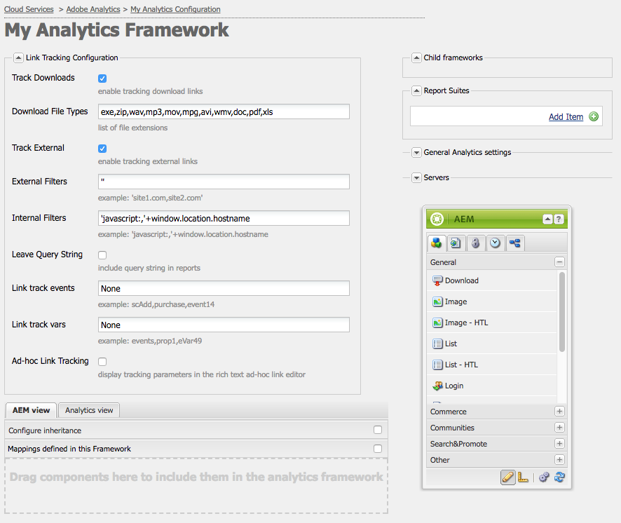
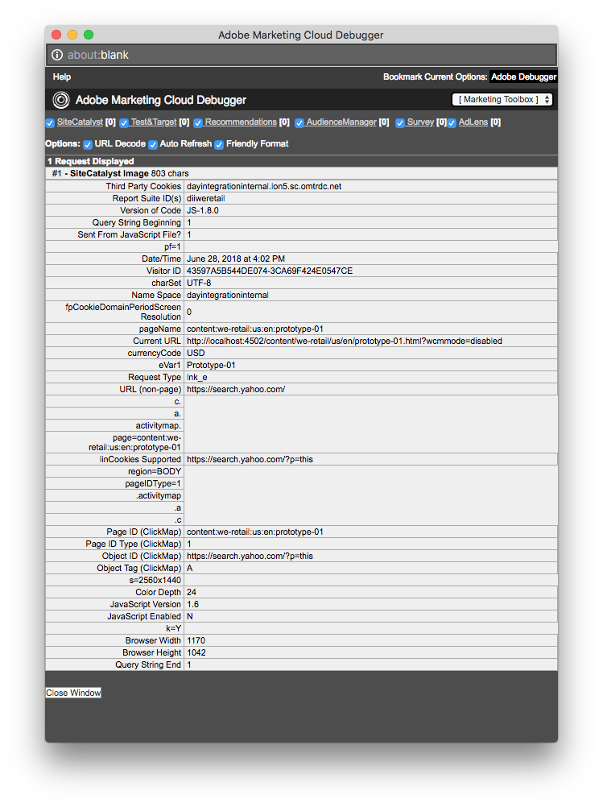
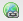
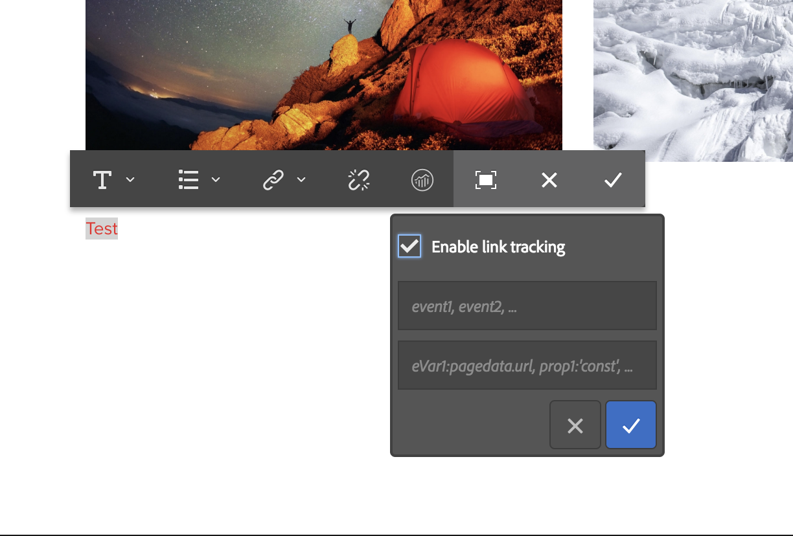

# Configuring Link Tracking for Adobe Analytics{#configuring-link-tracking-for-adobe-analytics}

When users click links on pages of your website you can capture related information in Adobe Analytics. For example, use link tracking to learn how users interact with your site, track file downloads, and track exit links.

## Configuring Link Tracking for an Adobe Analytics Framework {#configuring-link-tracking-for-an-adobe-analytics-framework}

1. Using **Navigation**, go via **Deployment**, **Cloud Services** to the **Adobe Analytics** section.

1. Using **Show Configurations**, open the required Adobe Analytics framework.
1. Expand the **Link Tracking Configuration** section and configure as required (this page provides further details):

   

## Tracking File Downloads {#tracking-file-downloads}

Configure the Adobe Analytics framework so that files downloaded from associated pages are automatically tracked as downloads in Adobe Analytics. When you enable the tracking of downloads, only the file types that you specify are tracked.

Downloads of the following file types are tracked by default:

* exe
* zip
* wav
* mp3
* mov
* mpg
* avi
* wmv
* doc
* pdf
* xls

So for example, with download tracking enabled for PDF files, whenever users click links to PDF files, the download of the PDF is tracked.

The download tracking properties of the framework are implemented as code in the `analytics.sitecatalyst.js` file that is generated for a page. The following code sample represents the default download tracking configuration:

```
s.trackDownloadLinks= true;
s.linkDownloadFileTypes= 'exe,zip,wav,mp3,mov,mpg,avi,wmv,doc,pdf,xls';
```

To enable download tracking for your Adobe Analytics framework:

1. [Open the Adobe Analytics framework and expand the Link Tracking Configuration section](#configuring-link-tracking-for-an-adobe-analytics-framework).
1. Enable **Track Downloads**.
1. In the **Download File Types** box, type the filename extensions for the types of files that you want tracked.

## Tracking external links {#tracking-external-links}

You can track the clicking of external links (exit links) on your pages.

To track external links for your Adobe Analytics framework:

1. [Open the Adobe Analytics framework and expand the **Link Tracking Configuration** section](#configuring-link-tracking-for-an-adobe-analytics-framework).
1. Configure the following properties according to your requirements.

Properties for tracking when external links are clicked:

* **Track External**
  Enables external link tracking.

* **External Filters**
  (Optional) Defines filters for matching the external URLs of the link targets. When the link targets match the filter, the link is tracked. External filters are useful for tracking only some of the external links on your pages.

  To specify the external links to track, type all or part of the URL of the link target. Separate multiple filters with a comma. Enclose string literals within single quotation marks. No value (the default value of `''`, two single quotes) causes all external links to be tracked.

* **Internal Filters**
  Defines filters for matching the URLs of internal links. When the link targets URLs that match this filter, the link is not tracked. The default value is a javascript command that returns the hostname of the URL for the current window address.

  To specify the internal links that are not tracked, type all or part of the internal URL of the link target. Separate multiple filters with a comma. Enclose string literals within single quotation marks.

  The default value is `'javascript:,'+window.location.hostname`

* **Leave Query String**
  Includes URL parameters when evaluating matches with internal and external filters.

  Enable if you want to include URL parameters when evaluating link target URLs against external and internal filters.

The external link tracking properties are implemented as code in the `analytics.sitecatalyst.js` file that is generated for a page. The following example code is generated for a page that is associated with a framework that has enabled external link tracking with the following configuration:

* External filter is `'google.com'`
* Internal filter is the default value of `'javascript:,'+window.location.hostname`
* Query strings are not included when evaluating the link target against filters.

```
s.trackExternalLinks= false;
s.linkExternalFilters= 'google.com';
s.linkInternalFilters= 'javascript:,'+window.location.hostname;
s.linkLeaveQueryString= false;
```

## Sending Variable Data with Link Clicks {#sending-variable-data-with-link-clicks}

You can configure AEM to send event and variable data to Adobe Analytics when a user clicks a link. The **Link Tracking Configuration** properties enable you to specify the Adobe Analytics events and variables to track when link clicks occur.

The framework mappings determine the event and variable values. You can map Adobe Analytics variables to the variables of your content components that store the data you want tracked when links are clicked.

To send variable data with link clicks:

1. [Open the Adobe Analytics framework and expand the Link Tracking Configuration section](#configuring-link-tracking-for-an-adobe-analytics-framework).
1. Configure the following properties according to your requirements.

Properties for sending variable data with link clicks:

* **Link Track Events**
  Enter the Adobe Analytics event variables that you want to use for counting link clicks.

  Separate multiple variable names with a comma.

  The default value of `None` causes no event tracking.

* **Link Track Vars**
  Enter the Adobe Analytics variables that you want to send to Adobe Analytics when links are clicked. Separate multiple variable names with a comma.

  The default value of `None` causes no variable data to be sent.

When you specify the events and variables to send, the configuration is implemented as code in the `analytics.sitecatalyst.js` file that is generated for a page. The following example code is generated for a page when the framework tracks the `event10` event and the `prop4` property:

```
s.linkTrackEvents= 'event10';
s.linkTrackVars= 'prop4';
```

## Example Link Tracking Configuration {#example-link-tracking-configuration}

Perform the following procedures to explore the link tracking behavior of the Adobe Analytics integration. The procedures show results from [Adobe Marketing Cloud Debugger](https://experienceleague.adobe.com/docs/debugger/using/experience-cloud-debugger.html).

### General configuration {#general-configuration}

This example illustrates how the mapping works in the context of tracking and the debugger:

1. Open the framework that has been associated with a web page.
1. Drag the **Page** component to the mappings area of the framework. The **Page** component belongs to the **General** component group in Sidekick.

   >[!NOTE]
   >
   >The component that you should use in a real-life scenario depends on the component inherited from (if at all).
   >
   >If not you should have your own component exposed there (by defining an analytics subnode in its page component).

   Configure the mapping according to the following table, by dragging the Analytics (SiteCatalyst) variable from the left side-panel:

<table>
 <tbody>
  <tr>
   <th>CQ Variable<br /> </th>
   <th>Entry in Variables Browser<br /> </th>
   <th>Adobe Analytics Variable</th>
  </tr>
  <tr>
   <td>pagedata.title</td>
   <td>Custom eVar 1 (eVar1)</td>
   <td>eVar1</td>
  </tr>
  <tr>
   <td>eventdata.events.pageView</td>
   <td>Custom 1 (event1)</td>
   <td>event1</td>
  </tr>
 </tbody>
</table>

1. Drag the Search component to the mappings area of the framework. The Search component belongs to the General component group in Sidekick. Configure the mapping according to the following table, by dragging the Analytics (SiteCatalyst) variable from the left side-panel:

<table>
 <tbody>
  <tr>
   <th>CQ Variable<br /> </th>
   <th>Entry in Variables Browser</th>
   <th>Adobe Analytics Variable</th>
  </tr>
  <tr>
   <td>eventdata.keyword</td>
   <td>Custom eVar 2 (eVar2)</td>
   <td>eVar2</td>
  </tr>
  <tr>
   <td>eventdata.results</td>
   <td>Custom eVar 3 (eVar3)</td>
   <td>eVar3</td>
  </tr>
  <tr>
   <td>eventdata.events.search</td>
   <td>Custom 2 (event2)</td>
   <td>event2</td>
  </tr>
 </tbody>
</table>

### Configure external link tracking {#configure-external-link-tracking}

1. In your framework, expand the **Link tracking Configuration** area.
1. Deselect **Track Downloads**.

1. Select **Track External**.
1. Deselect **Leave Query String**.
1. Use the following value for the **External Filters** list to identify it as an external URL:

   `'yahoo.com'`

1. Add the following value to the **Link Track Events** field:

   ```
       event1,event2
   ```

1. Add the following value to the **Link track vars** field:

   ```
       eVar1,eVar2
   ```

1. On the page that is associated with the framework, add a **Text** component. Inside the **Text** component, add a hyperlink pointing to the following address:

   `https://search.yahoo.com/?p=this`

1. Switch to **Preview mode** and click the link.

The call made will look like this when viewed with the Adobe Marketing Cloud Debugger:



>[!NOTE]
>
>The URL does not contain the Query string: `?p=this`

### Include the URL parameter {#include-the-url-parameter}

1. In the framework, expand the **Link Tracking Configuration** area.
1. Enable **Leave Query String**.
1. Reload the page preview, and click the link.

The call details that appear in Adobe Marketing Cloud Debugger are similar to the following example:


>[!NOTE]
>
>This time the URL does contain the Query string: `?p=this`

## Ad-Hoc Link Tracking {#ad-hoc-link-tracking}

Ad-hoc link tracking allows content authors to configure link tracking for a component. The configuration of the component overrides the **Link Tracking Configuration** of the framework, so on pages that are associated with the framework, **Text** components can be configured for link tracking of URLs.

Ad-hoc link tracking enables you to track download links, external links, together with event and variables data.

To enable ad-hoc link tracking you need to:

* [Associate the page that contains the **Text** component with the framework](/help/sites-administering/adobeanalytics-connect.md#associating-a-page-with-a-adobe-analytics-framework).
* [Configure the Adobe Analytics framework to enable ad-hoc link tracking](#enabling-ad-hoc-link-tracking).
* [Configure Link Tracking for a Text component](#configuring-link-tracking-for-a-text-component).

### Enabling Ad-hoc Link Tracking {#enabling-ad-hoc-link-tracking}

Configure your Adobe Analytics framework to enable ad-hoc link tracking.

1. Open the Adobe Analytics framework and expand the **Link Tracking Configuration** section.

1. Enable **Ad-hoc Link Tracking**.

   >[!NOTE]
   >
   >Not all user types have access to this checkbox. Contact your site administrator if you need access.

>[!NOTE]
>
>The XSS Antisamy configuration is now in SLING under path **/libs/sling/xss.config.xml** and the following rules need to be added to ad-hoc so that linking works:

#### Anchor tag rule extension {#anchor-tag-rule-extension}

```xml
<attribute name="onclick">
    <literal-list>
        <literal value="CQ_Analytics.Sitecatalyst.customTrack(this)"/>
    </literal-list>
</attribute>
<attribute name="adhocenable">
    <literal-list>
        <literal value="true"/>
        <literal value="false"/>
    </literal-list>
</attribute>
<attribute name="adhocevents">
    <regexp-list>
        <regexp name="anything"/>
    </regexp-list>
</attribute>
<attribute name="adhocevars">
    <regexp-list>
        <regexp name="anything"/>
    </regexp-list>
</attribute>
```

### Configuring Link Tracking for a Text Component {#configuring-link-tracking-for-a-text-component}

Before you can configure ad-hoc link tracking for **Text** components themselves, the following configurations must have already been implemented:

* The [Adobe Analytics framework is configured to enable ad-hoc link tracking](#enabling-ad-hoc-link-tracking).
* The [page that contains the **Text** component is associated with the framework](/help/sites-administering/adobeanalytics-connect.md#associating-a-page-with-a-adobe-analytics-framework).

Use the following procedure to configure link tracking for a **Text** component:

1. Open the page in edit mode and edit the **Text** component.

1. Select the text that you want to use as hypertext and click the Hyperlink button.

   

1. Add the target URL in the Link To box, then expand the Link Tracking area.

   >[!NOTE]
   >
   >Custom link tracking is visible as a separate action, beside the Link/Unlink action (Analytics Icon).
   >
   >It will only be enabled when you have selected a valid Link in the RTE.

   

1. Enable **Custom Link Tracking** to override the link tracking configuration of the Adobe Analytics framework and to enable link tracking for the current link.

1. (Optional) To track events with the link click, add Adobe Analytics event names in the **Include Adobe Analytics Variables** field. Separate multiple event name with commas, for example

   `event1, event22`.

1. (Optional) To track variable data with the link click, add Adobe Analytics variables in the **Include Adobe Analytics Variables** field. Use either of the following formats:

    * *`<Variable-name>`*: *`<Dynamic Value>`*
    * *`<Variable-name>`*: *`'CONSTANT'`*

   The following examples illustrate each format:

    * `eVar10:pagedata.title`
    * `prop1: 'Aubergine'`

   Separate multiple values with a comma.

1. Select **OK**.
