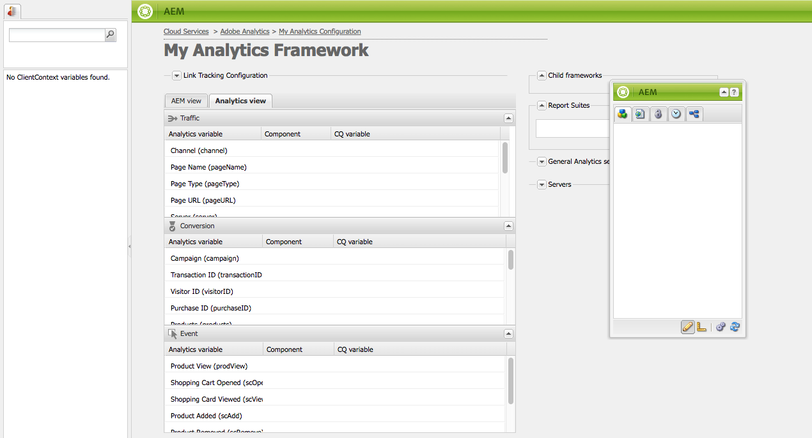

# Mapping Component Data with Adobe Analytics Properties{#mapping-component-data-with-adobe-analytics-properties}

Add components to the framework that gather the data to send to Adobe Analytics. Components that are designed to gather analytics data store the data in the appropriate **CQ variable**. When you add such a component to a framework, the framework displays the list of CQ variables so that you can each to the appropriate **Analytics variable**.

When the **AEM view** is open the Analytics variables appear in the content finder. 

You can map multiple Analytics variables with the same **CQ variable**.

The mapped data is sent to Adobe Analytics when the page loads and the following conditions are met:

* The page is associated with the framework.
* The page uses the components that are added to the framework.

Use the following procedure to map CQ component variables with Adobe Analytics report properties.

1. In the **AEM view**, drag a tracking component from sidekick onto the framework. For example, drag the **Page** component from the **General** category. 

   

   There are several default component groups: **General**, **Commerce**, **Communities**, and **Other**. Your AEM instance may be configured to display different groups and components.

1. To map Adobe Analytics variables with variables that are defined in the component, drag an **Analytics variable** from the content finder onto a field on the tracking component. For example, drag `Page Name (pageName)` to `pagedata.title`.

   

   >[!NOTE]
   >
   >The Report Suite ID (RSID) that is selected for the framework determines the Adobe Analytics variables that appear in the content finder.

1. Repeat the previous two steps for other components and variables.

   >[!NOTE]
   >
   >You can map multiple Analytics variables (for example, `props`, `eVars`, `events`) to the same CQ variable (for example, `pagedata.title`)

   >[!CAUTION]
   >
   >It is highly recommended that:
   >
   >* `eVars` and `props` are mapped to CQ variables beginning with either `pagedata.X` or `eventdata.X`
   >* whereas events should be mapped to variables starting with `eventdata.events.X`

1. To make the framework available on the publish instance of your site, open the **Page** tab of sidekick, and click **Activate Framework.**

## Mapping Product-Related Variables {#mapping-product-related-variables}

AEM uses a convention for naming product-related variables and events that are meant to be mapped to Adobe Analytics product-related properties:

| CQ Variable | Analytics Variable | Description |
|--- |--- |--- |
| `product.category` | `product.category` (conversion variable) | The product category. |
| `product.sku` | `product.sku` (conversion variable) | The product sku. |
| `product.quantity` | `product.quantity` (conversion variable) | The number of products being purchased. |
| `product.price` | `product.price` (conversion variable) | The product price. |
| `product.events.<eventName>` | The success event(s) to associate with the product in your report. | `product.events` is the prefix for events named *eventName.* |
| `product.evars.<eVarName>` | The conversion variable(s) ( `eVar`) to associate with the product. | `product.evars` is the prefix for eVar variables named *eVarName.* |

Several AEM Commerce components use these variable names.

>[!NOTE]
>
>Do not map the Adobe Analytics Products property to a CQ variable. Configuring product-related mappings as described in the table is effectively equivalent to mapping the Products variable.

### Checking reports on Adobe Analytics {#checking-reports-on-adobe-analytics}

1. Login to the Adobe Analytics website using the same credentials provided to AEM.
1. Make sure the RSID selected is the one used in the previous steps.
1. In **Reports** (on the left side of the page) select **Custom Conversion**, then **Custom Conversion 1-10** and select the variable coresponding to `eVar7`

1. Depending on the version of Adobe Analytics that you are using, you need to wait on average 45 minutes for the report to be updated with the search term used; for example, aubergine in the example

## Using the Content Finder (cf#) with Adobe Analytics frameworks {#using-the-content-finder-cf-with-adobe-analytics-frameworks}

Initially, when you open an Adobe Analytics framework the content finder contains predefined Analytics variables under:

* Traffic
* Conversion
* Events

When an RSID is selected all the variables belonging to that RSID get added to the list.  
The `cf#` is needed to map Analytics variables to the CQ variables present on the different tracking components. See Setting Up a Framework for Basic Tracking.

Depending on the view selected for the framework, the content finder will be populated by either Analytics variables (in AEM view) or CQ variables (in Analytics view).

The list can be manipulated in the following ways:

1. When in **AEM view**, the list can be filtered depending on what variable type is selected using the three filter buttons:

   * If *no button* is selected, the list shows the full list.
   * If the **Traffic** button is selected, the list will only show the variables belonging to the Traffic section.
   * If the **Conversion** button is selected, the list will only show the variables belonging to the Conversion section.
   * If the **Events** button is selected, the list will only show the variables belonging to the Events section.

   >[!NOTE]
   >
   >Only one filter button can be active at once.

   1. The list also has a search feature, which filters the elements according to the text entered in the search field.
   1. If a filter option is activated while searching for elements in the list, the results displayed will be filtered according to the active button as well.
   1. The list can be reloaded at any time using the swirly-arrows button.
   1. If multiple RSIDs are selected on the framework, all variables in the list will be displayed using all labels used within the RSIDs selected.

1. When in Adobe Analytics view, the Content Finder displays all CQ variables belonging to the tracking components dragged in CQ view.

   * For example, in case the **Download component** is the *only one dragged* in CQ view (which has two mappable variables *eventdata.downloadLink* and *eventdata.events.startDownload*), the Content Finder will look like this when switching to Adobe Analytics view:

   

   * The variables can be dragged&dropped onto any Adobe Analytics variable belonging to either one of the three variable sections (**Traffic**, **Conversion** and **Events**).

   * When dragging a new tracking component onto the framework in CQ view, the CQ variables belonging to the component get automatically added to the Content Finder(cf#) in Adobe Analytics view.

   >[!NOTE]
   >
   >Only one CQ variable can be mapped to an Adobe Analytics variable at any given time.

## Using AEM view and Analytics view {#using-aem-view-and-analytics-view}

At any given time, users can switch between two ways of viewing the Adobe Analytics mappings when on a framework page. The two views provide a better overview of the mappings within the framework, from two distinct perspectives.

### AEM View {#aem-view}

Taking the above image as an example, the **AEM view** has the following properties:

1. This is the default view when the framework opens.
1. Left side: the content finder(cf#) is populated by Adobe Analytics variables based on the RSID(s) selected.
1. Tab headers (**AEM view** and **Analytics view**): use these to switch between the two views.

1. **AEM view**:

   1. If the framework has components that are inherited from its parent, they will be listed here, along with the variables mapped to the components.

      1. Inherited components are locked.
      1. To unlock an inherited component, double-click the padlock next to the component's name
      1. To revert the inheritance, delete the unlocked component; after which it will regain its locked status.

   1. **Drag components here to include them in the analytics framework**: Components can be dragged from the Sidekick and dropped here.
   1. You can find all the components that are currently included in the analytics framework:

      1. To add a component drag one from the sidekick's Components tab
      1. To delete a component and all of its mappings, select Delete from the component's context menu then accept the deletion on the confirmation dialogue.
      1. Keep in mind that a component can only be deleted from the framework it was created in, and cannot be deleted from child frameworks in the traditional sense (they can only be overwritten).

### Analytics View {#analytics-view}

1. This view can be accessed by switching to the **Analytics view** tab on the framework. 
1. Left side: Content Finder (cf#) populated by CQ variables based on the components dragged onto the framework in CQ view.
1. Tab headers (**AEM view** and **Analytics view**): use these to switch between the two views.

1. The three tables (Traffic, Conversion, Event) list all available Adobe Analytics variables. belonging to the RSID(s) selected. The mappings shown here should be the same as in the AEM view:

   * **Traffic**:

     * Traffic variable ( `prop1`) mapped to a CQ variable ( `eventdata.downloadLink`)
 
     * When the component has a Padlock next to it, this means it is inherited from a parent framework and thus cannot be edited

   * **Conversion**:

     * Conversion variable ( `eVar1`) mapped to a CQ variable ( `pagedata.title`)
 
     * Conversion variable ( `eVar3`) mapped to a JavaScript expression added inline by double-clicking the CQ variable field and entering the code manually

   * **Event**:

     * Event variable ( `event1`) mapped to a CQ event ( `eventdata.events.pageView`)

>[!NOTE]
>
>The CQ variable column of any table can be filled inline as well, by double-clicking the field and adding text to it. These fields accept JavaScript as an input.
>
>For example, next to `prop3` you can add:
>&nbsp;&nbsp;&nbsp;&nbsp; `'`* `Adobe:'+pagedata.title+':'+pagedata.sitesection`  
>to send the *title* of a page concatenated with its *sitesection* using *:* (colon) and prefixed with *Adobe* as `prop3`
>

>[!CAUTION]
>
>Only one CQ variable can be mapped to an Adobe Analytics variable at any given time.
