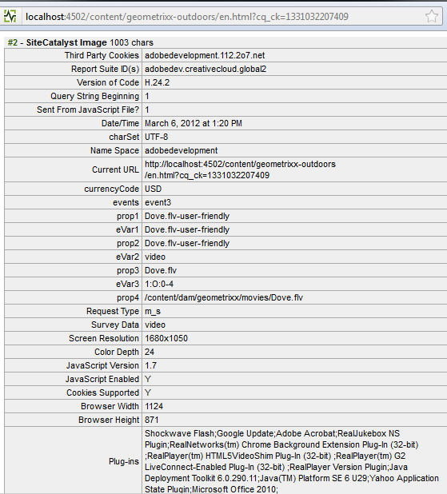
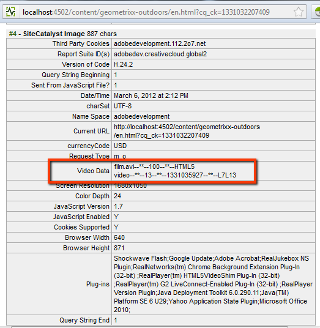

# Configuring Video Tracking for Adobe Analytics{#configuring-video-tracking-for-adobe-analytics}

There are several methods available for tracking video events, 2 of which are legacy options for older versions of Adobe Analytics. These legacy option are: Legacy Milestones and Legacy Seconds.

>[!NOTE]
>
>Before you continue, make sure that you have a **playable video** uploaded within AEM.
>
>To ensure that your videos play on the page, consult **[this tutorial](/help/sites-authoring/default-components-foundation.md#video)** for information about how to transcode video files in AEM.

Use the following procedure to set up a framework for video tracking using each method.

>[!NOTE]
>
>For new implementations, it is recommended that you **do not use** the legacy options for video tracking. Use the **Milestones** method instead.

## Common steps {#common-steps}

1. Set up a web page by dragging a **video component** from the sidekick and adding a playable **video as an asset** for the component

1. [Create an Adobe Analytics configuration and framework](/help/sites-administering/adobeanalytics.md).

    * The examples in the sections that follow use the name **my-sc-configuration** for the configuration and **videofw** for the framework.

1. On the framework page, select an RSID and set the usage to all. ([https://localhost:4502/cf#/etc/cloudservices/sitecatalyst/videoconf/videofw.html](https://localhost:4502/cf#/etc/cloudservices/sitecatalyst/videoconf/videofw.html))
1. From the General component category in Sidekick, drag the Video component onto the framework.
1. Select a tracking method:

    * [Milestones](/help/sites-administering/adobeanalytics.md)
    * [Non-legacy Milestones](/help/sites-administering/adobeanalytics.md)
    * [Legacy Milestones](/help/sites-administering/adobeanalytics.md)
    * [Legacy Seconds](/help/sites-administering/adobeanalytics.md)

1. When you select a tracking method, the list of CQ variables changes accordingly. Use the sections that follow for information about how to further configure the component and map the CQ variables with Adobe Analytics properties.

## Milestones {#milestones}

The Milestones method tracks the most information about the video, is highly customizable, and easy to configure.

To use the Milestones method, specify time-based track offsets to define the milestones. When a video playback passes a milestone, the page calls Adobe Analytics to track the event. For each milestone that you define, the component creates a CQ variable that you can map to an Adobe Analytics property. The name of these CQ variables use the following format:

```shell
eventdata.events.milestoneXX
```

The XX suffix is the track offset that defines the milestone. For example, specifying track offsets of 4, 8, 16, 20, and 28 seconds generates the following CQ variables:

* `eventdata.events.milestone4`
* `eventdata.events.milestone8`
* `eventdata.events.milestone16`
* `eventdata.events.milestone20`
* `eventdata.events.milestone28`

The following table describes the default CQ variables that are provided for the Milestones method:

<table>
 <tbody>
  <tr>
   <th>CQ variables</th>
   <th>Adobe Analytics properties</th>
  </tr>
  <tr>
   <td>eventdata.videoName </td>
   <td>Variables mapped to this will contain the <strong>user-friendly</strong> name (<strong>Title</strong>) of the video if set in the DAM; if this is not set, the video's <strong>file name</strong> will be sent instead. Only sent once, at the beginning of playing a video.</td>
  </tr>
  <tr>
   <td>eventdata.videoFileName </td>
   <td>Variables mapped to this will contain the file's name. Only sent along with eventdata.events.a.media.view </td>
  </tr>
  <tr>
   <td>eventdata.videoFilePath </td>
   <td>Variables mapped to this will contain the file's path on the server. Only sent along with eventdata.events.a.media.view </td>
  </tr>
  <tr>
   <td>eventdata.events.a.media.segmentView </td>
   <td>Sent every time a segment milestone is passed </td>
  </tr>
  <tr>
   <td>eventdata.events.a.media.timePlayed</td>
   <td>Sent every time a milestone is triggered, the number of seconds the user spent watching the given segment is also sent along with this event. for example, eventX=21<br /> </td>
  </tr>
  <tr>
   <td>eventdata.events.a.media.view </td>
   <td>Sent on initializing video view</td>
  </tr>
  <tr>
   <td>eventdata.events.a.media.complete </td>
   <td>Sent when video finished playing<br /> </td>
  </tr>
  <tr>
   <td>eventdata.events.milestoneX </td>
   <td>Sent when the given milestone is passed, X stands for the second the milestone gets triggered at<br /> </td>
  </tr>
  <tr>
   <td>eventdata.a.contentType </td>
   <td>Sent on every milestone; shows up as pev3 in the Adobe Analytics call, usually sent as "video"<br /> </td>
  </tr>
  <tr>
   <td>eventdata.a.media.name </td>
   <td>Exactly matches eventdata.videoName </td>
  </tr>
  <tr>
   <td>eventdata.a.media.segment </td>
   <td>Contains information on the segment that has been viewed for example, <code>2:O:4-8</code> </td>
  </tr>
 </tbody>
</table>

>[!NOTE]
>
>You can set a video's **user-friendly** name by opening the video for editing in the DAM, and setting the **Title** metadata field to the desired name.

1. After selecting Milestones as the tracking method, in the Track Offset box, enter a comma-separated list of tracking offsets in seconds. For example, the following value defines milestones at 4, 8, 16, 20 and 28 seconds after the start of the video:

   ```xml
   4,8,16,20,24
   ```

   The offset values must be integers that are greater than 0. The default value is `10,25,50,75`.

1. To map the CQ variables to Adobe Analytics properties, drag the Adobe Analytics properties from ContentFinder beside the CQ variable on the component.

   For information about optimizing the mappings, see the [Measuring Video in Adobe Analytics](https://experienceleague.adobe.com/docs/media-analytics/using/media-overview.html) guide.

1. [Add the framework](/help/sites-administering/adobeanalytics.md) to the page.
1. To test the setup in **Preview mode**, play the video to get Adobe Analytics calls to trigger.

The Adobe Analytics tracking data examples that follow apply to Milestone tracking using track offsets of 4,8,16,20, and 24, and the following mappings for the CQ variables:

<table>
 <tbody>
  <tr>
   <th>CQ variable</th>
   <th>Adobe Analytics property</th>
  </tr>
  <tr>
   <td>eventdata.videoName </td>
   <td>prop2</td>
  </tr>
  <tr>
   <td>eventdata.videoFileName </td>
   <td>prop3 </td>
  </tr>
  <tr>
   <td>eventdata.videoFilePath </td>
   <td>prop4</td>
  </tr>
  <tr>
   <td>eventdata.events.a.media.segmentView </td>
   <td>event1</td>
  </tr>
  <tr>
   <td>eventdata.events.a.media.timePlayed</td>
   <td>event2<br /> </td>
  </tr>
  <tr>
   <td>eventdata.events.a.media.view </td>
   <td>event3</td>
  </tr>
  <tr>
   <td>eventdata.events.a.media.complete </td>
   <td>event4<br /> </td>
  </tr>
  <tr>
   <td>eventdata.events.milestone4</td>
   <td>event10</td>
  </tr>
  <tr>
   <td>eventdata.events.milestone8</td>
   <td>event11</td>
  </tr>
  <tr>
   <td>eventdata.events.milestone16</td>
   <td>event12</td>
  </tr>
  <tr>
   <td>eventdata.events.milestone20</td>
   <td>event13</td>
  </tr>
  <tr>
   <td>eventdata.events.milestone24</td>
   <td>event14</td>
  </tr>
  <tr>
   <td>eventdata.a.contentType </td>
   <td>eVar3</td>
  </tr>
  <tr>
   <td>eventdata.a.media.name </td>
   <td>eVar1, prop1 </td>
  </tr>
  <tr>
   <td>eventdata.a.media.segment </td>
   <td>eVar2</td>
  </tr>
 </tbody>
</table>

For this example, the Video component appears as follows on the framework page:


>[!NOTE]
>
>To see the calls made to Adobe Analytics use an appropriate tool, like DigitalPulse Debugger or Fiddler.

Calls to Adobe Analytics using the example provided should look like this when viewed with DigitalPulse Debugger:



*This is the **first call** made to Adobe Analytics containing the following values:*

* *prop1 and eVar1 for eventdata.a.media.name,*
* *props2-4, along with eVar2 and eVar3 containing contentType (video) and segment (1:O:1-4)*
* *event3 which was mapped to eventdata.events.a.media.view.*


*This is the **third call** made to Adobe Analytics:*

* *prop1 and eVar1 contain a.media.name;*
* *event1 because a segment has been viewed*
* *event2 sent with time played = 4*
* *event11 sent because eventdata.events.milestone8 has been reached*
* *prop2 to 4 are not sent (since eventdata.events.a.media.view was not triggered)*

## Non-Legacy Milestones {#non-legacy-milestones}

The Non-Legacy Milestones method is similar to the Milestones method except milestones are defined using percentages of the track length. The commonalities are as follows:

* When a video playback passes a milestone, the page calls Adobe Analytics to track the event.
* The [static set of CQ variables](#cqvars) that are defined for mapping with Adobe Analytics properties.
* For each milestone that you define, the component creates a CQ variable that you can map to an Adobe Analytics property.

The name of these CQ variables use the following format:

The XX suffix is the percentage of track length that defines the milestone. For example, specifying percentages of 10, 25, 50, and 75 generates the following CQ variables:

* `eventdata.events.milestone10`
* `eventdata.events.milestone25`
* `eventdata.events.milestone50`
* `eventdata.events.milestone75`

```shell
eventdata.events.milestoneXX
```

1. After selecting Non-Legacy Milestones as the tracking method, in the Track Offset box, enter a comma-separated list of percentages of track length. For example, the following default value defines milestones at 10, 25, 50 and 75 percent of the track length:

   ```xml
   10,25,50,75
   ```

   The offset values must be integers that are greater than 0.

1. To map the CQ variables to Adobe Analytics properties, drag the Adobe Analytics properties from ContentFinder beside the CQ variable on the component.

   For information about optimizing the mappings, see the [Measuring Video in Adobe Analytics](https://experienceleague.adobe.com/docs/media-analytics/using/media-overview.html) guide.

1. [Add the framework](/help/sites-administering/adobeanalytics.md) to the page.
1. To test the setup in **Preview mode**, play the video to get Adobe Analytics calls to trigger.

## Legacy Milestones {#legacy-milestones}

This method is similar to the Milestones method with the difference that the milestones specified in the *Tracking offset* field are percentages instead of set points within the video.

>[!NOTE]
>
>The Tracking offset field only accepts a comma separated list containing whole numbers between 1 and 100.

1. Set the Track offset.

    * for example,10,50,75,100

   Also, the information sent to Adobe Analytics is less customizable; there are only 3 variables available for mapping:

<table>
 <tbody>
  <tr>
   <td>eventdata.videoName <br /> </td>
   <td>Variables mapped to this will contain the <strong>user-friendly</strong> name (<strong>Title</strong>) of the video if set in the DAM; if the Title is not set, the video's <strong>file name</strong> will be sent instead. Only sent once, at the beginning of playing a video.<br /> </td>
  </tr>
  <tr>
   <td>eventdata.videoFileName </td>
   <td>Variables mapped to this will contain the file's name. Only sent once, at the beginning of playing a video.</td>
  </tr>
  <tr>
   <td>eventdata.videoFilePath </td>
   <td>Variable mapped to this will contain the file's path on the server. Only sent once, at the beginning of playing a video.</td>
  </tr>
 </tbody>
</table>

   >[!NOTE]
   >
   >You can set a video's **user-friendly** name by opening the video for editing in the DAM, and setting the **Title** metadata field to the desired name. You also need to Save the changes made when finished.

1. Map these variables to props 1 to 3

   The **rest of the relevant information** in the call will be sent concatenated into **one** variable named **pev3**.

   **Sample calls** to Adobe Analytics using the example provided should look like this when viewed with DigitalPulse Debugger:

   

   *The **pev3** variable sent in the call contains the following information:*

    * *Name* - The name of the video file (*film.avi*)

    * *Length* - The length of the video file, in seconds (*100*)

    * *Player Name* - The video player used to play the video file (*HTML5 video*)

    * *Total Seconds Played* - The total number of seconds the video was played (*25*)

    * *Start Timestamp* - Timestamp that identifies when the video play started (*1331035567*)

    * *Play Session* - The details of the play session. This field indicates how the user interacted with the video. This might include data such as where they started playing the video, whether they used the video slider to advance the video, and where they stopped playing the video (*L10E24S58L58 - video was stopped at sec. 25 of section L10, then skipped to sec. 48*)

## Legacy seconds {#legacy-seconds}

When using the** legacy seconds** method, Adobe Analytics calls get triggered every N-th second, where N is specified in the Track offset field.

1. Set the Track offset to any number of seconds,

    * for example, 6

   >[!NOTE]
   >
   >The Tracking offset field only accepts whole numbers that are higher than 0

   The information sent to Adobe Analytics is less customizable. There are only 3 variables available for mapping:

<table>
 <tbody>
  <tr>
   <td>eventdata.videoName <br /> </td>
   <td>Variables mapped to this will contain the <strong>user-friendly</strong> name (<strong>Title</strong>) of the video if set in the DAM; if the Title is not set, the video's <strong>file name</strong> will be sent instead. Only sent once, at the beginning of playing a video.<br /> </td>
  </tr>
  <tr>
   <td>eventdata.videoFileName </td>
   <td>Variable mapped to this will contain the file's name. Only sent once, at the beginning of playing a video.</td>
  </tr>
  <tr>
   <td>eventdata.videoFilePath </td>
   <td>Variable mapped to this will contain the file's path on the server. Only sent once, at the beginning of playing a video.</td>
  </tr>
 </tbody>
</table>

   >[!NOTE]
   >
   >You can set a video's **user-friendly** name by opening the video for editing in the DAM, and setting the **Title** metadata field to the desired name. You also need to Save the changes made when finished.

1. Map these variables to prop1, prop2 and prop3

   The **rest of the relevant information** in the call will be sent concatinated into **one** variable named **pev3**.

   Calls to Adobe Analytics using the example provided should look like this when viewed with DigitalPulse Debugger:

   

   *The call is similar to the Legacy Milestones call above. See the information on pev3 provided under [Integrating with Adobe Analytics](/help/sites-administering/adobeanalytics.md).*

**References used in this tutorial:**

[0] [https://experienceleague.adobe.com/docs/media-analytics/using/media-overview.html](https://experienceleague.adobe.com/docs/media-analytics/using/media-overview.html)
