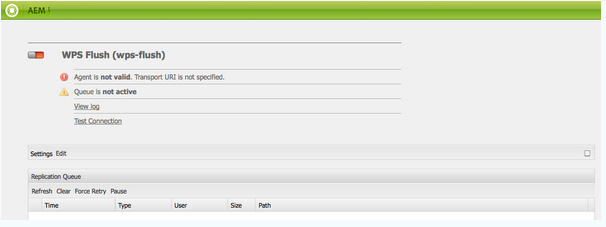
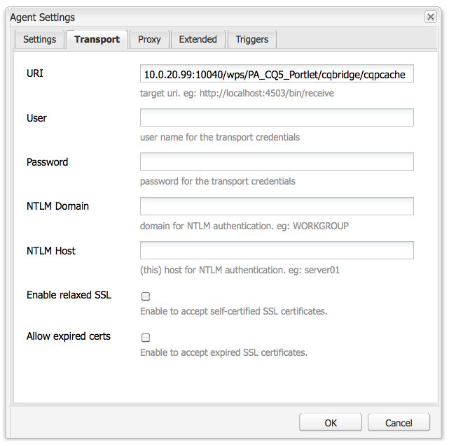
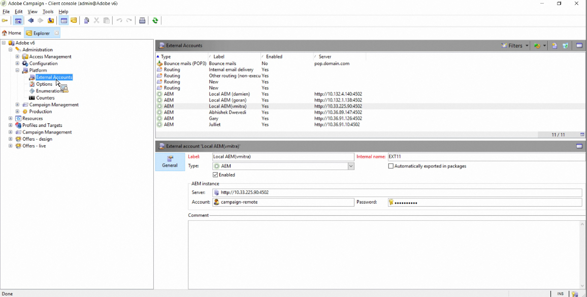
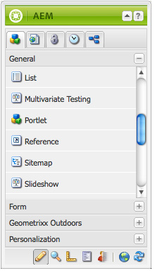
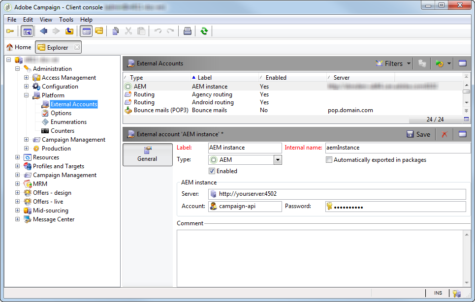

# AEM Portals and Portlets{#aem-portals-and-portlets}

This document describes the following:

* AEM Portal architecture
* Administering and configuring AEM as a portal
* Using AEM as a portal
* Installing, configuring, and displaying AEM content in a portlet (for example, a web server)

## AEM Portal Architecture {#aem-portal-architecture}

AEM portal architecture includes definitions of portals and portlets.

### What is a portal? {#what-is-a-portal}

A portal is a web application that provides personalization, single sign on, content integration from different sources, and hosts the presentation layer of information systems.

You can run JSR 286-compliant portlets in AEM. The portlet component lets you embed a portlet on the page. See [Administering the AEM Content Portlet](#administeringthecqcontentportlet).

### What is a portlet? {#what-is-a-portlet}

Portlets are web components deployed inside of a container that generate dynamic content. The portlet interface is packaged and deployed as a .war file inside of a portlet container. If you are running AEM as a portal, you need the portlet's .war file to run the portlet.

To configure AEM content to appear in a portal, see [Installing, Configuring, and Using AEM in a portlet](#installingconfiguringandusingcqinaportlet).

### AEM Portal Director {#aem-portal-director}

>[!CAUTION]
>
>The AEM Portal Director is deprecated as of AEM 6.4. See [Deprecated and Removed Features](https://helpx.adobe.com/experience-manager/6-4/release-notes/deprecated-removed-features.html).

## Administering the AEM Content Portlet {#administering-the-aem-content-portlet}

The AEM content portlet enables you to display AEM content in a portal. The portlet is available at `/crx-quickstart/opt/portal`, and can be customized in various ways. For example, you can customize the SSO/Authentication handling by deploying your own authentication service generating the required authentication information for AEM to overwrite the default behavior. The plugins use a defined API that lets you add your own functionality by building the plugin against the API. The plugin can be deployed into the running portlet. To function properly, it needs a configuration of the AEM author and publish instance together with the content path to display on startup.

Some of the configurations can be changed through portlet preferences and others through OSGi service configurations. You change these configurations using **config** files or the OSGi web console.

### Portlet Preferences {#portlet-preferences}

Porlet preferences can be configured at deployment time in the portal server or by editing the **WEB-INF/portlet.xml** file before deploying the portlet web application. The portlet.xml file appears as follows by default:

```xml
<?xml version="1.0" encoding="UTF-8"?>
<portlet-app xmlns="https://java.sun.com/xml/ns/portlet/portlet-app_1_0.xsd"
             xmlns:xsi="https://www.w3.org/2001/XMLSchema-instance"
             xsi:schemaLocation="https://java.sun.com/xml/ns/portlet/portlet-app_1_0.xsd /opt/SUNWps/dtd/portlet.xsd"
             version="1.0">
   <portlet>
      <portlet-name>RSSWeatherPortlet</portlet-name>
      <portlet-class>org.jboss.portlet.weather.WeatherPortlet</portlet-class>
      <init-param>
         <name>default_zipcode</name>
         <value>05673</value>
      </init-param>
      <init-param>
         <name>RSS_XSL</name>
         <value>/WEB-INF/Rss.xsl</value>
      </init-param>
      <init-param>
         <name>base_url</name>
         <value>https://xml.weather.yahoo.com/forecastrss?p=</value>
      </init-param>
      <expiration-cache>180</expiration-cache>
      <supports>
         <mime-type>text/html</mime-type>
         <portlet-mode>VIEW</portlet-mode>
         <portlet-mode>EDIT</portlet-mode>
      </supports>
      <portlet-info>
         <title>Weather Portlet</title>
      </portlet-info>
      <portlet-preferences>
         <preference>
            <name>expires</name>
            <value>180</value>
         </preference>
         <preference>
            <name>RssXml</name>
            <value>https://xml.weather.yahoo.com/forecastrss?p=33145</value>
            <read-only>false</read-only>
         </preference>
      </portlet-preferences>
   </portlet>
</portlet-app>

```

The portlet can be configured with the following preferences:

<table>
 <tbody>
  <tr>
   <td>startPath</td>
   <td><p>This is the start path of the portlet: it defines the content that is initially displayed.</p> <p><strong>Important</strong>: If the portlet is configured to connect to AEM author and publish instances that are running on a context path different from<strong> /</strong>, you need to enable the force <strong>CQUrlInfo</strong> in the Html Library Manager configuration of these AEM instances (for example, via Felix Webconsole) or editing will not work and the preferences dialog will not appear.</p> </td>
  </tr>
  <tr>
   <td>htmlSelector</td>
   <td>The selector that is appended to each url. By default this is <strong>portlet</strong>, so all requests to html pages use urls ending in <strong>.portlet.html.</strong> This allows the use of custom scripts within AEM for portlet rendering.</td>
  </tr>
  <tr>
   <td>addCssToPortalHeader</td>
   <td><p>By default css files included in the HTML page from AEM are included in the portlet. Disabling this option excludes the default css files.</p> <p>If this option is enabled, the CSS files are either added to the head of the html page or embedded in the html page depending on the behavior of the portal.</p> </td>
  </tr>
  <tr>
   <td>includeToolbar</td>
   <td>By default, a toolbar is rendered inside the content portlet for management functionality. By disabling this option, no toolbar is rendered.</td>
  </tr>
  <tr>
   <td>urlParameterNames</td>
   <td><p>List of alternative URL parameter names that might contain the new content URL to display for the portlet. The list is processed top to bottom, the first parameter containing a value is used. If no URL is found, the default URL parameter is used. The provided URL is used, as is, without any further modification.</p> <p>This setting is per deployed portlet - it is also to globally configure some url parameters in the OSGi configuration for the "Day Portal Director Portlet Bridge".</p> </td>
  </tr>
  <tr>
   <td>preferenceDialog</td>
   <td>Path to the preferences dialog in AEM - if left empty, the built-in preferences dialog is used. This defaults to /libs/portal/content/prefs.html.</td>
  </tr>
  <tr>
   <td>initialRedirect</td>
   <td>By default, the portlet performs a javascript redirect of the whole portal page on the first invocation. This is to support the drag and drop scenario of modern portal servers. In production this redirect is rarely needed and can therefore be turned off with this preference being set to <em>false</em>.</td>
  </tr>
 </tbody>
</table>

#### OSGi Web Console {#osgi-web-console}

Assuming the portal server runs on host localhost, port 8080 and the AEM portlet web application is mounted in the web application context *cqportlet*, the URL for the web console is `https://localhost:8080/cqportlet/cqbridge/system/console`. The default user and password is **admin**.

Open the **Configurations** tab and select **Portal Directory CQ Server Configuration**. Here you specify the base URL to the author and the publish instance. This procedure is described in [Configuring the Portlet](#configuring-the-portlet).

>[!NOTE]
>
>The OSGi web console is only meant for changing configurations during development (or testing). Make sure to block requests to the console for production systems.

### Providing Configurations {#providing-configurations}

To support automated deployments and configuration provisioning, the AEM content portlet has built-in configuration support that tries to read configurations from the classpath provided to the portlet application.

On startup, the system property **com.day.cq.portet.config** is read to detect the current environment. Usually, the value of this property is something like **dev**, **prod**, **test**, and so on. If no environment is set, no configurations are read.

If an environment is set, a config file is searched in the classpath at* ***com/day/cq/portlet/{env}.config** where **env** is replaced with the actual value for the environment. This file should list all configuration files for this environment. These files are searched relative to the location of the config file. For example, if the file contains a line `my.service.xml,` this file is read from the classpath at `com/day/cq/portlet/my.service.config.` The name of the file consists of the persistence ID of the service, followed by **.config**. In the previous example, the persistence ID is **my.service**. The format of the configuration file, is the format used by the Apache Sling OSGi installer.

This means, for each environment, a corresponding config file needs to be added. A configuration that should be applied to all environments needs to be entered in all these files - if it is just for a single environment, it is just entered in that file. This mechanism ensures full control over which configuration is read in which environment.

It is possible to use a different system property to detect the environment. Specify the system property **com.day.cq.portet.configproperty** containing the name of the system property to use instead of **com.day.cq.portet.config**.

#### Caching and Caching Invalidation {#caching-and-caching-invalidation}

The portlet, in its default configuration, caches the responses it receives from AEM WCM in a user-specific cache. The caches need to be invalidated when changes occur in the content of the publish instance. For this purpose, in AEM WCM a replication agent must be configured on the author instance. The cache can also be flushed manually. This section describes both of those procedures.

The portlet can be configured with its own cache, so that the content in the portlet displays without requiring access to AEM. The portal is available as content in /libs/portal/director. To access the content, start a AEM instance and download, using CRXDE Lite or Webdav, the file from that location.

You can either deploy this bundle at runtime or add it to the portlet web application at `WEB-INF/lib/resources/bundles` before the deployment.

After the cache is deployed, the portlet caches contents from the publish instance. The portlet cache can be invalidated with a dispatcher flush from AEM. To configure the portlet to use its own cache:

1. Configure a replication agent in author that targets the portal server.
1. Assuming that the portal server runs on host **localhost**, **port 8080 **and the AEM portlet web application is mounted in the context **cqportlet**, the url to flush the cache is `https://localhost:8080/cqportlet/cqbridge/cqpcache?Path=$(path)`. Use GET as the method.
   **Note:** Instead of using a request parameter, you can send an http header named **Path**.

#### Flushing the Cache via Replication Agent {#flushing-the-cache-via-replication-agent}

Just like the normal dispatcher invalidation, a replication agent can be configured to target the portal's AEM portlet cache. After you configure the replication agent, every regular page activation flushes the portal cache.

If you operate several portal nodes running the AEM portlet, you need to create an agent for each node as described in this procedure.

To configure a replication agent for the portal:

1. Log in to the author instance.
1. In the Websites tab, click the *Tools* tab.
1. Click **New Page...** in the replication agents **New...** menu.

   

1. In *Template*, select *Replication Agent*, and enter a name for the agent. Click *Create*.

   

1. Double-click the replication agent you created. It displays as invalid as it has not yet been configured.

   

1. Click **Edit.**
1. In the **Settings** tab, select the **Enabled** check box, select **Dispatcher Flush** as the serialization type, and enter a retry timeout (for example, 60000).

   

1. Click the **Transport** tab.
1. In the **URI** field, enter the flush URI (URL) of the portlet. The URI is in the following form:

   ```xml
   https://<wps-host>:<port>/<wps-context>/<cq5-portlet-context>/cqbridge/cqpcache
   ```

   

1. Click the **Extended** tab.

   

1. In the **HTTP Method** field, type **GET**.
1. In the **HTTP Headers** field, click **+** to add a new entry and type **Path: {path}**.
1. If necessary, click the **Proxy** tab and enter proxy information to the agent.
1. Click **OK** to save changes.
1. To test the connection, click the **Test Connection** link. A log message appears that indicates whether the replication test succeeded. For example:

   

#### Manually Flushing the Portlet Cache {#manually-flushing-the-portlet-cache}

You can manually flush the portlet cache by accessing the same URL configured for the replication agent. See [Flushing the Cache](#flushing-the-cache-via-replication-agent) for the form of the URL. In addition, the URL needs to be extended with a URL parameter Path=&lt;path&gt; to indicate what to flush.

For example:

`https://10.0.20.99:10040/wps/PA_CQ5_Portlet/cqbridge/cqpcache?Path=*` flushes the complete cache. `https://10.0.20.99:10040/wps/PA_CQ5_Portlet/cqbridge/cqpcache?Path=/content/mypage/xyz` flushes `/content/mypage/xyz` from the cache.

### Portal Security {#portal-security}

The portal is the driving authentication mechanism. You can log into AEM either with a technical user, the portal user, a group, and so on. The portlet has no access to the password for the user in the portal, so if the portlet does not know all the credentials to successfully log in a user, an SSO solution must be used. In this case, the AEM portlet forwards all required information to AEM, which in turn forwards this information to the underlying AEM repository. This behavior is pluggable and can be customized.

### Authentication on Publish {#authentication-on-publish}

This section describes the available authentication modes the portlet can use in communicating with the underlying AEM WCM instances.

By default no user information is sent to the publish instance of AEM; the content is always displayed as the anonymous user. If user specific information should be delivered from AEM or if user authentication for publish is required, this has to be turned on.

#### Accessing the Portlet's Authentication Configuration {#accessing-the-portlet-s-authentication-configuration}

Authentication configuration options that the portlet uses in AEM WCM instances are available in the Web console (OSGi configuration).

>[!NOTE]
>
>When working with AEM, there are several methods of managing the configuration settings for OSGi services (console or repository nodes).
>
>See [Configuring OSGi](/help/sites-deploying/configuring-osgi.md) for full details.

To access the portlet's authentication configuration:

1. Access the Web console at the following URL:

   `https://localhost:8080/cqportlet/cqbridge/system/console`

   For example, in its default configuration:

   `https://wps-host:10040/wps/PA_CQ5_Portlet/cqbridge/system/console`

1. Log in to the Web console. The default credentials are `admin/admin`.
1. In the console, select **Configuration**.
1. In the **Configuration** menu, select a particular service to configure. Services are provided by the portlet in the OSGi framework.

   | Service Name |Description  |
   |---|---|
   | Day Portal Director Authenticator |Configure which authentication mode is used for AEM WCM instances. Depending on the selected mode, a technical user or the name of the SSO cookie can be specified. Also, authentication for AEM WCM publish instances can be enabled. |
   | Day Portal Director File Cache |Configure the parameters of how the portlet caches responses it receives from AEM WCM instances. |
   | Day Portal Director HTTP Client Service |Configure how the portlet connects via HTTP to underlying AEM WCM instances. You can, for example, specify a proxy server. |
   | Day Portal Director Locale Handler |Configure which locales the portlet supports. Requests to AEM WCM instances are based on the user locale; for example, user language *German *would request `/content/geometrixx/de/`.... |
   | Day Portal Director Privilege Manager |Configure whether the portlet should test the Websites tab based on the currently logged in user. |
   | Day Portal Director Toolbar Renderer |Customize the rendering of the portlet's toolbar. |

1. In addition, you can configure the Web console and the logging service. For example, you can change the admin credentials for the Web console by clicking the Apache Felix OSGi Management Console link.

#### Technical User Mode {#technical-user-mode}

In default mode, all requests issued by the portlet for the AEM WCM author instance are authenticated using the same technical user, regardless of the current portal user. Technical User mode is enabled by default. You enable/disable this mode in the respective configuration screen in the OSGi management console:

The technical user specified must exist on the AEM WCM author instance and on the publish instance if **Authenticate on Publish** is enabled. Be sure to give the user access privileges sufficient for authoring work.

#### SSO {#sso}

The portlet supports SSO with AEM out of the box. The authenticator service can be configured to use SSO and transmit the current portal user with format **Basic** as a cookie named `cqpsso` to AEM. AEM should be configured to use the SSO authentication handler for path /. The cookie name needs to be configured here as well.

The `crx-quickstart/repository/repository.xml` for AEM repository needs to be configured accordingly:

```xml
<LoginModule class="com.day.crx.security.authentication.CRXLoginModule">
  ...
  <param name="trust_credentials_attribute" value="TrustedInfo"/>
  <param name="anonymous_principal" value="anonymous"/>
</LoginModule>
```

#### SSO Authentication Mode {#sso-authentication-mode}

The portlet can authenticate for AEM WCM using the Single Sign On (SSO) scheme. In this mode, the user currently logged in to the portal is forwarded to AEM WCM in the form of an SSO cookie. If SSO mode is used, all portal users with access to the AEM portlet must be known to the underlying AEM WCM instances, most commonly in the form of AEM WCM being connected to LDAP, or by having manually created the users beforehand. Also, before enabling SSO in the portlet, the underlying AEM WCM author instance (and the publish instance, if **Authenticate on Publish** is enabled) needs to be configured to accept SSO-based requests.

To configure the portlet to use SSO authentication mode, complete the following steps (described in detail in the following sections):

* Enable AEM WCM's repository to accept trusted credentials.
* Enable SSO authentication in the AEM WCM.
* Enable SSO Authentication in the AEM portlet.

#### Enabling AEM WCM's repository to accept trusted credentials {#enabling-aem-wcm-s-repository-to-accept-trusted-credentials}

Before SSO can be enabled for AEM WCM, the underlying repository needs to be configured to accept the trusted credentials provided by AEM WCM. To do this, you configure AEM's repository.xml.

1. In the file system where AEM WCM is installed, open the following file:

   `//crx-quickstart/repository/repository.xml`

1. In the XML file, find the entry for the **LoginModule** and add the trust_credentials_attribute to its configuration:

   ```xml
   <LoginModule class="com.day.crx.security.authentication.CRXLoginModule">
     ...
     <param name="trust_credentials_attribute" value="TrustedInfo"/>
     <param name="anonymous_principal" value="anonymous"/>
   </LoginModule>
   ```

1. Restart AEM WCM for the changes to take effect.

#### Enabling SSO authentication in the AEM WCM {#enabling-sso-authentication-in-the-aem-wcm}

To enable SSO in AEM WCM, access the relevant configuration entry in the AEM WCM's Apache Felix Web Management Console (OSGi):

1. Access the console through its URI at https://&lt;AEM-host&gt;:&lt;port&gt;/system/console.
1. In the Configuration menu, select SSO Authentication Handler. In this example, the SSO handler accepts SSO requests for all paths based on the cookie provided by the AEM portlet. Your configuration may vary.

   | Path  |/  |Enables SSO handler for all requests  |
   |---|---|---|
   | Cookie Names  |cqpsso  |Name of the cookie provided by the portlet as configured in the portlet's OSGi console.  |

1. Click **Save** to enable SSO. SSO is now the primary authentication scheme.

For every request AEM WCM receives, first the SSO-based authentication is attempted. Upon failure, a fallback to the usual basic authentication scheme is performed. As such, normal connections to AEM WCM without SSO remain possible.

#### Enabling SSO Authentication in a AEM Portlet {#enabling-sso-authentication-in-a-aem-portlet}

In order for the underlying AEM WCM instance to accept SSO requests, the portlet's authentication mode has to be switched from **Technical** to **SSO**.

To enable SSO authentication in a AEM portlet:

1. Access the console through its URI at https://&lt;aem-host&gt;:&lt;port&gt;/system/console.
1. In the Configuration menu, select Day Portal Director Authenticator from the list of available configurations.
1. In Mode, select SSO. Leave the other parameters with their default values.

   

1. Click Save to enable SSO for the portlet.

   For testing purposes, access the portlet with your portal's administrative user, after you create the same user in AEM WCM with administrator privileges.

After performing this procedure, requests are authenticated using SSO. A typical snippet from the HTTP communication reveals the presence of the following SSO and Portlet specific headers:

```xml
C-12-#001898 -> [GET /mynet/en/_jcr_content/par/textimage/image.img.png HTTP/1.1 ]
C-12-#001963 -> [cq5:locale: en ]
C-12-#001979 -> [cq5:used-locale: en ]
C-12-#002000 -> [cq5:locales: en,en_US ]
C-12-#002023 -> [cqp:user: wpadmin ]
C-12-#002042 -> [cqp:portal: IBM WebSphere Portal/6.1 ]
C-12-#002080 -> [cqp:windowid: 7_CGAH47L000CE302V2KFNOG0084 ]
C-12-#002124 -> [cqp:windowstate: normal ]
C-12-#002149 -> [cqp:portletmode: view ]
C-12-#002172 -> [User-Agent: Jakarta Commons-HttpClient/3.1 ]
C-12-#002216 -> [Host: 10.0.0.68:4502 ]
C-12-#002238 -> [Cookie: $Version=0; cqpsso=Basic+d3BhZG1pbg%3D%3D ]
C-12-#002289 -> [ ]
```

### Enabling PIN authentication {#enabling-pin-authentication}

If you are not using the default inline editing features of the AEM content portlet, but want the authoring and administration part of the portlet outside the portal directly in the AEM author instance, you should enable PIN authentication. You also need to change the configuration of the management buttons.

To open the website administration page or to edit a page from the portlet, the AEM content portlet uses the new pin authentication. By default, the pin authentication is disabled, therefore, the following configuration changes have to be made in AEM:

1. Enable trusted authentication in AEM by adding the trusted info in the repository.xml file:

   ```xml
   <LoginModule class="com.day.crx.security.authentication.CRXLoginModule">
     ...
     <param name="trust_credentials_attribute" value="TrustedInfo"/>
   </LoginModule>
   ```

1. In the OSGi configuration console, by default located at https://localhost:4502/system/console/configMgr, select **CQ PIN Authentication Handler** from the drop-down menu.
1. Edit the **URL Root Path** parameter to just contain the single value **/**.

### Privileges {#privileges}

Some functions of the portlet are protected by privileges. The current user needs to have this privilege to be able to access this function. There are the following privileges pre-defined:

* "toolbar" : This is the general privilege to see/use the toolbar in the portlet.
* "prefs" : If the user has this privilege, the user is allowed to see/change the preferences of the portlet.
* "cq-author:edit" : With this privilege, the user is allowed to invoke the edit view of the content.
* "cq-author:preview" : With this privilege, the user is allowed to see the preview.
* "cq-author:siteadmin" : With this privlege, the user is allowed to open the siteadmin within AEM.

The best approach to manage the privileges is to use portal roles and assign roles to these privileges. This can be done through an OSGi configuration. The "Day Portal Director Privilege Manager" can be configured with a set of roles for each privilege. If the user has one of the roles, the user has the corresponding privilege.

In addition it is possible to define this role based access on a per portlet instance base. The preferences dialog of the portlet contains an input field for each of the above privileges. For each privilege a comma-separated list of portlet roles can be configured. If a value is configured, this overrides the global configuration from the "Day Portal Director Privilege Manager" service and it might be required to add the same roles from this global setting as the roles are not merged! If no value is specified, the global configuration is used.

### Customizing the AEM portlet application {#customizing-the-aem-portlet-application}

The provided AEM portlet application starts an OSGi container inside the web application just as AEM does. This architecture lets you use all the benefits of OSGi:

* Easy to update and extend
* Provides hot updates of the portlet without any interaction of the portal server
* Easy to customize the portlet

### Toolbar Buttons {#toolbar-buttons}

The toolbar and its buttons are configurable and can be customized. You can add your own buttons to the toolbar or define which buttons are displayed in which mode. Each button is an OSGi service configurable through an OSGi configuration.

The OSGi web console lists all button configurations on the **Configuration** tab. For each button, you can define in which mode this button is displayed. This lets you disable a button by removing all modes for example.

By default, the AEM content portlet uses the inline editing functionality. However, if you prefer to switch into the AEM author instance for editing, enable the **SiteAdmin Button** and the **ContentFinder Button**, but disable the **Edit Button**. In this case, make sure to correctly configure the PIN authentication in AEM.

The portlet's toolbar layout can be customized by installing a bundle through the portlet's Felix Web Console, which contains custom CSS/HTML at a predefined location.

#### Bundle Structure {#bundle-structure}

The following is an example bundle structure:

```xml
$ jar tvf target/toolbarlayout-0.0.1-SNAPSHOT.jar | awk '{print $8}'
META-INF/
META-INF/MANIFEST.MF
/com/day/cq/portlet/toolbar/layout/
/com/day/cq/portlet/toolbar/layout/author.gif
/com/day/cq/portlet/toolbar/layout/back.gif
/com/day/cq/portlet/toolbar/layout/button.html
/com/day/cq/portlet/toolbar/layout/edit.gif
/com/day/cq/portlet/toolbar/layout/manage.html
/com/day/cq/portlet/toolbar/layout/publish.html
/com/day/cq/portlet/toolbar/layout/refresh.gif
/com/day/cq/portlet/toolbar/layout/siteadmin.gif
/com/day/cq/portlet/toolbar/layout/toolbar.css
```

The META-INF folder contains the MANIFEST.MF file required by OSGi to identify it as a bundle. It appears as follows:

```xml
Manifest-Version: 1.0
Built-By: djaeggi
Created-By: Apache Maven Bundle Plugin
Import-Package: com.day.cq.portlet.toolbar.layout
Bnd-LastModified: 1234178347159
Export-Package: com.day.cq.portlet.toolbar.layout
Bundle-Version: 0.0.1.SNAPSHOT
Bundle-Name: Company CQ5 Portal Director Portlet Toolbar Layout
Bundle-Description: This bundle provides a custom layout for the CQ5 P
 ortal Director Portlet Toolbar.
Build-Jdk: 1.5.0_16
Bundle-ManifestVersion: 2
Bundle-SymbolicName: com.day.cq.portlet.company.toolbarlayout
Tool: Bnd-0.0.255
```

The fact that the HTML/CSS/images are within the /com/day/cq/portlet/toolbar/layout folder is mandated by the portlet and cannot be changed. Along the same lines, the Import-Package and Export-Package headers in MANIFEST.MF must be called /com/day/cq/portlet/toolbar/layout as well. The Bundle-SymbolicName must be a unique, fully qualified package name.

You can build it using a tool such as maven or manually create such a jar file with the relevant header set as shown in this section.

#### Portlet Toolbar Views {#portlet-toolbar-views}

The portlet's toolbar basically has two view states. Each view and associated buttons can be customized with a respective HTML file.

#### Publish View {#publish-view}

The publish view only has one button that switches the toolbar to the Manage view. The publish view is represented by the publish.html file in [previous bundle](/help/sites-deploying/configuring-osgi.md#bundles). In the HTML, you can use the following placeholders, which are replaced by the portlet with the respective contents when rendered:

#### Publish View Placeholders {#publish-view-placeholders}

| Placeholder String |Description  |
|---|---|
| {buttonManage} |Placeholder is replaced by the **Manage** button, which switches the portlet state into the management state. |

#### Manage View {#manage-view}

The manage view has four buttons: Edit, Websites tab, Refresh and Back. The manage view is represented by the manage.html file in the [previous bundle](/help/sites-deploying/configuring-osgi.md#bundles). In the HTML, you can use the following placeholders, which are replaced by the portlet with the respective contents when rendered:

#### Manage View Placeholders {#manage-view-placeholders}

| Placeholder String  |Description  |
|---|---|
| {buttonEdit} |Placeholder is replaced by the **Edit** button, which opens a new window with the current page in AEM's edit mode. |
| {buttonWebsites tab} |Placeholder, replaced by a button which opens the Websites tab of AEM WCM. |
| {buttonRefresh} |Refreshes the current view. |
| {buttonBack} |Switches the portlet back into the publish view. |

#### Buttons {#buttons}

Buttons, on whichever view they appear, use the same common HTML, defined in button.html.

In the HTML, you can use the following placeholders, which are replaced by the portlet with the respective contents when rendered:

#### Manage and Publish View Buttons {#manage-and-publish-view-buttons}

| Placeholder String  |Description  |
|---|---|
| {name} |Name of the button, for example,**author, back, refresh**, and so on. |
| {id} |CSS id of the button. |
| {url} |URL for the button's target. |
| {text} |Label of the button. |
| {onclick} |JavaScript **onclick** function (contains {url}). |

Example of a button.html file:

```xml
<div class="cqp_button">

 <a href="#" onclick="{onclick}">

 

 </a>
</div>
```

#### Installing a Custom Layout {#installing-a-custom-layout}

To install a custom layout, access the portlet's OSGI Web console **Bundles **section and upload the bundle.

#### Packages {#packages}

If you need to upload, or create, packages for your installation, then see Package Manager in the AEM documentation for detailed instructions.

### Link Handling {#link-handling}

All links are rewritten to work within the portal context. By default links with render parameters are used. The Portal Director HTML Rewriter can be configured to use action links instead.

You can also define additional request parameters to be queried for the content path to be displayed. This is useful, for example, if there is a link from the outside to specific content.

In addition, the Portal Director HTML Rewriter can be configured with a list of regular expressions defined excludes for link rewriting. For example, if you have relative links to external systems, you should add them to this exclude list.

### Localization {#localization}

The AEM content portlet has a built-in localization feature, which ensures that the content from AEM is in the correct language.

This is done in two steps:

1. The Portal Directory Locale Detector detects the locale of the portal user by getting the locale setting from the portal. This service must be configured with the list of available languages in AEM.
1. The Portal Director Locale Handler handles the localization of the current request. It takes the path of the requested content, for example, `/content/geometrixx/en/company.html`and according to the configuration, it rewrites the **en** with the actual locale of the user.

The Portal Director Locale Handler can be configured with the paths to check for locale information - usually this includes everything under `/content` and with the position of the locale information in the path. By default, the locale handler follows the recommondation of structuring multi-language sites within AEM.

If your site has no strict rule for handling the locale information within the path, it is possible to replace the locale handler with your own implementation.

### Optional OSGi Services {#optional-osgi-services}

Optional OSGi services can be implemented to customize various parts of the portlet. Each service corresponds to a Java interface. This interface can be implemented and deployed through a bundle into the portlet.

<table>
 <tbody>
  <tr>
   <td>RequestTracker</td>
   <td>The request tracker gets notified whenever content is displayed by the portlet. This lets you keep track of the invocations of the portlet.</td>
  </tr>
  <tr>
   <td>InvocationContextListener</td>
   <td>Listener that is invoked at the beginning and end of each request to the portlet. The listener can be used to change or add information for the current request.<br /> </td>
  </tr>
  <tr>
   <td>ErrorHandler</td>
   <td>Custom error handler for errors during the render phase.</td>
  </tr>
  <tr>
   <td>HttpProcessor</td>
   <td>This service can be used to add information to each http invocation to AEM.</td>
  </tr>
  <tr>
   <td>PortletAction</td>
   <td>Add an own action to the portlet - this action can be invoked through a portlet action link.</td>
  </tr>
  <tr>
   <td>PortletDecoratorService</td>
   <td>This service can be used to decorate the contents of the portlet.</td>
  </tr>
  <tr>
   <td>ResourceProvider</td>
   <td>Add your own resource provider to deliver some resource through a portlet resource link to the client.</td>
  </tr>
  <tr>
   <td>TextMapper</td>
   <td>Lets you post process HTML, CSS and JavaScript files.</td>
  </tr>
  <tr>
   <td>ToolbarButton</td>
   <td>Add your own button to the toolbar.</td>
  </tr>
  <tr>
   <td>UrlMapper</td>
   <td>Add a service to apply a custom url mapping or rewriting.</td>
  </tr>
  <tr>
   <td>UserInfoProvider</td>
   <td>Add your own information about the user. This service can be used to get information from the portal to the portlet.</td>
  </tr>
 </tbody>
</table>

#### Replacing Default Services {#replacing-default-services}

The following services have a default implementation in the content portlet (with a corresponding Java interface). To customize, a bundle containing the new service implementation needs to be deployed into the portlet application.

When implementing such a service, make sure to set the **service.ranking** property of the service to a positive value. The default implementation uses the ranking** 0** and the portlet uses the service with the highest ranking.

| **Name** |**Description** |**Default Behavior** |
|---|---|---|
| Authenticator |Provides the authentication information to AEM |Uses a configurable technical user for both author and publish. Or SSO can be used. |
| HTMLRewriter |Rewrites links and mages |Rewrites AEM links to portal links, can be extended by a UrlMapper and a TextMapper |
| HttpClientService |Handles all http connections |Standard implementation |
| LocaleHandler |Handles the locale info |Rewrites a link to the content with respect to the locale. |
| LocaleDetector |Detects the locale of the user. |Uses the locale provided by the portal. |
| PrivilegeManager |Checks user rights |Checks access to author instance if user is allowed to edit contents |
| ToolbarRenderer |Renders the toolbar |Adds a toolbar functionality |

### Portlet Events {#portlet-events}

The portlet API (JSR-286) specifies portlet events. The AEM content portlet has an integrated bridge, distributing portlet events for the AEM portlet as OSGi events - this makes handling of portlet events pluggable.

If you want to handle specific events, declare these as receiving events in the deployment descriptor (or configure it through your portal server) and implement an OSGi service declaring the EventHandler interface (see OSGi EventAdmin specification).

Whenever a portlet event occurs, a specific OSGi event is sent invoking your handler. The handler gets all context information and can update the status of the portlet accordingly or sent new events. Basically, inside the handle method all functionality of the portlet event phase can be used.

## Using AEM as a Portal {#using-aem-as-a-portal}

Use the Portlet component to add portlet windows to AEM pages. Shared libraries that you install to the application server enable the Portlet component to detect deployed portlet applications.

To use AEM as a portal, perform the following tasks:

1. Install the Portlet component and shared libraries.
1. Add the Portlet component to Sidekick.
1. Configure and deploy the web application that contains the portlets that you want to appear in the Portal component.
1. Add the Portlet component to a page and select the portlet to display.

>[!NOTE]
>
>You can use the portlet component only when AEM is deployed as a web application. ([See Installing AEM With an Application Server](/help/sites-deploying/application-server-install.md).)

### Installing the portlet component {#installing-the-portlet-component}

The AEM Quickstart JAR file contains the portlet component files. To obtain the files (cq-portlet-components.zip), you can either execute the Quickstart, or extract the contents.

1. Execute or extract the contents of the Quickstart JAR file, and locate the cq-portlet-components.zip file accordingly:

    * Execute Quickstart: crx-quickstart/opt/portal
    * Extract Quickstart contents: static/opt/portal

1. Open Package Manager of the CQ5 author instance that is deployed to the application server. (https://*appserverhost*:*port*/cq5author/crx/packmgr)

1. Use Package Manager to [Upload and install](/help/sites-administering/package-manager.md#uploading-packages-from-your-file-system) the cq-portlets-components.zip package.

   The package installs the cq-portlet-director-sharedlibs-x.x.x.jar in the /libs/portal/director folder in the repository.

1. Copy cq-portlet-director-sharedlibs-x.x.x.jar to your hard drive. Use any means to obtain the file, for example, FileVault or a WebDAV client.
1. Move the cq-portlet-director-sharedlibs.x.x.x.jar file to the shared library folder of your application server so that the classes are available to deployed portlet applications.

### Adding the Portlet component to Sidekick {#adding-the-portlet-component-to-sidekick}

Add the portlet component to the paragraph system so that it is available to authors.

1. In Sidekick, click the ruler icon to enter Design mode.
1. Beside the `Design of par` heading above the first paragraph, click **Edit**.

1. In the **General** component category, select the check box next to the Portlet component and click OK.



### Configuring and deploying your portlet applications {#configuring-and-deploying-your-portlet-applications}

Deploy the portlets to the application server web container so that they are available to the Portal component. Before you deploy the portlet application, you need to configure the application so that it loads the AEM portal container servlet. This configuration enables the Portlet component to access the portlets.

1. Extract the contents of the portlet application WAR file.

   **Tip:** The jar xf *nameofapp*.war command extracts the files.

1. Open the web.xml file in a text editor.
1. Add the following servlet configuration inside the web-app element:

   ```xml
   <servlet>
           <servlet-name>slingportal</servlet-name>
           <servlet-class>org.apache.sling.portal.container.api.ContainerServlet</servlet-class>
           <load-on-startup>1</load-on-startup>
   </servlet>
   <servlet-mapping>
           <servlet-name>slingportal</servlet-name>
           <url-pattern>/SlingPortletInvoker</url-pattern>
   </servlet-mapping>
   ```

1. Save the web.xml file and repackage the WAR file.

   **Tip:** The `jar cvf nameofapp.war *` command adds contents of the current directory to the nameofapp.war file.

1. Deploy the portlet application to the application server. For information, see the documentation for your application server.

### Adding portlets to your AEM page {#adding-portlets-to-your-aem-page}

Use the Portal component to add a portlet window to your web page. Use the component properties to specify the portlet to display.

1. On the web page, drag the **Portlet** component from the General group in Sidekick to the page.

   >[!NOTE]
   >
   >After you drag the component to the page, reload the page to ensure that it works properly.

1. Double-click the component to open the Portlet properties.
1. In the **Portlet Entity** drop-down menu, select the portlet from the list.
1. Select or clear the **Hide Title Bar **check box depending on whether you want to see the portlet's title bar.
1. In the **Portlet Window** field, enter a unique Portlet Window ID, if desired.

   >[!NOTE]
   >
   >If you plan to use the same portlet more than once on the same page, give each portlet a different window ID.

1. Click **OK**. The portlet displays on your AEM page.

   

## Installing, Configuring, and Using AEM in a Portlet {#installing-configuring-and-using-aem-in-a-portlet}

To access content provided by AEM WCM, the portal server needs to be fitted with the AEM Portal Director Portlet. You do this by installing, configuring, and adding the portlet to the portal page by using the steps provided in this section.

By default, the portlet connects to the publish instance at localhost:4503 and to the author instance at localhost:4502. These values can be changed during deployment of the portlet. The portal director is available as content in the repository under /libs/portal/directory. Download the application war file before using it.

### Downloading the war file {#downloading-the-war-file}

1. Using either Webdav or CRXDE Lite, navigate to /libs/portal/director.

1. Download *cq-portlet-webapp.war*.

>[!NOTE]
>
>These procedures use the Websphere portal as an example although they are as generic as possible; procedures vary for other web portals. Although the steps are essentially identical for all web portals, you need to repurpose the steps for your particular web portal.

#### Installing the portlet {#installing-the-portlet}

To install the portlet:

1. Log in to the portal with administrator privileges.
1. Navigate to the Portlet Management part of your web portal.
1. Click Install and browse to the AEM portlet application (cq-portlet-webapp.war) you downloaded and enter other important information about the portlet.

   For other essential portlet information, you can either accept the defaults or change the values. If you accept the default values, the portlet is available at https://&lt;wps-host&gt;:&lt;port&gt;/wps/PA_CQ5_Portlet. The OSGi administration console provided by the portlet is available at https://&lt;wps-host&gt;:&lt;port&gt;/wps/ PA_CQ5_Portlet/cqbridge/system/console (default username/password is admin/admin).

1. Ensure that the portlet application automatically starts by selecting that option or check box and save your changes. You see a message that your installation was successful.

#### Configuring the Portlet {#configuring-the-portlet}

After you install the portlet, you need to configure it so that it knows the URLs of the underlying AEM instances (author and publish). You can also configure other options.

To configure the portlet:

1. In the Portal administration window of the app server, navigate to portlet management, where all portlets are listed and select the AEM Portal Director portlet.
1. Configure the portlet, as necessary. For example, you may need to change the URL for the author and publish instances and the URL for the start path. Default configurations are described in [Portlet Preferences](/help/sites-administering/aem-as-portal.md#portlet-preferences).

   >[!NOTE]
   >
   >If the portlet is configured to connect to AEM author and publish instances that are running on a context path different from **/**, you need to enable the force **CQUrlInfo** in the Html Library Manager configuration of these AEM instances (for example, via Felix Webconsole) or editing will not work and the preferences dialog will not appear.

1. Save the configuration changes in the app server.

1. Navigate to the OSGI admin console for the portlet. The default location is `https://<wps-host>:<port>/wps/PA_CQ5_Portlet/cqbridge/system/console/configMgr`. The default username/password is **admin/admin**.

1. Select the **Day Portal Director CQ Server Configuration** configuration and edit the following values:

    * **Author Base URL**: The base URL for the AEM author instance.
    * **Publish Base URL**: The base URL for the AEM publish instance.
    * **Author Is Used As Publish**: Is the author instance used as a publish
      instance (for development)?

   

1. Click **Save**. You can now add the portlet to portal pages and use the portal.

### Content URLs {#content-urls}

When content is requested from AEM, the portlet uses the current display mode (publish or author) and the current path to assemble a complete URL. With the default values, the first url is `https://localhost:4503/content/geometrixx/en.portlet.html`. The value of the `htmlSelector` is automatically added to the URL before the extension.

If the portlet switches to the help mode and the `appendHelpViewModeAsSelector` is selected, then the `help` selector is appended as well, for example, `https://localhost:4503/content/geometrixx/en.portlet.html.help`. If the portlet window is maximized and the `appendMaxWindowStateAsSelector` is selected, then the selector is appended as well, for example, `https://localhost:4503/content/geometrixx/en.portlet.max.help`.

The selectors can be evaluated in AEM and a different template can be used for different selectors.

### Using a Content Url Map in AEM {#using-a-content-url-map-in-aem}

Usually the start path points directly to the content in AEM. However if you want to maintain start paths in AEM rather than in the portlet preferences, you can point the start path to a content map in AEM, like `/var/portlets`. In this case, a script running in AEM can use the submitted information from the portlet to decide which url is the start URL. It should issue a redirect to the correct URL.

#### Adding the Portlet to the Portal Page {#adding-the-portlet-to-the-portal-page}

To add the portlet to the portal page:

1. Be sure you are in the administration window of your app server and navigate to the location where you manage pages. (for example, in WebSphere 6.1, click **Manage Pages**).
1. Select the name of the portlet and then select an existing page or create a page.
1. Edit the page layout.
1. Select the portlet and add it to a container.
1. Save your changes.

#### Using the Portlet {#using-the-portlet}

To access the page you added to the portlet:

1. In the portlet's personalization menu, configure the portlet as you configured it in the portal.
1. Open the configuration (The portlet displays the publish start URL configured in the portlet's configuration) and make edits as necessary, then save them.
