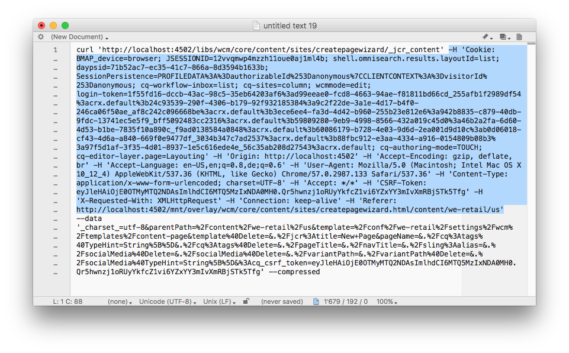

# Best Practices for Email Templates {#best-practices-for-email-templates}

>[!CAUTION]
>
>This article applies to the deprecated Foundation Components based AEM email components.
>
>Users are encouraged to use the modern [Core Components Email Components.](https://experienceleague.adobe.com/docs/experience-manager-core-components/using/email/introduction.html)

This document describes some of the best practices around email design resulting in a well-developed email campaign template.

The demo campaign available in AEM follows all of these best practices. How the best practices are implemented in the demo campaign is described for each best practice.

Use these best practices when creating your own newsletter.

>[!NOTE]
>
>All campaign content should be created under a `master` page of type `cq/personalization/components/ambitpage`.
>
>For example if your planned campaign structure is something like
>
>`/content/campaigns/teasers/en/campaign-promotion-global`
>
>Make sure it resides under a `master` page
>
>`/content/campaigns/teasers/master/en/campaign-promotion-global`

>[!NOTE]
>
>When creating a mail template for Adobe Campaign, you must include the property **acMapping** with the value **mapRecipient** in the **jcr:content** node of the template. If you do not, you cannot select the Adobe Campaign template in **Page Properties** of Experience Manager (field is disabled).

## Template/page component {#template-page-component}

***/libs/mcm/campaign/components/campaign_newsletterpage***

<table>
 <tbody>
  <tr>
   <td><strong>Best practice</strong></td>
   <td><strong>Implementation</strong></td>
  </tr>
  <tr>
   <td>
Specify document type so tht you ensure consistent rendering.
 
Add DOCTYPE at the beginning (HTML or XHTML)
 </td>
   <td>
Is configurable by design changing the <i>cq:doctype</i> property in<i>"/etc/designs/default/jcr:content/campaign_newsletterpage"</i>
 
The default is "XHTML":
 
&lt;!DOCTYPE html PUBLIC "-//W3C//DTD XHTML 1.0 Transitional/EN" "https://www.w3.org/TR/xhtml1/DTD/xhtml1-transitional.dtd"&gt;
 
Can be changed to "HTML_5":
 
&lt;!DOCTYPE HTML&gt;
 </td>
  </tr>
  <tr>
   <td>
Specify character definition so that you ensure the correct rendering of special characters.
 
Add CHARSET declaration (for example, iso-8859-15, UTF-8) to &lt;head&gt;
 </td>
   <td>
Is set to UTF-8.
 
&lt;meta http-equiv="content-type" content="text/html; charset=UTF-8"&gt;
 </td>
  </tr>
  <tr>
   <td>
Code all structure using the &lt;table&gt;element. For more complicated layouts, you should nest tables to build complex structures.
 
Email should look good even without css.
 </td>
   <td>
Tables are used throughout the whole template for structuring content. Currently using a maximum of four nested tables (1 base table + max. 3 nesting levels)
 
&lt;div&gt; tags are only used in author mode to ensure proper component editing.
 </td>
  </tr>
  <tr>
   <td>Use element attributes (such as cellpadding, valign, and width) to set table dimensions. This method forces a box-model structure.</td>
   <td>
All tables contain necessary attributes like <i>border</i>, <i>cellpadding</i>, <i>cellspacing</i>, and <i>width</i>.
 
To harmonize element positioning inside tables, all table cells have the attribute <i>valign="top"</i> being set.
 </td>
  </tr>
  <tr>
   <td>
Account for mobile-friendliness, if possible. Use media queries to increase text sizes on small screens, provide thumb-sized hit areas for links.
 
Make an email responsive if the design allows for it.
 </td>
   <td>As far as CSS styles are being used to illustrate demo design, media queries are being used to offer a mobile friendly version.</td>
  </tr>
  <tr>
   <td>Inline CSS is better than putting all the CSS at the beginning.</td>
   <td>
To better demonstrate the underlying HTML structure and ease the possibility to customize the newsletter structure, only some CSS definitions have been inlined.
 
Base styles and template variations have been extracted to a style block in the &lt;head&gt; of the page. On final submission of the newsletter, these CSS definitions are inlined into the HTML. An automatic inlining mechanism is planned, but currently not available.
 </td>
  </tr>
  <tr>
   <td>Keep your CSS simple. Avoid compound style declarations, shorthand code, CSS layout properties, complex selectors, and pseudo-elements.</td>
   <td>As far as CSS styles are being used to illustrate demo design, the CSS recommendations are being followed.</td>
  </tr>
  <tr>
   <td>Emails should be 600-800 pixels maximum width. This sizing makes them behave better within the preview-pane size provided by many clients.</td>
   <td>The <i>width</i> of content table is limited to 600 pixels in demo design.</td>
  </tr>
 </tbody>
</table>

### Images {#images}

/libs/mcm/campaign/components/image

| **Best Practice** |**Implementation** |
|---|---|
| Add *alt* attributes to images |The *alt* attribute has been defined as mandatory for the image component. |
| Use *jpg* instead of *png* format for images |Images are always served as JPG by the image component. |
| Use `` element instead of background images in a table. |No background image data is used in the templates. |
| Add attribute style="display block" on pictures. Doing so lets them display well on Gmail. |All images contain per default the *style="display block"* attribute. |

### Text and Links {#text-and-links}

/libs/mcm/campaign/components/heading, /libs/mcm/campaign/components/textimage

<table>
 <tbody>
  <tr>
   <td><strong>Best Practice</strong></td>
   <td><strong>Implementation</strong></td>
  </tr>
  <tr>
   <td>Use html &lt;font&gt; instead of style in CSS (font-family)</td>
   <td>The RichTextEditor (for example, in textimage component) now supports choosing and applying font-families and font-sizes to selected texts. They are rendered as &lt;font&gt; tags.</td>
  </tr>
  <tr>
   <td>Use basic, cross-platform fonts such as <i>Arial&reg;, Verdana, Georgia</i>, and <i>Times New Roman&reg;</i>.</td>
   <td>
Depends on newsletter design.
 
For the demo design, the font "Helvetica&reg;" is used, but it falls back to a generic sans-serif font, if not present.
 </td>
  </tr>
 </tbody>
</table>

### Generic {#generic}

| **Best Practice** |**Implementation** |
|---|---|
| Use W3C validator to correct the HTML code. Make sure that all open tags are properly closed. |Code was validated. For XHTML transitional Doctype only, the missing xmlns attribute for the `<html>` element is missing. |
| Avoid using JavaScript or Flash - those technologies are often unsupported by email clients. | JavaScript or Flash is not used in the newsletter template. |
| Add a plain text version for multipart sending. | A new widget was built into the page properties to easily extract a plaintext version from the page content. You can use it as a starting point for the final plaintext version. |

## Campaign newsletter templates and examples {#campaign-newsletter-templates-and-examples}

AEM comes with several templates and components out of the box for you to create campaign newsletters. You can use these templates and components to create your custom newsletters.

### Templates {#templates}

To offer a solid base and to broaden the variety of content flow possibilities, there are three slightly different template types available out-of-the-box. You can easily use these three types to build a custom newsletter.

All have a **header**, a **footer**, and a **body** section. Below the body section, each template differs in **column design** (one, two, or three columns).

### Components {#components}

There are currently [seven components available for use inside campaign templates](/help/sites-authoring/adobe-campaign-components.md). These components are all based on the Adobe markup language **HTL**.

| **Component name** |**Component path** |
|---|---|
| Heading |/libs/mcm/campaign/components/heading |
| Image |/libs/mcm/campaign/components/image |
| Text&Personalization |/libs/mcm/campaign/components/personalization |
| Textimage |/libs/mcm/campaign/components/textimage |
| Link |/libs/mcm/campaign/components/reference |
| Dynamic Media Classic (formerly Scene7) Image Template |/libs/mcm/campaign/s7image |
| Targeted Reference |/libs/mcm/campaign/components/reference |

>[!NOTE]
>
>These components are optimized for mail content; that is, they adhere to the best practices outlined in this document. Using other out-of-the-box components usually violates these rules.

These components are described in detail in [Adobe Campaign components](/help/sites-authoring/adobe-campaign-components.md).
