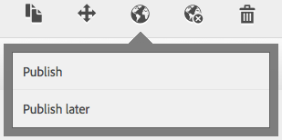
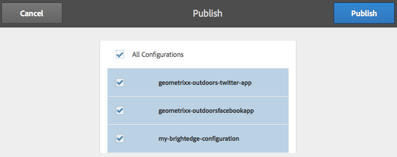

# Integrating with BrightEdge Content Optimizer{#integrating-with-brightedge-content-optimizer}

Create a BrightEdge cloud configuration so that AEM can connect using the credentials of your BrightEdge account. You can create multiple configurations if you use multiple accounts.

When you create the configuration, you specify a title. The title should be descriptive so that people can correlate the configuration with the BrightEdge account. When a page author or administrator associaties a web page with the BrightEdge account, this title is presented in a drop-down list.

1. On the rail, click Tools &gt; Operations &gt; Cloud &gt; Cloud Services.
1. Click the link that appears in the BrightEdge Content Optimizer section. Whether a BrightEdge configuration has been created determines the link text:

    * Configure Now: This link appears when no coniguration has been created.
    * Show Configurations: This link appears when one or more configurations have been created.

   

1. If you clicked Show Configurations, click the + link beside Available Configurations.
1. Type a title for the configuration. Optionally, type a name for the node that is used to store the configuration in the repository. Click Create.
1. In the BrightEdge Content Optimizer Configuration dialog, type the user name and password of the BrightEdge account, and then click OK.

## Editing a BrightEdge Configuration {#editing-a-brightedge-configuration}

Modify the user name and password of a BrightEdge configuration when required. The modifications affect all pages that use the configuration.

1. On the rail, click Tools &gt; Operations &gt; Cloud &gt; Cloud Services.
1. In the BrightEdge Content Optimizer section, click Show Configurations.

   

1. Click the name of the configuration that you want to edit.
1. Click Edit, modify the property values, and then click OK.

## Associating Pages with a BrightEdge Configuration {#associating-pages-with-a-brightedge-configuration}

Associate pages with a BrightEdge configuration to send page data to the BrightEdge service for analysis. When you associate a page with a configuration, the child pages inherit the association. Typically, you associate the home page of your site so that data from all pages is sent to BrightEdge.

1. Open the classic Websites console. ([http://localhost:4502/siteadmin#/content](http://localhost:4502/siteadmin#/content))
1. In the Websites tree, select the folder or page that contains the page that you want to associate with the BrightEdge configuration.
1. In the list of pages, right-click the page to configure and click Properties.
1. On the Cloud Services tab, click the Add Service button, and in the Cloud Services dialog select BrightEdge Content Optimizer and then click OK.
1. In the BrightEdge Content Optimizer list, select the BrightEdge configuration to associate with the page and then click OK.

   

## Activating a BrightEdge Configuration {#activating-a-brightedge-configuration}

Activate a BrightEdge configuration to replicate it on the publish instance and to enable published pages to interact with the BrightEdge service.

1. On the rail, click Sites, and then browse to and select the page that you associated with the BrightEdge configuration.
1. Click the Publish icon, and then click Publish.

   

1. In the list of configurations that appear, ensure that your BrightEdge configuration is selected and then click Publish.

   
