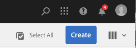
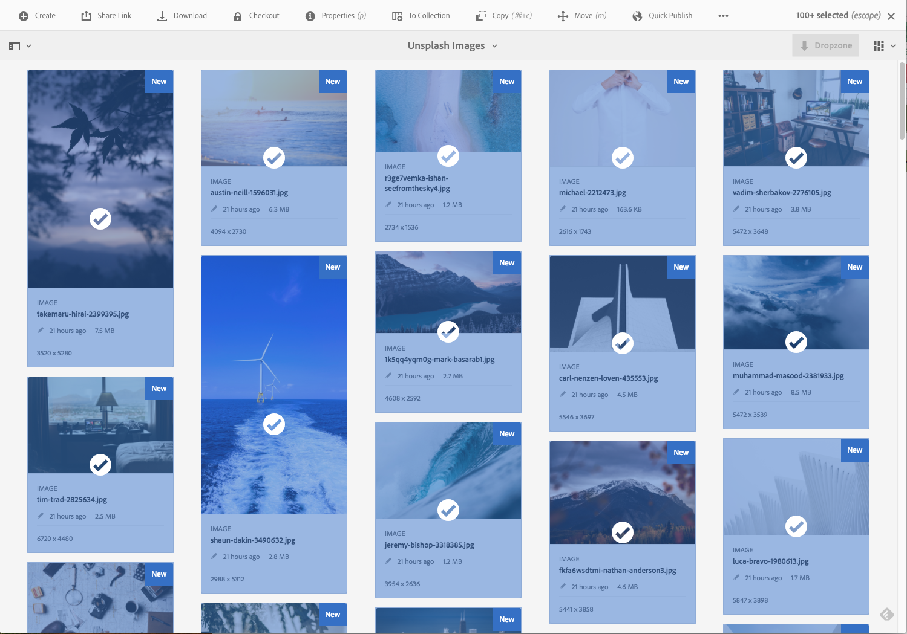
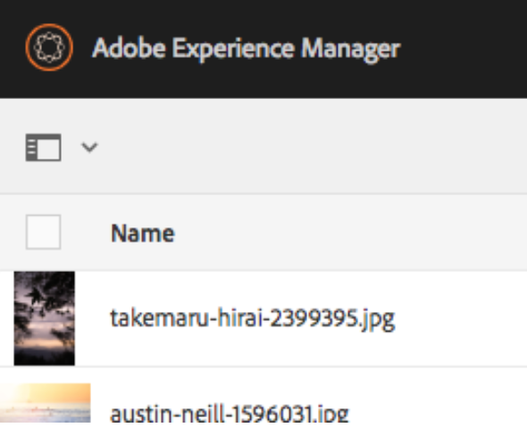
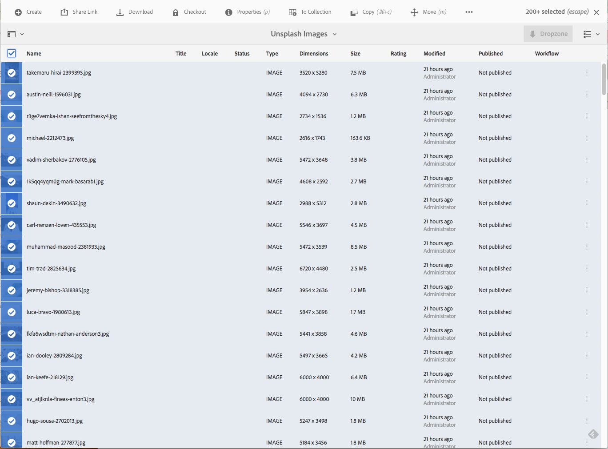
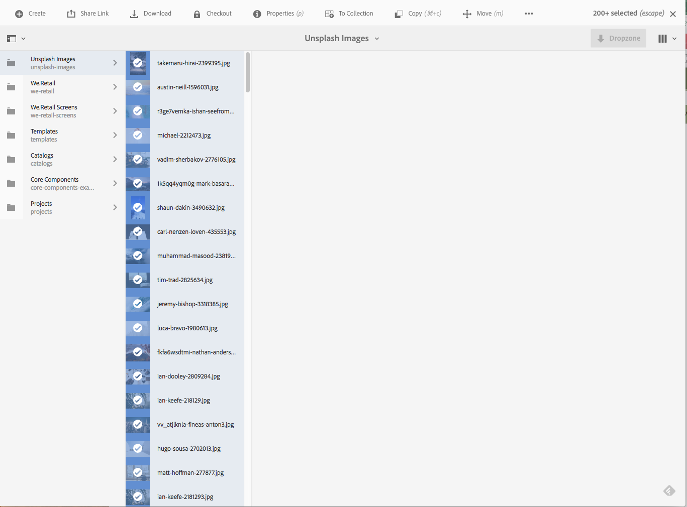
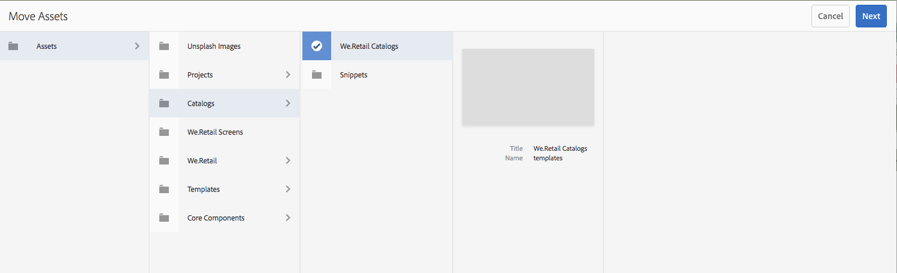
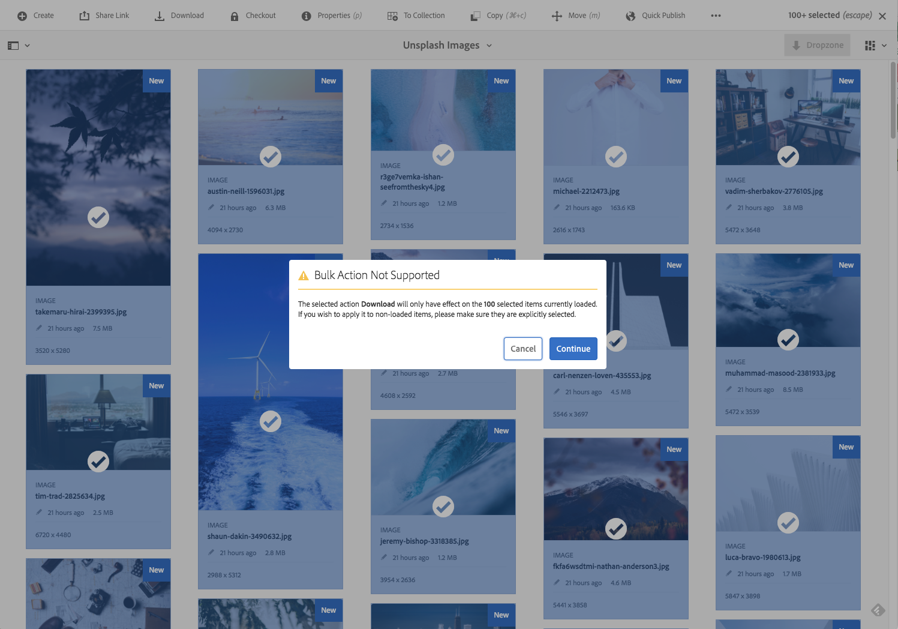

# Bulk Processing Operations {#bulk-processing-operations}

## Introduction {#introduction}

With the newest version of Adobe Experience Manager (AEM), the select all button has been extended to all views: List, Column, and Card view. The select all button now selects all content in a given folder or collection and not just the Assets and Pages that are loaded and visible in the client browser.

Key actions have been enabled for the bulk operation: **Move**, **Delete**, and **Copy**. A new dialog box lets customers know what are the actions that bulk processing is unavailable for.

## How To Use {#how-to-use}

A new button called **Select All** has been added to the Card, List, or Column views. This button can be used in any of the views to select all the elements in the data set.

In previous versions of AEM, the selection was limited what was loaded in the client browser. This new change was introduced to avoid confusion regarding the number of elements a bulk operation is being performed on.

For now, three operations have been added to bulk processing:

* Move
* Copy
* Delete

Support for more operations will be added in the future.
To use this feature, navigate to the folder or collection where you want to perform bulk operation on Pages or on Assets.

Then, choose one of the views, as shown below:

### Card View {#card-view}

### Bulk Selection in Card View {#bulk-selection-in-card-view}

Assets or Pages can be selected in bulk using the **Select All** button on top right:

 

### List View {#list-view}

The same goes for List View, too:

### Bulk Selection in List View {#bulk-selection-in-list-view}

In List View, use either the **Select All** button, or use the checkbox on the left for bulk selection.

 

### Column View {#column-view}

### Bulk Selection in Column View {#bulk-selection-in-column-view}

## Bulk enabled Operations {#bulk-enabled-operations}

After selection, one of the three bulk-enabled actions can be performed: **Move**, **Copy** or **Delete**.

Here, **Move** operation is performed on the Assets selected above. In any of the views, this results in all Assets being moved to the chosen location and not just the ones that are loaded on the screen.

For other operations that are not bulk enabled, like **Download,** a warning is shown stating that only elements that are loaded in the browser is included in the operation.

