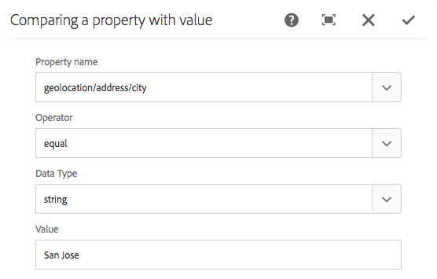
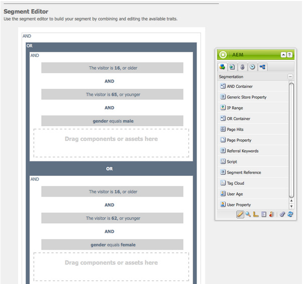
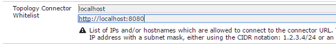

# Configuring Segmentation {#configuring-segmentation}

>[!NOTE]
>
>This document covers the configuration of segmentation as used with the Client Context. To configure segments with ContextHub using the touch UI, see [Configuring Segmentation with ContextHub](/help/sites-administering/segmentation.md).

Segmentation is a key consideration when creating a campaign. See [Segmentation glossary](/help/sites-authoring/segmentation-overview.md) for information on how segmentation works and key terms.

Depending on the information you have already collected about your site visitors and the goals you want to achieve, you must define the segments and strategies needed for your targeted content.

These segments are then used to provide a visitor with specifically targeted content. This content is maintained in the [Campaigns](/help/sites-classic-ui-authoring/classic-personalization-campaigns.md) section of the website. Teaser pages defined here can be included as teaser paragraphs on any page and define which visitor segment the specialized content is applicable for.

AEM lets you easily create and update segments, teasers, and campaigns. It also lets you verify the results of your definitions.

The **Segment Editor** lets you easily define a segment:

You can **Edit** each segment to specify a **Title**, **Description** and **Boost** factor. Using the sidekick you can add **AND** and **OR** containers to define the **Segment Logic**, then add the required **Segment Traits** to define the selection criteria.

## Boost Factor {#boost-factor}

Each segment has a **Boost** parameter that is used as a weighting factor; a higher number indicates that the segment will be selected in preference to a segment with a lower number.

* Minimum value: `0`
* Maximum value: `1000000`

## Segment Logic {#segment-logic}

The following logic containers are available out-of-the-box and let you construct the logic of your segment selection. They can be dragged from the sidekick to the editor:

<table>
 <tbody>
  <tr>
   <td> AND Container  </td>
   <td> The boolean AND operator.  </td>
  </tr>
  <tr>
   <td> OR Container  </td>
   <td> The boolean OR operator.</td>
  </tr>
 </tbody>
</table>

## Segment Traits {#segment-traits}

The following segment traits are available out-of-the-box; they can be dragged from the sidekick to the editor:

<table>
 <tbody>
  <tr>
   <td> IP Range  </td>
   <td>Defines a range of IP addresses that the visitor can have.  </td>
  </tr>
  <tr>
   <td> Page Hits  </td>
   <td>How often the page has been requested.   </td>
  </tr>
  <tr>
   <td> Page Property  </td>
   <td>Any property of the visited page.  </td>
  </tr>
  <tr>
   <td> Referral Keywords  </td>
   <td>Keywords to match with information from the referring website.   </td>
  </tr>
  <tr>
   <td> Script</td>
   <td>JavaScript expression to be evaluated.  </td>
  </tr>
  <tr>
   <td> Segment Reference   </td>
   <td>Reference to another segment definition.  </td>
  </tr>
  <tr>
   <td> Tag Cloud  </td>
   <td>Tags to be matched with those from the pages visited.  </td>
  </tr>
  <tr>
   <td> User Age  </td>
   <td>As taken from the user profile.  </td>
  </tr>
  <tr>
   <td> User Property  </td>
   <td>Any other information that is available in the user profile. </td>
  </tr>
 </tbody>
</table>

You can combine these traits using the boolean operators OR and AND (see [Creating a New Segment](#creating-a-new-segment)) to define the exact scenario for selecting this segment.

When the entire statement evaluates to true then this segment has resolved. If there are multiple applicable segments, then the **[Boost](/help/sites-administering/campaign-segmentation.md#boost-factor)** factor is also used.

>[!CAUTION]
>
>The segment editor does not check for any circular references. For example, segment A references another segment B, which in turn references segment A. Ensure that your segments do not contain any circular references.

>[!NOTE]
>
>Properties with the **_i18n** suffix are set by a script which is a part of personalization's UI clientlib. All UI-related clientlibs are loaded on author only since the UI is not needed on publish.
>
>Therefore when creating a segment with such properties is it normally necessary to rely on **browserFamily** for instance instead of **browserFamily_i18n**.

### Creating a New Segment {#creating-a-new-segment}

To define your new segment:

1. In the rail, choose **Tools &gt; Operations &gt; Configuration**.
1. Click on the **Segmentation** page in the left pane, and navigate to the required location.
1. Create a [new page](/help/sites-authoring/editing-content.md#creatinganewpage) using the **Segment** template.
1. Open the new page to see the segment editor:

   

1. Use either the sidekick or the context menu (usually right mouse button click, then select **New...** to open the Insert New Component window) to find the segment trait you need. Then drag it to the **Segment Editor** it will appear in the default **AND** container.
1. Double-click the new trait to edit the specific parameters; for example, the mouse position:

   

1. Click **OK** to save your definition:
1. You can **Edit** the segment definition to give it a **Title**, **Description** and **[Boost](#boost-factor)** factor:

   

1. Add more traits if necessary. You can formulate boolean expressions using the **AND Container** and **OR Container** components found under **Segment Logic**. With the segment editor you can delete traits or containers not needed anymore, or drag them to new positions within the statement.

### Using AND and OR Containers {#using-and-and-or-containers}

You can construct complex segments in AEM. It helps to be aware of a few basic points:

* The top-level of the definition is always the AND container that is initially created; this cannot be changed, but does not have an effect on the rest of your segment definition.
* Ensure that the nesting of your container makes sense. The containers can be viewed as the brackets of your boolean expression.

The following example is used to select visitors who are either:

Male and between the ages of 16 and 65

OR

Female and between the ages of 16 and 62

As the main operator is OR you need to start with an **OR Container**. Within this you have 2 AND statements, for each of these you need an **AND Container**, into which you can add the individual traits.

## Testing the Application of a Segment {#testing-the-application-of-a-segment}

Once the segment has been defined, potential results can be tested with the help of the **[Client Context](/help/sites-administering/client-context.md)**:

1. Select the segment to be tested.
1. Press **[Ctrl-Alt-C](/help/sites-authoring/page-authoring.md#keyboardshortcuts)** to open the **[Client Context](/help/sites-administering/client-context.md)**, which shows the data that has been collected. For testing purposes you can **Edit** certain values, or **Load** another profile to see the impact there.

1. Depending on the traits defined, the data available for the current page may or may not match the segment definition. The status of the match is shown underneath the definition.

For example, a simple segment definition can be based on the age and gender of the user. Loading a specific profile shows that the segment is successfully resolved:

Or not:

>[!NOTE]
>
>All traits are resolved immediately, though most only change on page reload. Changes to mouse position are visible immediately, so useful for testing purposes.

Such tests can also be performed on content pages and in combination with **Teaser** components.

Mouseover on a teaser paragraph will show the segments applied, whether they currently resolve and therefore, why the current teaser instance has been selected:

### Using Your Segment {#using-your-segment}

Segments are currently used within [Campaigns](/help/sites-classic-ui-authoring/classic-personalization-campaigns.md). They are used to steer the actual content seen by specific target audiences. See [Understanding Segments](/help/sites-authoring/segmentation-overview.md) for more information.
