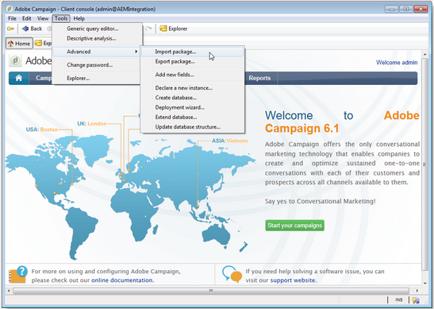
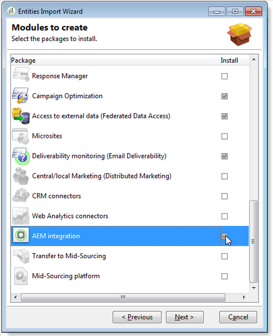
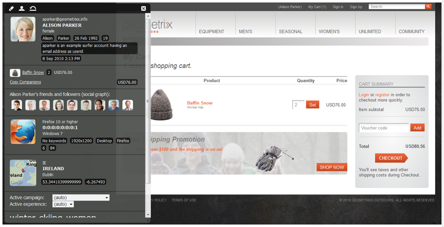
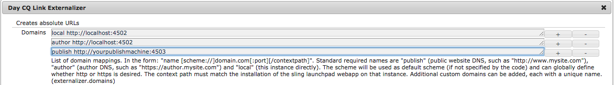

# Integrating with Adobe Campaign Classic{#integrating-with-adobe-campaign-classic}

>[!NOTE]
>
>This documentation describes how to integrate AEM with Adobe Campaign Classic, the on-premise solution. If you are using Adobe Campaign Standard, see [Integrating with Adobe Campaign Standard](/help/sites-administering/campaignstandard.md) for those instructions.

Adobe Campaign lets you manage email delivery content and forms directly in Adobe Experience Manager.

To use both solutions together at the same time, you must first configure them to connect to one another. This involves configuration steps in both Adobe Campaign and Adobe Experience Manager. These steps are described in detail in this document.

Working with Adobe Campaign in AEM includes the ability to send email via Adobe Campaign and is described at [Working with Adobe Campaign](/help/sites-authoring/campaign.md). It also includes using forms on AEM pages to manipulate data.

In addition, the following topics may be of interest when integrating AEM with [Adobe Campaign](https://helpx.adobe.com/support/campaign/classic.html):

* [Best Practices for Email Templates](/help/sites-administering/best-practices-for-email-templates.md)
* [Troubleshooting your Adobe Campaign Integration](/help/sites-administering/troubleshooting-campaignintegration.md)

If you are extending your integration with Adobe Campaign, you may want to see the following pages:

* [Creating Custom Extensions](/help/sites-developing/extending-campaign-extensions.md)
* [Creating Custom Form Mappings](/help/sites-developing/extending-campaign-form-mapping.md)

## AEM and Adobe Campaign Integration Workflow {#aem-and-adobe-campaign-integration-workflow}

This section describes a typical workflow between AEM and Adobe Campaign when creating campaigns and delivering content.

The typical workflow involves the following and is described in detail:

1. Start building your campaign (both in Adobe Campaign and AEM).
1. Before you link the content and delivery, personalize your content in AEM and create a delivery in Adobe Campaign.
1. Link content and delivery in Adobe Campaign.

### Start building your campaign {#start-building-your-campaign}

You start building a campaign at any time. Before you link the content, AEM and AC are independent That means marketers can start creating their campaigns and targeting in Adobe Campaign, while content creators are working on the design in AEM.

### Before linking content and delivery {#before-linking-content-and-delivery}

Before you link the content and create a delivery mechanism, you need to do the following:

**In AEM**

* Personalize using the personalization fields in the **Text & Personalization** component

**In Adobe Campaign**

* Create a delivery of type **aemContent**

### Linking content and setting delivery {#linking-content-and-setting-delivery}

After you have prepared the content for linking and delivery, you determine exactly how and where to link content.

All these steps are completed in Adobe Campaign.

1. Specify which AEM instance to use.
1. Synchronize the content by clicking the Synchronize button.
1. Open the content picker to pick your content.

### If you are new to AEM {#if-you-are-new-to-aem}

If you are new to AEM, you may find the following links helpful to understand AEM:

* [Starting AEM](/help/sites-deploying/deploy.md)
* [Understanding replication agents](/help/sites-deploying/replication.md)
* [Finding and working with log files](/help/sites-deploying/monitoring-and-maintaining.md#working-with-audit-records-and-log-files)
* [Introduction to the AEM Platform](/help/sites-deploying/platform.md)

## Configuring Adobe Campaign {#configuring-adobe-campaign}

Configuring Adobe Campaign involves the following:

1. Installing the AEM integration package in Adobe Campaign.
1. Configuring an external account.
1. Verifying that the AEMResourceTypeFilter is configured correctly.

In addition, there are advanced configurations that you can make, including :

* Managing content blocks
* Managing personalization fields

See [Advanced Configurations](#advanced-configurations).

>[!NOTE]
>
>To perform these operations, you must have the **administration** role in Adobe Campaign.

### Prerequisites {#prerequisites}

Make sure you have the following elements beforehand:

* [An AEM authoring instance](/help/sites-deploying/deploy.md#getting-started)
* [An AEM publishing instance](/help/sites-deploying/deploy.md#author-and-publish-installs)
* [An Adobe Campaign Classic instance](https://helpx.adobe.com/support/campaign/classic.html) - including a client and a server
* Internet Explorer 11

>[!NOTE]
>
>If you are running a version earlier than Adobe Campaign Classic build 8640, see the [upgrade documentation](https://docs.campaign.adobe.com/doc/AC6.1/en/PRO_Updating_Adobe_Campaign_Upgrading.html) for more information. Note that both client and database have to be upgraded to the same build.

>[!CAUTION]
>
>Operations detailed in the [Configuring Adobe Campaign](#configuring-adobe-campaign) and [Configuring Adobe Experience Manager](#configuring-adobe-experience-manager) sections are necessary for the integration functionalities between AEM and Adobe Campaign to work correctly.

### Installing the AEM Integration Package {#installing-the-aem-integration-package}

You must install the **AEM Integration** package in Adobe Campaign. To do this:

1. Go to the Adobe Campaign instance that you would like to link with AEM.
1. Select *Tools* &gt; *Advanced* &gt; *Import package...*.

   

1. Click **Install a standard package**, then select the **AEM Integration** package.

   

1. Click **Next**, and then **Start**.

   This package contains the **aemserver** operator that will be used to connect the AEM server to Adobe Campaign.

   >[!CAUTION]
   >
   >By default, no security zone is configured for this operator. To connect to Adobe Campaign via AEM, you must select one.
   >
   >In the **serverConf.xml** file, the **allowUserPassword** attribute of the selected security zone must be set to **true** to authorize AEM to connect Adobe Campaign via login/password.
   >
   >We strongly recommend creating a security zone dedicated to AEM to avoid any security problems. For more on this, refer to the [Installation guide](https://docs.campaign.adobe.com/doc/AC/en/INS_Additional_configurations_Configuring_Campaign_server.html).

   

### Configuring an AEM external account {#configuring-an-aem-external-account}

You must configure an external account that allows you to connect Adobe Campaign to your AEM instance.

>[!NOTE]
>
>* When installing the **AEM Integration** package, an external AEM account is created. You can configure the connection to your AEM instance from it or create a new one.
>* In AEM, be sure that you set the password for the campaign-remote user. You need to set this password to connect Adobe Campaign with AEM. Log in as administrator and in the user administration console, search for the campaign-remote user and click **Set Password**.
>

To configure an external AEM account:

1. Go to the **Administration** &gt; **Platform** &gt; **External Accounts** node.
1. Create a new external account and select the **AEM** type.
1. Enter the access parameters for your AEM authoring instance: the server address as well as the ID and password used to connect to this instance. The campaign-api user account password is the same as the campaign-remote user that you set a password for in AEM.

   >[!NOTE]
   >
   >Make sure that the server address does **not** end in a trailing slash. For example, enter `https://yourserver:4502` instead of `https://yourserver:4502/`

    

1. Make sure that the **Enabled** checkbox is selected.

### Verifying the AEMResourceTypeFilter option {#verifying-the-aemresourcetypefilter-option}

The **AEMResourceTypeFilter** option is used to filter types of AEM resources that can be used in Adobe Campaign. This allows Adobe Campaign to retrieve AEM contents that are specifically designed to be used in Adobe Campaign only.

This option should come pre-configured; however, if you change this option, it may lead to a non-functioning integration.

To verify the **AEMResourceTypeFilter** option is configured:

1. Go to **Platform** &gt;**Options**.
1. In the **AEMResourceTypeFilter** option, check that the paths are correct. This field must contain the value:

   **mcm/campaign/components/newsletter,mcm/campaign/components/campaign_newsletterpage,mcm/neolane/components/newsletter**

   Or in some cases, the value is as follows:

   **mcm/campaign/components/newsletter**

   

## Configuring Adobe Experience Manager {#configuring-adobe-experience-manager}

To configure AEM, you must do the following:

* Configure replication between instances.
* Connect AEM to Adobe Campaign via Cloud Services.
* Configure the externalizer.

### Configuring replication between AEM instances {#configuring-replication-between-aem-instances}

Content created from the AEM authoring instance is first sent to the publishing instance. You need to publish so that the images in the newsletter are available on the publish instance and to newsletter recipients. The replication agent must therefore be configured to replicate from the AEM authoring instance to the AEM publishing instance.

>[!NOTE]
>
>If you do not want to use the replication URL but instead use the public-facing URL, you can set the **Public URL** in the following configuration setting in the OSGi (**AEM logo** &gt;  **Tools** icon &gt;  **Operations** &gt; **Web Console** &gt; **OSGi Configuration** &gt; **AEM Campaign Integration - Configuration**):
>
>**Public URL:** com.day.cq.mcm.campaign.impl.IntegrationConfigImpl#aem.mcm.campaign.publicUrl

This step is also necessary to replicate certain authoring instance configurations into the publishing instance.

To configure replication between AEM instances:

1. From the authoring instance, select **AEM logo**&gt; **Tools** icon &gt; **Deployment** &gt; **Replication** &gt; **Agents on author**, then click **Default Agent**.

   

   >[!NOTE]
   >
   >Avoid using localhost (that is a local copy of AEM) when configuring your integration with Adobe Campaign unless the publish and author instance are both on the same computer.

1. Tap or click **Edit** then select the **Transport** tab.
1. Configure the URI by replacing **localhost** with the IP address or the address of the AEM publishing instance.

   

### Connecting AEM to Adobe Campaign {#connecting-aem-to-adobe-campaign}

Before you can use AEM and Adobe Campaign together, you must establish the link between both solutions so that they can communicate.

1. Connect to your AEM authoring instance.
1. Select **AEM logo** &gt; **Tools** icon &gt; **Deployment** &gt; **Cloud Services**, then **Configure now** in the Adobe Campaign section.

   

1. Create a new configuration by entering a **Title** and click **Create**, or choose the existing configuration that you want to link with your Adobe Campaign instance.
1. Edit the configuration so that it matches the parameters of your Adobe Campaign instance.

    * **Username**: **aemserver**, the Adobe Campaign AEM Integration package operator used to establish the link between the two solutions.
    * **Password**: Adobe Campaign aemserver operator password. You may have to re-specify the password for this operator directly in Adobe Campaign.
    * **API End Point**: Adobe Campaign instance URL.

1. Select **Connect to Adobe Campaign** and click **OK**.

   

   >[!NOTE]
   >
   >After you [create your email and publish it](/help/sites-authoring/campaign.md), you need to re-publish the configuration onto your publish instance.

   

>[!NOTE]
>
>If the connection fails, make sure you check the following:
>
>* You may encounter a certificate problem when using a secure connection to an Adobe Campaign instance (https). You will have to add the Adobe Campaign instance certificate to the **cacerts** file of your AEM instance's JDK.
>* A security zone must be configured for the [aemserver operator](#connecting-aem-to-adobe-campaign) in Adobe Campaign. Furthermore, in the **serverConf.xml** file, the **allowUserPassword** attribute of the security zone must be set to **true** to authorize AEM connection to Adobe Campaign using the login/password mode.
>
>In addition, see [Troubleshooting your AEM/Adobe Campaign integration](/help/sites-administering/troubleshooting-campaignintegration.md).

### Configuring the externalizer {#configuring-the-externalizer}

You need to [configure the externalizer](/help/sites-developing/externalizer.md) in AEM on your author instance. The Externalizer is an OSGi service that lets you transform a resource path into an external and absolute URL. This service provides a central place to configure those external URLs and build them.

See [Configure the externalizer](/help/sites-developing/externalizer.md) for general instructions. For the Adobe Campaign integration, make sure you configure the publish server at `https://<host>:<port>/system/console/configMgr/com.day.cq.commons.impl.ExternalizerImpl`not point to `localhost:4503` but to a server that is reachable by the Adobe Campaign console.

If it points to `localhost:4503` or another server that Adobe Campaign cannot reach, your images will not appear on the Adobe Campaign console.

 

## Advanced Configurations {#advanced-configurations}

You can also perform some advanced configurations, namely:

* Manage personalization fields and blocks.
* Deactivate a personalization block.
* Manage target extension data.

### Managing personalization fields and blocks {#managing-personalization-fields-and-blocks}

The fields and blocks available to add personalization to your email content in AEM are managed by Adobe Campaign.

A default list is provided but can be modified. You can also add or hide personalization fields and blocks.

#### Adding a personalization field {#adding-a-personalization-field}

To add a new personalization field to those that are already available, you have to extend the Adobe Campaign **nms:seedMember** schema as follows:

>[!CAUTION]
>
>The field that you need to add must have already been added via a recipient schema extension (**nms:recipient**). For more information, see the [Configuration](https://docs.campaign.adobe.com/doc/AC6.1/en/CFG_Editing_schemas_Editing_schemas.html) guide.

1. Go to the **Administration** &gt; **Configuration** &gt; **Data schemas** node in the Adobe Campaign navigation.
1. Select **New**.

   

1. In the pop-up window, select **Extend the data in the table using an extension schema** and click **Next**.

   

1. Enter the different parameters of the extended schema:

    * **Schema**: select the **nms:seedMember** schema. The other fields in the window are automatically completed.
    * **Namespace**: personalize the namespace of the extended schema.

1. Edit the XML code of the schema to specify the field that you want to add there. For more information on extending schemas in Adobe Campaign, refer to the [Configuration guide](https://docs.campaign.adobe.com/doc/AC6.1/en/CFG_Editing_schemas_Extending_a_schema.html).
1. Save your schema then update the Adobe Campaign database structure via the **Tools** &gt; **Advanced** &gt; **Update database structure** menu in the console.
1. Disconnect then reconnect to the Adobe Campaign console to save your changes. The new field now appears in the list of personalization fields available in AEM.

#### Example {#example}

To add a **Registration Number** field, you must have the following elements:

* The **nms:recipient** schema extension named **cus:recipient** contains:

```xml
<element desc="Recipient table (profiles)" img="nms:recipient.png" label="Recipients" labelSingular="Recipient" name="recipient">

  <attribute dataPolicy="smartCase" desc="Recipient registration number" 
  label="Registration Number"
  length="50" name="registrationNumber" type="string"/>

</element>
```

The **nms:seedMember** schema extension named **cus:seedMember** contains:

```xml
<element desc="Seed to insert in the export files" img="nms:unknownad.png" label="Seed addresses" labelSingular="Seed" name="seedMember">

  <element name="custom_nms_recipient">
    <attribute name="registrationNumber" 
    template="cus:recipient:recipient/@registrationNumber"/>
  </element>

</element>
```

The **Registration Number** field is now part of the available personalization fields:

 

#### Hiding a personalization field {#hiding-a-personalization-field}

To hide a personalization field among those that are already available, you must extend the Adobe Campaign **nms:seedMember** schema as detailed in the [Adding a personalization field](#adding-a-personalization-field) section. Apply the following steps:

1. Copy the field that you want to take from the **nms:seedMember** schema in the extended schema (**cus:seedMember** for example).
1. Add the **advanced="true"** XML attribute to the field. It no longer appears in the list of personalization fields available in AEM.

   For example, to hide the **Middle Name** field, the **cud:seedMember** schema must contain the following element:

   ```xml
   <element desc="Seed to insert in the export files" img="nms:unknownad.png" label="Seed addresses" labelSingular="Seed" name="seedMember">
   
     <element name="custom_nms_recipient">
       <attribute advanced="true" name="middleName"/>
     </element>
   
   </element>
   ```

### Deactivating a personalization block {#deactivating-a-personalization-block}

To deactivate a personalization block among those available:

1. Go to the **Resources** &gt; **Campaign Management** &gt; **Personalization blocks** node in the Adobe Campaign navigation.
1. Select the personalization block that you want to deactivate in AEM.
1. Clear the **Visible in the customization menus** checkbox and save your changes. The block no longer appears in the list of personalization blocks available in Adobe Campaign.

   

### Managing target extension data {#managing-target-extension-data}

You can also insert target extension data for personalization. Target extension data (also called 'Target Data'), comes from enriching or adding data in a query in a campaign workflow for example. For more information, refer to the [Creating queries](https://docs.campaign.adobe.com/doc/AC/en/PTF_Creating_queries_About_queries_in_Campaign.html) and [Enriching data](https://docs.campaign.adobe.com/doc/AC/en/WKF_Use_cases_Enriching_data.html) sections.

>[!NOTE]
>
>The data in the target is only available if the AEM content is synchronized with an Adobe Campaign delivery. See [Synchronizing content created in AEM with a delivery from Adobe Campaign](/help/sites-authoring/campaign.md#synchronizing-content-created-in-aem-with-a-delivery-from-adobe-campaign-classic).


