# Integrating AEM 6.5 with Adobe Campaign Standard {#integrating-with-adobe-campaign-standard}

By integrating AEM 6.5 with Adobe Campaign Standard (ACS), you can manage email delivery, content, and forms directly in AEM. Configuration steps in both Adobe Campaign Standard and AEM are needed to enable bidirectional communication between solutions.

This integration allows AEM and Adobe Campaign Standard to be used independently. Marketers can create campaigns and use targeting in Adobe Campaign, while content creators in parallel can work on content design in AEM. Using the integration, the content and design of the campaign created in AEM can be targeted and delivered by Adobe Campaign.

>[!INFO]
>
>This document details how to integrate Adobe Campaign Standard with AEM 6.5. For other Campaign integrations see the document [Integrating AEM 6.5 with Adobe Campaign.](campaign.md)

## Integration Steps {#integration-steps}

The configuration of the integration between AEM and Adobe Campaign Standard requires a number of steps in both solutions.

1. [Configure the `aemserver` User in Campaign](#aemserver-user)
1. [Verify the `AEMResourceTypeFilter` in Campaign](#resource-type-filter)
1. [Create an AEM-Specific Email Delivery Template in Campaign](#aem-email-delivery-template)
1. [Configure the Campaign Integration in AEM](#campaign-integration)
1. [Configure Replication to AEM Publish Instance](#replication)
1. [Configure the AEM Externalizer](#externalizer)
1. [Configure the `campaign-remote` User in AEM](#campaign-remote-user)
1. [Configure the AEM External Account in Campaign](#acc-external-user)

This document leads you through each of these steps in detail.

## Prerequisites {#prerequisites}

* Administrator access to Adobe Campaign Standard
  * If you need additional details on how to set up and configure Adobe Campaign Standard please refer to the [Adobe Campaign Standard documentation.](https://experienceleague.adobe.com/docs/campaign-standard/using/campaign-standard-home.html)
* Administrator access to AEM

## Configure the aemserver User in Campaign {#aemserver-user}

Adobe Campaign Standard by default comes with an `aemserver` user that AEM uses to connect to Adobe Campaign. You must assign an appropriate security group for this user and set its password.

1. Log into Adobe Campaign as an administrator.

1. Tap or click the Adobe Campaign Logo at the top-left of the menu bar to open the global navigation, then select **Administration** &gt; **Users &amp; Security** &gt; **Users** from the navigation menu.

1. Tap or click the `aemserver` user in the users console.

1. Ensure that the `aemserver` user is assigned at a minimum to a security group that has the role `deliveryPrepare` assigned to it. By default the group `Standard Users` has this role.

   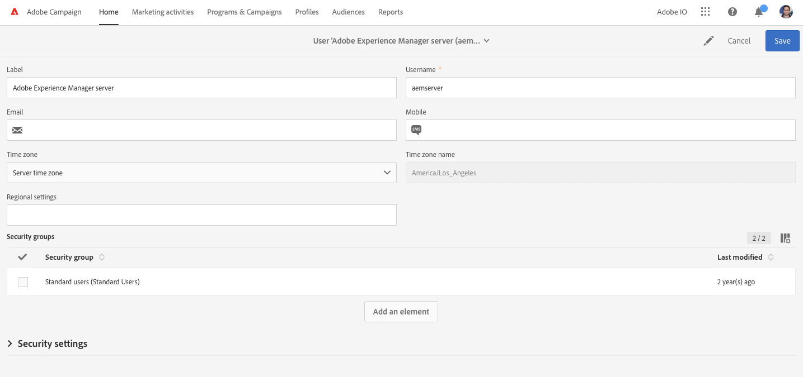

1. Tap or click **Save** to save the changes.

Your `aemserver` user now has the necessary rights so that AEM can use it to communicate with Adobe Campaign.

However, before AEM can use the `aemserver` user, its password must be set. This can not be done through Adobe Campaign. It must be carried out by an Adobe support engineer. [Please raise a ticket with Adobe Customer Care](https://experienceleague.adobe.com/?support-tab=home#support) to request the reset of the `aemserver` password. Once you have the password from Adobe Customer Care, please keep it in a secure location.

## Verify the AEMResourceTypeFilter in Campaign {#resource-type-filter}

The `AEMResourceTypeFilter` is an option in Adobe Campaign that is used to filter AEM resources that can be used in Adobe Campaign. Because AEM contains a lot of content, this option acts as a filter that allows Adobe Campaign to retrieve only the AEM content of types specifically designed to be used in Adobe Campaign.

This option comes pre-configured. However, you may need to update it if you have customized the Campaign components of AEM. To verify that the `AEMResourceTypeFilter` option is configured, follow these steps.

1. Log into Adobe Campaign as an administrator.

1. Tap or click the Adobe Campaign Logo at the top-left of the menu bar to open the global navigation, then select **Administration** &gt; **Application Settings** &gt; **Options** from the navigation menu.

1. Tap or click the `AEMResourceTypeFilter` in the options console.

1. Confirm the configuration of the `AEMResourceTypeFilter`. The paths are delimited with commas and by default contain:

   * `mcm/campaign/components/newsletter`
   * `mcm/campaign/components/campaign_newsletterpage`
   * `mcm/neolane/components/newsletter`

   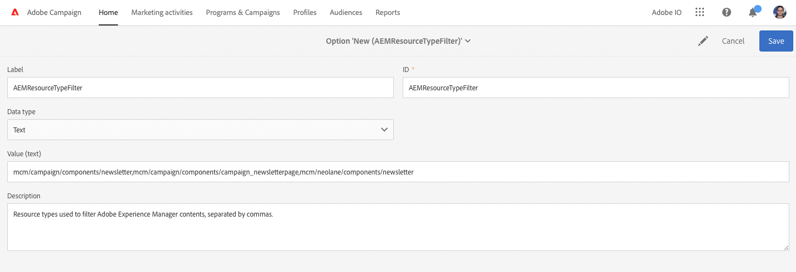

1. Tap or click **Save** to save the changes.

Your `AEMResourceTypeFilter` is now configured to retrieve the correct content from AEM.

## Create an AEM-Specific Email Delivery Template in Campaign {#aem-email-delivery-template}

By default, AEM is not enabled in Adobe Campaign’s email templates. You must configure a new email delivery template that can be used to create emails using AEM content. To create an AEM-specific email delivery template, follow these steps.

1. Log into Adobe Campaign as an administrator.

1. Tap or click the Adobe Campaign Logo at the top-left of the menu bar to open the global navigation, then select **Resources** &gt; **Templates** &gt; **Delivery templates** from the navigation menu.

1. In the delivery templates console, locate the default email template **Send via email (mail)** and hover the mouse over the card (or line) representing it to reveal the options. Click **Duplicate element**.

   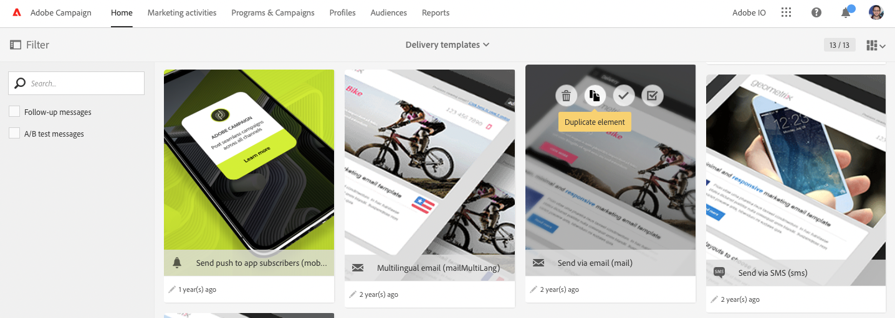

1. In the **Confirmation** dialog, click **Confirm** to duplicate the template.

   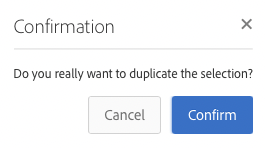

1. The template editor opens with your copy of the **Send via email (mail)** template. Click the **Edit properties** icon at the top-right of the window.

   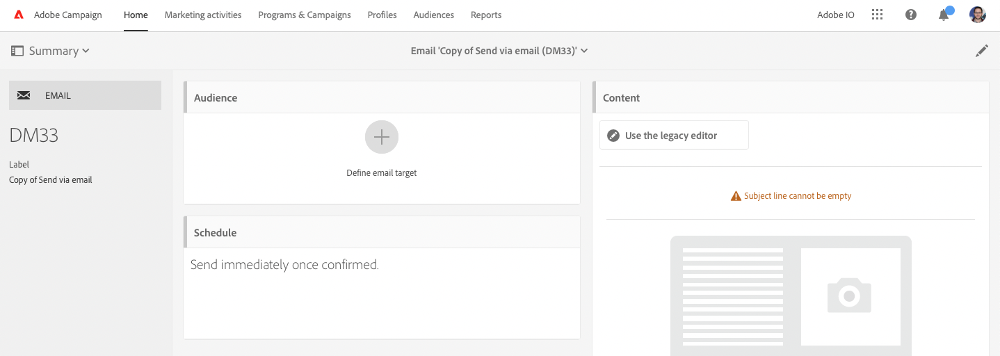

1. In the properties window, change the **Label** field to be descriptive of your new AEM template.

1. Click the **Content** heading to expand it and select **Adobe Experience Manager** in the **Content source** drop-down.

1. This reveals the **Adobe Experience Manager account** field. Use the drop-down to select **Adobe Experience Manager instance (aemInstance)** user. This is the default external user for the AEM integration.

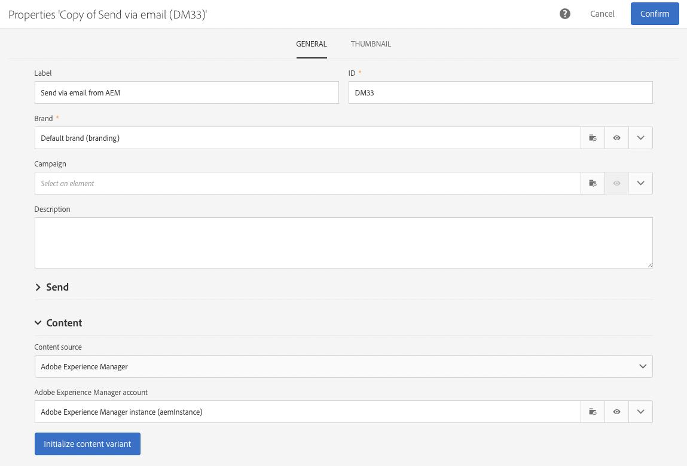

1. Click **Confirm** to save the changes to the properties.

1. In the template editor, click **Save** to save your modified copy of the email template for use with AEM.

You now have an email template that can use AEM content.

## Configure the Campaign Integration in AEM {#campaign-integration}

AEM communicates with Adobe Campaign using a built-in integration and the `aemserver` user you configured in Adobe Campaign. Follow these steps to configure this integration.

1. Sign into to your AEM authoring instance as an administrator.

1. From the global navigation side rail, select **Tools** &gt; **Cloud Services** &gt; **Legacy Cloud Services** &gt; **Adobe Campaign**, then click **Configure Now**.

   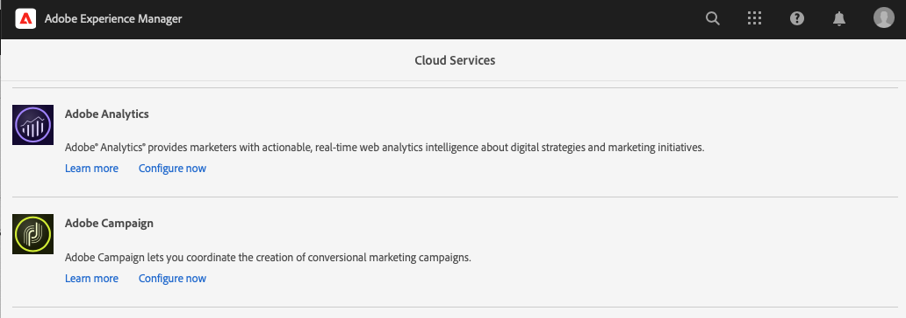

1. In the dialog, create a Campaign service configuration by entering a **Title** and click **Create**.

   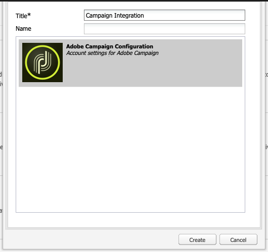

1. A new window and dialog opens to edit the configuration. Provide the necessary information.

    * **Username** - This is [the `aemserver` user in Adobe Campaign that you configured in a previous step.](#aemserver-user) By default it is `aemserver`. 
    * **Password** - This is the password for [the `aemserver` user in Adobe Campaign that you requested from Adobe Customer Care in a previous step.](#aemserver-user)
    * **API End Point** - This is the Adobe Campaign instance URL.

    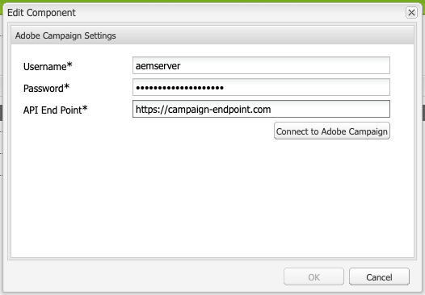

1. Select **Connect to Adobe Campaign** to verify the connection and then click **OK**.

AEM can now communicate with Adobe Campaign.

>[!NOTE]
>
>Make sure that your Adobe Campaign server is reachable via the internet. AEM can not access private networks.

## Configure Replication to AEM Publish Instance {#replication}

Campaign content is created by content authors on the AEM authoring instance. This instance is typically only available internally at your organization. For content such as images and assets to be accessible to the recipients of your campaign, you need to publish that content.

The replication agent is responsible for publishing your content from the AEM author instance to the publish instance and must be set up for the integration to work properly. This step is also necessary to replicate certain authoring instance configurations into the publishing instance.

To configure replication from your AEM author instance to the publish instance:

1. Sign into to your AEM authoring instance as an administrator.

1. From the global navigation side rail, select **Tools** &gt; **Deployment** &gt; **Replication** &gt; **Agents on author**, then tap or click **Default agent (publish)**.

   

1. Tap or click **Edit** then select the **Transport** tab.

1. Configure the **URI** field by replacing the default `localhost` value with the IP address of the AEM publishing instance.

   

1. Tap or click **OK** to save the changes to the agent settings.

You have configured replication to the AEM publish instance so your campaign recipients can access your content.

>[!NOTE]
>
>If you do not want to use the replication URL but instead use the public-facing URL, you can set the public URL in the following configuration setting via OSGi
>
>From the global navigation side rail, select **Tools** &gt; **Operations** &gt; **Web Console** &gt; **OSGi Configuration** and search for **AEM Campaign Integration - Configuration**. Edit the configuration and change the field **Public URL** (`com.day.cq.mcm.campaign.impl.IntegrationConfigImpl#aem.mcm.campaign.publicUrl`).

## Configure the AEM Externalizer {#externalizer}

[The Externalizer](/help/sites-developing/externalizer.md) is an OSGi service in AEM that transforms a resource path into an external and absolute URL, which is necessary for AEM to serve content that Campaign can use. You must configure it for the Campaign integration to work.

1. Sign into the AEM authoring instance as an administrator.
1. From the global navigation side rail, select **Tools** &gt; **Operations** &gt; **Web Console** &gt; **OSGi Configuration** and search for **Day CQ link Externalizer**.
1. By default the last entry in the **Domains** field is intended for the publish instance. Change the URL from the default `http://localhost:4503` to your publicly-available publish instance.

   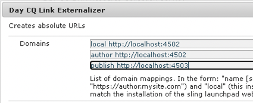

1. Tap or click **Save**. 

You have configured the Externalizer and Adobe Campaign can now access your content.

>[!NOTE]
>
>The publish instance must be reachable from the Adobe Campaign server. If it points to `localhost:4503` or another server that Adobe Campaign cannot reach, images from AEM will not appear in the Adobe Campaign console.

## Configure the campaign-remote User in AEM {#campaign-remote-user}

Just as you need a user in Adobe Campaign that AEM can use to communicate with Adobe Campaign, Adobe Campaign also needs a user in AEM for communication with AEM. By default the Campaign integration creates the `campaign-remote` user in AEM. Follow these steps to configure this user.

1. Log into AEM as an administrator.
1. On the main navigation console, click on **Tools** in the left rail.
1. Then click **Security** &gt; **Users** to open the user administration console.
1. Locate the `campaign-remote` user.
1. Select the `campaign-remote` user and click **Properties** to edit the user.
1. In the **Edit User Settings** window, click **Change Password**.
1. Provide a new password for the user and note the password in a secure location for future use.
1. Click **Save** to save the password change.
1. Click **Save &amp; Close** to save the changes to the `campaign-remote` user.

## Configure the AEM External Account in Campaign {#acc-external-user}

When you [created an AEM-specific email delivery template,](#aem-email-delivery-template) you specified that the template should use the `aemInstance` external account to communicate with AEM. In order to enable two-way communication between both solutions, you need to configure this account in Adobe Campaign.

1. Log into Adobe Campaign as an administrator.

1. Tap or click the Adobe Campaign Logo at the top-left of the menu bar to open the global navigation, then select **Administration** &gt; **Application settings** &gt; **External accounts** from the navigation menu.

1. Tap or click the **Adobe Experience Manager instance (aemInstance)** user in the users console.

1. Ensure that the user has **Adobe Experience Manager** as the **Type**.

1. In the **Connection** section, define the following fields:

   1. Server: This is the URL of your AEM authoring server. This should not end in a slash.
   1. Account: This is the `campaign-remote` user you [previously configured in AEM.](#campaign-remote-user)
   1. Password: This is the password for the `campaign-remote`user you [previously configured in AEM.](#campaign-remote-user)

   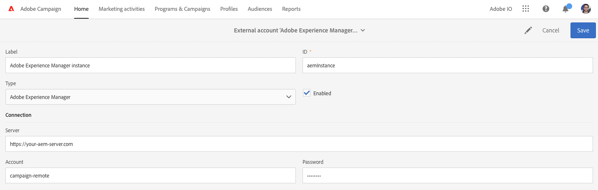

1. Ensure that the **Enabled** checkbox is selected and then click **Save** to save your changes.

Congratulations! You have completed the integration between AEM and Adobe Campaign Standard!

## Next Steps {#next-steps}

With both Adobe Campaign Classic and AEM configured, the integration is now complete.

You can now learn how to create a newsletter in Adobe Experience Manager by continuing with [this document.](/help/sites-authoring/campaign.md)
