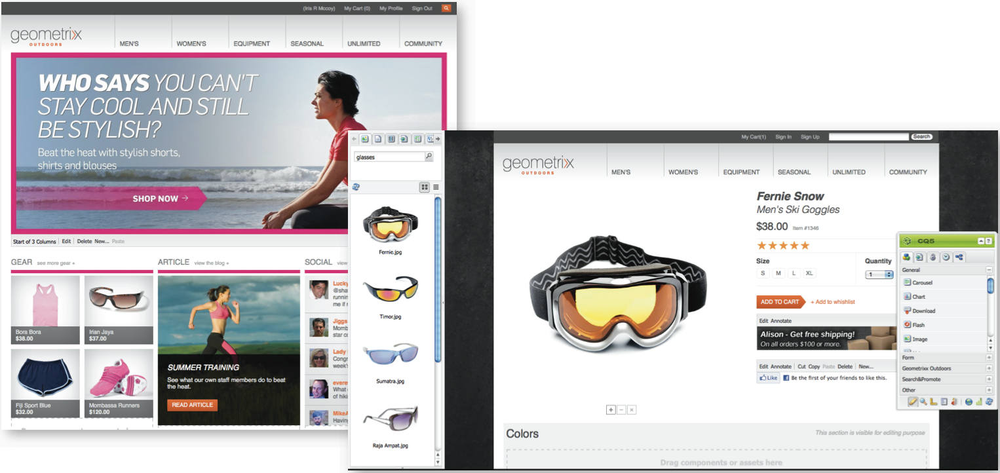
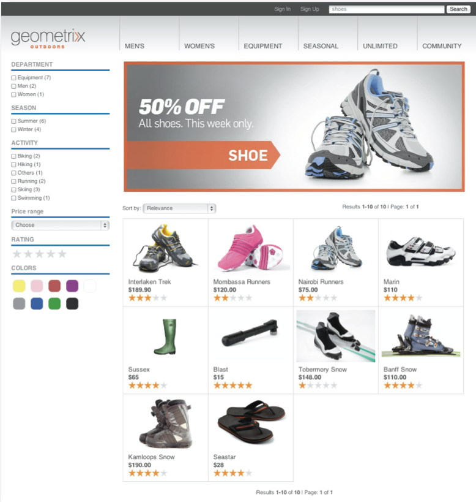

# Integrating with Adobe Campaign Standard{#integrating-with-adobe-campaign-standard}

>[!NOTE]
>
>This documentation describes how to integrate AEM with Adobe Campaign Standard, the subscription-based solution. If you are using Adobe Campaign 6.1, see [Integrating with Adobe Campaign 6.1](/help/sites-administering/campaignonpremise.md) for those instructions.

Adobe Campaign lets you manage email delivery content and forms directly in Adobe Experience Manager.

To use both solutions together at the same, you must first configure them to connect to one another. This involves configuration steps in both Adobe Campaign and Adobe Experience Manager. These steps are described in detail in this document.

Working with Adobe Campaign in AEM includes the ability to send email and forms via Adobe Campaign and is described at [Working with Adobe Campaign](/help/sites-authoring/campaign.md).

In addition, the following topics may be of interest when integrating AEM with [Adobe Campaign](https://docs.campaign.adobe.com/doc/standard/en/home.html):

* [Best practices for email templates](/help/sites-administering/best-practices-for-email-templates.md)
* [Troubleshooting your Adobe Campaign integration](/help/sites-administering/troubleshooting-campaignintegration.md)

If you are extending your integration with Adobe Campaign, you may want to see the following pages:

* [Creating Custom Extensions](/help/sites-developing/extending-campaign-extensions.md)
* [Creating Custom Form Mappings](/help/sites-developing/extending-campaign-form-mapping.md)

## Configuring Adobe Campaign {#configuring-adobe-campaign}

Configuring Adobe Campaign involves the following:

1. Configuring the **aemserver** user.
1. Creating a dedicated external account.
1. Verifying the AEMResourceTypeFilter option.
1. Creating a dedicated delivery template.

>[!NOTE]
>
>To perform these operations, you must have the **administration** role in Adobe Campaign.

### Prerequisites {#prerequisites}

Make sure you have the following elements beforehand:

* [An AEM authoring instance](/help/sites-deploying/deploy.md#getting-started)
* [An AEM publishing instance](/help/sites-deploying/deploy.md#author-and-publish-installs)
* [An Adobe Campaign instance](https://docs.adobe.com/content/docs/en/campaign/ACS.html)

>[!CAUTION]
>
>Operations detailed in the [Configuring Adobe Campaign](#configuring-adobe-campaign) and [Configuring Adobe Experience Manager](#configuring-adobe-experience-manager) sections are necessary for the integration functionalities between AEM and Adobe Campaign to work correctly.

### Configuring the aemserver user {#configuring-the-aemserver-user}

The **aemserver** user must be configured in Adobe Campaign. The **aemserver** is a technical user that will be used to connect the AEM server to Adobe Campaign.

Go to **Administration** &gt;  **Users & Security** &gt;  **Users**, and select the **aemserver** user. Click it to open the user settings.

* You have to set a password for this user. This cannot be done through the UI. This configuration must be done in REST by a technical administrator.
* You can assign specific roles to this user, such as **deliveryPrepare**, which allows the user to create and edit deliveries.

### Configuring an Adobe Experience Manager external account {#configuring-an-adobe-experience-manager-external-account}

You must configure an external account that allows you to connect Adobe Campaign to your AEM instance.

>[!NOTE]
>
>In AEM, be sure that you set the password for the campaign-remote user. You need to set this password to connect Adobe Campaign with AEM. Log in as administrator and in the user administration console, search for the campaign-remote user and click **Set Password**.

To configure an AEM external account:

1. Go to **Administration** &gt; **Application settings** &gt; **External accounts**.

   

1. Select the default **aemInstance** external account or create a new one by clicking the **Create** button.
1. Select **Adobe Experience Manager**i n the **Type** field and enter the access parameters used for your AEM authoring instance: server address, account name and password.

   >[!NOTE]
   >
   >Be sure that you do not add an ending **/** slash at the end of the URL or the connection will not work.

1. Make sure that the **Enabled** checkbox is selected, then click **Save** to save your modifications.

### Verifying the AEMResourceTypeFilter option {#verifying-the-aemresourcetypefilter-option}

The **AEMResourceTypeFilter** option is used to filter types of AEM resources that can be used in Adobe Campaign. This allows Adobe Campaign to retrieve AEM contents that are specifically designed to be used in Adobe Campaign only.

This option comes pre-configured; however, if you change this option, it may lead to a non-functioning integration.

To verify the **AEMResourceTypeFilter** option is configured:

1. Go to **Administration** &gt; **Application settings** &gt; **Options**.
1. In the list, you can ensure that the **AEMResourceTypeFilter** option is listed and that the paths are correct.

### Creating an AEM-specific email delivery template {#creating-an-aem-specific-email-delivery-template}

By default, the AEM feature is not enabled in Adobe Campaign's email templates. You can configure a new email delivery template that will be used to create emails with AEM content.

To create an AEM-specific email delivery template:

1. Go to **Resources** &gt; **Templates** &gt; **Delivery templates**.
1. **Enable selection** by clicking the checkmark in the action bar and selecting the existing **Standard email (mail)** default template, then duplicate it by clicking the **Copy** icon and clicking **Confirm**.
1. Disable the selection mode by clicking the **x** and open the newly created **Copy of Standard email (mail)** template, then select **Edit properties** from the action bar of the template dashboard.

   You can modify the template's **Label**.

1. In the properties **Content** section, change the **Content source** to **Adobe Experience Manager**. Then select the external account that was previously created and click **Confirm**.

   Save your modifications by clicking **Confirm** and clicking **Save.**

   Email deliveries created from this template will have the AEM content feature enabled.

   

## Configuring Adobe Experience Manager {#configuring-adobe-experience-manager}

To configure AEM, you must do the following:

* Configure replication between instances.
* Connect AEM to Adobe Campaign.
* Configure the externalizer.

### Configuring replication between AEM instances {#configuring-replication-between-aem-instances}

Content created from the AEM authoring instance is first sent to the publishing instance. This publishing instance then transfers the content to Adobe Campaign. The replication agent must therefore be configured to replicate from the AEM authoring instance to the AEM publishing instance.

>[!NOTE]
>
>If you do not want to use the replication URL but instead use the public-facing URL, you can set the **Public URL** in the following configuration setting in the OSGi (**Tools** &gt; **Web Console** &gt; **OSGi Configuration &gt; AEM Campaign Integration - Configuration**):
>
>**Public URL:** com.day.cq.mcm.campaign.impl.IntegrationConfigImpl#aem.mcm.campaign.publicUrl

This step is also necessary to replicate certain authoring instance configurations into the publishing instance.

To configure replication between AEM instances:

1. From the authoring instance, select **AEM logo**&gt; **Tools **icon &gt; **Deployment** &gt; **Replication** &gt; **Agents on author**, then click **Default Agent**.

   

   >[!NOTE]
   >
   >Avoid using localhost (that is a local copy of AEM) when configuring your integration with Adobe Campaign unless the publish and author instance are both on the same computer.

1. Click **Edit** then select the **Transport** tab.
1. Configure the URI by replacing **localhost** with the IP address or the address of the AEM publishing instance.

   

### Connecting AEM to Adobe Campaign {#connecting-aem-to-adobe-campaign}

Before you can use AEM and Adobe Campaign together, you must establish the link between both solutions so that they can communicate.

1. Connect to your AEM authoring instance.
1. Select **Tools** &gt; **Operations** &gt; **Cloud** &gt; **Cloud Services**, then **Configure now** in the Adobe Campaign section.

   

1. Create a new configuration by entering a **Title** and click **Create**, or choose the existing configuration that you want to link with your Adobe Campaign instance.
1. Edit the configuration so that it matches the parameters of your Adobe Campaign instance.

    * **Username**: **aemserver**, the Adobe Campaign AEM Integration package operator used to establish the link between the two solutions.
    * **Password**: Adobe Campaign aemserver operator password. You may have to re-specify the password for this operator directly in Adobe Campaign.
    * **API End Point**: Adobe Campaign instance URL.

1. Select **Connect to Adobe Campaign** and click **OK**.

   

   >[!NOTE]
   >
   >After you [create your email and publish it](/help/sites-authoring/campaign.md), you need to re-publish the configuration onto your publish instance.

   

>[!NOTE]
>
>If the connection fails, make sure you check the following:
>
>* You may encounter a certificate problem when using a secure connection to an Adobe Campaign instance (https). You will have to add the Adobe Campaign instance certificate to the **cacerts **file of your JDK.
>* In addition, see [Troubleshooting your AEM/Adobe Campaign Integration](/help/sites-administering/troubleshooting-campaignintegration.md).
>

### Configuring the externalizer {#configuring-the-externalizer}

You need to [configure the externalizer](/help/sites-developing/externalizer.md) in AEM on your author instance. The Externalizer is an OSGi service that lets you transform a resource path into an external and absolute URL. This service provides a central place to configure those external URLs and build them.

See [Configure the externalizer](/help/sites-developing/externalizer.md) for general instructions. For the Adobe Campaign integration, make sure you configure the publish server at `https://<host>:<port>/system/console/configMgr/com.day.cq.commons.impl.ExternalizerImpl` not point to `localhost:4503` but to a server that is reachable by the Adobe Campaign console.

If it points to `localhost:4503` or another server that Adobe Campaign cannot reach, your images will not appear on the Adobe Campaign console.

