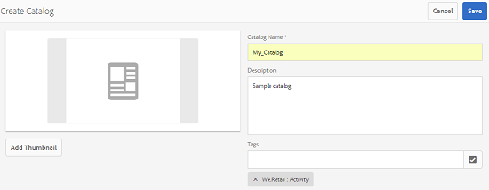
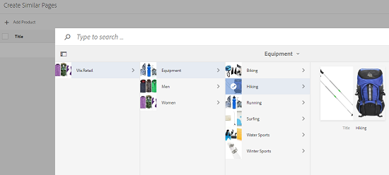
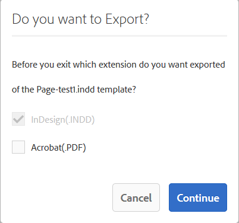

# Catalog Producer{#catalog-producer}

Learn how to use Catalog Producer in AEM Assets to generate product catalogs using your digital assets.

With the Adobe Experience Manager (AEM) Assets Catalog Producer, you can create catalogs for your brand products using InDesign templates imported from an InDesign application. To import InDesign templates, first integrate AEM Assets with an InDesign server.

## Integrating with InDesign server {#integrating-with-indesign-server}

As part of the integration process, configure the **DAM Update Asset** workflow, which is suited for integration with InDesign. In addition, configure a proxy worker for the InDesign server. For details, see [Integrating AEM Assets with InDesign Server](/help/assets/indesign.md).

>[!NOTE]
>
>You can generate InDesign templates from InDesign files before importing them into AEM Assets. For details, see [Working with files and templates](https://helpx.adobe.com/indesign/using/files-templates.html).
>
>You can map the elements in your InDesign templates to XML tags. The mapped tags are displayed as properties when you map product properties with template properties in Catalog Producer. To learn about XML tagging in InDesign files, see [Tagging content for XML](https://helpx.adobe.com/indesign/using/tagging-content-xml.html).

>[!NOTE]
>
>Only InDesign files (.indd) are used as templates. Files with the extension .indt are not supported.

## Creating a catalog {#creating-a-catalog}

Catalog Producer uses product information management (PIM) data to map product properties with the XML properties displayed in the template. To create a catalog, perform these steps:

1. From the Assets user interface, tap/click the **AEM logo**, and go to **Assets &gt; Catalogs**.
1. In the **Catalogs** page, tap/click **Create** from the toolbar, and then select **Catalog** from the list.
1. In the **Create Catalog** page, enter a name and description (optional) for the catalog and specify tags, if any. You can also add a thumbnail image for the catalog.

   

1. Tap/click **Save**. A confirmation dialog notifies that the catalog is created. Tap/click **Done** to close the dialog.
1. To open the catalog you created, tap/click it from the **Catalogs** page.

   >[!NOTE]
   >
   >To open the catalog, you can also tap/click **Open** in the confirmation dialog mentioned in the previous step.

1. To add pages to the catalog, tap/click **Create** from the toolbar, and then choose the **New Page** option.
1. From the wizard, select an InDesign template for your page. Then, tap/click **Next**.
1. Specify a name for the page and an optional description. Specify tags, if any.
1. Tap/click the **Create** from the toolbar. Then, tap/click **Open** from the dialog. The properties for the product are displayed on the left pane. The predefined properties for the InDesign template appear on the right pane.
1. From the left pane, drag the product properties to the InDesign template properties, and create a mapping between them.

   To view how the page appears in real time, tap/click the **Preview** tab on the right pane.

1. To create more pages, repeat steps 6-9. To create similar pages for other products, select the page and tap/click the **Create similar pages** icon from the toolbar.

   

   >[!NOTE]
   >
   >You can only create similar pages for products with similar structure.

   Tap/click the Add icon, select products from the product picker, and then tap/click **Select** from the toolbar.

   

1. From the toolbar, click/tap **Create**. Tap/click **Done** to close the dialog. Similar pages are included in your catalog.
1. To add any existing InDesign file to your catalog, tap/click **Create** from the toolbar, and choose the **Add to existing page** option.
1. Select the InDesign file, and tap/click **Add** from the toolbar. Then, tap/click **OK** to close the dialog.

   If the metadata of the products that you reference in the catalog pages is changed, the changes are not automatically reflected in the catalog pages. A banner labeled **Stale** appears on the product images in the referencing catalog pages, indicating that the metadata for the referenced products is not up-to-date.

   

   To ensure that the product images reflect the latest metadata changes, select the page in the Catalog console and click/tap the **Update page** icon from the toolbar.

   

   >[!NOTE]
   >
   >To change the metadata for a referenced product, navigate to the Products console (**AEM Logo** &gt; **Commerce** &gt; **Products**), and select the product. Then, click/tap the **View Properties** icon from the toolbar and edit the metadata in the Properties page of the asset.

1. To rearrange the pages in catalog, tap/click the **Create** icon from the toolbar and then choose **Merge** from the menu. In the wizard, the carousel on top lets you reorder pages by dragging them. You can also remove pages.

1. Tap/click **Next**. To add an existing InDesign file as a cover page, tap/click **Browse** beside the **Choose Cover Page** box, and specify the path for the cover page template.
1. Tap/click **Save**, and then tap/click **Done** to close the confirmation dialog.
On selecting the **Done** option, a dialog box opens to select whether you want .pdf rendition.

 If Acrobat(PDF) option is selected, a pdf rendition is created in  **/jcr:content/renditions** in addition to indesign rendition. You can download all the renditions by selecting "Renditions" checkbox in download dialog.

1. To generate a preview for the catalog you created, select it in the **Catalogs** console, and then click the **Preview** icon from the toolbar.

   

   Review the pages in your catalog in the preview. Tap/click **Close** to close the preview.
