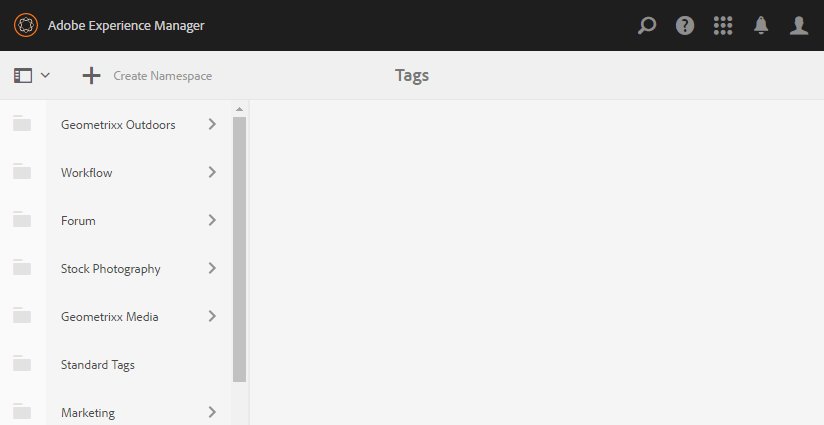
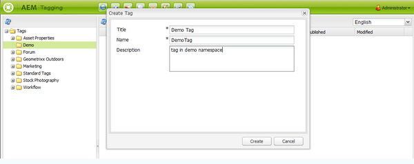
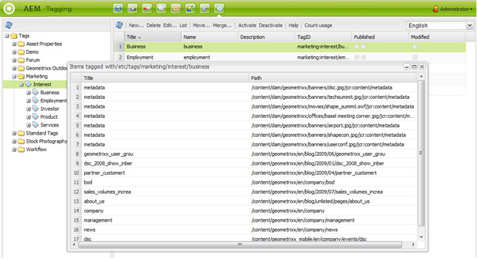
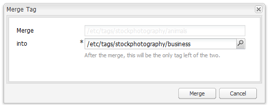

# Classic UI Tagging Console{#classic-ui-tagging-console}

This section is for the Classic UI Tagging Console.

>[!NOTE]
>
>See [Administering Tags](/help/sites-administering/tags.md#tagging-console) for details of the Touch-optimized UI Tagging Console.

To access the Classic UI Tagging console :

* on author
* sign in with administrative privileges
* browse to the console
  for example, [https://localhost:4502/tagging](https://localhost:4502/tagging)

## Creating Tags and Namespaces {#creating-tags-and-namespaces}

1. Depending on the level you are starting from you can create either a tag or a namespace using **New**:

   If you select **Tags** you can create a namespace:

   

   If you select a namespace (for example, **Demo**) you can create a tag within that namespace:

   

1. In both cases enter

    * **Title**
      (*Required*) The display title for the tag. While any character may be entered,
      it is recommended to not use these special characters:

        * `colon (:)` - namespace delimiter
        * `forward slash (/)` - sub-tag delimiter

      These characters will not be displayed if entered.

    * **Name**
      (*Required*) The node name for the tag.

    * **Description**
      (*Optional*) A description for the tag.

    * select **Create**

## Editing Tags {#editing-tags}

1. In the right-hand pane, select the tag that you want to edit.
1. Click **Edit**.
1. You can modify the **Title** and the **Description**.
1. Click **Save** to close the dialog.

## Deleting Tags {#deleting-tags}

1. In the right-hand pane, select the tag that you want to delete.
1. Click **Delete**.
1. Click **Yes** to close the dialog.

   The tag should not be listed anymore.

## Activating and Deactivating Tags {#activating-and-deactivating-tags}

1. In the right-hand pane, select the namespace or tag that you want to activate (publish) or deactivate (unpublish).
1. Click **Activate** or **Deactivate** as required.

## List - showing where tags are referenced {#list-showing-where-tags-are-referenced}

**List** opens a new window showing the paths of all pages using the highlighted tag:

## Moving Tags {#moving-tags}

To help tags administrators and developers clean up the taxonomy or rename a tag ID, it is possible to move a tag to a new location :

1. Open the **Tagging** console.
1. Select the tag and click **Move...** in the top tool bar (or in the context menu).
1. In the **Move Tag** dialog, define:

    * **to**, the destination node.
    * **Rename to**, the new node name.

1. Click **Move**.

The **Move Tag** dialog looks as follows:

>[!NOTE]
>
>Authors should not move tags or rename a tag ID. When necessary, Authors should only [change the tag titles](#editing-tags).

## Merging Tags {#merging-tags}

Merging tags can be used when a taxonomy has duplicates. When tag A is merged into tag B, all the pages tagged with tag A will be tagged with tag B and tag A is no more available to authors.

To merge a tag into another one:

1. Open the **Tagging** console.
1. Select the tag and click **Merge...** in the top tool bar (or in the context menu).
1. In the **Merge Tag** dialog, define:

    * **into**, the destination node.

1. Click **Merge**.

The **Merge Tag** dialog looks as follows:

## Counting Usage of Tags {#counting-usage-of-tags}

To see how many times a tag is being used:

1. Open the **Tagging** console.
1. Click **Count usage** in the top tool bar: the column Count displays the result.

## Managing Tags in Different Languages {#managing-tags-in-different-languages}

The optional `title`property of a tag may be translated into multiple languages. Tag `titles` can then be displayed according to the user language or to the page language.

### Defining Tag Titles in Multiple Languages {#defining-tag-titles-in-multiple-languages}

The following procedure shows how to translate the `title`of the tag **Animals** into English, German and French:

1. Go to the **Tagging** console.
1. Edit the tag **Animals** below **Tags** &gt; **Stock Photography**.
1. Add the translations in the following languages:

    * **English**: Animals
    * **German**: Tiere
    * **French**: Animaux

1. Save the changes.

The dialog looks as follows:

The Tagging console uses the user language setting, so for the Animal tag, 'Animaux' is displayed for a user who sets the language to French in user properties.

To add a new language to the dialog, see the section [Adding a New Language to the Edit Tag Dialog](/help/sites-developing/building.md#adding-a-new-language-to-the-edit-tag-dialog) in the **Tagging for Developers** section.

### Displaying Tag Titles in Page Properties in a Specified Language {#displaying-tag-titles-in-page-properties-in-a-specified-language}

By default the tag `titles`in the page properties are displayed in the page language. The tag dialog in the page properties has a language field that enables the display of tag `titles`in a different language. The following procedure describes how to display the tag `titles`in French:

1. Refer to the previous section to add the French translation to the **Animals** below **Tags** &gt; **Stock Photography**.
1. Open the page properties of the **Products** page in the English branch of the **Geometrixx** site.
1. Open the **Tags/Keywords** dialog (by selecting the pull-down menu to the right of the Tags/Keywords display area) and select the **French** language from the pull-down menu in the bottom right corner.
1. Scroll using the left-right arrows until able to select the **Stock Photography** tab

   Select the **Animals** (**Animaux**) tag and select outside the dialog to close it and add the tag to the page properties.

   

By default, the Page Properties dialog displays the tag `titles`according to the page language.

In general, the language of the tag is taken from the page language if the page language is available. When the [ `tag` widget](/help/sites-developing/building.md#tagging-on-the-client-side) is used in other cases (for example, in forms or in dialog boxes), the tag language depends on the context.

>[!NOTE]
>
>The tag cloud and the meta keywords in the standard page component use the localized tag `titles`based on the page language, if available.
