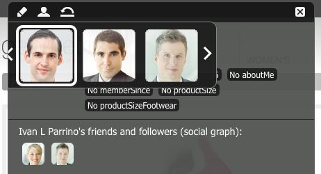
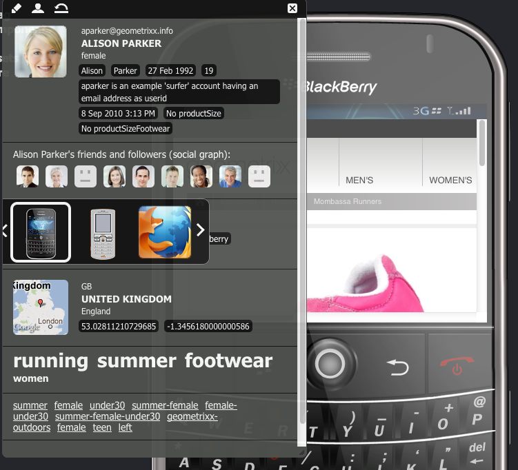
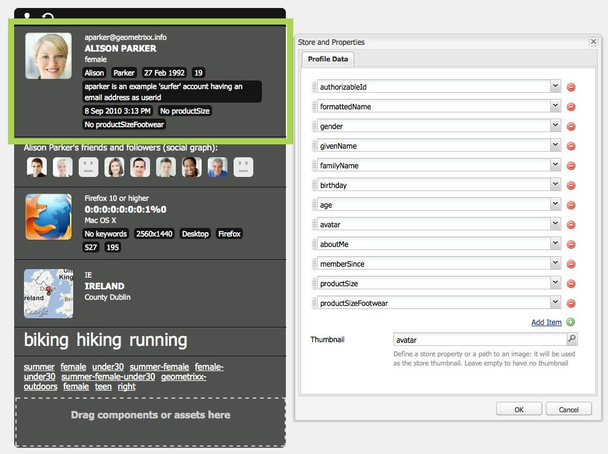
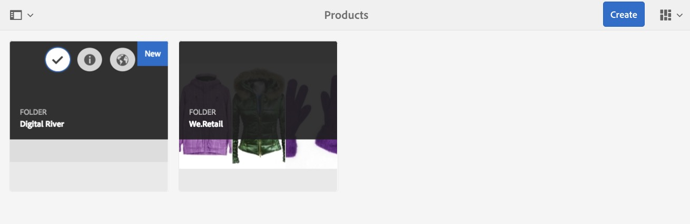
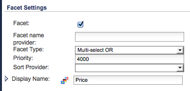
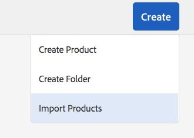

# Client Context{#client-context}

>[!NOTE]
>
>Client Context has been superseded by ContextHub. For more details, see the related [configuration](/help/sites-developing/ch-configuring.md) and [developer](/help/sites-developing/contexthub.md) documentation.

The Client Context is a mechanism that provides you with certain information about the current page and visitor. It can be opened using **Ctrl-Alt-c** (windows) or **control-option-c** (Mac):

In both the publish and author environment it shows information about:

* The visitor; depending on your instance certain information is requested, or derived.
* Page tags and the number of times that these tags have been accessed by the current visitor (this is shown when you move the mouse over a specific tag) .
* Page information.
* Information about the technical environment; such as the IP address, browser and screen resolution.
* Any segments that are currently resolved.

The icons (only available in the author environment) let you configure the details of the client context:

* **Edit**
  A new page opens, letting you [edit, add, or remove a profile property](#editingprofiledetails).

* **Load**
  You can [select from a list of profiles and load the profile](#loading-a-new-user-profile) you want to test.

* **Reset**
  You can [reset the profile](#resetting-the-profile-to-the-current-user) to that of the current user.

## Available Client Context Components {#available-client-context-components}

The Client Context can show the following properties ([depending on what has been selected using Edit](#adding-a-property-component)):

**Surfer Information** Shows the following client-side information:

* the **IP address**
* **keywords** used for search engine referral
* the **browser** being used
* the **OS** (operating system) being used
* the screen **resolution**
* the **mouse X** position
* the **mouse Y** position

**Activity Stream** This provides information about the social activity of the user on various platforms; for example, the AEM forums, blogs, ratings, and so on.

**Campaign** Allows authors to simulate a specific experience for a campaign. This component overrides normal campaign resolution and experience selection to enabled the testing of various permutations.

Campaign resolution is normally based on the priority property of the campaign. The experience is normally selected based on segmentation.

**Cart** Shows shopping cart information including product entries (title, quantity, priceFormatted, and so on), resolved promotions (title, message, and so on) and vouchers (code, description, and so on).

The cart session store also notifies the server about resolved promotion changes (based on segmentation changes) using the ClientContextCartServlet.

**Generic Store** Is a generic component that displays the content of a store. It is a lower-level version of the Generic Store Properties component.

The Generic Store must be configured with a JS renderer that will display the data in a custom manner.

**Generic Store Properties** Is a generic component that displays the content of a store. It is a higher-level version of the Generic Store component.

The Generic Store Properties component includes a default renderer that lists the configured properties (together with a thumbnail).

**Geolocation** Shows the latitude and longitude of the client. It uses the HTML5 geolocation API to query the browser for the current location. This results in a popup being shown to the visitor, where the browser asks them if they agree to sharing their location.

When displayed in the Context Cloud, the component uses a Google API to display a map as thumbnail. The component is subject to the Google API [usage limits](https://developers.google.com/maps/documentation/staticmaps/intro#Limits).

>[!NOTE]
>
>In AEM 6.1, the Geolocation store no longer provides the reverse geocoding feature. Therefore, the Geolocation store no longer retrieves details about the current location, such as the city name or country code. Segments that use this store data will not function properly. The Geolocation store only contains the latitude and longitude of a location.

**JSONP Store** A component that displays content that is dependent on your installation.

The JSONP standard is a complement to JSON that allows the circumvention of the same origin policy (making it impossible for a web app to communicate with servers that are on another domain). It consists in wrapping the JSON object in a function call to be able load it as a `<script>` from the other domain (which is an allowed exception to the same origin policy).

The JSONP Store is like any other store, but it loads information that comes from another domain without the need of having a proxy for that information on the current domain. See the example in [Storing Data in Client Context Via JSONP](/help/sites-administering/client-context.md#storing-data-in-client-context-via-jsonp).

>[!NOTE]
>
>The JSONP Store does not cache the information in the cookie, but retrieves that data on each page load.

**Profile Data** Shows information collected in the user profile. For example, gender, age, email address, among others.

**Resolved segments** Shows which segments currently resolve (often dependent on other information shown in the client context). This is of interest when configuring a campaign.

For example, whether the mouse is currently over the left or right hand portion of the window. This segment is primarily used for testing as changes can be seen immediately.

**Social Graph** Shows the social graph of the user's friends and followers.

>[!NOTE]
>
>Currently this is a demo feature that relies on pre-configured data set on the profile nodes of our demonstration users. For example, see:
>
>`/home/users/geometrixx/aparker@geometrixx.info/profile` =&gt; friends property

**Tag Cloud** Shows tags set on the current page and those gathered while surfing the site. Moving the mouse over a tag shows the number of times that the current user has accessed pages holding that specific tag.

>[!NOTE]
>
>Tags set on DAM assets that are displayed on the visited pages will not be counted.

**Technographics Store** This component is dependent on your installation.

**ViewedProducts** Keeps track of products the shopper has viewed. Can be queried for the most-recently-viewed product, or the most-recently-viewed product which is not already in the cart.

This session store has no default client context component.

For additional information, see [Client Context in Detail](/help/sites-developing/client-context.md).

>[!NOTE]
>
>Page Data is no longer in the client context as a default component. If needed, you can add this by editing the client context, adding the **Generic Store Properties** component, then configuring this to define the **Store** as `pagedata`.

## Changing the Client Context Profile {#changing-the-client-context-profile}

The Client Context lets you interactively change details:

* Changing the profile being used in the Client Context lets you see the differing experiences that the various user will see for the current page.
* As well as changing the user profile you can change some profile details to see how the page experience differs under various conditions.

### Loading a New User Profile {#loading-a-new-user-profile}

You can change the profile by either:

* [using the load icon](#loading-a-new-visitor-profile-with-the-load-profile-icon)
* [using the selection slider](#loadinganewvisitorprofilewiththeselectionslider)

When finished you can [reset the profile](#resetting-the-profile-to-the-current-user).

#### Loading a New Visitor Profile with the Load Profile Icon {#loading-a-new-visitor-profile-with-the-load-profile-icon}

1. Click the Load Profile icon:

   

1. This opens the dialog, here you can select the profile you want to load:

   

1. Click **OK** to load.

#### Loading a New User Profile with the Selection Slider {#loading-a-new-user-profile-with-the-selection-slider}

You can also select a profile with the selection slider:

1. Double-click the icon representing the current user. The selector opens, use the arrows to navigate and see the profiles available:

   

1. Click on the profile you want to load. When the details have loaded click outside the selector to close.

#### Resetting the Profile to the Current User {#resetting-the-profile-to-the-current-user}

1. Use the reset icon to return the profile in the Client Context to that of the current user:

   

### Changing the Browser Platform {#changing-the-browser-platform}

1. Double-click the icon representing the browser platform. The selector opens, use the arrows to navigate and see the platforms/browsers available:

   

1. Click on the platform browser you want to load. When the details have loaded click outside the selector to close.

### Changing the Geolocation {#changing-the-geolocation}

1. Double-click the geolocation icon. An expanded map opens, here you can drag the marker to a new location:

   

1. Click outside the map to close.

### Changing the Tag Selection {#changing-the-tag-selection}

1. Double-click the Tag Cloud section of the Client Context. The dialog opens, here you can select tags:

   

1. Click OK to load into the Client Context.

## Editing the Client Context {#editing-the-client-context}

Editing a client context can be used to set (or reset) the values of certain properties, add a new property or remove one that is no longer needed.

### Editing Property Details {#editing-property-details}

Editing a client context can be used to set (or reset) the values of certain properties. This lets you test specific scenarios (particularly useful for [segmentation](/help/sites-administering/campaign-segmentation.md) and [campaigns](/help/sites-classic-ui-authoring/classic-personalization-campaigns.md)).

### Adding a Property Component {#adding-a-property-component}

After you have opened the **ClientContext design page**, you can also **Add** a completely new property using the available components (the components are listed on both the sidekick or from the **Insert New Component** dialog that is opened after a double-click the **Drag components or assets here** box):

### Removing a Property Component {#removing-a-property-component}

After you have opened the **ClientContext design page**, you can also **Remove** a property if no longer required. This includes properties supplied out-of-the-box; **Reset** will reinstate these if they have been removed.

## Storing Data in Client Context Via JSONP {#storing-data-in-client-context-via-jsonp}

Follow this example to use the JSONP Store context store component to add external data to Client Context. Then, create a segment based on the information from that data. The example uses the JSONP service that WIPmania.com provides. The service returns geolocation information based on the IP address of the web client.

This example uses the Geometrixx Outdoors sample website to access Client Context and to test the created segment. You can use a different web site as long as the page has enabled Client Context. (See [Adding Client Context To a Page](/help/sites-developing/client-context.md#adding-client-context-to-a-page).)

### Add the JSONP Store Component {#add-the-jsonp-store-component}

Add the JSONP Store component to Client Context and use it to retrieve and store geolocation information about the web client.

1. Open the English home page of the Geometrixx Outdoors site on the AEM author instance. ([https://localhost:4502/content/geometrixx-outdoors/en.html](https://localhost:4502/content/geometrixx-outdoors/en.html)).
1. To open Client Context, press Ctrl-Alt-c (windows) or control-option-c (Mac).
1. Click the edit icon at the top of Client Context to open Client Context Designer.

   

1. Drag the JSONP Store component to Client Context.

   

1. Double-click the component to open the edit dialog.
1. In the JSONP Service URL box, enter the following URL, and then click Fetch Store:

   `https://api.wipmania.com/jsonp?callback=${callback}`

   The component calls the JSONP service and lists all the properties that the returned data contains. The properties that are in the list are those that will be available in Client Context.

   

1. Click OK.
1. Return to the Geometrixx Outdoors home page and refresh the page. Client Context now includes the information from the JSONP Store component.

   

### Create the Segment {#create-the-segment}

Use the data from the session store that you created using the JSONP store component. The segment uses the latitude from the session store and the current date to determine whether it is winter time at the client's location.

1. Open the Tools console in your web browser (`https://localhost:4502/miscadmin#/etc`).
1. In the folder tree, click the Tools/Segmentation folder, and then click New &gt; New Folder. Specify the following property values and then click Create:

    * Name: mysegments
    * Title: My Segments

1. Select the My Segments folder and click New &gt; New Page:

    1. For the Title, type Winter.
    1. Select the Segment template.
    1. Click Create.

1. Right-click the Winter segment and click Open.
1. Drag the Generic Store Property to the default AND container.

   

1. Double-click the component to open the edit dialog, specify the following property values, and then click OK:

    * Store: wipmania
    * Property Name: latitude
    * Operator: is greater than
    * Property Value: 30

1. Drag the Script component to the same AND container, and open its edit dialog. Add the following script and then click OK:

   `3 < new Date().getMonth() < 12`
