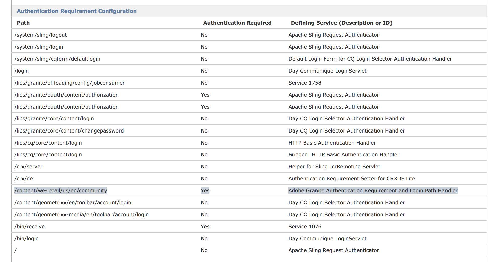

# Closed User Groups in AEM{#closed-user-groups-in-aem}

## Introduction {#introduction}

Since AEM 6.3, there is a new Closed User Group implementation intended to address the performance, scalability, and security issues present with the existing implementation.

>[!NOTE]
>
>For the sake of simplicity, the CUG abbreviation is used throughout this documentation.

The goal of the new implementation is to cover existing functionality where needed while addressing problems and design limitations from older versions. The result is a new CUG design with the following characteristics:

* Clear separation of authentication and authorization elements, which can be used individually or in combination;
* Dedicated authorization model to reflect the restricted read access at the configured CUG trees without interfering with other access control setup and permission requirements;
* Separation between the access control setup of the restricted read access, which is needed on authoring instances, and permission evaluation which is only desired on publish;
* Editing of restricted read access without privilege escalation;
* Dedicated node type extension to mark the authentication requirement;
* Optional login path associated with the authentication requirement.

### The New Custom User Group Implementation {#the-new-custom-user-group-implementation}

A CUG as it is known in the context of AEM consists of the following steps:

* Restrict read access on the tree that must be protected and only allow read for principals that are either listed with a given CUG instance or excluded from the CUG evaluation altogether. This is called the **authorization** element.
* Enforce authentication on a given tree and optionally specify a dedicated login page for that tree that is then excluded. This is called the **authentication** element.

The new implementation has been designed to draw a line between the authentication and the authorization elements. As of AEM 6.3, it is possible to restrict read access without explicitly adding an authentication requirement. For example, if a given instance requires authentication altogether or a given tree already resides in a subtree that requires authentication already.

Equally, a given tree can be marked with an authentication requirement without changing the effective permission setup. The combinations and results are listed in the [Combining CUG Policies and the Authentication Requirement](/help/sites-administering/closed-user-groups.md#combining-cug-policies-and-the-authentication-requirement) section.

## Overview {#overview}

### Authorization: Restricting Read Access {#authorization-restricting-read-access}

The key feature of a CUG is restricting read access on a given tree in the content repository for everyone except selected principals. Instead of manipulating the default access control content on the fly the new implementation takes a different approach by defining a dedicated type of access control policy that represents a CUG.

#### Access Control Policy for CUG {#access-control-policy-for-cug}

This new type of policy has the following characteristics:

* Access control policy of type org.apache.jackrabbit.api.security.authorization.PrincipalSetPolicy (defined by the Apache Jackrabbit API);
* PrincipalSetPolicy grants privileges to a modifiable set of principals;
* The privileges granted and the scope of the policy are an implementation detail.

The implementation of PrincipalSetPolicy used to represent CUGs in addition defines that:

* CUG policies only grant read access to regular JCR items (for example, access control content is excluded);
* The scope is defined by the access-controlled node that holds the CUG policy;
* CUG policies can be nested, a nested CUG starts a new CUG without inheriting the principal set of the 'parent' CUG;
* The effect of the policy, if evaluation is enabled, is inherited to the whole subtree down to the next nested CUG.

These CUG policies are deployed to an AEM instance through a separate authorization module called oak-authorization-cug. This module comes with its own access control management and permission evaluation. In other words, the default AEM setup ships an Oak content repository configuration that combines multiple authorization mechanisms. For more info, see [this page on the Apache Oak Documentation](https://jackrabbit.apache.org/oak/docs/security/authorization/composite.html).

In this composite setup, a new CUG does not replace the existing access control content attached to the target node. Instead, it is a supplement which can also be removed later on without affecting the original access control, that by default in AEM would be an access control list.

In contrast to the former implementation, the new CUG policies are always recognized and treated as access control content. This implies that they are created and edited using the JCR access control management API. For more info, see the [Managing CUG Policies](#managing-cug-policies) section.

#### Permission Evaluation of CUG Policies {#permission-evaluation-of-cug-policies}

Apart from a dedicated access control management for CUGs, the new authorization model lets you conditionally enable permission evaluation for its policies. This lets you set up CUG policies in a staging environment, and only enables evaluation of the effective permissions once replicated to the production environment.

Permission evaluation for CUG policies and the interaction with the default or any additional authorization model follows the pattern designed for multiple authorization mechanisms in Apache Jackrabbit Oak. That is, a given set of permissions is granted if and only if all models grant access. See the [Jackrabbit Oak Documentation](https://jackrabbit.apache.org/oak/docs/security/authorization/composite.html) for more details.

The following characteristics apply for the permission evaluation associated with the authorization model designed to handle and evaluate CUG policies:

* It only handles read permissions for regular nodes and properties, but not reading access control content
* It does not handle write permissions nor any kind of permissions required for modification of protected JCR content (access control, node type information, versioning, locking, or user management among others). These permissions are not affected by a CUG policy and will not be evaluated by the associated authorization model. Whether these permissions are granted depends on the other models configured in the security setup.

The effect of a single CUG policy upon permission evaluation can be summarized as follows:

* Read access is denied for everyone except for subjects containing excluded principals or principals listed in the policy;
* The policy takes effect on the access-controlled node which holds the policy and its properties;
* The effect is also inherited down the hierarchy - that is, the item tree defined by the access-controlled node;
* However, it does neither affect siblings nor ancestors of the access-controlled node;
* The inheritance of a given CUG stops at a nested CUG.

#### Best Practices {#best-practices}

The following best practices should account for defining restricted read access through CUGs:

* Make a conscious decision on whether your need for a CUG is about restricting read access or an authentication requirement. If the latter, or if there is a need for both, consult the section on Best Practices for details regarding the Authentication requirement
* Create a threat model for the data or content that must be protected to identify threat boundaries and get a clear picture about the sensitivity of the data and the roles associated with authorized access
* Model the repository content and CUGs keeping general authorization-related aspects and best practices in mind:

    * Remember that read permission is only granted if a given CUG and the evaluation of other modules deployed in the setup grant allow a given subject to read a given repository item
    * Avoid creating redundant CUGs where read access is already restricted by other authorization modules
    * Excessive need for nested CUGs may potentially highlight issues in the content design
    * Excessive need for CUGs (for example, on every page) may indicate the need for a custom authorization model potentially better suited to match the specific security needs of the application and content at hand.

* Limit the paths supported for CUG policies to a few trees in the repository to allow for optimized performance. For example, only allow CUGs below the /content node as shipped as the default value since AEM 6.3.
* CUG policies are designed to grant read access to a small set of principals. The need for a huge number of principals may highlight issues in the content or application design and should be reconsidered.

### Authentication: Defining the Auth Requirement {#authentication-defining-the-auth-requirement}

The authentication-related parts of the CUG feature let you mark trees that require authentication and optionally specify a dedicated login page. In accordance to the previous version, the new implementation lets you mark trees that require authentication in the content repository. It also conditionally enables synchronization with the `Sling org.apache.sling.api.auth.Authenticator`responsible for ultimately enforcing the requirement and redirecting to a login resource.

These requirements are registered with the Authenticator by an OSGi service that provides the `sling.auth.requirements` registration property. These properties are then used to dynamically extend the authentication requirements. For more details, consult the [Sling documentation](https://sling.apache.org/apidocs/sling7/org/apache/sling/auth/core/AuthConstants.html#AUTH_REQUIREMENTS).

#### Defining the Authentication Requirement with A Dedicated Mixin Type {#defining-the-authentication-requirement-with-a-dedicated-mixin-type}

For security reasons, the new implementation replaces the usage of a residual JCR property by a dedicated mixin type called `granite:AuthenticationRequired`, which defines a single optional property of type STRING for the login path `granite:loginPath`. Only content changes related to this mixin type leads to an update of the requirements registered with Apache Sling Authenticator. The modifications are tracked upon persisting any transient modifications and thus require a `javax.jcr.Session.save()` call to become effective.

The same applies for the `granite:loginPath` property. It is only respected if it is defined by the auth-requirement related mixin type. Adding a residual property with this very name at an unstructured JCR node does not show the desired effect and the property is ignored by the handler responsible for updating the OSGi registration.

>[!NOTE]
>
>Setting the login path property is optional and only needed if the tree which requires authentication cannot fall back to the default or an otherwise inherited login page. See the [Evaluation of Login Path](/help/sites-administering/closed-user-groups.md#evaluation-of-login-path) below.

#### Registering the Authentication Requirement and Login Path With the Sling Authenticator {#registering-the-authentication-requirement-and-login-path-with-the-sling-authenticator}

Since this type of authentication requirement is expected to be limited to certain run modes and to a small subset of trees within the content repository, tracking of the requirement mixin type and the login path properties is conditional. And, it is bound to a corresponding configuration that defines the supported paths (see Configuration Options below). Therefore, only changes within the scope of these supported paths trigger an update of the OSGi registration, elsewhere both the mixin type and the property are ignored.

The default AEM setup now makes use of this configuration by allowing to set the mixin in the author run mode but only have it take effect upon replication to the publish instance. See the [Sling Authentication - Framework](https://sling.apache.org/documentation/the-sling-engine/authentication/authentication-framework.html) documentation for details how Sling enforces the authentication requirement.

Adding the `granite:AuthenticationRequired` mixin type within the configured supported paths cause the OSGi registration of the responsible handler to be updated containing a new, additional entry with the `sling.auth.requirements` property. If a given authentication requirement specifies the optional `granite:loginPath` property, the value is also registered with the Authenticator with a '-' prefix to be excluded from authentication requirement.

#### Evaluation and Inheritance of the Authentication Requirement {#evaluation-and-inheritance-of-the-authentication-requirement}

Apache Sling authentication requirements are inherited through the page or node hierarchy. The very details of the inheritance and the evaluation of the authentication requirements such as order and precedence are considered an implementation detail and will not be documented in this article.

#### Evaluation of Login Path {#evaluation-of-login-path}

The evaluation of the login path and redirect to the corresponding resource upon authentication is an implementation detail of the Adobe Granite Login Selector Authentication Handler ( `com.day.cq.auth.impl.LoginSelectorHandler`), which is an Apache Sling AuthenticationHandler configured with AEM by default.

Upon calling `AuthenticationHandler.requestCredentials` this handler attempts to determine the mapping login page to which the user is redirected. This includes the following steps:

* Distinguish between expired password and need for regular login as reason for the redirect;
* If a regular login, tests if a login path can be obtained in the following order:

    * from the LoginPathProvider as implemented by the new `com.adobe.granite.auth.requirement.impl.RequirementService`,
    * from the old, deprecated CUG implementation,
    * from the Login Page Mappings, as defined with the `LoginSelectorHandler`,
    * and finally, fall back to the Default Login Page, as defined with the `LoginSelectorHandler`.

* When a valid login path was obtained through the calls listed above, the user's request is redirected to that page.

The target of this documentation is the evaluation of the login path as exposed by the internal `LoginPathProvider` interface. The implementation shipped since AEM 6.3 behaves as follows:

* Registration of login paths depends on distinguishing between expired password and need for regular login as reason for the redirect
* If regular login, tests if a login path can be obtained in the following order:

    * from the `LoginPathProvider` as implemented by the new `com.adobe.granite.auth.requirement.impl.RequirementService`,
    * from the old, deprecated CUG implementation,
    * from the Login Page Mappings as defined with the `LoginSelectorHandler`,
    * and finally fall back to the Default Login Page as defined with the `LoginSelectorHandler`.

* When a valid login path was obtained through the calls listed above, the user's request is redirected to that page.

The `LoginPathProvider` as implemented by the new auth-requirement support in Granite exposes login paths as defined by the `granite:loginPath` properties, which in turn are defined by the mixin type as described above. The mapping of the resource path holding the login path and the property value itself is kept in memory and is evaluated to find a suitable login path for other nodes in the hierarchy.

>[!NOTE]
>
>The evaluation is only performed for requests associated with resources that are located with in the configured supported paths. For any other requests the alternative ways of determining the login path will be evaluated.

#### Best Practices {#best-practices-1}

The following best practices should be taken into account when defining authentication requirements:

* Avoid nesting authentication requirements: placing a single auth-requirement marker at the start of a tree should be sufficient and be inherited to the whole subtree defined by the target node. Additional authentication requirements within that tree should be considered redundant and may lead to performance issues while evaluating the authentication requirement within Apache Sling. With the separation of authorization and authentication-related CUG areas, it is possible to restrict read access by CUG or other types of policies while enforcing authentication for the whole tree.
* Model repository content such that authentication requirements apply for the whole tree without the need to exclude nested subtrees from requirement again.
* To avoid specifying, and then registering redundant login paths:

    * rely on inheritance and avoid defining nested login paths,
    * do not set the optional login path to a value that corresponds to the default or an inherited value,
    * application developers should identify which login paths should be configured in the global login-path configurations (both default and mappings) associated with the `LoginSelectorHandler`.

## Representation in the Repository {#representation-in-the-repository}

### CUG Policy Representation in the Repository {#cug-policy-representation-in-the-repository}

The Oak documentation covers the how the new CUG policies are reflected in the repository content. For more information, consult the [Jackrabbit Oak Documentation on Managing Access with CUGs](https://jackrabbit.apache.org/oak/docs/security/authorization/cug.html#Representation_in_the_Repository).

### Authentication Requirement in the Repository {#authentication-requirement-in-the-repository}

The need for a separate authentication requirement is reflected in the repository content with a dedicated mixin node type placed at the target node. The mixin type defines an optional property to specify a dedicated login page for the tree defined by the target node.

The page associated with the login path may be located inside or outside that tree. It is excluded from the authentication requirement.

```java
[granite:AuthenticationRequired]
      mixin
      - granite:loginPath (STRING)
```

## Managing CUG Policies and Authentication Requirement {#managing-cug-policies-and-authentication-requirement}

### Managing CUG Policies {#managing-cug-policies}

The new type of access control policies to restrict read access for a CUG is managed using the JCR access control management API and follows the mechanisms described with the [JCR 2.0 specification](https://developer.adobe.com/experience-manager/reference-materials/spec/jcr/2.0/16_Access_Control_Management.html).

#### Set A New CUG Policy {#set-a-new-cug-policy}

Code to apply a new CUG policy at a node that did not have a CUG set before. Note that `getApplicablePolicies` only returns new policies that have not been set before. At the end, the policy must be written back and changes must be persisted.

```java
String path = [...] // needs to be a supported, absolute path

Principal toAdd1 = [...]
Principal toAdd2 = [...]
Principal toRemove = [...]

AccessControlManager acMgr = session.getAccessControlManager();
PrincipalSetPolicy cugPolicy = null;

AccessControlPolicyIterator it = acMgr.getApplicablePolicies(path);
while (it.hasNext()) {
        AccessControlPolicy policy = it.nextAccessControlPolicy();
        if (policy instanceof PrincipalSetPolicy) {
           cugPolicy = (PrincipalSetPolicy) policy;
           break;
        }
}

if (cugPolicy == null) {
   log.debug("no applicable policy"); // path not supported or no applicable policy (for example,
                                                   // the policy was set before)
   return;
}

cugPolicy.addPrincipals(toAdd1, toAdd2);
cugPolicy.removePrincipals(toRemove));

acMgr.setPolicy(path, cugPolicy); // as of this step the policy can be edited/removed
session.save();
```

#### Edit An Existing CUG Policy {#edit-an-existing-cug-policy}

The following steps are needed to edit an existing CUG policy. The modified policy must be written back and changes must be persisted using `javax.jcr.Session.save()`.

```java
String path = [...] // needs to be a supported, absolute path

Principal toAdd1 = [...]
Principal toAdd2 = [...]
Principal toRemove = [...]

AccessControlManager acMgr = session.getAccessControlManager();
PrincipalSetPolicy cugPolicy = null;

for (AccessControlPolicy policy : acMgr.getPolicies(path)) {
     if (policy instanceof PrincipalSetPolicy) {
        cugPolicy = (PrincipalSetPolicy) policy;
        break;
     }
}

if (cugPolicy == null) {
   log.debug("no policy to edit"); // path not supported or policy not set before
   return;
}

if (cugPolicy.addPrincipals(toAdd1, toAdd2) || cugPolicy.removePrincipals(toRemove)) {
   acMgr.setPolicy(path, cugPolicy);
   session.save();
} else {
     log.debug("cug policy not modified");
}
```

### Retrieve Effective CUG Policies {#retrieve-effective-cug-policies}

The JCR access control management defines a best-effort method to retrieve the policies that take effect at a given path. Because evaluation of CUG policies is conditional and depends on the corresponding configuration to be enabled, calling `getEffectivePolicies` is a convenient way to verify if a given CUG policy is taking effect in a given installation.

>[!NOTE]
>
>The difference between `getEffectivePolicies` and the subsequent code example that walks up the hierarchy to find if a given path is already part of an existing CUG.

```java
String path = [...] // needs to be a supported, absolute path

AccessControlManager acMgr = session.getAccessControlManager();
PrincipalSetPolicy cugPolicy = null;

// log an debug message of all CUG policies that take effect at the given path
// there could be zero, one or many (creating nested CUGs is possible)
for (AccessControlPolicy policy : acMgr.getEffectivePolicies(path) {
     if (policy instanceof PrincipalSetPolicy) {
        String policyPath = "-";
        if (policy instanceof JackrabbitAccessControlPolicy) {
           policyPath = ((JackrabbitAccessControlPolicy) policy).getPath();
        }
        log.debug("Found effective CUG for path '{}' at '{}', path, policyPath);
     }
}
```

#### Retrieve Inherited CUG Policies {#retrieve-inherited-cug-policies}

Finding all nested CUGs that have been defined at a given path irrespective on whether they take effect or not. For more info, see the [Configuration Options](/help/sites-administering/closed-user-groups.md#configuration-options) section.

```java
String path = [...]

List<AccessControlPolicy> cugPolicies = new ArrayList<AccessControlPolicy>();
while (isSupportedPath(path)) {
     for (AccessControlPolicy policy : acMgr.getPolicies(path)) {
         if (policy instanceof PrincipalSetPolicy) {
            cugPolicies.add(policy);
         }
      }
      path = (PathUtils.denotesRoot(path)) ? null : PathUtils.getAncestorPath(path, 1);
}
```

#### Managing CUG Policies by Principal {#managing-cug-policies-by-pincipal}

The extensions defined by `JackrabbitAccessControlManager` that let you edit access control policies by principal are not implemented with CUG access control management, as by definition a CUG policy always affects all principals: those listed with the `PrincipalSetPolicy` are being granted read access while all other principals will be prevented to read content in the tree defined by the target node.

The corresponding methods always return an empty policy array but will not throw exceptions.

### Managing the Authentication Requirement {#managing-the-authentication-requirement}

The creation, modification, or removal of a new authentication requirement is achieved by changing the effective node type of the target node. The optional login path property can then be written using regular JCR API.

>[!NOTE]
>
>The modifications to a given target node mentioned above will only be reflected on the Apache Sling Authenticator if the `RequirementHandler` has been configured and the target is contained in the trees defined by the supported paths (see section Configuration Options).
>
>For more info, see [Assigning Mixin Node Types](https://docs.adobe.com/docs/en/spec/jcr/2.0/10_Writing.html#10.10.3 Assigning Mixin Node Types) and [Adding Nodes and Setting Properties](https://docs.adobe.com/docs/en/spec/jcr/2.0/10_Writing.html#10.4 Adding Nodes and Setting Properties)

#### Adding a New Auth Requirement {#adding-a-new-auth-requirement}

Steps to create an authentication requirement are detailed below. The requirement is only registered with the Apache Sling Authenticator if the `RequirementHandler` has been configured for the tree containing the target node.

```java
Node targetNode = [...]

targetNode.addMixin("granite:AuthenticationRequired");
session.save();
```

#### Add a New Auth Requirement with Login Path {#add-a-new-auth-requirement-with-login-path}

Steps to create an authentication requirement including a login path. The requirement and the exclusion for the login path is only registered with the Apache Sling Authenticator if the `RequirementHandler` has been configured for the tree containing the target node.

```java
Node targetNode = [...]
String loginPath = [...] // STRING property

Node targetNode = session.getNode(path);
targetNode.addMixin("granite:AuthenticationRequired");

targetNode.setProperty("granite:loginPath", loginPath);
session.save();
```

#### Modify an Existing Login Path {#modify-an-existing-login-path}

Steps to change an existing login path are detailed below. The modification is only registered with the Apache Sling Authenticator if the `RequirementHandler` has been configured for the tree containing the target node. The previous login path value is removed from the registration. The auth requirement associated with the target node is not affected by this modification.

```java
Node targetNode = [...]
String newLoginPath = [...] // STRING property

if (targetNode.isNodeType("granite:AuthenticationRequired")) {
   targetNode.setProperty("granite:loginPath", newLoginPath);
   session.save();
} else {
     log.debug("cannot modify login path property; mixin type missing");
}
```

#### Remove an Existing Login Path {#remove-an-existing-login-path}

Steps to remove an existing login path. The login path entry will only be unregistered from the Apache Sling Authenticator if the `RequirementHandler` has been configured for the tree containing the target node. The auth requirement associated with the target node is not affected.

```java
Node targetNode = [...]

if (targetNode.hasProperty("granite:loginPath") &&
   targetNode.isNodeType("granite:AuthenticationRequired")) {
   targetNode.setProperty("granite:loginPath", null);
   session.save();
} else {
     log.debug("cannot remove login path property; mixin type missing");
}
```

Or, you can use the below method for achieving the same purpose:

```java
String path = [...] // absolute path to target node

String propertyPath = PathUtils.concat(path, "granite:loginPath");
if (session.propertyExists(propertyPath)) {
    session.getProperty(propertyPath).remove();
    // or: session.removeItem(propertyPath);
    session.save();
}
```

#### Remove an Auth Requirement {#remove-an-auth-requirement}

Steps to remove an existing authentication requirement. The requirement will only be unregistered from the Apache Sling Authenticator if the `RequirementHandler` has been configured for the tree containing the target node.

```java
Node targetNode = [...]
targetNode.removeMixin("granite:AuthenticationRequired");

session.save();
```

#### Retrieve Effective Auth Requirements {#retrieve-effective-auth-requirements}

There is no dedicated public API to read all effective authentication requirements as registered with the Apache Sling Authenticator. However, the list is exposed in the system console at `https://<serveraddress>:<serverport>/system/console/slingauth` under the "**Authentication Requirement Configuration**" section.

The following image shows the authentication requirements of an AEM publish instance with demo content. The highlighted path of the community page illustrates how a requirement added by the implementation described in this document is reflected in the Apache Sling Authenticator.

>[!NOTE]
>
>In this example the optional login path property was not set. Therefore, no second entry has been registered with the authenticator.



#### Retrieve the Effective Login Path {#retrieve-the-effective-login-path}

There is currently no public API to retrieve the login path that takes effect upon anonymously accessing a resource that requires authentication. See section Evaluation of Login Path for implementation details on how the login path is retrieved.

Note however, that apart from the login paths defined with this feature there are alternative ways to specify the redirect to the login, which should be taken into consideration when designing the content model and the authentication requirements of a given AEM installation.

#### Retrieve the Inherited Auth Requirement {#retrieve-the-inherited-auth-requirement}

Like with the login path, there is no public API to retrieve the inherited authentication requirements defined in the content. The following sample illustrates how to list all authentication requirements that have been defined with a given hierarchy irrespective on whether they take effect or not. For more info, see [Configuration Options](/help/sites-administering/closed-user-groups.md#configuration-options).

>[!NOTE]
>
>It is recommended to rely on the inheritance mechanism both for authentication requirements and login path and avoid creation of nested auth requirements.
>
>For more information see [Evaluation and Inheritance of Authentication Requirement](#evaluation-and-inheritance-of-the-authentication-requirement), [Evaluation of Login Path](#evaluation-of-login-path) and [Best Practices](#best-practices).

```java
String path = [...]
Node node = session.getNode(path);

Map<String, String> authRequirements = new ArrayList<String, String>();
while (isSupported(node)) {
     if (node.isNodeType("granite:AuthenticationRequired")) {
         String loginPath = (node.hasProperty("granite:loginPath") ?
                                     node.getProperty("granite:loginPath").getString() :
                                     "";
        authRequirements.put(node.getPath(), loginPath);
        node = node.getParent();
     }
}
```

### Combining CUG Policies and the Authentication Requirement {#combining-cug-policies-and-the-authentication-requirement}

The following table lists the valid combinations of CUG policies and the authentication requirement in an AEM instance that has both modules enabled through configuration.

| **Authentication Required** |**Login Path** |**Restricted Read Access** |**Expected Effect** |
|---|---|---|---|
| Yes |Yes |Yes |A given user will only be able to view the subtree marked with the CUG policy if effective permission evaluation grants access. An unauthenticated user is redirected to the specified login page.  |
| Yes |No |Yes |A given user will only be able to view the subtree marked with the CUG policy if effective permission evaluation grants access. An unauthenticated user is redirected to an inherited default login page.  |
| Yes |Yes |No |An unauthenticated user is redirected to the specified login page. Whether it is allowed to view the tree marked with the auth-requirement depends on the effective permissions of the individual items contained in that subtree. No dedicated CUG restricting read access in place.  |
| Yes |No |No |An unauthenticated user is redirected to an inherited default login page. Whether it is allowed to view the tree marked with the auth requirement depends on the effective permissions of the individual items contained in that subtree. No dedicated CUG restricting read access in place. |
| No |No |Yes |A given authenticated or unauthenticated user can only view the subtree marked with the CUG policy if effective permission evaluation grants access. An unauthenticated user is treated equally and is not redirected to log in.  |

>[!NOTE]
>
>The combination of 'Authentication Requirement' = No and 'Login Path' = Yes is not listed above as the 'Login Path' is an optional attribute associated with an Auth-Requirement. Specifying a JCR property with that name without adding the defining mixin type has no effect and is ignored by the corresponding handler.

## OSGi Components and Configuration {#osgi-components-and-configuration}

This section provides an overview to the OSGi components and the individual configuration options introduced with the new CUG implementation.

See also the CUG-mapping documentation for a comprehensive mapping of the configuration options between the old and the new implementation.

### Authorization: Setup and Configuration {#authorization-setup-and-configuration}

The new, authorization-related parts are contained in the **Oak CUG Authorization** bundle ( `org.apache.jackrabbit.oak-authorization-cug`), which is part of the AEM default installation. The bundle defines a separated authorization model aimed to be deployed as an additional way to manage read access.

#### Setting Up CUG Authorization {#setting-up-cug-authorization}

Setting up CUG authorization is described in detail in the [relevant Apache Documentation](https://jackrabbit.apache.org/oak/docs/security/authorization/cug.html#pluggability). By default, AEM has CUG authorization deployed in all run modes. The step-by-step instructions may also be used to disable CUG authorization in those installations that require a different authorization setup.

#### Configuring the Referrer Filter {#configuring-the-referrer-filter}

You must also configure the [Sling Referrer Filter](/help/sites-administering/security-checklist.md#the-sling-referrer-filter) with all hostnames that may be used to access AEM; for example, via CDN, Load Balancer, and any others.

If the referrer filter is not configured, then errors, similar to the following, are seen when a user tries to log in to a CUG site:

```shell
31.01.2017 13:49:42.321 *INFO* [qtp1263731568-346] org.apache.sling.security.impl.ReferrerFilter Rejected referrer header for POST request to /libs/granite/core/content/login.html/j_security_check : https://hostname/libs/granite/core/content/login.html?resource=%2Fcontent%2Fgeometrixx%2Fen%2Ftest-site%2Ftest-page.html&$$login$$=%24%24login%24%24&j_reason=unknown&j_reason_code=unknown
```

#### Characteristics of OSGi Components {#characteristics-of-osgi-components}

The following two OSGi components have been introduced to define authentication requirements and specify dedicated login paths:

* `org.apache.jackrabbit.oak.spi.security.authorization.cug.impl.CugConfiguration`
* `org.apache.jackrabbit.oak.spi.security.authorization.cug.impl.CugExcludeImpl`

**org.apache.jackrabbit.oak.spi.security.authorization.cug.impl.CugConfiguration**

<table>
 <tbody>
  <tr>
   <td>Label</td>
   <td>Apache Jackrabbit Oak CUG Configuration</td>
  </tr>
  <tr>
   <td>Description</td>
   <td>Authorization configuration dedicated to setup and evaluate CUG permissions.</td>
  </tr>
  <tr>
   <td>Configuration Properties</td>
   <td>
    <ul>
     <li><code>cugSupportedPaths</code></li>
     <li><code>cugEnabled</code></li>
     <li><code>configurationRanking</code></li>
    </ul> <p>Also, see <a href="#configuration-options">Configuration Options</a> below.</p> </td>
  </tr>
  <tr>
   <td>Configuration Policy</td>
   <td><code>ConfigurationPolicy.REQUIRE</code></td>
  </tr>
  <tr>
   <td>References</td>
   <td><code>CugExclude (ReferenceCardinality.OPTIONAL_UNARY)</code></td>
  </tr>
 </tbody>
</table>

**org.apache.jackrabbit.oak.spi.security.authorization.cug.impl.CugExcludeImpl**

<table>
 <tbody>
  <tr>
   <td>Label</td>
   <td>Apache Jackrabbit Oak CUG Exclude List</td>
  </tr>
  <tr>
   <td>Description</td>
   <td>Lets you exclude principals with the configured names from CUG evaluation.</td>
  </tr>
  <tr>
   <td>Configuration Properties</td>
   <td>
    <ul>
     <li><code>principalNames</code></li>
    </ul> <p>Also see section Configuration Options below.</p> </td>
  </tr>
  <tr>
   <td>Configuration Policy</td>
   <td><code>ConfigurationPolicy.REQUIRE</code></td>
  </tr>
  <tr>
   <td>References</td>
   <td>NA</td>
  </tr>
 </tbody>
</table>

#### Configuration Options {#configuration-options}

The key configuration options are:

* `cugSupportedPaths`: specify the subtrees that may contain CUGs. No default value is set
* `cugEnabled`: configuration option to enable permission evaluation for the present CUG policies.

The available configuration options associated with the CUG-authorization module are listed and described in more detail at the [Apache Oak Documentation](https://jackrabbit.apache.org/oak/docs/security/authorization/cug.html#configuration).

#### Excluding Principals From CUG Evaluation {#excluding-principals-from-cug-evaluation}

Exempting individual principals from CUG evaluation has been adopted from the former implementation. The new CUG authorization covers this with a dedicated interface named CugExclude. Apache Jackrabbit Oak 1.4 ships with a default implementation that excludes a fixed set of principals and an extended implementation that lets you configure individual principal names. The latter is configured in AEM publish instances.

The default since AEM 6.3 prevents the following principals from being affected by CUG policies:

* administrative principals (admin user, administrators group)
* service user principals
* repository internal system principal

For more info, see the table in the [Default Configuration since AEM 6.3](#default-configuration-since-aem) section below.

The exclusion of the 'administrators' group can be altered or expanded in the system console in the configuration section of **Apache Jackrabbit Oak CUG Exclude List**.

Alternatively, it is possible to provide and deploy a custom implementation of the CugExclude interface to adjust the set of excluded principals if there are special needs. See the documentation on [CUG pluggability](https://jackrabbit.apache.org/oak/docs/security/authorization/cug.html#pluggability) for details and an example implementation.

### Authentication: Setup and Configuration {#authentication-setup-and-configuration}

The new, authentication-related parts are contained in the **Adobe Granite Authentication Handler** bundle ( `com.adobe.granite.auth.authhandler` version 5.6.48). This bundle is part of the AEM default installation.

To set up the authentication requirement replacement for the deprecated CUG support, some OSGi components must be present and active in a given AEM installation. For more details, see **Characteristics of OSGi Components** below.

>[!NOTE]
>
>Due to the mandatory configuration option with the RequirementHandler, the authentication-related parts will only be active if the feature has been enabled by specifying a set of supported paths. With a standard AEM installation the feature is disabled in author run mode and enabled for /content in publish run mode.

**Characteristics of OSGi Components**

The following two OSGi components have been introduced to define authentication requirements and specify dedicated login paths:

* `com.adobe.granite.auth.requirement.impl.RequirementService`
* `com.adobe.granite.auth.requirement.impl.DefaultRequirementHandler`

**com.adobe.granite.auth.requirement.impl.RequirementService**

<table>
 <tbody>
  <tr>
   <td>Label</td>
   <td>-</td>
  </tr>
  <tr>
   <td>Description</td>
   <td>Dedicated OSGi service for authentication requirements that registers an observer for content changes affecting auth-requirement (through the <code>granite:AuthenticationRequirement</code> mixin type) and login paths with are exposed to the <code>LoginSelectorHandler</code>. </td>
  </tr>
  <tr>
   <td>Configuration Properties</td>
   <td>-</td>
  </tr>
  <tr>
   <td>Configuration Policy</td>
   <td><code>ConfigurationPolicy.OPTIONAL</code></td>
  </tr>
  <tr>
   <td>References</td>
   <td>
    <ul>
     <li><code>RequirementHandler (ReferenceCardinality.MANDATORY_UNARY)</code></li>
     <li><code>Executor (ReferenceCardinality.MANDATORY_UNARY)</code></li>
    </ul> </td>
  </tr>
 </tbody>
</table>

**com.adobe.granite.auth.requirement.impl.DefaultRequirementHandler**

| Label |Adobe Granite Authentication Requirement and Login Path Handler |
|---|---|
| Description | `RequirementHandler` implementation that updates the Apache Sling authentication requirements and the corresponding exclusion for the associated login paths.  |
| Configuration Properties | `supportedPaths` |
| Configuration Policy | `ConfigurationPolicy.REQUIRE` |
| References |NA |

#### Configuration Options {#configuration-options-1}

The authentication-related parts of the CUG rewrite only come with a single configuration option associated with the Adobe Granite Authentication Requirement and Login Path Handler:

**"Authentication Requirement and Login Path Handler"**

<table>
 <tbody>
  <tr>
   <td>Property</td>
   <td>Type</td>
   <td>Default Value</td>
   <td>Description</td>
  </tr>
  <tr>
   <td><p>Label = Supported Paths</p> <p>Name = 'supportedPaths'</p> </td>
   <td>Set&lt;String&gt;</td>
   <td>-</td>
   <td>Paths under which authentication requirements will be respected by this handler. Leave this configuration unset if you want to add the <code>granite:AuthenticationRequirement</code> mixin type to nodes without having them enforced (for example, on author instances). If missing, the feature is disabled. </td>
  </tr>
 </tbody>
</table>

## Default Configuration since AEM 6.3 {#default-configuration-since-aem}

New installations of AEM will by default use the new implementations both for the authorization and authentication-related parts of the CUG feature. The old implementation "Adobe Granite Closed User Group (CUG) Support" has been deprecated and will by default be disabled in all AEM installations. The new implementations will instead be enabled as follows:

### Author Instances {#author-instances}

| **"Apache Jackrabbit Oak CUG Configuration"** |**Explanation** |
|---|---|
| Supported Paths `/content` | Access control management for CUGpolicies is enabled. |
| CUG Evaluation Enabled FALSE | Permission evaluation is disabled. CUG policies take no effect. |
| Ranking \|200 | See Oak documentation. |

>[!NOTE]
>
>No configuration for **Apache Jackrabbit Oak CUG Exclude List** and **Adobe Granite Authentication Requirement and Login Path Handler** is present on default authoring instances.

### Publish Instances {#publish-instances}

| **"Apache Jackrabbit Oak CUG Configuration"** |**Explanation** |
|---|---|
| Supported Paths `/content` | Access control management for CUG policies is enabled below the configured paths.  |
| CUG Evaluation Enabled TRUE | Permission evaluation is enabled below the configured paths. CUG policies take effect upon `Session.save()`. |
| Ranking \|200 | See Oak documentation. |

| **"Apache Jackrabbit Oak CUG Exclude List"** |**Explanation** |
|---|---|
| Principal Names administrators | Excludes administrators principal from CUG evaluation. |

| **"Adobe Granite Authentication Requirement and Login Path Handler"** |**Explanation** |
|---|---|
| Supported Paths  `/content` | Authentication requirements as defined in the repository by the `granite:AuthenticationRequired` mixin type take effect below `/content` upon `Session.save()`. Sling Authenticator gets updated. Adding the mixin type outside of the supported paths is ignored. |

## Disabling CUG Authorization and Authentication Requirement {#disabling-cug-authorization-and-authentication-requirement}

The new implementation may be disabled altogether in case a given installation does not use CUGs or uses different means for authentication and authorization.

### Disable CUG Authorization {#disable-cug-authorization}

Consult the [CUG pluggability](https://jackrabbit.apache.org/oak/docs/security/authorization/cug.html#pluggability) documentation for details on how to remove the CUG authorization model from the composite authorization setup.

### Disable the Authentication Requirement {#disable-the-authentication-requirement}

To disable support for the authentication requirement as provided by the `granite.auth.authhandler` module, it is sufficient to remove the configuration associated with **Adobe Granite Authentication Requirement and Login Path Handler**.

>[!NOTE]
>
>Note however, that removing the configuration will not unregister the mixin type, which was still applicable to nodes without taking effect.

## Interaction with other Modules {#interaction-with-other-modules}

### Apache Jackrabbit API {#apache-jackrabbit-api}

To reflect the new type of access control policy used by the CUG authorization model, the API defined by Apache Jackrabbit has been extended. Since version 2.11.0 of the `jackrabbit-api` module defines a new interface called `org.apache.jackrabbit.api.security.authorization.PrincipalSetPolicy`, which extends from `javax.jcr.security.AccessControlPolicy`.

### Apache Jackrabbit FileVault {#apache-jackrabbit-filevault}

The import mechanism of Apache Jackrabbit FileVault has been adjusted to deal with access control policies of type `PrincipalSetPolicy`.

### Apache Sling Content Distribution {#apache-sling-content-distribution}

See the above [Apache Jackrabbit FileVault](/help/sites-administering/closed-user-groups.md#apache-jackrabbit-filevault) section.

### Adobe Granite Replication {#adobe-granite-replication}

The replication module has been slightly adjusted to be able to replicate the CUG policies between different AEM instances:

* `DurboImportConfiguration.isImportAcl()` is interpreted literally and will only affect access control policies implementing `javax.jcr.security.AccessControlList`

* `DurboImportTransformer` will only respect this configuration for true ACLs
* Other policies such as `org.apache.jackrabbit.api.security.authorization.PrincipalSetPolicy` instances created by the CUG authorization model will always get replicated and the configuration option `DurboImportConfiguration.isImportAcl`() will be ignored.

There is one limitation of replicating CUG policies. If a given CUG policy gets removed without removing the corresponding mixin node type `rep:CugMixin,` the removal will not be reflected upon replication. This has been addressed by always removing the mixin upon policy removal. The limitation may nevertheless show up if the mixin type is manually added.

### Adobe Granite Authentication Handler {#adobe-granite-authentication-handler}

The authentication handler **Adobe Granite HTTP Header Authentication Handler** shipped with the `com.adobe.granite.auth.authhandler` bundle holds a reference to the `CugSupport` interface defined by the same module. It is used to calculate the 'realm' in certain circumstances, falling back to the realm configured with the handler.

This has been adjusted to make the reference to `CugSupport` optional to ensure maximal backwards compatibility if a given setup decides to re-enable the deprecated implementation. Installations using the implementation will no longer get the realm extracted from the CUG implementation but will always display the realm as defined with **Adobe Granite HTTP Header Authentication Handler**.

>[!NOTE]
>
>By default, the **Adobe Granite HTTP Header Authentication Handler** is only configured in publish run mode with the "Disable Login Page" ( `auth.http.nologin`) option enabled.

### AEM LiveCopy {#aem-livecopy}

Configuring CUGs with LiveCopy is represented in the repository by the addition of one extra node and one extra property as follows:

* `/content/we-retail/us/en/blueprint/rep:cugPolicy`
* `/content/we-retail/us/en/LiveCopy@granite:loginPath`

Both of these elements are created under the `cq:Page`. With the current design, MSM only handles nodes and properties that are under the `cq:PageContent` (`jcr:content`) node.

Therefore, CUG groups cannot be rolled out to Live Copies from Blueprints. Plan around this when configuring Live Copy.

## Changes with the New CUG Implementation {#changes-with-the-new-cug-implementation}

The aim of this section is to provide an overview of the changes made to the CUG feature and a comparison between the old and the new implementation. It lists the changes affecting the way CUG support is configured and describes how and by whom CUGs are managed in the repository content.

### Differences in CUG Setup and Configuration {#differences-in-cug-setup-and-configuration}

The deprecated OSGi component **Adobe Granite Closed User Group (CUG) Support** ( `com.day.cq.auth.impl.cug.CugSupportImpl`) has been replaced by new components to be able to separately handle authorization and authentication-related parts of the former CUG functionality.

## Differences in Managing CUGs in the Repository Content {#differences-in-managing-cugs-in-the-repository-content}

The following sections describe the differences between the old and the new implementations from the implementation and security perspectives. While the new implementation aims to provide the same functionality, there are subtle changes that are important to know when using the new CUG.

### Differences With Regard To Authorization {#differences-with-regards-to-authorization}

The main differences from an authorization perspective are summarized in the list below:

**Dedicated Access Control Content For CUGs**

In the old implementation the default authorization model was used to manipulate access control list policies on publish, replacing any existing ACEs by the setup mandated by the CUG. This was triggered by writing regular, residual JCR properties which were interpreted on publish.

With the new implementation the access control setup of the default authorization model is not affected by any CUG being created, modified, or removed. Instead a new type of policy called `PrincipalSetPolicy` is applied as additional access control content to the target node. This additional policy is located as a child of the target node and would be a sibling of the default policy node if present.

**Editing CUG Policies In Access Control Management**

This move from residual JCR properties to a dedicated access control policy has an impact on the permission needed to create or modify the authorization part of the CUG feature. Since this is considered a modification to access control content, it requires `jcr:readAccessControl` and `jcr:modifyAccessControl` privileges to be written to the repository. Therefore, only content authors entitled to modify the access control content of a page can set up or modify this content. This contrasts to the old implementation where the ability to write regular JCR properties was sufficient, resulting in a privilege escalation.

**Target Node Defined By Policy**

Create CUG policies at the JCR node defining the subtree to be subject to restricted read access. This is likely to be a AEM page in case the CUG is expected to affect the whole tree.

Placing the CUG policy only at the jcr:content node located below a given page only restricts access to the content s.str of a given page but will not take effect on any siblings or child pages. This may be a valid use case and it is possible to achieve with a repository editor that lets you apply fine grained access content. However, it contrasts the former implementation where placing a cq:cugEnabled property on the jcr:content node was internally remapped to the page node. This mapping is no longer performed.

**Permission Evaluation With CUG Policies**

Moving from the old CUG support to an additional authorization model, changes the way effective read permissions are evaluated. As described in the [Jackrabbit documentation](https://jackrabbit.apache.org/oak/docs/security/authorization/composite.html), a given principal allowed to view the `CUGcontent` will only be granted read access if the permission evaluation of all models configured in the Oak repository grant read-access.

In other words, for the evaluation of the effective permissions, both the `CUGPolicy` and the default access control entries are taken into account and read access on the CUG content is only granted if it is granted by both types of policies. In a default AEM publish installation where read access to the complete `/content` tree is granted for everyone, the effect of the CUG policies is the same as with the old implementation.

**On-Demand Evaluation**

The CUG authorization model lets you individually turn on access control management and permission evaluation:

* access control management is enabled if the module has one or many supported paths where CUGs can be created
* permission evaluation is only enabled if option **CUG Evaluation Enabled** is also checked.

In the new AEM default setup evaluation of CUG policies, it is only enabled with the 'publish' run mode. See the details on the [default configuration since AEM 6.3](#default-configuration-since-aem) for more details. This can be verified by comparing the effective policies for a given path to the policies stored in the content. Effective policies will only be shown in case permission evaluation for CUGs is enabled.

As explained above the CUG access control policies are now always stored in the content but evaluation of the effective permissions that result from those policies will only be enforced if **CUG Evaluation Enabled** is turned on in the system console at Apache Jackrabbit Oak **CUG Configuration.** By default, it is enabled with the 'publish' run mode only.

### Differences With Regard To Authentication {#differences-with-regards-to-authentication}

The differences regarding authentication are described below.

#### Dedicated Mixin Type For Authentication Requirement {#dedicated-mixin-type-for-authentication-requirement}

In the former implementation both the authorization and authentication aspects of a CUG were triggered by a single JCR property ( `cq:cugEnabled`). As far as authentication is concerned this resulted in an updated list of authentication requirements as stored with the Apache Sling Authenticator implementation. With the new implementation, the same result is achieved by marking the target node with a dedicated mixin type ( `granite:AuthenticationRequired`).

#### Property For Excluding Login Path {#property-for-excluding-login-path}

The mixin type defines a single, optional property called `granite:loginPath`, which basically corresponds to the `cq:cugLoginPage` property. In contrast to the previous implementation, the login path property is only respected if its declaring node type is the mentioned mixin. Adding a property with that name without setting the mixin type has no effect and neither a new requirement nor an exclusion for the login path is reported to the authenticator.

#### Privilege For Authentication Requirement {#privilege-for-authentication-requirement}

Adding or removing a mixin type requires `jcr:nodeTypeManagement` privilege being granted. In the previous implementation, the `jcr:modifyProperties` privilege is used to edit the residual property.

As far as the `granite:loginPath` is concerned the same privilege is required to add, modify, or remove the property.

#### Target Node Defined By Mixin Type {#target-node-defined-by-mixin-type}

Create authentication requirements at the JCR node defining the subtree to be subject to enforced login. This is likely to be an AEM Page in case the CUG is expected to affect the whole tree and the UI for the new implementation therefore adds the auth-requirement mixin type on the page node.

Placing the CUG policy only at the jcr:content node located below a given page only restricts access to the contents. However, it does not take affect on the page node itself nor on any child pages.

This may be a valid scenario and is possible with a repository editor that lets you place the mixin at any node. However, the behavior contrasts the former implementation, where placing a cq:cugEnabled or cq:cugLoginPage property on the jcr:content node was internally remapped ultimately to the page node. This mapping is no longer performed.

#### Configured Supported Paths {#configured-supported-paths}

Both the `granite:AuthenticationRequired` mixin type and the granite:loginPath property will only be respected within the scope defined by the set of **Supported Paths** configuration option present with the **Adobe Granite Authentication Requirement and Login Path Handler**. If no paths are specified, the authentication requirement feature is disabled altogether. In this case mixin type nor property take effect when being added or set to a given JCR node.

### Mapping of JCR Content, OSGi Services, and Configurations {#mapping-of-jcr-content-osgi-services-and-configurations}

The document below provides a comprehensive mapping of OSGi services, configurations, and repository content between the old and the new implementation.

CUG Mapping since AEM 6.3

[Get File](assets/cug-mapping.pdf)

## Upgrade CUG {#upgrade-cug}

### Existing Installations Using the Deprecated CUG {#existing-installations-using-the-deprecated-cug}

The old CUG support implementation has been deprecated and will be removed for in future versions. It is recommended to move to the new implementations when upgrading from versions older than AEM 6.3.

For upgraded AEM installation, it is important to ensure that only one CUG implementation is enabled. The combination of the new and the old, deprecated CUG support is not tested and is likely to cause undesired behavior:

* collisions in the Sling Authenticator regarding authentication requirements
* denied read access when the ACL setup associated with old CUG collides with a new CUG policy.

### Migrating Existing CUG Content {#migrating-existing-cug-content}

Adobe provides a tool for migrating to the new CUG implementation. To use it, perform the following steps:

1. Go to `https://<serveraddress>:<serverport>/system/console/cug-migration` to access the tool.
1. Enter the root path that you want to check CUGs for, and press the **Perform dry-run** button. This scans for CUGs eligible for conversion in the selected location.
1. After you have reviewed the results, press the **Perform migration** button to migrate to the new implementation.

>[!NOTE]
>
>If you run into issues, it is possible to set up a specific logger at **DEBUG** level on `com.day.cq.auth.impl.cug` to get the output of the migration tool. See [Logging](/help/sites-deploying/configure-logging.md) for more information on how to do this.
