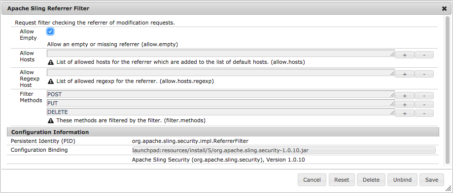

# Configuring for AEM Apps{#configuring-for-aem-apps}

Adobe Experience Manager Apps lets you update the content of your application OTA (over the air). The updated content is stored on the publish instance. To allow the App on your device to connect to the publish instance and check for updates, the publish instance must be configured to allow an empty referrer header.

## Configuring Empty Referrer Header {#configuring-empty-referrer-header}

To configure the referrer filter service:

* Open the Apache Felix console (**Configurations**) at:
* https://&lt;server&gt;:&lt;port_number&gt;/system/console/configMgr
* Login as admin.
* In the **Configurations** menu, select: *Apache Sling Referrer Filter*
* Check the Allow Empty field so you can allow empty/missing referrer headers.
* Click **Save** to save your changes.

See the [OSGI Configuration Settings](/help/sites-deploying/osgi-configuration-settings.md) and [Security Checklist - Issues with Cross-Site Request Forgery](/help/sites-administering/security-checklist.md#protect-against-cross-site-request-forgery) for further details.
