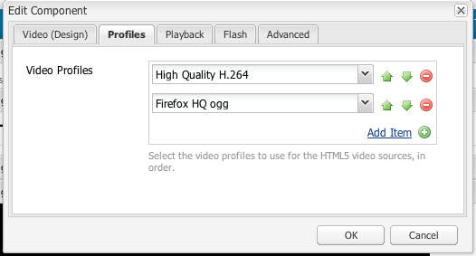

# Configure the Video component {#configure-the-video-component}

The [Video component](/help/sites-authoring/default-components-foundation.md#video) lets you place a predefined, out-of-the-box video asset on your page.

For proper transcoding to occur, an administrator installs FFmpeg separately. See [Install FFmpeg and configure AEM](#install-ffmpeg). Administrators also [Configure Video Profiles](#configure-video-profiles) for use with HTML5 elements.

>[!CAUTION]
>
>This Foundation Component has been deprecated. Adobe recommends using the [Core Components Embed Component](https://experienceleague.adobe.com/docs/experience-manager-core-components/using/wcm-components/embed.html) instead.

>[!CAUTION]
>
>This component is no longer expected to function out-of-the-box without extensive project-level customization.

## Configure video profiles {#configure-video-profiles}

For use of HTML5 elements, define video profiles. Those chosen here are used in order. To access, use [Design Mode](/help/sites-authoring/default-components-designmode.md) (Classic UI only) and select the **[!UICONTROL Profiles]** tab:

From this dialog, you can also configure the design of the Video component and parameters for [!UICONTROL Playback], [!UICONTROL Flash], and [!UICONTROL Advanced].

## Install FFmpeg and configure AEM {#install-ffmpeg}

The Video component relies on the third-party open-source product FFmpeg for transcoding of videos. Downloaded from [https://ffmpeg.org/](https://ffmpeg.org/). After installing FFmpeg, configure AEM to use a specific audio codec and specific runtime options.

To install FFmpeg on **Windows**, follow these steps:

1. Download the compiled binary as `ffmpeg.zip`.
1. Unarchive to a folder.
1. Set the system environment variable `PATH` to <*your-ffmpeg-location*>`\bin`.
1. Restart AEM.

To install FFmpeg on **macOS X**, follow these steps:

1. Install Xcode available at [developer.apple.com/xcode](https://developer.apple.com/xcode/).
1. Install available at [XQuartz](https://www.xquartz.org) to get [X11](https://support.apple.com/en-us/100724).
1. Install MacPorts available at [www.macports.org](https://www.macports.org/).
1. In the console, run `sudo port install ffmpeg` command and follow the on-screen instructions. Ensure that the path of the `FFmpeg` executable is added to the `PATH` system variable.

To install FFmpeg on **macOS X 10.6**, using the pre-compiled version, follow these steps:

1. Download the precompiled version.
1. Unarchive it to the `/usr/local` directory.
1. In the console, run `sudo ln -s /usr/local/Cellar/ffmpeg/0.6/bin/ffmpeg /usr/bin/ffmpeg`. Change the path as appropriate.

To **configure AEM**, follow these steps:

>[!NOTE]
>
>These steps are only necessary if further customization of codecs is required.

1. Open [!UICONTROL CRXDE Lite] in your web browser. Access [http://localhost:4502/crx/de](http://localhost:4502/crx/de).
2. Select the `/libs/settings/dam/video/format_aac/jcr:content` node and ensure that the node properties are as follows:

   * `audioCodec` is `aac`.
   * `customArgs` is `-flags +loop -me_method umh -g 250 -qcomp 0.6 -qmin 10 -qmax 51 -qdiff 4 -bf 16 -b_strategy 1 -i_qfactor 0.71 -cmp chroma -subq 8 -me_range 16 -coder 1 -sc_threshold 40 -b-pyramid normal -wpredp 2 -mixed-refs 1 -8x8dct 1 -fast-pskip 1 -keyint_min 25 -refs 4 -trellis 1 -direct-pred 3 -partitions i8x8,i4x4,p8x8,b8x8`.

3. To customize the configuration, create an overlay in `/apps/settings/` node and move the same structure under `/conf/global/settings/` node. It cannot be edited in `/libs` node. For example, to overlay path `/libs/settings/dam/video/fullhd-bp`, create it at `/conf/global/settings/dam/video/fullhd-bp`.

   >[!NOTE]
   >
   >Overlay and edit the entire profile-node and not just the property that needs modification. Such resources are not resolved via SlingResourceMerger.

4. If you changed either of the properties, click **[!UICONTROL Save All]**.

>[!NOTE]
>
>Changes to the default out-of-the-box workflow models are not preserved when you upgrade your AEM instance. Adobe recommends that you copy the modified workflow models before edit those. For example, copy the out-of-the-box [!UICONTROL DAM Update Asset] model before editing the FFmpeg Transcoding step in the [!UICONTROL DAM Update Asset] model to pick video-profile names that existed before the upgrade. Then, you can overlay the `/apps` node to let AEM retrieve the custom changes to the out-of-the-box model.
