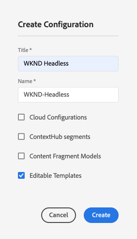
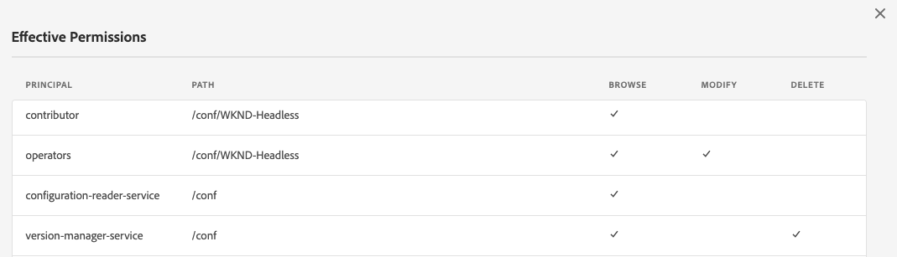
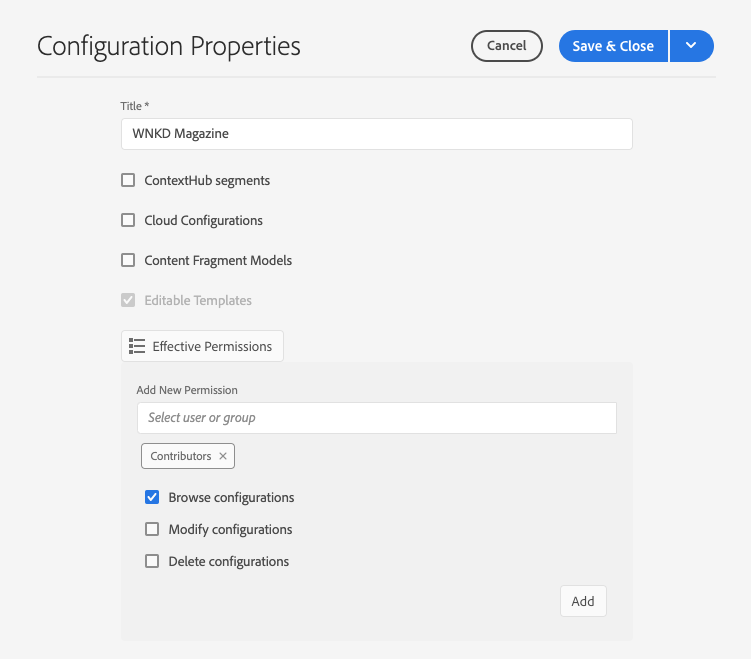
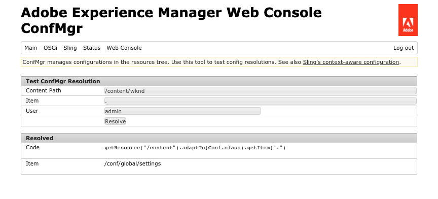
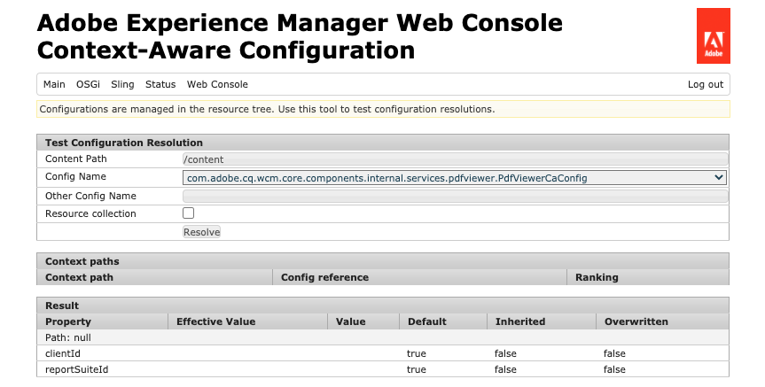

# Configurations and the Configuration Browser {#configuration-browser}

AEM configurations serve to manage settings in AEM and serve as workspaces.

## What is a Configuration? {#what-is-a-configuration}

A configuration can be considered from two different viewpoints.

* [An administrator](#configurations-administrator) uses configurations as workspaces within AEM to define and manage groups of settings.
* [A developer](#configurations-developer) uses the underlying configuration mechanism that implements configurations to persist and look up settings in AEM.

In summary: from an administrator's point of view, configurations are how you create workspaces to manage settings in AEM, whereas the developer should understand how AEM uses and manages these configurations within the repository.

Regardless from your perspective, configurations serve two main purposes in AEM:

* Configurations enable certain features for certain groups of users.
* Configurations define access rights for those features.

## Configurations as an Administrator {#configurations-administrator}

The AEM administrator and authors can consider configurations as workspaces. These workspaces can be used to gather groups of settings  and their associated content for organizational purposes by implementing access rights for those features.

Configurations can be created for many different features within AEM.

* [Cloud Configurations](/help/sites-administering/configurations.md)
* [Context Hub Segments](/help/sites-administering/segmentation.md)
* [Content Fragment Models](/help/assets/content-fragments/content-fragments-models.md)
* [Editable Templates](/help/sites-authoring/templates.md)

### Example {#administrator-example}

For example, an administrator may create two configurations for Editable Templates.

* WKND-General
* WKND-Magazine

The admin can then create general page templates using the WKND-General configuration and then templates specific to the magazine under WKND-Magazine.

The admin can then associate the WKND-General with all content of the WKND site. However the WKND-Magazine configuration would be associated only with the magazine site.

By doing this:

* When a content author creates a page for the magazine, the author can choose from general templates (WKND-General) or magazine templates (WKND-Magazine).
* When a content author creates a page for another part of the site that is not the magazine, the author can only choose from the general templates (WKND-General).

Similar setups are possible not only for Editable Templates but also for Cloud Configurations, ContextHub Segments, and Content Fragment Models.

### Using the Configuration Browser {#using-configuration-browser}

The Configuration Browser allows an administrator to easily create, manage, and configure access rights to configurations in AEM.

>[!NOTE]
>
>It is only possible to create configurations using the Configuration Browser if your user has `admin` rights. Administrator rights are also required to assign access rights to the configuration or otherwise modify a configuration.

#### Creating a Configuration {#creating-a-configuration}

It is simple to create a configuration in AEM by using the Configuration Browser.

1. Log into AEM as a Cloud Service and from the main menu select **Tools** > **General** > **Configuration Browser**.
1. Click **Create**.
1. Provide a **Title** and a **Name** for your configuration.

   

   * The **Title** should be descriptive.
   * The **Name** becomes the node name in the repository.
     * It is automatically generated based on the title and adjusted according to [AEM naming conventions.](/help/sites-developing/naming-conventions.md)
     * It can be adjusted if necessary.
1. Check the type of configurations that you want to allow.
   * [Cloud Configurations](/help/sites-administering/configurations.md)
   * [Context Hub Segments](/help/sites-administering/segmentation.md)
   * [Content Fragment Models](/help/assets/content-fragments/content-fragments-models.md)
   * [Editable Templates](/help/sites-authoring/templates.md)
1. Click **Create**.

>[!TIP]
>
>Configurations may be nested.

#### Editing Configurations and Their Access Rights {#access-rights}

If you think of configurations as workspaces, access rights can be set on those configurations to enforce who may and may not access those workspaces.

1. Log into AEM as a Cloud Service and from the main menu select **Tools** > **General** > **Configuration Browser**.
1. Select the configuration that you want to modify and then click **Properties** in the tool bar.
1. Select any additional features that you want to add to the configuration.

   >[!NOTE]
   >
   >It is not possible to unselect a feature once the configuration has been created.

1. Use the **Effective Permissions** button to view a matrix of roles and what permissions they are currently granted to configurations.
   
1. To assign new permissions, enter the user or group name in the **Select user or group** field in the **Add New Permissions** section.
   * The  **Select user or group** field offers auto-completion based on existing users and roles.
1. Select the appropriate user or role from the auto-complete results.
   * You can select more than one user or role.
1. Check the access options that the selected users or roles should have and click **Add**.
   
1. Repeat the steps so you can select users or roles and assign additional access rights as necessary.
1. Select **Save &amp; Close** when you are finished.

## Configurations as a Developer {#configurations-developer}

As a developer, it is important to know how AEM as a Cloud Service works with configurations and how it processes configuration resolution.

### Separation of Configuration and Content {#separation-of-config-and-content}

Although the [administrator and users may think of configurations as workplaces](#configurations-administrator) to manage different settings and content, it is important to understand that configurations and content are stored and managed separately by AEM in the repository.

* `/content` is home to all content.
* `/conf` is home to all configuration.

Content references its associated configuration via a `cq:conf` property. AEM performs a lookup based on the content and its contextual `cq:conf` property to find the appropriate configuration.

### Example {#developer-example}

For this example, let's assume you have some application code that is interested in DAM settings.

```java
Conf conf = resource.adaptTo(Conf.class);
ValueMap imageServerSettings = conf.getItem("dam/imageserver");
String bgkcolor = imageServerSettings.get("bgkcolor", "FFFFFF");
```

The starting point of all configuration lookup is a content resource, somewhere under `/content`. This could be a page, a component inside a page, an asset, or a DAM folder. This is the actual content for which you are looking for the right configuration that applies in this context.

Now with the `Conf` object in hand, you can retrieve the specific configuration item that you are interested in. In this case, it is `dam/imageserver`, which is a collection of settings related to the `imageserver`. The `getItem` call returns a `ValueMap`. You then read a `bgkcolor` string property and provide a default value of "FFFFFF" in case the property (or entire config item) is not present.

Now let's have a look at the corresponding JCR content:

```text
/content/dam/wknd
    + jcr:content
      - cq:conf = "/conf/wknd"
    + image.png [dam:Asset]

/conf/wkns
    + settings
      + dam
        + imageserver [cq:Page]
          + jcr:content
            - bgkcolor = "FF0000"
```

In this example, you can assume a WKND-specific DAM folder here and a corresponding configuration. Starting at that folder `/content/dam/wknd`, you can see that there is a string-property named `cq:conf` that references the configuration that should apply for the subtree. The property is set on the `jcr:content` of an asset folder or page. These `conf` links are explicit, so it is easy to follow them by just looking at the content in CRXDE.

Jumping inside `/conf`, you can follow the reference and see that there is a `/conf/wknd` node. This is a configuration. Its lookup is transparent to the application code. The example code never has a dedicated reference to it, it is hidden behind the `Conf` object. Which configuration applies is controlled through the JCR content.

You can see that the configuration contains a fixed-named `settings` node that contains the actual items, including the `dam/imageserver` that you need in this case. Such an item can be thought of as a "settings document" and is represented by a `cq:Page` including a `jcr:content` holding the actual content.

Finally, you can see the property `bgkcolor` that sample code needs. The `ValueMap` you get back from `getItem` is based on the page's `jcr:content` node.

### Configuration Resolution {#configuration-resolution}

The basic example above showed a single configuration. But there are many cases where you want to have different configurations such as a default global configuration, a different one for each brand and maybe a specific one for your subprojects.

To support this, the configuration lookup in AEM has an inheritance and fallback mechanism in the following order of preference:

1. `/conf/<siteconfig>/<parentconfig>/<myconfig>`
   * Specific config referenced from `cq:conf` somewhere in `/content`
   * The hierarchy is arbitrary and can be designed just like your site structure, it is not the business of application code to know this
   * Changeable at runtime by users with configuration privileges
1. `/conf/<siteconfig>/<parentconfig>`
   * Traverse parents for fallback configs
   * Changeable at runtime by users with configuration privileges
1. `/conf/<siteconfig>`
   * Traverse parents for fallback configs
   * Changeable at runtime by users with configuration privileges
1. `/conf/global`
   * System global settings
   * Global defaults for your installation
   * Set by an `admin` role
   * Changeable at runtime by users with configuration privileges
1. `/apps`
   * Application defaults
   * Fixed with application deployment
   * Read-only at runtime
1. `/libs`
   * AEM product defaults
   * Only changeable by Adobe, project access not allowed
   * Fixed with application deployment
   * Read-only at runtime

### Using Configurations {#using-configurations}

Configurations in AEM are based on Sling Context-Aware Configurations. The Sling bundles provide a service API that can be used to get context-aware configurations. Context-aware configurations are configurations that are related to a content resource or a resource tree as was [described in the previous example.](#developer-example)

For further details about Context-Aware Configurations, examples, and how to use them, [see the Sling documentation.](https://sling.apache.org/documentation/bundles/context-aware-configuration/context-aware-configuration.html)

### ConfMgr Web Console {#confmgr-web-console}

For debugging and testing purposes, there is a **ConfMgr** web console at `https://<host>:<port>/system/console/conf`, which can show configurations for a given path/item.



Simply provide:

* **Content Path**
* **Item**
* **User**

To see which configurations are resolved and receive a sample code that resolves those configurations, select **Resolve**.

### Context-Aware Configuration Web Console {#context-aware-web-console}

For debugging and testing purposes, there is a **Context-Aware Configuration** web console at `https://<host>:<port>/system/console/slingcaconfig`, which allows querying context-aware configurations in the repository and viewing their properties.



Simply provide:

* **Content Path**
* **Config Name**

To retrieve the associated context paths and properties for the selected configuration, select **Resolve**.
