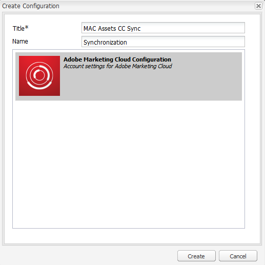
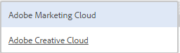

# Configure AEM Assets integration with Experience Cloud and Creative Cloud {#configure-aem-assets-integration-with-experience-cloud-and-creative-cloud}

If you are an Adobe Experience Cloud customer, you can synchronize your assets within Adobe Experience Manager (AEM) Assets with Adobe Creative Cloud, and vice versa. You can also synchronize your assets with Experience Cloud and vice versa. You can set up this synchronization through Adobe I/O.

The workflow to set up this integration is:

1. Create an authentication in Adobe I/O using a public gateway and get an application ID.  
1. Create a profile on your AEM Assets instance using the appplication ID.
1. Use this configuration to synchronize your assets within AEM Assets with Creative Cloud.

At the backend, the AEM server authenticates your profile with the gateway and then synchronizes the data between AEM Assets and Experience Cloud.

Flow of data when AEM Assets and Creative Cloud are integrated

>[!NOTE]
>
>Sharing assets between Adobe Experience Cloud and Adobe Creative Cloud requires administrator privileges on the AEM instance.

>[!CAUTION]
>
>Adobe Maketing Cloud has been rebranded as Adobe Experience Cloud. The procedures below still mention Marketing Cloud in order to reflect the current interface. These mentions will be changed at a later date.

## Create an application {#create-an-application}

1. Access the Adobe Developer gateway interface by logging in at [https://legacy-oauth.cloud.adobe.io](https://legacy-oauth.cloud.adobe.io/).

   >[!NOTE]
   >
   >You require administrator privileges to create an application ID.

1. From the left pane, navigate to **[!UICONTROL Developer Tools]** > **[!UICONTROL Applications]** to view a list of applications.
1. Click **[!UICONTROL Add]**  to create an application.
1. From the **[!UICONTROL Client Credentials]** list, select **[!UICONTROL Service Account (JWT Assertion)]**, which is a server-to-server communication service for server authentication.

   

1. Specify a name for the application and an optional description.
1. From the **[!UICONTROL Organization]** list, select the organization for which you want to synchronize assets.
1. From the **[!UICONTROL Scope]** list, select **[!UICONTROL dam-read]**, **[!UICONTROL dam-sync]**, **[!UICONTROL dam-write]**, and **[!UICONTROL cc-share]**.
1. Click **[!UICONTROL Create]**. A message notifies that the application is created.

   

1. Copy the **[!UICONTROL Application ID]** that is generated for the new application.

   >[!CAUTION]
   >
   >Ensure that you do not inadvertently copy the **[!UICONTROL Application Secret]** instead of the **[!UICONTROL Application ID]**.

## Add a new configuration to Marketing Cloud {#add-a-new-configuration-to-marketing-cloud}

1. Click the AEM logo on the user interface of your local AEM Assets instance and navigate to **[!UICONTROL Tools]** > **[!UICONTROL Cloud Services]** > **[!UICONTROL Legacy Cloud Services]**.  

1. Locate the **[!UICONTROL Adobe Marketing Cloud]** service. If no configurations exist, click **[!UICONTROL Configure Now]**. If configurations exist, click **[!UICONTROL Show Configurations]** and click **[!UICONTROL [+]]** to add a new configuration.

   >[!NOTE]
   >
   >Use an Adobe ID account that has administrator privileges for the organization.

1. In the **[!UICONTROL Create Configuration]** dialog, specify a title and name for the new configuration and click **[!UICONTROL Create]**.

   

1. In the **[!UICONTROL Tenant URL]** field, specify the URL for AEM Assets.

   >[!CAUTION]
   >
   >Due to rebranding, if you entered the Tenant URL as **https://&lt;tenant_id&gt;.marketing.adobe.com** you need to change it to **https://&lt;tenant_id&gt;.experiencecloud.adobe.com.** In order to do this, follow the steps below:
   >
   >1. Navigate to **Tools &gt; Cloud Services &gt; Legacy Cloud Services**.
   >1. Under Adobe Marketing Cloud, click **Show Configurations**. 
   >1. Select the configuration that was created while setting up the AEM-MAC-CC sync. 
   >1. Edit the cloudservice configuration and replace **marketing.adobe.com** in Tenant URL field to **experiencecloud.adobe.com**.
   >1. Save the configuration.
   >1. Test the mac-sync replication agents.

1. In the **[!UICONTROL Client ID]** field, paste the application ID you copied at the end of the procedure [Create an application](/help/sites-administering/configure-assets-cc-integration.md#create-an-application).

   

1. Under **[!UICONTROL Synchronization]** select **[!UICONTROL Enabled]** to enable synchronization and click **[!UICONTROL OK]**.

   >[!NOTE]
   >
   >If you select **disabled**, synchronization will work in a single direction.

1. From the configuration page, click **[!UICONTROL Display Public Key]** to display the public key generated for your instance. Alternatively, click **[!UICONTROL Download Public Key for OAuth Gateway]** to download the file containing the public key. Then, open the file to display the public key.

## Enable synchronization {#enable-synchronization}

1. Display the public key using one of the following methods mentioned in the last step of the procedure [Add a new configuration to Marketing Cloud](/help/sites-administering/configure-assets-cc-integration.md#add-a-new-configuration-to-marketing-cloud). Click **[!UICONTROL Display Public Key]**.

   

1. Copy the public key and paste it into the **[!UICONTROL Public Key]** field of configuration interface of the application you created in [Create an application](/help/sites-administering/configure-assets-cc-integration.md#create-an-application). 

   

1. Click **[!UICONTROL Update]**. Synchronize your assets with the AEM Assets instance now.

## Test the synchronization {#test-the-synchronization}

1. Click the AEM logo on the user interface of your local AEM Assets instance and navigate to **[!UICONTROL Tools]**> **[!UICONTROL Deployment]**> **[!UICONTROL Replication]**to locate the replication profiles created for synchronization.
1. On the **[!UICONTROL Replication]** page, click **[!UICONTROL Agents on author]**.
1. From the list of profiles, click the default replication profile for your organization to open it.
1. In the dialog, click **[!UICONTROL Test Connection]**.

   

1. When the replication rest completes, check for a success message at the end of the test results.

## Add users to Marketing Cloud {#add-users-to-marketing-cloud}

1. Log in to Marketing Cloud using administrator credentials.
1. From the rails, go to **[!UICONTROL Administration]**and then click/tap **[!UICONTROL Launch Enterprise Dashboard]**.
1. From the rail, click **[!UICONTROL Users]** to open the **[!UICONTROL User Management]** page.
1. From the toolbar, click/tap **Add** .
1. Add one or more users that you want to provide the ability to share assets with Creative Cloud.

   >[!NOTE]
   >
   >Only the users that you add to Marketing Cloud can share assets from AEM Assets to Creative Cloud.

## Exchange assets between AEM Assets and Marketing Cloud {#exchange-assets-between-aem-assets-and-marketing-cloud}

1. Log in to AEM Assets.
1. In the Assets console, create a folder and upload some assets to it. For example, create a folder **mc-demo** and upload an asset to it.
1. Select the folder and click **Share** .
1. From the menu, select **[!UICONTROL Adobe Marketing Cloud]** and the click **[!UICONTROL Share]**. A message notifies that the folder is shared with Marketing Cloud.

   

   >[!NOTE]
   >
   >Sharing an Assets folder of the type `sling:OrderedFolder`, is not supported  in the context of sharing in Adobe Marketing Cloud. If you want to share a folder, when creating it in AEM Assets, do not select the **[!UICONTROL Ordered]** option.

1. Refresh the AEM Assets user interface. The folder you created in the Assets console of your local AEM Assets instance is copied to the Marketing Cloud UI. The asset that you upload to the folder in AEM Assets appears in the copy of the folder in Marketing Cloud after it is processed by the AEM server.
1. You can also upload an asset in the replicated copy of the folder in Marketing Cloud. After it is processed, the asset appears in the shared folder in AEM Assets.

## Exchange assets between AEM Assets and Creative Cloud {#exchange-assets-between-aem-assets-and-creative-cloud}

AEM Assets lets you share folders containing assets with Adobe Creative Cloud users.

1. In the Assets console, select the folder to share with Creative Cloud.
1. From the toolbar, click **[!UICONTROL Share]** .
1. From the list, select the **[!UICONTROL Adobe Creative Cloud]** option.

   >[!NOTE]
   >
   >The options are available for users with read permissions on the root. Users must have the required permission to access the replication agent information of Marketing Cloud.

1. In the **[!UICONTROL Creative Cloud Sharing]** page, add the user to share the folder with and choose a role for the user. Click **[!UICONTROL Save]** and click **[!UICONTROL OK]**.  

1. Log on to Creative Cloud with the credentials of the user you shared the folder with. The shared folder is available in Creative Cloud.

The AEM Assets-Marketing Cloud synchronization is designed in a way that the user machine instance from where the asset is uploaded retains the right to modify the asset. Only these changes are propagated to the other instance.

For example, if an asset is uploaded from an AEM Assets (on premises) instance, the changes to the asset from this instance are propagated to the Marketing Cloud instance. However, the changes done from the Marketing Cloud instance to the same asset aren’t propagated to the AEM instance and vice versa for asset uploaded from Marketing Cloud.

>[!MORELIKETHIS]
>
>* [AEM and Creative Cloud Integration Best Practices](../assets/aem-cc-integration-best-practices.md)
>* [AEM to Creative Cloud Folder Sharing Best Practices](../assets/aem-cc-folder-sharing-best-practices.md)
