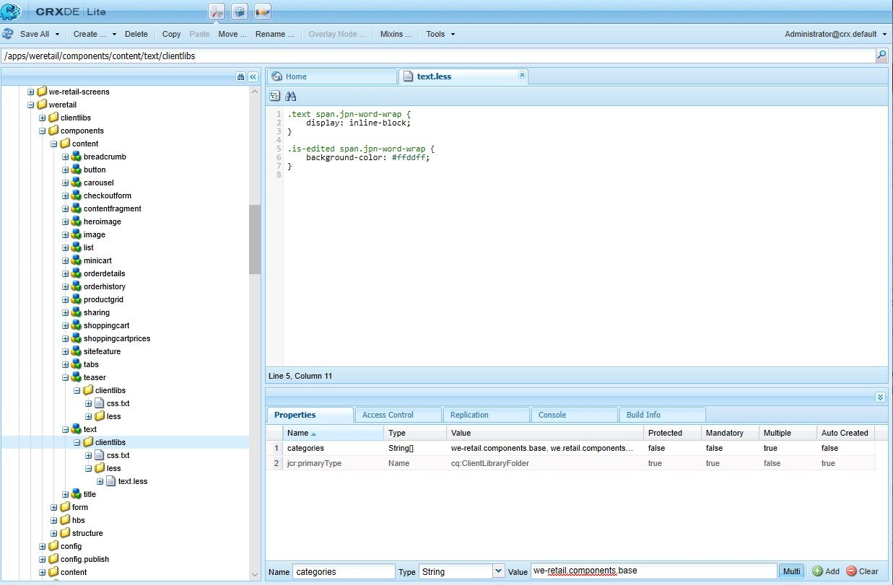
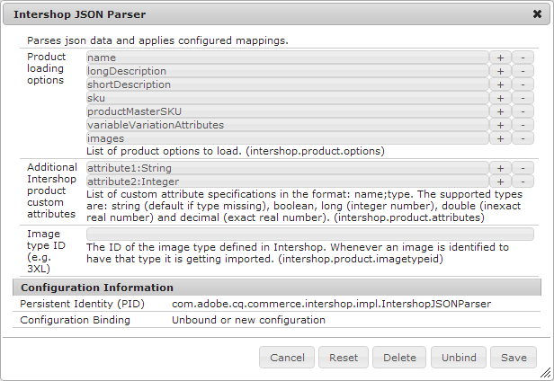
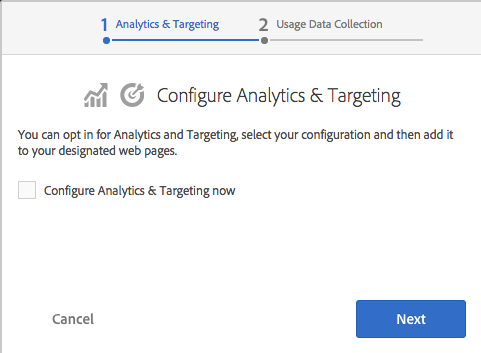
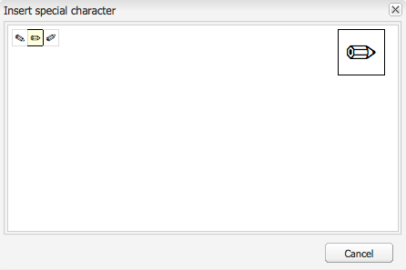

# Configure the Rich Text Editor plug-ins {#configure-the-rich-text-editor-plug-ins}

RTE functionalities are made available via a series of plug-ins, each with features property. You can configure the features property to enable or disable one or more RTE features. This article describes how to specifically configure the RTE plug-ins.

For details about the other RTE configurations, see [Configure Rich Text Editor](/help/sites-administering/rich-text-editor.md).

>[!NOTE]
>
>When working with CRXDE Lite, it is recommended to save the changes regularly using [!UICONTROL Save All] option.

## Activate a plug-in and configure the features property {#activateplugin}

To activate a plug-in, follow these steps. Some steps are needed only when you configure a plug-in for the first time, as the corresponding nodes do not exist.

By default, `format`, `link`, `list`, `justify`, and `control` plugins and all their features are enabled in RTE.

>[!NOTE]
>
>The respective `rtePlugins` node is referred to as `<rtePlugins-node>` to avoid duplication in this article.

1. Using CRXDE Lite, locate the text component for your project.
1. Create the parent node of `<rtePlugins-node>` if it does not exist, before configuring any RTE plug-ins:

    * Depending on your component, the parent nodes are:

        * `config: .../text/cq:editConfig/cq:inplaceEditing/config`
        * an alternative configuration node: `.../text/cq:editConfig/cq:inplaceEditing/inplaceEditingTextConfig`
        * `text: .../text/dialog/items/tab1/items/text`

    * Are of type: **jcr:primaryType** `cq:Widget`
    * Both have the following properties:

        * **Name** `name`
        * **Type** `String`
        * **Value** `./text`

1. Depending on the interface for which you are configuring, create a node `<rtePlugins-node>`, if it does not exist:

    * **Name** `rtePlugins`
    * **Type** `nt:unstructured`

1. Below this, create a node for each plug-in that you want to activate:

    * **Type** `nt:unstructured`
    * **Name** the Plug-in ID of the plug-in required

After activating a plug-in, follow these guidelines to configure the `features` property.

| | Enable all features | Enable a few specific features | Disable all features |
|---|---|---|---|
|Name| features | features | features |
|Type| String | String[] (multi-string; set Type to String and click Multi in CRXDE Lite) | String |
|Value| `*` (an asterisk) | set to one, or more, feature values | - |

## Understand the findreplace plug-in {#findreplace}

The `findreplace` plug-in does not need any configuration. It works out of the box.

When using the replace functionality, the replace string to be replaced should be entered at the same time as find string. However you can still click find to search for the string before replacing it. If the replace string is entered after clicking find, the search is reset to the beginning of the text.

The find and replace dialog becomes transparent when find is clicked and becomes opaque when replace is clicked. This allows the author to review the text that the author replaces. If users click replace all, the dialog box closes and displays the number of replacements made.

## Configure the paste modes {#paste-modes}

When using RTE, authors can paste content in one of the following three modes:

* **Browser mode**: Paste text using the browser's default paste implementation. It is not a recommended method as it may introduce unwanted markup.

* **Plain text mode**: Paste the clipboard content as plain text. It strips all elements of style and formatting from the copied content before inserting in [!DNL Experience Manager] component.

* **MS&reg; Word mode**: Paste the text, including tables, with formatting when copying from MS&reg; Word. Copying and pasting text from another source such as a web page or MS&reg; Excel is not supported and retain only partial formatting.

### Configure Paste options available on the RTE toolbar  {#configure-paste-options-available-on-the-rte-toolbar}

You can provide some, all, or none of these three icons to your authors in the RTE toolbar:

* **[!UICONTROL Paste (Ctrl+V)]**: Can be pre-configured to correspond to one of the above three Paste modes.

* **[!UICONTROL Paste as Text]**: Provides plain text mode functionality.

* **[!UICONTROL Paste from Word]**: Provides MS&reg; Word mode functionality.

To configure RTE to display the required icons, follow these steps.

1. Navigate to your component, say for example, `/apps/<myProject>/components/text`.
1. Navigate to the node `rtePlugins/edit`. See [activate a plug-in](#activateplugin) if the node does not exist.
1. Create the `features` property on the `edit` node and add one or more of the features. Save all changes.

### Configure the behavior of the Paste (Ctrl+V) icon and shortcut {#configure-the-behavior-of-the-paste-ctrl-v-icon-and-shortcut}

You can pre-configure the behavior of the **[!UICONTROL Paste (Ctrl+V)]** icon, using the following steps. This configuration also defines the behavior of keyboard shortcut Ctrl+V that Authors use to paste content.

The configuration allows for the following three types of use cases:

* Paste text using the browser's default paste implementation. It is not a recommended method as it may introduce unwanted markup. Configured using `browser` below.

* Paste the clipboard content as plain text. It strips all elements of style and formatting from the copied content before inserting in AEM component. Configured using `plaintext` below.

* Paste the text, including tables, with formatting when copying from MS&reg; Word. Copying and pasting text from another source such as a web page or MS&reg; Excel is not supported and retain only partial formatting. Configured using `wordhtml` below.

1. In your component, navigate to `<rtePlugins-node>/edit` node. Create the nodes if these do not exist. For more information, see [activate a plug-in](#activateplugin).
1. In the `edit` node, create a property using the following details:

    * **Name** `defaultPasteMode`
    * **Type** `String`
    * **Value** One of the required paste mode `browser`, `plaintext`, or `wordhtml`.

### Configure the formats allowed when pasting content {#pasteformats}

The paste-as-Microsoft-Word (`paste-wordhtml`) mode can be further configured so that you can explicitly define which styles are allowed when pasting in AEM from another program, such as Microsoft&reg; Word.

For example, if only bold formats and lists should be allowed when pasting in AEM, you can filter out the other formats. This is called configurable paste filtering, which can be done for both:

* [Text](#paste-modes)
* [Links](#linkstyles)

For links, you can also define the protocols that are automatically accepted.

To configure which formats are allowed when pasting text into AEM from another program:

1. In your component, navigate to the node `<rtePlugins-node>/edit`. Create the nodes if these do not exist. For more details, see [activate a plug-in](#activateplugin).
1. Create a node under the `edit` node so you can hold the HTML paste rules:

    * **Name** `htmlPasteRules`
    * **Type** `nt:unstructured`

1. Create a node under `htmlPasteRules`, so you can hold details of the basic formats allowed:

    * **Name** `allowBasics`
    * **Type** `nt:unstructured`

1. To control the individual formats accepted, create one, or more, of the following properties on the `allowBasics` node:

    * **Name** `bold`
    * **Name** `italic`
    * **Name** `underline`
    * **Name** `anchor` (for both links and named anchors)
    * **Name** `image`

   All properties are of **Type** `Boolean`, so in the appropriate **Value** you can either select or remove the check mark to enable or disable the functionality.

   >[!NOTE]
   >
   >If not explicitly defined the default value of true is used and the format accepted.

1. Other formats can also be defined using a range of other properties or nodes, also applied to the `htmlPasteRules` node. Save all changes.

You can use the following properties for `htmlPasteRules`.

| Property | Type | Description |
|---|---|---|
| `allowBlockTags` | String | Defines the list of block tags allowed. A few possible block tags include: <ul> <li>headlines (h1, h2, h3)</li> <li>paragraphs (p)</li> <li>lists (ol, ul)</li> <li>tables (table)</li> </ul> |
| `fallbackBlockTag` | String| Defines the block tag used for any blocks having a block tag not included in `allowBlockTags`. `p` usually suffices. |
| table | nt:unstructured | Defines the behavior when pasting tables. This node must have the property `allow` (type Boolean) to define whether pasting tables is allowed. If allow is set to `false`, you must specify the property `ignoreMode` (type String) to define how pasted table content is handled. Valid values for `ignoreMode` are: <ul> <li>`remove`: Removes table content.</li> <li>`paragraph`: Turns table cells into paragraphs.</li> </ul> |
| list | nt:unstructured | Defines the behavior when pasting lists. Must have the property `allow` (type Boolean) to define whether the pasting of lists is allowed. If `allow` is set to `false`, you must specify the property `ignoreMode` (type String) to define how to handle any list content pasted. Valid values for `ignoreMode` are: <ul><li> `remove`: Removes list content.</li> <li>`paragraph`: Turns list items into paragraphs.</li> </ul> |

An example of a valid `htmlPasteRules` structure is below.

   ```xml
   "htmlPasteRules": {
       "allowBasics": {
           "italic": true,
           "link": true
       },
       "allowBlockTags": [
           "p", "h1", "h2", "h3"
       ],
       "list": {
           "allow": false,
           "ignoreMode": "paragraph"
       },
       "table": {
           "allow": true,
           "ignoreMode": "paragraph"
       }
   }
   ```

## Configure text styles {#textstyles}

Authors can apply Styles to change the appearance of a portion of text. The styles are based on CSS classes that you pre-define in your CSS style sheet. Stylized content is enclosed in `span` tags using the `class` attribute to refer to the CSS class. For example, `<span class=monospaced>Monospaced Text Here</span>`.

When the Styles plug-in is enabled for the first time, no default Styles are available. The pop-up list is empty. To provide the authors with Styles, do the following:

* Enable the Style drop-down selector.
* Specify the locations of the style sheets.
* Specify the individual styles that can be selected from the Style drop-down list.

For later configurations, say to add more styles, follow only the instructions to reference a new style sheet and to specify the additional styles.

>[!NOTE]
>
>You can define Styles for [tables or table cells](/help/sites-administering/configure-rich-text-editor-plug-ins.md#tablestyles). These configurations require separate procedures.

### Enable the Style drop-down selector list {#styleselectorlist}

This is done by enabling the style plug-in.

1. In your component, navigate to the node `<rtePlugins-node>/styles`. Create the nodes if these do not exist. For more details, see [activate a plug-in](#activateplugin).
1. Create the `features` property on the `styles` node:

    * **Name** `features`
    * **Type** `String`
    * **Value** `*` (asterisk)

1. Save all changes.

>[!NOTE]
>
>Once the Styles plug-in is enabled, the Style drop-down list is displayed in the edit dialog. However, the list is empty as no Styles are configured.

### Specify the style sheet location {#locationofstylesheet}

Then, specify the locations of the style sheets that you want to reference:

1. Navigate to the root node of your text component, for example, `/apps/<myProject>/components/text`.
1. Add the property `externalStyleSheets` to the parent node of `<rtePlugins-node>`:

    * **Name** `externalStyleSheets`
    * **Type** `String[]` (multi-string; click **Multi** in CRXDE)
    * **Values** The path and filename of every style sheet that you want to include. Use repository paths.

   >[!NOTE]
   >
   >You can add references to additional style sheets at any later time.

1. Save all changes.

>[!NOTE]
>
>When using RTE in a dialog (Classic UI), you may want to specify style sheets that are optimized for rich text editing. Due to technical restrictions, the CSS context is lost in the editor, so you may want to emulate this context to improve the WYSIWYG experience.
>
>The Rich Text Editor uses a container DOM element with an ID of `CQrte` which may be used to provide different styles for viewing and editing:
>
>`#CQ td {`
>` // defines the style for viewing }`
>
>`#CQrte td {`
>` // defines the style for editing }`

### Specify the available Styles in the pop-up list {#stylesindropdown}

1. In the component definition, navigate to the node `<rtePlugins-node>/styles`, as created in [Enabling the style drop-down selector](#styleselectorlist).
1. Under the node `styles`, create a node (also called `styles`) to hold the list being made available:

    * **Name** `styles`
    * **Type** `cq:WidgetCollection`

1. Create a node under the `styles` node so you can represent an individual style:

    * **Name**, you can specify the name, but it should be suitable for the style
    * **Type** `nt:unstructured`

1. Add the property `cssName` to this node so you can reference the CSS class:

    * **Name** `cssName`
    * **Type** `String`
    * **Value** The name of the CSS class (without a preceding '.'; for example, `cssClass` instead of `.cssClass`)

1. Add the property `text` to the same node; this defines the text shown in the selection box:

    * **Name** `text`
    * **Type** `String`
    * **Value** Description of the style; appears in the Style drop-down selection box.

1. Save the changes.

   Repeat the above steps for each required style.

### Configure RTE for optimal word breaks in Japanese {#jpwordwrap}

Authors using AEM to author Japanese language content can apply a style to characters to avoid line breaks where a break is not required. This allows authors to let the sentences break at the desired position. The style for this functionality is based on CSS class that is pre-defined in the CSS style sheet.

>[!NOTE]
>
>This feature requires at least AEM 6.5 Service Pack 1.

To create the style that authors can apply to Japanese text, follow these steps:

1. Create a node under the styles node. See [specify a new style](#stylesindropdown).
   * Name: `jpn-word-wrap`
   * Type: `nt:unstructure`

1. Add the property `cssName` to the node so you can reference the CSS class. This class name is a reserved name for Japanese word wrap feature.
   * Name: `cssName`
   * Type: `String`
   * Value: `jpn-word-wrap` (without a preceding `.`)

1. Add the property text to the same node. The value is the name of the style that the author sees when selecting the style.
   * Name: `text`
   *Type: `String`
   * Value: `Japanese word-wrap`

1. Create a style sheet and specify its path. See [specify location of style sheet](#locationofstylesheet). Add the following contents to the style sheet. Change the background color as desired.

   ```css
   .text span.jpn-word-wrap {
       display:inline-block;
   }
   .is-edited span.jpn-word-wrap {
       background-color: #ffddff;
   }
   ```

   

## Configure the paragraph formats {#paraformats}

Any text authored in RTE is placed within a block tag, the default being `<p>`. By enabling the `paraformat` plug-in, you specify additional block tags that can be assigned to paragraphs, using a drop-down selection list. Paragraph formats determine the paragraph type by assigning the correct block tag. The author can select and assign them using the Format selector. The example block tags include, among others, the standard paragraph &lt;p&gt; and headings &lt;h1&gt;, &lt;h2&gt;, and so on.

>[!CAUTION]
>
>This plug-in is not suitable for content with complex structures, such as lists or tables.

>[!NOTE]
>
>If a block tag, for example, an &lt;hr&gt; tag, cannot be assigned to a paragraph, it is not a valid use case for a paraformat plug-in.

When the Paragraph Formats plug-in is enabled for the first time, no default Paragraph Formats are available. The pop-up list is empty. To provide the authors with Paragraph Formats, do the following:

* Enable the Format drop-down selector list.
* Specify the block tags that can be selected as paragraph formats from the drop-down.

For later configurations or reconfigurations, say to add more formats, follow only the relevant part of the instructions.

### Enable the Format drop-down selector {#formatselectorlist}

First enable the paraformat plug-in:

1. In your component, navigate to the node `<rtePlugins-node>/paraformat`. Create the nodes if these do not exist. For more details, see [activate a plug-in](#activateplugin).
1. Create the `features` property on the `paraformat` node:

    * **Name** `features`
    * **Type** `String`
    * **Value** `*` (asterisk)

>[!NOTE]
>
>If the plug-in is not configured further, the following default formats are enabled:
>
>* Paragraph ( `<p>`)
>* Heading 1 ( `<h1>`)
>* Heading 2 ( `<h2>`)
>* Heading 3 ( `<h3>`)
>

>[!CAUTION]
>
>When configuring the paragraph format of the RTE, do not remove the paragraph tag &lt;p&gt; as a formatting option. If the `<p>` tag is removed, then the content author cannot select the **Paragraph formats** option even if there are additional formats configured.

### Specify the available Paragraph Formats {#paraformatsindropdown}

Paragraph formats may be made available for selection by:

1. In the component definition, navigate to the node `<rtePlugins-node>/paraformat`, as created in [Enabling the format drop-down selector](#styleselectorlist).
1. Under the `paraformat` node, create a node to hold the list of formats:

    * **Name** `formats`
    * **Type** `cq:WidgetCollection`

1. Create a node under the `formats` node, this holds details for an individual format:

    * **Name**, you can specify the name, but it should be suitable for the format (for example, myparagraph, myheading1).
    * **Type** `nt:unstructured`

1. To this node, add the property to define the block tag used:

    * **Name** `tag`
    * **Type** `String`
    * **Value** The block tag for the format; for example: p, h1, h2.

      You do not need to enter the delimiting angle-brackets.

1. To the same node add another property, for descriptive text to appear in the drop-down list:

    * **Name** `description`
    * **Type** `String`
    * **Value** The descriptive text for this format; for example, Paragraph, Heading 1, Heading 2. This text is displayed in the Format selection list.

1. Save the changes.

   Repeat the steps for each required format.

>[!CAUTION]
>
>If you define custom formats, the default formats (`<p>`, `<h1>`, `<h2>`, and `<h3>`) are removed. Re-create `<p>` format as it is the default format.

## Configure special characters {#spchar}

In a standard AEM installation, when the `misctools` plug-in is enabled for special characters (`specialchars`) a default selection is immediately available for use; for example, the copyright and trademark symbols.

You can configure the RTE to make your own selection of characters available; either by defining distinct characters, or an entire sequence.

>[!CAUTION]
>
>Adding your own special characters overrides the default selection. If necessary, define or redefine these characters in your own selection.

### Define a single character {#definesinglechar}

1. In your component, navigate to the node `<rtePlugins-node>/misctools`. Create the nodes if these do not exist. For more details, see [activate a plug-in](#activateplugin).
1. Create the `features` property on the `misctools` node:

    * **Name** `features`
    * **Type** `String[]`
    * **Value** `specialchars`

      &nbsp; &nbsp; (or `String / *` if applying all features for this plug-in)

1. Under `misctools`, create a node to hold the special character configurations:

    * **Name** `specialCharsConfig`
    * **Type** `nt:unstructured`

1. Under `specialCharsConfig`, create another node to hold the list of characters:

    * **Name** `chars`
    * **Type** `nt:unstructured`

1. Under `chars`, add a node to hold an individual character definition:

    * **Name** you can specify the name, but it should reflect the character; for example, half.
    * **Type** `nt:unstructured`

1. To this node, add the following property:

    * **Name** `entity`
    * **Type** `String`
    * **Value** the HTML representation of the required character; for example, `&189;` for the fraction one half.

1. Save the changes.

In CRXDE, once the property is saved, the represented character is displayed. See below the example of half. Repeat the above steps so you can make more special characters available to authors.

   

### Define a range of characters {#definerangechar}

1. Use steps 1 – 3 from [Defining a Single Character](#definesinglechar).
1. Under `chars`, add a node to hold the definition of the character range:

    * **Name** you can specify the name, but it should reflect the character range; for example, pencils.
    * **Type** `nt:unstructured`

1. Under this node (named according to your special character range) add the following two properties:

    * **Name** `rangeStart`
      **Type** `Long`
      **Value** the [Unicode](https://unicode.org/) representation (decimal) of the first character in the range

    * **Name** `rangeEnd`
      **Type** `Long`
      **Value** the [Unicode](https://unicode.org/) representation (decimal) of the last character in the range

1. Save the changes.

   For example, define a range 9998 - 10000 provides you with the following characters.

   

   *Figure: In CRXDE, define a range of characters to be made available in RTE*

   

## Configure table styles {#tablestyles}

Styles are typically applied on text, but a separate set of Styles can also be applied on a table or a few table cells. Such Styles are available to authors from the Style selector box in either the Cell properties or Table properties dialog. The styles are available when editing a table within a Text component (or derivative) and not in the standard Table component.

>[!NOTE]
>
>You can define styles for tables and cells for Classic UI only.

>[!NOTE]
>
>Copying and pasting tables in or from RTE component is browser-dependent. It is not supported out of the box for all browsers. You may get varied results depending on table structure and browser. For example, when you copy and paste a table in an RTE component in Mozilla Firefox in Classic UI and Touch UI, the layout of the table is not preserved.

1. Within your component, navigate to the node `<rtePlugins-node>/table`. Create the nodes if these do not exist. For more details, see [activate a plug-in](#activateplugin).
1. Create the `features` property on the `table` node:

    * **Name** `features`
    * **Type** `String`
    * **Value** `*` (asterisk)

   >[!NOTE]
   >
   >If you do not want to enable all table features, you can create the `features` property as:
   >
   >* **Type** `String[]`
   >
   >* **Value** one, or both, of the following, as required:
   >   * `table` to allow the editing of table properties; including the styles.
   >   * `cellprops` to allow the editing of cell properties, including the styles.

1. Define the location of CSS style sheets so you can refer those. See [Specifying the location of your style sheet](#locationofstylesheet) as this is the same as when defining [styles for text](#textstyles). The location may be defined if you defined other styles.
1. Under the `table` node, create the following new nodes (as required):

    * To define styles for the entire table (available under **Table properties**):

        * **Name** `tableStyles`
        * **Type** `cq:WidgetCollection`

    * To define styles for the individual cells (available under **Cell properties**):

        * **Name** `cellStyles`
        * **Type** `cq:WidgetCollection`

1. Create a node (under the `tableStyles` or `cellStyles` node as appropriate) so you can represent an individual style:

    * **Name** you can specify the name, but it should reflect the style.
    * **Type** `nt:unstructured`

1. On this node, create the properties:

    * To define the CSS style to be referenced

        * **Name** `cssName`
        * **Type** `String`
        * **Value** the name of the CSS class (without a preceding `.`, for example, `cssClass` instead of `.cssClass`)

    * To define a descriptive text to appear in the drop-down selector

        * **Name** `text`
        * **Type** `String`
        * **Value** the text to appear in the selection list

1. Save all changes.

Repeat the above steps for each required style.

### Configure hidden headers in tables for accessibility {#hiddenheader}

Sometimes, you may create data tables without visual text in a column header assuming that the header's purpose is implied by the visual relationship of the column with other columns. In this case, it is necessary to provide hidden inner text within the cell in the header cell. Doing so allow screen readers and other assistive technologies to help the readers with various needs understand the purpose of the column.

To enhance accessibility in such scenarios, RTE supports hidden header cells. In addition, it provides configuration settings related to hidden headers in tables. These settings let you apply CSS styles on hidden headers in edit and preview modes. To help authors identify hidden headers in the edit mode, include the following parameters in your code:

* `hiddenHeaderEditingCSS`: Specifies the name of the CSS class that is applied on the hidden-header cell, when RTE is edited.
* `hiddenHeaderEditingStyle`: Specifies a Style string that is applied on the hidden-header cell when RTE is edited.

If you specify both the CSS and the Style string in code, the CSS class takes precedence over the style string and may overwrite any configuration changes the Style string makes.

To help authors apply CSS on hidden headers in the preview mode, you can include the following parameters in your code:

* `hiddenHeaderClassName`: Specifies the name of the CSS class that is applied on the hidden header cell in preview mode.
* `hiddenHeaderStyle`: Specifies a Style string that is applied on the hidden-header cell in preview mode.

If you specify both the CSS and the Style string in code, the CSS class takes precedence over the style string and may overwrite any configuration changes the Style string makes.

## Add dictionaries for the spell checker {#adddict}

When the spellcheck plug-in is activated, the RTE uses dictionaries for each appropriate language. These are then selected according to the language of the website by taking either the language property of the subtree or extracting the language from the URL. For example, the `/en/` branch is checked as English, the `/de/` branch as German.

>[!NOTE]
>
>The message `Spell checking failed` is seen if a check is attempted for a language that is not installed. The standard dictionaries are at `/libs/cq/spellchecker/dictionaries`, along with the appropriate readme files. Do not modify the files.

A standard AEM installation includes the dictionaries for American English (`en_us`) and British English (`en_gb`). To add more dictionaries, follow these steps.

1. Navigate to the page [https://extensions.openoffice.org/](https://extensions.openoffice.org/).

1. Do one of the following to find a dictionary of your choice of language:

   * Search for dictionary of your choice of language. On the dictionary page, locate the link to the original source or author's webpage. Locate the dictionary files for v2.x on such a page.
   * Search for v2.x dictionary files at [https://wiki.openoffice.org/wiki/User:Khirano/Dictionaries](https://wiki.openoffice.org/wiki/User:Khirano/Dictionaries).

1. Download the archive with the spelling definitions. Extract the contents of the archive on your file system.

   >[!CAUTION]
   >
   >Only dictionaries in the `MySpell` format for OpenOffice.org v2.0.1 or earlier, are supported. As the dictionaries are now archive files, it is recommended that you verify the archive after downloading.

1. Locate the `.aff` and `.dic` files. Keep filename in lowercase. For example, `de_de.aff` and `de_de.dic`.
1. Load the `.aff` and `.dic` files in the repository at `/apps/cq/spellchecker/dictionaries`.

>[!NOTE]
>
>The RTE spell checker is available on-demand. It does not run automatically as you start typing text. To run the spell checker, click [!UICONTROL Spellchecker] from the toolbar. RTE checks the spelling of words and highlights the misspelled words.
>
>If you incorporate any change that the spell checker suggests, the state of the text changes and misspelled words are no longer highlighted. To run the spell checker, click Spellchecker button again.

## Configure the history size for undo and redo actions {#undohistory}

RTE allows authors to undo or redo a few last edits. By default, 50 edits are stored in the history. You can configure this value as required.

1. Within your component, navigate to the node `<rtePlugins-node>/undo`. Create these nodes if they do not exist. For more details, see [activate a plug-in](#activateplugin).
1. On the `undo` node, create the property:

    * **Name** `maxUndoSteps`
    * **Type** `Long`
    * **Value** the number of undo steps you want saved in the history. The default is 50. Use `0` to completely disable undo/redo.

1. Save the changes.

## Configure the tab size {#tabsize}

When the tab character is pressed within any text a predefined number of spaces is inserted; by default this is three non-breaking spaces and one space.

To define the tab size:

1. In your component, navigate to the node `<rtePlugins-node>/keys`. Create the nodes if these do not exist. For more details, see [activate a plug-in](#activateplugin).
1. On the `keys` node, create the property:

    * **Name** `tabSize`
    * **Type** `String`
    * **Value** the number of space characters to be used for the tabulator

1. Save the changes.

## Set indent margin {#indentmargin}

When indentation is enabled (default), you can define the size of indent:

>[!NOTE]
>
>This indent size is only applied to paragraphs (blocks) of text; it does not affect the indentation of actual lists.

1. Within your component, navigate to the node `<rtePlugins-node>/lists`. Create these nodes if they do not exist. For more details, see [activate a plug-in](#activateplugin).
1. On the `lists` node, create the `indentSize` parameter:

    * **Name**: `indentSize`
    * **Type**: `Long`
    * **Value**: number of pixels required for the indent margin.

## Configure the height of editable space {#editablespace}

>[!NOTE]
>
>This is only applicable when using the RTE in a dialog (not in-place editing in classic UI).

You can define the height of the editable space shown within the component dialog:

1. On the `../items/text` node in the dialog definition for the component, create a property:

    * **Name** `height`
    * **Type** `Long`
    * **Value** the height of the edit canvas in pixels.

   >[!NOTE]
   >
   >This does not change the height of the dialog window.

1. Save the changes.

## Configure styles and protocols for links {#linkstyles}

When adding links in AEM, you can define:

* The CSS styles to be used
* The protocols automatically accepted

To configure how links are added in AEM from another program, define the HTML rules.

1. Using CRXDE Lite, locate the text component for your project.
1. Create a node at the same level as `<rtePlugins-node>`, that is, create the node under the parent node of `<rtePlugins-node>`:

    * **Name** `htmlRules`
    * **Type** `nt:unstructured`

   >[!NOTE]
   >
   >The `../items/text` node has the property:
   >
   >* **Name** `xtype`
   >* **Type** `String`
   >* **Value** `richtext`
   >
   >The location of the `../items/text` node can vary, depending on the structure of your dialog; two examples are `/apps/myProject>/components/text/dialog/items/text` and `/apps/<myProject>/components/text/dialog/items/panel/items/text`.

1. Under `htmlRules`, create a node.

    * **Name** `links`
    * **Type** `nt:unstructured`

1. Under the `links` node, define the properties as required:

    * CSS style for internal links:

        * **Name** `cssInternal`
        * **Type** `String`
        * **Value** the name of the CSS class (without a preceding '.'; for example, `cssClass` instead of `.cssClass`)

    * CSS style for external links

        * **Name** `cssExternal`
        * **Type** `String`
        * **Value** the name of the CSS class (without a preceding '.'; for example, `cssClass` instead of `.cssClass`)

    * Array of valid **protocols**. The supported protocols are `http://`, `https://`, `file://`, and `mailto:`.

        * **Name** `protocols`
        * **Type** `String[]`
        * **Value** one, or more, protocols

    * **defaultProtocol** (property of type **String**): Protocol to be used if the user did not specify one explicitly.

        * **Name** `defaultProtocol`
        * **Type** `String`
        * **Value** one, or more, default protocols

    * Definition of how to handle the target attribute of a link. Create a node:

        * **Name** `targetConfig`
        * **Type** `nt:unstructured`

      On the node `targetConfig`, define the required properties:

        * Specify the target mode:

            * **Name** `mode`
            * **Type** `String`
            * **Value**

                * `auto`: means that an automatic target is chosen

                  (specified by the `targetExternal` property for external links or `targetInternal` for internal links).

                * `manual`: not applicable in this context
                * `blank`: not applicable in this context

        * The target for internal links:

            * **Name** `targetInternal`
            * **Type** `String`
            * **Value** the target for internal links (only use when the mode is `auto`)

        * The target for external links:

            * **Name** `targetExternal`
            * **Type** `String`
            * **Value** the target for external links (only used when the mode is `auto`).

1. Save all changes.
