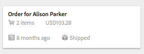
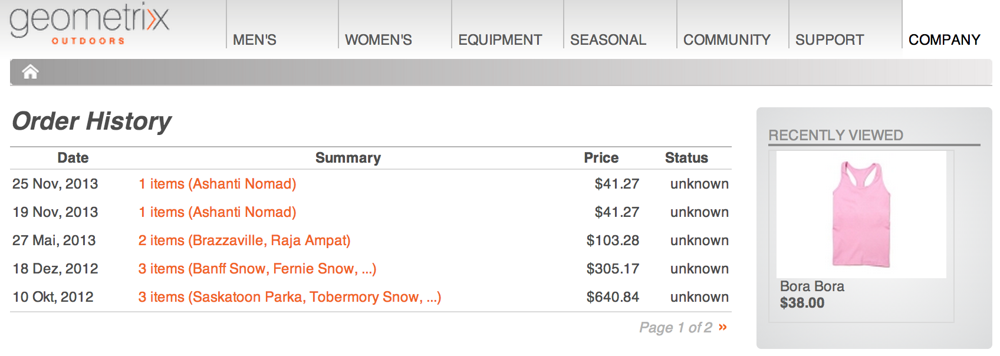

# Integrate with Adobe Creative Cloud {#integrating-with-adobe-creative-cloud}

Adobe Experience Manager (AEM) Assets lets you share folders containing assets with Adobe Creative Cloud users. For details on how to configure Adobe Marketing Cloud to let you share assets with Adobe Creative Cloud, see [Configuring Assets-Creative Cloud integration](../sites-administering/configure-assets-cc-integration.md).

1. In the Assets console, select a folder to share with Creative Cloud.

   

1. From the toolbar, click the **Share** icon.

   

1. From the list, select the **Adobe Creative Cloud** option.

   

1. In the **Creative Cloud Sharing** page, add the user to share the folder with and then click **Save**.

   

1. Click **Ok** to close the confirmation message.
1. Log on to Creative Cloud with the credentials of the user you shared the folder with. The shared folder is available in Creative Cloud.
