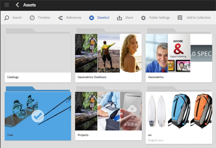
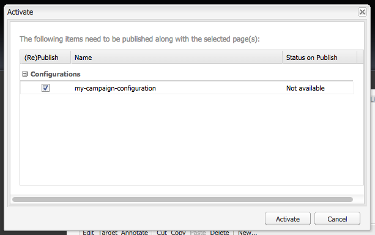

# Folder sharing with Adobe Creative Cloud {#folder-sharing-with-adobe-creative-cloud}

>[!CAUTION]
>
>The AEM to Creative Cloud Folder Sharing feature is deprecated. Customers are advised to use newer capabilities, like [Adobe Asset Link](https://helpx.adobe.com/enterprise/using/adobe-asset-link.html) or [AEM desktop app](https://experienceleague.adobe.com/docs/experience-manager-desktop-app/using/using.html?lang=en). Learn more in [AEM and Creative Cloud Integration Best Practices](/help/assets/aem-cc-integration-best-practices.md).

<!-- TBD: This article is removed from TOC and is not published. The functionality does not exist.

Adobe Experience Manager (AEM) Assets lets you share folders containing assets with Adobe Creative Cloud users. For details on how to configure Adobe Marketing Cloud to let you share assets with Adobe Creative Cloud, see [Configuring Assets-Creative Cloud integration](/help/sites-administering/configure-assets-cc-integration.md).

1. In the Assets console, select a folder to share with Creative Cloud.

   

1. From the toolbar, click **Share**.

   

1. From the list, select the **Adobe Creative Cloud** option.

   

1. In the **Creative Cloud Sharing** page, add the user to share the folder with and then click **Save**.

   

1. Click **Ok** to close the confirmation message.
1. Log on to Creative Cloud with the credentials of the user you shared the folder with. The shared folder is available in Creative Cloud.
-->
