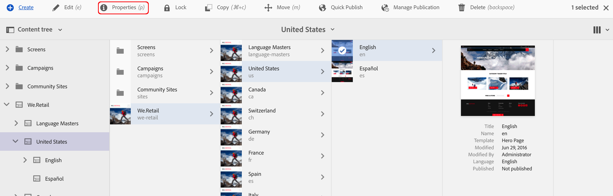
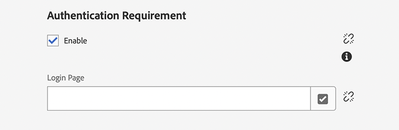
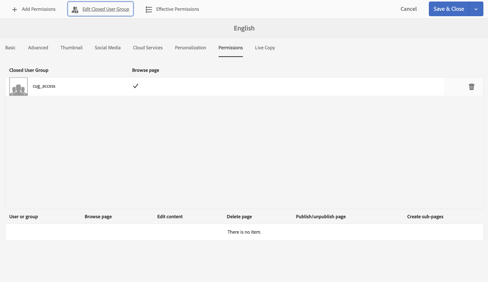

# Creating a Closed User Group{#creating-a-closed-user-group}

Closed User Groups (CUGs) are used to limit access to specific pages that reside within a published internet site. Such pages require the assigned members to login and provide security credentials.

To configure such an area within your website you:

* [create the actual closed user group and assign members](#creating-the-user-group-to-be-used).

* [apply this group to the required pages](#applying-your-closed-user-group-to-content-pages) and select (or create) the login page for use by the members of the CUG; also specified when applying a CUG to a content page.

* [create a link, of some form, to at least one page within the protected area](#linking-to-the-cug-pages), otherwise it will not be visible.

* [configure the Dispatcher](#configure-dispatcher-for-cugs) if in use.

>[!CAUTION]
>
>Closed user groups (CUGs) should always be created with performance in mind.
>
>Although the number of users and groups in a CUG is not limited, a high number of CUGs on a page may slow down rendering performance.
>
>The impact of CUGs should always be considered when doing performance testing.

## Creating The User Group To Be Used {#creating-the-user-group-to-be-used}

To create a closed user group:

1. Go to **Tools - Security** from the AEM homescreen.

   >[!NOTE]
   >
   >See [Managing Users and Groups](/help/sites-administering/security.md#managing-users-and-groups) for full information on creating and configuring users and groups.

1. Select the **Groups** card from the next screen.

   

1. Press the **Create** button in the top right corner, to create a group.
1. Name your new group; for example, `cug_access`.

   

1. Go to the **Members** tab and assign the required users to this group.

   

1. Activate any users that you have assigned to your CUG; in this case, all members of `cug_access`.
1. Activate the closed user group so that it is available in the publish environment; in this example, `cug_access`.

## Applying Your Closed User Group To Content Pages {#applying-your-closed-user-group-to-content-pages}

To apply the CUG to a page, or pages:

1. Navigate to the root page of the restricted section you want to assign to your CUG.
1. Select the page by clicking on its thumbnail and then selecting **Properties** in the top toolbar.

   

1. In the following window, open the **Advanced** tab.

1. Scroll down to the **Authentication Requirement** section.

   1. Activate the **Enable** tickbox.

   1. Add the path to your **Login Page**.
   This is optional, if left blank the standard login page is used.

   

1. Next, go to the **Permissions** tab and select **Edit Closed User Group**.

   

   >[!NOTE]
   >
   >CUGs in the Permissions tab cannot be rolled out to Live Copies from Blueprints. Plan around this when configuring Live Copy.
   >
   >For more information, see [Closed User Groups in AEM - Livecopy](closed-user-groups.md#aem-livecopy).

1. The **Edit Closed User Group** dialog opens. Here you can search for, and select, your CUG, then confirm the group selection with **Save**. 

   The group will be added to the list; for example, the group **cug_access**.

   

1. Confirm the changes with **Save & Close**.

>[!NOTE]
>
>See [Identity Management](/help/sites-administering/identity-management.md) for information about profiles in the publish environment and providing forms for logging in and out.

## Linking To The CUG Pages {#linking-to-the-cug-pages}

Since the target of any links to the CUG pages are not visible to the anonymous user, the linkchecker will remove such links.

To avoid this, it is advisable to create non-protected redirect pages that point to pages within the CUG area. The navigation entries are then rendered without causing the linkchecker any problems. Only when actually accessing the redirect page will the user be redirected inside the CUG area - after successfully providing their login credentials.

## Configure Dispatcher for CUGs {#configure-dispatcher-for-cugs}

If you are using Dispatcher, you need to define a Dispatcher farm with the following properties:

* [virtualhosts](https://experienceleague.adobe.com/docs/experience-manager-dispatcher/using/configuring/dispatcher-configuration.html#identifying-virtual-hosts-virtualhosts): Matches the path to the pages that the CUG applies to.
* \sessionmanagement: see below.
* [cache](https://experienceleague.adobe.com/docs/experience-manager-dispatcher/using/configuring/dispatcher-configuration.html#configuring-the-dispatcher-cache-cache): A cache directory that is dedicated to the files that the CUG applies to.

### Configuring Dispatcher Session Management for CUGs {#configuring-dispatcher-session-management-for-cugs}

Configure [session management in the dispatcher.any file](https://experienceleague.adobe.com/docs/experience-manager-dispatcher/using/configuring/dispatcher-configuration.html#enabling-secure-sessions-sessionmanagement) for the CUG. The authentication handler that is used when access is requested for CUG pages determines how you configure session management.

```xml
/sessionmanagement
    ...
    /header "Cookie:login-token"
    ...
```

>[!NOTE]
>
>When a Dispatcher farm has session-management enabled, all pages that the farm handles are not cached. To cache pages that are outside of CUG, create a second farm in dispatcher.any
>that handles the non-CUG pages.

1. Configure [/sessionmanagement](https://experienceleague.adobe.com/docs/experience-manager-dispatcher/using/configuring/dispatcher-configuration.html#enabling-secure-sessions-sessionmanagement) by defining `/directory`; for example:

   ```xml
   /sessionmanagement
     {
     /directory "/usr/local/apache/.sessions"
     ...
     }
   ```

1. Set [/allowAuthorized](https://experienceleague.adobe.com/docs/experience-manager-dispatcher/using/configuring/dispatcher-configuration.html#caching-when-authentication-is-used) to `0`.
