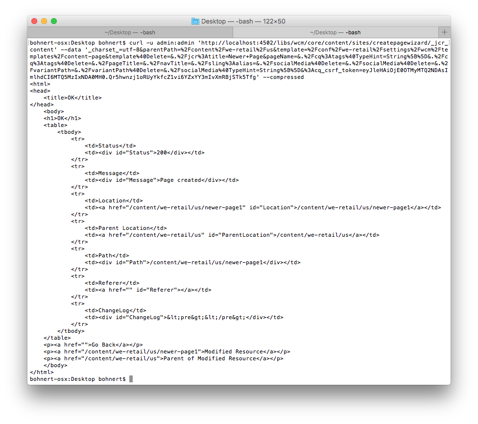

# Using cURL with AEM{#using-curl-with-aem}

Administrators often need to automate or simplify common tasks within any system. In AEM for example, managing users, installing packages, and managing OSGi bundles are tasks that must be commonly done.

Because of the RESTful nature of the Sling framework upon which AEM is built, most tasks can be done with a URL call. cURL can be used to execute such URL calls and can be a useful tool for AEM administrators.

## What is cURL {#what-is-curl}

cURL is an open-source command-line tool used to perform URL manipulations. It supports a wide range of internet protocols including HTTP, HTTPS, FTP, FTPS, SCP, SFTP, TFTP, LDAP, DAP, DICT, TELNET, FILE, IMAP, POP3, SMTP, and RTSP.

cURL is a well-established and widely-used tool for getting or sending data using the URL syntax and was originally released in 1997. The name cURL originally meant "see URL."

Because of the RESTful nature of the Sling framework upon which AEM is built, most tasks can be reduced to a URL call, which can be executed with cURL. [Content manipulation tasks](/help/sites-administering/curl.md#common-content-manipulation-aem-curl-commands) such as activating pages, and starting workflows and [operational tasks](/help/sites-administering/curl.md#common-operational-aem-curl-commands) such as package management and managing users can be automated using cURL. In addition you can [create your own cURL](/help/sites-administering/curl.md#building-a-curl-ready-aem-command) commands for most tasks in AEM.

>[!NOTE]
>
>Any AEM command executed through cURL has to be authorized just as any user to AEM. All ACLs and access rights are respected when using cURL to execute an AEM command.

## Downloading cURL {#downloading-curl}

cURL is a standard part of macOS and some Linux distros. However it is avaialble for most every operating system. The latest downloads can be found at [https://curl.haxx.se/download.html](https://curl.haxx.se/download.html).

cURL's source repository can be found on GitHub as well.

## Building a cURL-Ready AEM Command {#building-a-curl-ready-aem-command}

cURL commands can be built for most operations in AEM such as triggering workflows, checking OSGi configurations, triggering JMX commands, creating replication agents, and much more.

To find the exact command you need for your particular operation, you need to use the developer tools in your browser to capture the POST call to the server when you execute the AEM command.

The following steps describe how to do this using the creation of a new page within the Chrome browser as an example.

1. Prepare the action you wish to invoke within AEM. In this case, we have proceded to the end of the **Create Page** wizard, but have not yet clicked **Create**.

   

1. Start the developer tools and select the **Network** tab. Click the **Preserve log** option before clearing the console.

   

1. Click **Create** in the **Create Page** wizard to actually create the workflow.
1. Right-click the resulting POST action and select **Copy** > **Copy as cURL**.

   

1. Copy the cURL command to a text editor and remove all headers from the command, which start with `-H` (highligted in blue in the image below) and add the proper authentication parameter such as `-u <user>:<password>`.

   

1. Execute the cURL command via the command line and view the response.

   

## Common Operational AEM cURL Commands {#common-operational-aem-curl-commands}

Here is a list of AEM cURL commands for common administrative and operational tasks.

>[!NOTE]
>
>The following examples assume that AEM is running on `localhost` on port `4502` and uses the user `admin` with password `admin`. Additional command placeholders are set in angle brackets.

### Package Management {#package-management}

#### List All Installed Packages

```shell
curl -u <user>:<password> http://<host>:<port>/crx/packmgr/service.jsp?cmd=ls
```

#### Create a Package {#create-a-package}

```shell
curl -u <user>:<password> -X POST http://localhost:4502/crx/packmgr/service/.json/etc/packages/mycontent.zip?cmd=create -d packageName=<name> -d groupName=<name>
```

#### Preview a Package {#preview-a-package}

```shell
curl -u <user>:<password> -X POST http://localhost:4502/crx/packmgr/service/.json/etc/packages/mycontent.zip?cmd=preview
```

#### List Package Content {#list-package-content}

```shell
curl -u <user>:<password> -X POST http://localhost:4502/crx/packmgr/service/console.html/etc/packages/mycontent.zip?cmd=contents
```

#### Build a Package {#build-a-package}

```shell
curl -X POST http://localhost:4502/crx/packmgr/service/.json/etc/packages/mycontent.zip?cmd=build
```

#### Rewrap a Package {#rewrap-a-package}

```shell
curl -u <user>:<password> -X POST http://localhost:4502/crx/packmgr/service/.json/etc/packages/mycontent.zip?cmd=rewrap
```

#### Rename a Package {#rename-a-package}

```shell
curl -u <user>:<password> -X POST -Fname=<New Name> http://localhost:4502/etc/packages/<Group Name>/<Package Name>.zip/jcr:content/vlt:definition
```

#### Upload a Package {#upload-a-package}

```shell
curl -u <user>:<password> -F cmd=upload -F force=true -F package=@test.zip http://localhost:4502/crx/packmgr/service/.json
```

#### Install a Package {#install-a-package}

```shell
curl -u <user>:<password> -F cmd=install http://localhost:4502/crx/packmgr/service/.json/etc/packages/my_packages/test.zip
```

#### Uninstall a Package {#uninstall-a-package}

```shell
curl -u <user>:<password> -F cmd=uninstall http://localhost:4502/crx/packmgr/service/.json/etc/packages/my_packages/test.zip
```

#### Delete a Package {#delete-a-package}

```shell
curl -u <user>:<password> -F cmd=delete http://localhost:4502/crx/packmgr/service/.json/etc/packages/my_packages/test.zip
```

#### Download a Package {#download-a-package}

```shell
curl -u <user>:<password> http://localhost:4502/etc/packages/my_packages/test.zip
```

#### Replicate a Package {#replicate-a-package}

```shell
curl -u <user>:<password> -X POST http://localhost:4502/crx/packmgr/service/.json/etc/packages/my_packages/test.zip?cmd=replicate
```

### User Management {#user-management}

#### Create a New User {#create-a-new-user}

```shell
curl -u <user>:<password> -FcreateUser= -FauthorizableId=hashim -Frep:password=hashim http://localhost:4502/libs/granite/security/post/authorizables
```

#### Create a New Group {#create-a-new-group}

```shell
curl -u <user>:<password> -FcreateGroup=group1 -FauthorizableId=testGroup1 http://localhost:4502/libs/granite/security/post/authorizables

```

#### Add a Property to an Existing User {#add-a-property-to-an-existing-user}

```shell
curl -u <user>:<password> -Fprofile/age=25 http://localhost:4502/home/users/h/hashim.rw.html
```

#### Create a User with a Profile {#create-a-user-with-a-profile}

```shell
curl -u <user>:<password> -FcreateUser=testuser -FauthorizableId=hashimkhan -Frep:password=hashimkhan -Fprofile/gender=male http://localhost:4502/libs/granite/security/post/authorizables
```

#### Create a New User as a Member of a Group {#create-a-new-user-as-a-member-of-a-group}

```shell
curl -u <user>:<password> -FcreateUser=testuser -FauthorizableId=testuser -Frep:password=abc123 -Fmembership=contributor http://localhost:4502/libs/granite/security/post/authorizables
```

#### Add a User to a Group {#add-a-user-to-a-group}

```shell
curl -u <user>:<password> -FaddMembers=testuser1 http://localhost:4502/home/groups/t/testGroup.rw.html
```

#### Remove a User from a Group {#remove-a-user-from-a-group}

```shell
curl -u <user>:<password> -FremoveMembers=testuser1 http://localhost:4502/home/groups/t/testGroup.rw.html
```

#### Set a User's Group Membership {#set-a-user-s-group-membership}

```shell
curl -u <user>:<password> -Fmembership=contributor -Fmembership=testgroup http://localhost:4502/home/users/t/testuser.rw.html
```

#### Delete a User {#delete-a-user}

```shell
curl -u <user>:<password> -FdeleteAuthorizable= http://localhost:4502/home/users/t/testuser
```

#### Delete a Group {#delete-a-group}

```shell
curl -u <user>:<password> -FdeleteAuthorizable= http://localhost:4502/home/groups/t/testGroup
```

### Backup {#backup}

See [Backup and Restore](/help/sites-administering/backup-and-restore.md#automating-aem-online-backup) for details.

### OSGi {#osgi}

#### Starting a Bundle {#starting-a-bundle}

```shell
curl -u <user>:<password> -Faction=start http://localhost:4502/system/console/bundles/<bundle-name>
```

#### Stopping a Bundle {#stopping-a-bundle}

```shell
curl -u <user>:<password> -Faction=stop http://localhost:4502/system/console/bundles/<bundle-name>
```

### Dispatcher {#dispatcher}

#### Invalidate the Cache {#invalidate-the-cache}

```shell
curl -H "CQ-Action: Activate" -H "CQ-Handle: /content/test-site/" -H "CQ-Path: /content/test-site/" -H "Content-Length: 0" -H "Content-Type: application/octet-stream" http://localhost:4502/dispatcher/invalidate.cache
```

#### Evict the Cache {#evict-the-cache}

```shell
curl -H "CQ-Action: Deactivate" -H "CQ-Handle: /content/test-site/" -H "CQ-Path: /content/test-site/" -H "Content-Length: 0" -H "Content-Type: application/octet-stream" http://localhost:4502/dispatcher/invalidate.cache
```

### Replication Agent {#replication-agent}

#### Check the Status of an Agent {#check-the-status-of-an-agent}

```shell
curl -u <user>:<password> "http://localhost:4502/etc/replication/agents.author/publish/jcr:content.queue.json?agent=publish"
http://localhost:4502/etc/replication/agents.author/publish/jcr:content.queue.json?agent=publish
```

#### Delete an Agent {#delete-an-agent}

```shell
curl -X DELETE http://localhost:4502/etc/replication/agents.author/replication99 -u <user>:<password>
```

#### Create an Agent {#create-an-agent}

```shell
curl -u <user>:<password> -F "jcr:primaryType=cq:Page" -F "jcr:content/jcr:title=new-replication" -F "jcr:content/sling:resourceType=/libs/cq/replication/components/agent" -F "jcr:content/template=/libs/cq/replication/templates/agent" -F "jcr:content/transportUri=http://localhost:4503/bin/receive?sling:authRequestLogin=1" -F "jcr:content/transportUser=admin" -F "jcr:content/transportPassword={DES}8aadb625ced91ac483390ebc10640cdf"http://localhost:4502/etc/replication/agents.author/replication99
```

#### Pause an Agent {#pause-an-agent}

```shell
curl -u <user>:<password> -F "cmd=pause" -F "name=publish"  http://localhost:4502/etc/replication/agents.author/publish/jcr:content.queue.json
```

#### Clear an Agent Queue {#clear-an-agent-queue}

```shell
curl -u <user>:<password> -F "cmd=clear" -F "name=publish"  http://localhost:4502/etc/replication/agents.author/publish/jcr:content.queue.json
```

### Communities {#communities}

#### Assign and Revoke Badges {#assign-and-revoke-badges}

See [Communities Scoring and Badges](/help/communities/implementing-scoring.md#assign-and-revoke-badges) for details.

See [Scoring and Badges Essentials](/help/communities/configure-scoring.md#example-setup) for details.

#### MSRP Reindexing {#msrp-reindexing}

See [MSRP - MongoDB Storage Resource Provider](/help/communities/msrp.md#running-msrp-reindex-tool-using-curl-command) for details.

### Security {#security}

#### Enabling and Disabling CRX DE Lite {#enabling-and-disabling-crx-de-lite}

See [Enabling CRXDE Lite in AEM](/help/sites-administering/enabling-crxde-lite.md) for details.

### Data Store Garbage Collection {#data-store-garbage-collection}

See [Data Store Garbage Collection](/help/sites-administering/data-store-garbage-collection.md#automating-data-store-garbage-collection) for details.

### Analytics and Target Integration {#analytics-and-target-integration}

See [Opting Into Adobe Analytics and Adobe Target](/help/sites-administering/opt-in.md#configuring-the-setup-and-provisioning-via-script) for details.

### Single Sign On {#single-sign-on}

#### Send Test Header {#send-test-header}

See [Single Sign On](/help/sites-deploying/single-sign-on.md) for details.

## Common Content Manipulation AEM cURL Commands {#common-content-manipulation-aem-curl-commands}

Here is a list of AEM cURL commands for content manipulation.

>[!NOTE]
>
>The following examples assume that AEM is running on `localhost` on port `4502` and uses the user `admin` with password `admin`. Additional command placeholders are set in angle brackets.

### Page Management {#page-management}

#### Page Activation {#page-activation}

```shell
curl -u <user>:<password> -X POST -F path="/content/path/to/page" -F cmd="activate" http://localhost:4502/bin/replicate.json
```

#### Page Deactivation {#page-deactivation}

```shell
curl -u <user>:<password> -X POST -F path="/content/path/to/page" -F cmd="deactivate" http://localhost:4502/bin/replicate.json
```

#### Tree Activation {#tree-activation}

```shell
curl -u <user>:<password> -F cmd=activate -F ignoredeactivated=true -F onlymodified=true -F path=/content/geometrixx http://localhost:4502/etc/replication/treeactivation.html
```

#### Lock Page {#lock-page}

```shell
curl -u <user>:<password> -X POST -F cmd="lockPage" -F path="/content/path/to/page" -F "_charset_"="utf-8" http://localhost:4502/bin/wcmcommand
```

#### Unlock Page {#unlock-page}

```shell
curl -u <user>:<password> -X POST -F cmd="unlockPage" -F path="/content/path/to/page" -F "_charset_"="utf-8" http://localhost:4502/bin/wcmcommand
```

#### Copy Page {#copy-page}

```shell
curl -u <user>:<password> -F cmd=copyPage -F destParentPath=/path/to/destination/parent -F srcPath=/path/to/source/location http://localhost:4502/bin/wcmcommand
```

### How to perform a shallow rollout {#shallow-rollout}

When using AEM as a Cloud Service, there may be instances where you need to rollout only a single page without including its subpages. The issue is that the typical curl command for rolling out pages might inadvertently include subpages if not configured correctly. This section provides guidance on how to adjust the curl command to achieve a shallow rollout of a specified page and exclude any subpages from being propagated.

To perform a shallow rollout of a single page without its subpages using curl, follow these steps:

1. Modify your existing curl command by changing the parameter from `type=deep` to `type=page`.
1. Use the following syntax for your curl command:

```shell
curl -H "Authorization: Bearer <token>" "https://<instance-url>/bin/asynccommand" \
   -d type=page \
   -d operation=asyncRollout \
   -d cmd=rollout \
   -d path="/content/<your-path>"
```

Please be aware of the following:

1. Ensure that you replace `<token>` with your actual authorization token and `<instance-url>` with your specific instance URL.
1. Replace `/content/<your-path>` with the path of the specific page you wish to rollout.

By setting `type=page`, the command targets only the specified page, excluding any subpages from being rolled out. This adjustment aligns with how rollouts are managed through the AEM GUI when selecting individual pages.

This solution enables precise control over content deployment within AEM as a Cloud Service, ensuring that only intended changes are propagated across environments.

### Workflows {#workflows}

See [Interacting with Workflows Programmatically](/help/sites-developing/workflows-program-interaction.md) for details.

### Sling Content {#sling-content}

#### Create a Folder {#create-a-folder}

```shell
curl -u <user>:<password> -F jcr:primaryType=sling:Folder http://localhost:4502/etc/test
```

#### Delete a Node {#delete-a-node}

```shell
curl -u <user>:<password> -F :operation=delete http://localhost:4502/etc/test/test.properties
```

#### Move a Node {#move-a-node}

```shell
curl -u <user>:<password> -F":operation=move" -F":applyTo=/sourceurl"  -F":dest=/target/parenturl/" https://localhost:4502/content
```

#### Copy a Node {#copy-a-node}

```shell
curl -u <user>:<password> -F":operation=copy" -F":applyTo=/sourceurl"  -F":dest=/target/parenturl/" https://localhost:4502/content
```

#### Upload Files Using Sling PostServlet {#upload-files-using-sling-postservlet}

```shell
curl -u <user>:<password> -F"*=@test.properties"  http://localhost:4502/etc/test
```

#### Upload Files Using Sling PostServlet and Specifying Node Name {#upload-files-using-sling-postservlet-and-specifying-node-name}

```shell
curl -u <user>:<password> -F"test2.properties=@test.properties"  http://localhost:4502/etc/test
```

#### Upload Files Specifying a Content Type {#upload-files-specifying-a-content-type}

```shell
curl -u <user>:<password> -F "*=@test.properties;type=text/plain" http://localhost:4502/etc/test
```

### Asset Manipulation {#asset-manipulation}

See [Assets HTTP API](/help/assets/mac-api-assets.md) for details.
